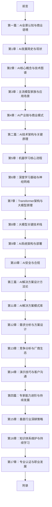

# AI解决方案专家实战指南

## 前言

### 创作目的

你是否曾经被复杂的AI技术术语搞得晕头转向？

你是否想了解如何将AI技术转化为实际的业务价值？

你是否渴望成为一名能够连接技术与业务的AI解决方案专家？

如果你的答案是肯定的，那么这本书就是为你而写的。

随着人工智能技术的飞速发展，企业对能够将AI技术转化为实际业务价值的解决方案专家需求日益迫切。然而，当前市场上的AI书籍要么过于技术化，满是复杂的公式和代码；要么过于理论化，缺乏实际的应用指导。

本书旨在填补这一空白，为非技术背景的人士提供一条清晰、可执行的AI解决方案专家培养路径。我们将使用通俗易懂的语言，生动形象的比喻，丰富的可视化图表，帮助你快速掌握AI解决方案设计的核心能力。

### 核心价值

#### 1. **非技术友好**
本书专为非技术背景人士设计，避免使用复杂的公式和代码，用生活化的比喻解释复杂的AI技术。

#### 2. **系统性学习**
构建了完整的AI解决方案专家知识体系，从基础概念到高级实践，循序渐进，确保你能够全面掌握所需的各项能力。

#### 3. **实用性强**
聚焦于实际工作场景，提供可直接应用的方法论和工具，帮助你在实际工作中快速上手。

#### 4. **可视化呈现**
大量使用流程图、示例图、对比图等可视化手段，帮助你更好地理解和记忆核心知识点。

#### 5. **场景化教学**
每个技术点都关联到实际业务场景，通过真实案例分析，让你学会如何将AI技术应用到具体的业务问题中。

### 读者对象

- **售前/解决方案工程师**：希望提升AI解决方案设计能力
- **产品经理**：希望了解AI技术，设计AI产品
- **业务分析师**：希望将AI技术引入业务流程
- **企业管理者**：希望了解AI技术，制定AI战略
- **想转型AI领域的职场人士**：非技术背景，希望进入AI行业
- **对AI感兴趣的普通读者**：想了解AI技术的实际应用

### 如何使用本书

#### 1. **按照章节顺序阅读**
本书采用由浅入深、循序渐进的结构，建议按照章节顺序阅读，确保知识体系的完整性。

#### 2. **重点关注可视化内容**
书中的流程图、示例图等可视化内容是理解核心概念的关键，建议仔细研究。

#### 3. **完成每章的实践任务**
每章结尾都有实践应用场景和小练习，建议认真完成，将理论知识转化为实际能力。

#### 4. **结合实际工作场景思考**
在阅读过程中，建议结合自己的实际工作场景，思考如何将所学知识应用到工作中。

#### 5. **加入学习社群**
欢迎加入本书的学习社群，与其他读者交流学习心得，分享实践经验。

### 本书结构

本书共分为四篇，十七章，涵盖了AI解决方案专家所需的全部核心能力：

#### **第一篇：AI全景认知与商业语境**（第1-4章）
建立AI的全景认知，了解AI的发展历史、核心概念、主流模型和商业模式，为后续学习奠定基础。

#### **第二篇：AI技术架构与关键原理**（第5-10章）
理解AI技术的核心工作原理，包括机器学习流程、深度学习基础、Transformer架构、大模型技术栈、AI系统架构与部署、AI安全与合规等。

#### **第三篇：AI解决方案设计方法论**（第11-14章）
掌握AI解决方案设计的方法论，包括解决方案模式库、需求分析与方案设计、竞争分析与厂商生态、演示技巧与客户沟通等。

#### **第四篇：专家能力进阶与持续发展**（第15-17章）
学习垂直行业深耕策略、知识体系维护与持续学习、专业认证与职业发展等，成为一名持续成长的AI解决方案专家。

#### **附录**
提供核心资源汇总表、常用工具与平台、术语表和参考文献，方便读者查阅和进一步学习。

### 学习线路图

### 成功公式

作为一名AI解决方案专家，你的成功取决于三个核心能力的乘积：

**技术理解深度 × 业务洞察能力 × 沟通转化效率**

- **技术理解深度**：不是让你成为AI工程师，而是让你理解AI技术的能力边界、适用场景和成本结构
- **业务洞察能力**：能够从客户的业务需求中识别AI落地机会，理解业务痛点和价值点
- **沟通转化效率**：能够将复杂的AI技术转化为客户可理解的业务价值，说服客户采纳你的解决方案

### 最后想说的话

AI解决方案专家不是无所不知的技术专家，而是能够连接技术与业务的桥梁。你的价值不在于懂得多少技术细节，而在于能够理解客户的业务需求，选择合适的AI技术，设计可行的解决方案，并有效地与客户沟通。

希望这本书能够成为你成长为AI解决方案专家的得力助手，帮助你在AI时代把握机遇，实现职业发展的跨越。

让我们开始这段精彩的学习之旅吧！

---

**作者**

2026年1月