# 第一篇 AI全景认知与商业语境

## 第1章 AI发展简史与现状

### 学习线路图
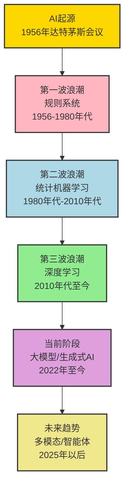
```mermaid
graph TD
    A[AI起源<br>1956年达特茅斯会议] --> B[第一波浪潮<br>规则系统<br>1956-1980年代] 
    B --> C[第二波浪潮<br>统计机器学习<br>1980年代-2010年代] 
    C --> D[第三波浪潮<br>深度学习<br>2010年代至今] 
    D --> E[当前阶段<br>大模型/生成式AI<br>2022年至今] 
    E --> F[未来趋势<br>多模态/智能体<br>2025年以后]
    
    style A fill:#FFD700,stroke:#333,stroke-width:2px
    style B fill:#FFB6C1,stroke:#333,stroke-width:2px
    style C fill:#ADD8E6,stroke:#333,stroke-width:2px
    style D fill:#90EE90,stroke:#333,stroke-width:2px
    style E fill:#DDA0DD,stroke:#333,stroke-width:2px
    style F fill:#F0E68C,stroke:#333,stroke-width:2px
```

### 学习目标
1. 了解AI发展的完整历史脉络，就像了解人类科技文明的进化史
2. 掌握AI发展的三波浪潮及其特点，就像了解人类从石器时代到信息时代的发展
3. 理解AI发展的关键技术转折点，就像了解工业革命中的关键发明
4. 分析当前AI发展阶段的主要特点，就像了解当前科技发展的前沿趋势
5. 思考为什么现在AI"能用了"，就像思考为什么人类能发明电灯泡和互联网

### 核心知识点
- AI的起源与定义：AI是什么，它是如何诞生的
- AI发展的三波浪潮：就像人类文明的三个发展阶段
- 关键技术转折点：就像科技革命中的里程碑事件
- 当前AI发展阶段的特点：大模型和生成式AI的崛起
- AI"能用了"的原因：技术、工程、商业和社会因素的共同作用

### 重点难点
- 各波浪潮之间的技术演进关系：从简单到复杂，从规则到学习
- 为什么深度学习会带来AI的爆发：就像为什么蒸汽机带来了工业革命
- 生成式AI与传统AI的本质区别：从"判断"到"创造"的飞跃

### 本章导读

你知道吗？AI这个概念已经存在了70多年，但直到最近几年才真正进入我们的日常生活。从最初的概念提出，到今天的ChatGPT、Midjourney等强大的AI应用，AI经历了怎样的发展历程？为什么现在AI突然"能用了"？

想象一下，AI就像是一个从婴儿逐渐成长为天才的孩子：
- 最初，它只会按照大人教的规则做事（规则系统时代）—— 就像一个只会背乘法表的小学生
- 后来，它学会了从例子中总结规律（统计机器学习时代）—— 就像一个会做数学题的中学生
- 现在，它能够自主学习，举一反三，甚至创造新的内容（深度学习与大模型时代）—— 就像一个会写论文、搞发明的博士生

本章将带领你回顾AI的成长历程，从最初的规则系统到现在的大模型时代，梳理AI发展的三波浪潮和关键技术转折点。通过了解AI的发展历程，你将能够更好地理解当前AI技术的特点和未来趋势，为后续学习奠定基础。

让我们一起开启这段AI的"成长之旅"吧！

---

## 1.1 AI的起源与三波浪潮

### 1.1.1 AI概念的提出：就像人类第一次仰望星空，思考宇宙的奥秘

1956年，美国达特茅斯学院举办了一场为期两个月的学术研讨会，会议的主题是"如何让机器像人一样思考"。在这次会议上，"人工智能"(Artificial Intelligence)这个概念正式诞生，标志着AI作为一个学科的开始。

参会的学者包括马文·明斯基、约翰·麦卡锡、艾伦·纽厄尔和赫伯特·西蒙等人，他们后来都成为了AI领域的先驱者，就像科技界的"开国元勋"。这次会议被认为是AI发展史上的里程碑，开启了AI研究的第一波浪潮。

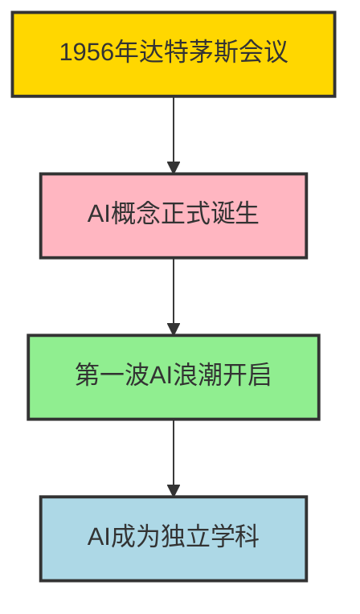
```mermaid
graph TD
    A[1956年达特茅斯会议] --> B[AI概念正式诞生]
    B --> C[第一波AI浪潮开启]
    C --> D[AI成为独立学科]
    
    style A fill:#FFD700,stroke:#333,stroke-width:2px
    style B fill:#FFB6C1,stroke:#333,stroke-width:2px
    style C fill:#90EE90,stroke:#333,stroke-width:2px
    style D fill:#ADD8E6,stroke:#333,stroke-width:2px
```

### 1.1.2 第一波浪潮：规则系统时代（1956-1980年代）—— AI的"童年时代"

**核心特点**：基于明确的规则和逻辑推理

这个时代的AI系统就像是一个"只会背规则手册的小学生"，它只能按照人类预先设定的规则进行推理和决策。例如，早期的下棋程序就是通过程序员编写大量的规则来实现的，就像一个只会背棋谱的棋手。

**形象化比喻**：
- 规则系统 = 一本厚厚的规则手册
- 专家系统 = 一本医学百科全书
- 逻辑推理 = 数学题的解题步骤

**代表性技术**：
- 专家系统：模拟人类专家的知识和经验，就像一本活的百科全书
- 逻辑推理：基于符号逻辑进行推理，就像做几何证明题
- 知识工程：手动构建知识库，就像编写一本字典

**应用场景**：
- 医疗诊断：如MYCIN系统，用于诊断细菌感染，就像一个只会按手册看病的医生
- 棋类游戏：如IBM的深蓝，击败了国际象棋世界冠军，就像一个背熟了所有棋谱的棋手
- 工业控制：如自动化生产线，就像一个只会按程序操作的工人

**局限性**：
- 规则难以覆盖所有情况：就像一本字典无法解释所有词汇的用法
- 缺乏灵活性和学习能力：就像一个只会背乘法表的孩子，不会做应用题
- 维护成本高：就像维护一本不断更新的百科全书，需要大量人力

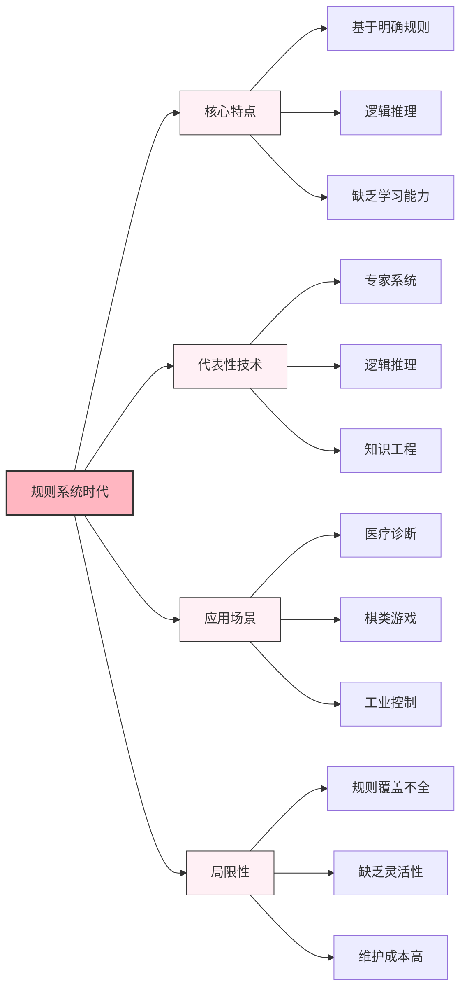
```mermaid
graph LR
    A[规则系统时代] --> B[核心特点] 
    A --> C[代表性技术]
    A --> D[应用场景]
    A --> E[局限性]
    
    B --> B1[基于明确规则]
    B --> B2[逻辑推理]
    B --> B3[缺乏学习能力]
    
    C --> C1[专家系统]
    C --> C2[逻辑推理]
    C --> C3[知识工程]
    
    D --> D1[医疗诊断]
    D --> D2[棋类游戏]
    D --> D3[工业控制]
    
    E --> E1[规则覆盖不全]
    E --> E2[缺乏灵活性]
    E --> E3[维护成本高]
    
    style A fill:#FFB6C1,stroke:#333,stroke-width:2px
    style B fill:#FFF0F5,stroke:#333,stroke-width:1px
    style C fill:#FFF0F5,stroke:#333,stroke-width:1px
    style D fill:#FFF0F5,stroke:#333,stroke-width:1px
    style E fill:#FFF0F5,stroke:#333,stroke-width:1px
```

### 1.1.3 第二波浪潮：统计机器学习时代（1980年代-2010年代）—— AI的"青少年时代"

**核心特点**：基于统计模型和数据驱动

这个时代的AI系统就像是一个"会从例子中学习的中学生"，它开始从数据中学习规律，而不是完全依赖人类编写的规则。例如，垃圾邮件过滤器就是通过学习大量的邮件样本，自动识别垃圾邮件的特征，就像一个学生通过做大量习题来学习解题方法。

**形象化比喻**：
- 统计模型 = 学生的学习方法
- 数据 = 学生的习题集
- 机器学习 = 学生做习题的过程

**代表性技术**：
- 决策树：基于树结构进行决策，就像一棵不断分叉的知识树
- 支持向量机(SVM)：用于分类和回归分析，就像用一条线把不同类别的数据分开
- 聚类算法：将相似的数据点分组，就像把不同类型的玩具分类
- 早期神经网络：简单的多层感知机，就像一个简单的大脑

**应用场景**：
- 图像识别：如手写数字识别，就像一个能认出不同手写字体的学生
- 语音识别：如早期的语音助手，就像一个能听懂简单指令的助手
- 推荐系统：如电商平台的商品推荐，就像一个能推荐你喜欢的商品的朋友
- 信用评分：如银行的贷款风险评估，就像一个能评估你信用水平的评估师

**局限性**：
- 需要大量手工特征工程：就像需要老师把习题分类，学生才能学习
- 对复杂问题处理能力有限：就像学生只能解决简单的数学题，不会解决复杂的应用题
- 模型容易过拟合：就像学生只会背习题，不会灵活运用

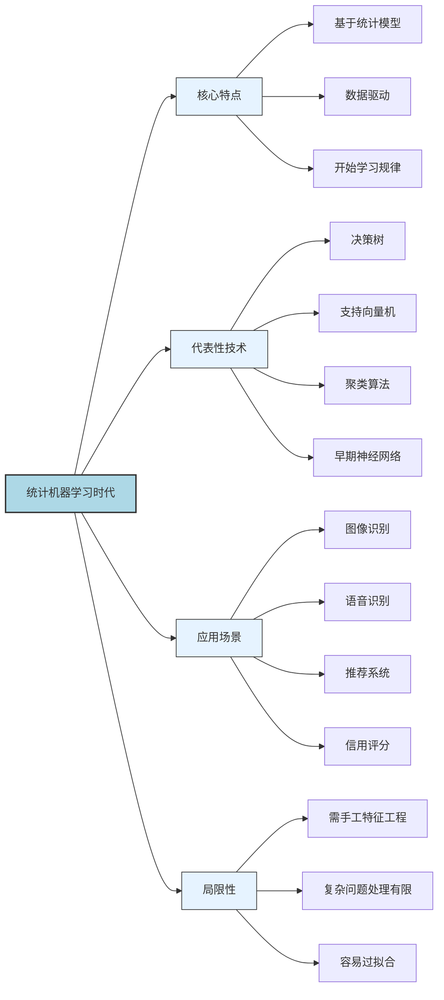
```mermaid
graph LR
    A[统计机器学习时代] --> B[核心特点] 
    A --> C[代表性技术]
    A --> D[应用场景]
    A --> E[局限性]
    
    B --> B1[基于统计模型]
    B --> B2[数据驱动]
    B --> B3[开始学习规律]
    
    C --> C1[决策树]
    C --> C2[支持向量机]
    C --> C3[聚类算法]
    C --> C4[早期神经网络]
    
    D --> D1[图像识别]
    D --> D2[语音识别]
    D --> D3[推荐系统]
    D --> D4[信用评分]
    
    E --> E1[需手工特征工程]
    E --> E2[复杂问题处理有限]
    E --> E3[容易过拟合]
    
    style A fill:#ADD8E6,stroke:#333,stroke-width:2px
    style B fill:#E6F3FF,stroke:#333,stroke-width:1px
    style C fill:#E6F3FF,stroke:#333,stroke-width:1px
    style D fill:#E6F3FF,stroke:#333,stroke-width:1px
    style E fill:#E6F3FF,stroke:#333,stroke-width:1px
```

### 1.1.4 第三波浪潮：深度学习时代（2010年代至今）—— AI的"成年时代"

**核心特点**：基于深度神经网络和海量数据

这个时代的AI系统就像是一个"拥有超级大脑的成年人"，它能够自动从海量数据中学习复杂的特征和规律。例如，AlphaGo就是通过深度学习，自学围棋，最终击败了世界冠军，就像一个能通过自学成为世界冠军的棋手；ChatGPT能够理解复杂的自然语言，生成高质量的文本内容，就像一个能写论文、编故事的作家。

**形象化比喻**：
- 深度神经网络 = 超级大脑
- 海量数据 = 人生经验
- 深度学习 = 从经验中学习成长

**代表性技术**：
- 深度卷积神经网络(CNN)：用于图像识别，就像人的视觉系统
- 循环神经网络(RNN)：用于序列数据处理，就像人的记忆系统
- Transformer架构：用于自然语言处理，就像人的语言系统
- 预训练模型：如BERT、GPT等，就像一个饱读诗书的智者

**应用场景**：
- 自动驾驶：如特斯拉的Autopilot，就像一个能自己开车的司机
- 自然语言处理：如ChatGPT、Google翻译，就像一个能说多种语言的翻译官
- 计算机视觉：如人脸识别、物体检测，就像一个能认出所有人脸的观察者
- 生成式AI：如Midjourney、DALL-E，就像一个能创作艺术作品的艺术家

**突破点**：
- 能够自动学习特征，无需手工设计：就像人能自动学习识别物体，无需别人教
- 处理复杂的非结构化数据：就像人能理解自然语言、图像等复杂信息
- 模型规模和能力不断提升：就像人通过学习不断成长，能力越来越强

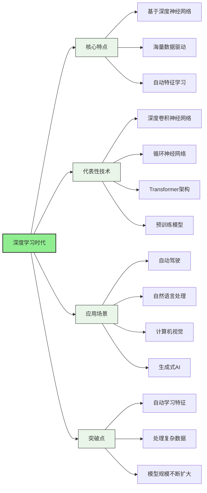
```mermaid
graph LR
    A[深度学习时代] --> B[核心特点] 
    A --> C[代表性技术]
    A --> D[应用场景]
    A --> E[突破点]
    
    B --> B1[基于深度神经网络]
    B --> B2[海量数据驱动]
    B --> B3[自动特征学习]
    
    C --> C1[深度卷积神经网络]
    C --> C2[循环神经网络]
    C --> C3[Transformer架构]
    C --> C4[预训练模型]
    
    D --> D1[自动驾驶]
    D --> D2[自然语言处理]
    D --> D3[计算机视觉]
    D --> D4[生成式AI]
    
    E --> E1[自动学习特征]
    E --> E2[处理复杂数据]
    E --> E3[模型规模不断扩大]
    
    style A fill:#90EE90,stroke:#333,stroke-width:2px
    style B fill:#E8F5E8,stroke:#333,stroke-width:1px
    style C fill:#E8F5E8,stroke:#333,stroke-width:1px
    style D fill:#E8F5E8,stroke:#333,stroke-width:1px
    style E fill:#E8F5E8,stroke:#333,stroke-width:1px
```

### 三波浪潮对比：AI的成长历程

为了更直观地理解AI发展的三波浪潮，我们可以将其比作AI的成长历程，从童年到成年，能力不断增强：

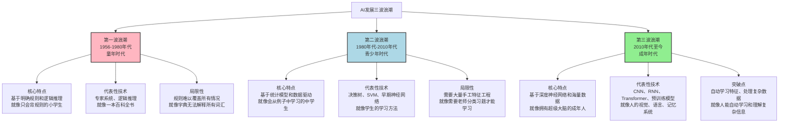
```mermaid
graph TD
    A[AI发展三波浪潮] --> B[第一波浪潮<br>1956-1980年代<br>童年时代] 
    A --> C[第二波浪潮<br>1980年代-2010年代<br>青少年时代]
    A --> D[第三波浪潮<br>2010年代至今<br>成年时代]
    
    B --> B1[核心特点<br>基于明确规则和逻辑推理<br>就像只会背规则的小学生]
    B --> B2[代表性技术<br>专家系统、逻辑推理<br>就像一本百科全书]
    B --> B3[局限性<br>规则难以覆盖所有情况<br>就像字典无法解释所有词汇]
    
    C --> C1[核心特点<br>基于统计模型和数据驱动<br>就像会从例子中学习的中学生]
    C --> C2[代表性技术<br>决策树、SVM、早期神经网络<br>就像学生的学习方法]
    C --> C3[局限性<br>需要大量手工特征工程<br>就像需要老师分类习题才能学习]
    
    D --> D1[核心特点<br>基于深度神经网络和海量数据<br>就像拥有超级大脑的成年人]
    D --> D2[代表性技术<br>CNN、RNN、Transformer、预训练模型<br>就像人的视觉、语言、记忆系统]
    D --> D3[突破点<br>自动学习特征、处理复杂数据<br>就像人能自动学习和理解复杂信息]
    
    style B fill:#FFB6C1,stroke:#333,stroke-width:2px
    style C fill:#ADD8E6,stroke:#333,stroke-width:2px
    style D fill:#90EE90,stroke:#333,stroke-width:2px
```

### 三波浪潮对比表：就像比较不同时代的科技产品

| 波浪 | 时间 | 核心特点 | 代表性技术 | 应用场景 | 形象化比喻 |
|------|------|----------|------------|----------|------------|
| 第一波 | 1956-1980年代 | 基于规则和逻辑推理 | 专家系统、逻辑推理 | 医疗诊断、棋类游戏 | 只会背规则的小学生 |
| 第二波 | 1980年代-2010年代 | 基于统计模型和数据驱动 | 决策树、SVM、早期神经网络 | 图像识别、语音识别 | 会从例子中学习的中学生 |
| 第三波 | 2010年代至今 | 基于深度神经网络和海量数据 | CNN、RNN、Transformer、预训练模型 | 自动驾驶、ChatGPT、Midjourney | 拥有超级大脑的成年人 |

### 小思考

如果把AI比作一个学生，那么三波浪潮分别对应了学生的什么阶段？

**参考答案**：
- 第一波浪潮：小学生，只会按照老师教的规则做题
- 第二波浪潮：中学生，能够从例题中学习解题方法
- 第三波浪潮：大学生/成年人，能够自主学习，举一反三

---

## 1.2 关键技术转折点：AI发展的里程碑事件

### AI发展关键里程碑时间线：就像人类历史上的重大发明

为了更直观地理解AI发展的关键技术转折点，我们可以通过以下时间线图表来了解这些重要事件，就像了解人类历史上的重大发明一样：

```mermaid
gantt
title AI发展关键里程碑时间线
    dateFormat  YYYY
    section 技术里程碑
    AlexNet横扫ImageNet     :done,    milestone, 2012-01-01, 1d
    Transformer架构诞生     :done,    milestone, 2017-01-01, 1d
    GPT-3发布               :done,    milestone, 2020-01-01, 1d
    ChatGPT引爆生成式AI     :done,    milestone, 2022-11-01, 1d
    GPT-4发布               :done,    milestone, 2023-03-01, 1d
    Gemini发布              :done,    milestone, 2023-12-01, 1d
    section 发展阶段
    深度学习时代开启        :2012-01-01, 2017-01-01
    大模型时代开启          :2017-01-01, 2022-11-01
    生成式AI爆发            :2022-11-01, 2026-01-01
    
    style AlexNet横扫ImageNet fill:#FFD700,stroke:#333,stroke-width:2px
    style Transformer架构诞生 fill:#FFB6C1,stroke:#333,stroke-width:2px
    style GPT-3发布 fill:#ADD8E6,stroke:#333,stroke-width:2px
    style ChatGPT引爆生成式AI fill:#90EE90,stroke:#333,stroke-width:2px
    style GPT-4发布 fill:#DDA0DD,stroke:#333,stroke-width:2px
    style Gemini发布 fill:#F0E68C,stroke:#333,stroke-width:2px
```

### 1.2.1 2012年：AlexNet横扫ImageNet——AI领域的"莱特兄弟首飞"

2012年，AlexNet在ImageNet图像识别竞赛中取得了革命性的突破，将错误率从26%降低到15%，震惊了整个AI领域，就像莱特兄弟的首次飞行证明了人类可以飞上天一样，AlexNet证明了深度学习的强大能力。

**技术突破**：
- 首次使用深度卷积神经网络(CNN)处理大规模图像数据，就像给AI装上了"超级眼睛"
- 使用GPU加速训练，大幅提高了训练速度，就像给AI装上了"超级引擎"
- 引入了ReLU激活函数，解决了梯度消失问题，就像给AI注入了"生命活力"
- 使用Dropout正则化，防止过拟合，就像给AI设置了"学习边界"

**影响**：
- 证明了深度学习的强大能力，就像是AI领域的"莱特兄弟首飞"，证明了深度学习的可行性
- 开启了深度学习时代，让整个AI领域重新审视神经网络的潜力，就像工业革命开启了人类社会的新篇章
- 推动了GPU在AI领域的应用，为后续大模型的发展奠定了算力基础，就像电力的发明推动了各种电器的发展

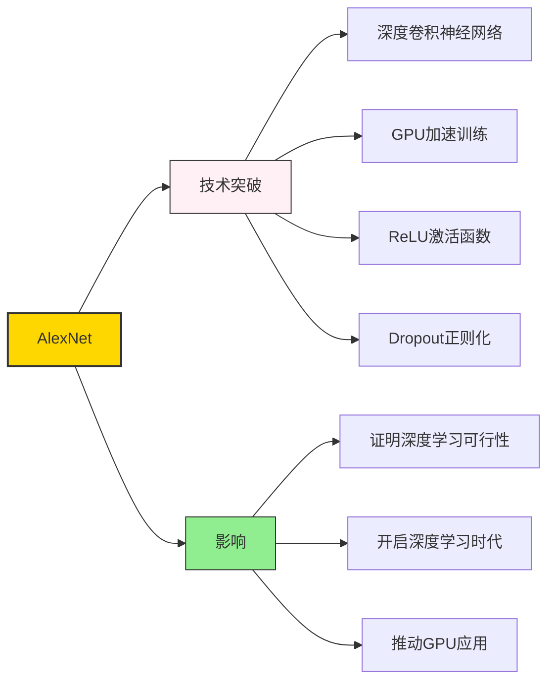
```mermaid
graph LR
    A[AlexNet] --> B[技术突破]
    A --> C[影响]
    
    B --> B1[深度卷积神经网络]
    B --> B2[GPU加速训练]
    B --> B3[ReLU激活函数]
    B --> B4[Dropout正则化]
    
    C --> C1[证明深度学习可行性]
    C --> C2[开启深度学习时代]
    C --> C3[推动GPU应用]
    
    style A fill:#FFD700,stroke:#333,stroke-width:2px
    style B fill:#FFF0F5,stroke:#333,stroke-width:1px
    style C fill:#90EE90,stroke:#333,stroke-width:1px
```

### 1.2.2 2017年：Transformer架构诞生——AI领域的"蒸汽机"

2017年，Google发表了论文《Attention Is All You Need》，提出了Transformer架构，彻底改变了自然语言处理领域，就像蒸汽机的发明推动了工业革命一样，Transformer架构推动了AI革命。

**技术突破**：
- 提出了自注意力机制，解决了长序列依赖问题，就像给AI装上了"超级注意力"，能同时关注所有输入内容
- 抛弃了传统的RNN结构，使用全注意力机制，就像从"单行队列"变成了"自由讨论"，让所有信息能直接交流
- 并行化程度高，训练速度快，就像从"单车道公路"变成了"多车道高速公路"，大大提高了通行效率

**影响**：
- 成为当前所有大语言模型的基础架构，就像是AI领域的"蒸汽机"，为后续的大模型革命提供了核心动力
- 推动了自然语言处理技术的爆发式发展，让机器能够更好地理解和生成人类语言，就像人类学会了说话和写作
- 影响了计算机视觉等其他领域，成为了AI领域的通用架构，就像电力从照明扩展到了各种电器

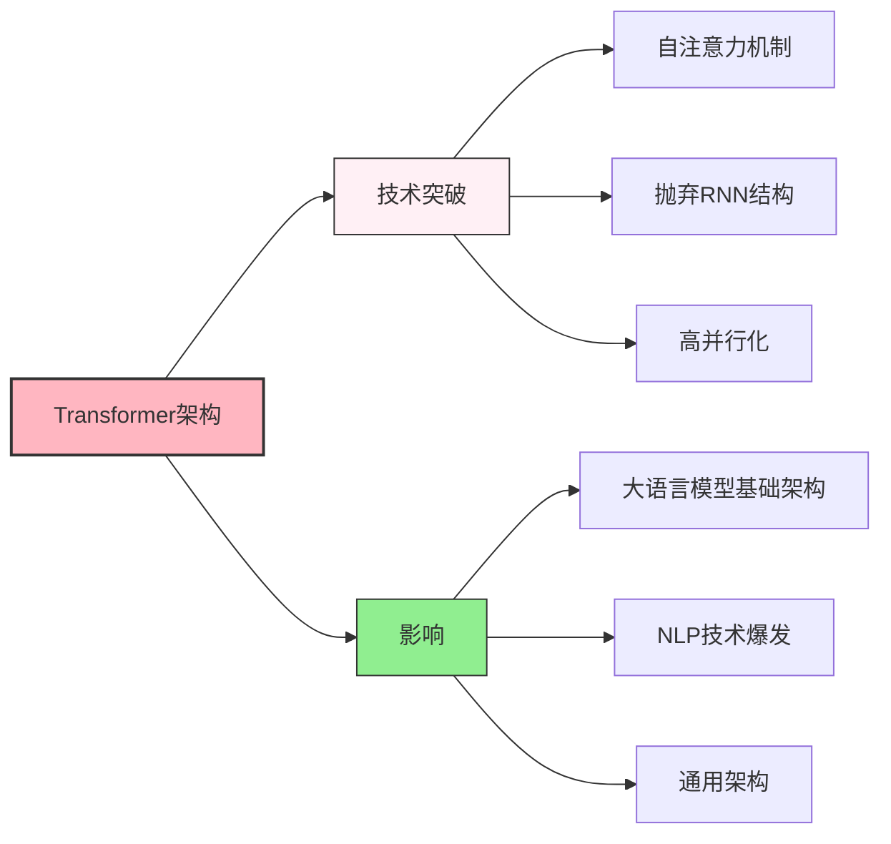
```mermaid
graph LR
    A[Transformer架构] --> B[技术突破]
    A --> C[影响]
    
    B --> B1[自注意力机制]
    B --> B2[抛弃RNN结构]
    B --> B3[高并行化]
    
    C --> C1[大语言模型基础架构]
    C --> C2[NLP技术爆发]
    C --> C3[通用架构]
    
    style A fill:#FFB6C1,stroke:#333,stroke-width:2px
    style B fill:#FFF0F5,stroke:#333,stroke-width:1px
    style C fill:#90EE90,stroke:#333,stroke-width:1px
```

### 1.2.3 2020年：GPT-3展示强大能力——AI领域的"登月时刻"

2020年，OpenAI发布了GPT-3，拥有1750亿参数，展现出惊人的少样本学习能力，就像人类首次登上月球一样，GPT-3展示了AI的巨大潜力。

**技术突破**：
- 模型规模达到了前所未有的1750亿参数，相当于一个"超级大脑"的诞生，1750亿参数就像1750亿个神经元，能够存储和处理海量信息
- 展示了强大的少样本学习能力，能够从少量示例中快速学习，就像一个聪明的学生，只需要看几个例题就能掌握解题方法
- 能够生成高质量的文本内容，几乎达到人类水平，就像一个天才作家，能写出各种风格的文章

**影响**：
- 证明了大模型的"缩放规律"（模型越大，能力越强），就像是AI领域的"摩尔定律"，推动了模型规模的不断扩大
- 推动了大模型研究的热潮，各大公司纷纷投入大模型研发，就像掀起了一场科学革命，吸引了全世界的科学家和工程师
- 展示了AI在自然语言处理领域的巨大潜力，让人们看到了通用人工智能的可能，就像打开了一扇新世界的大门

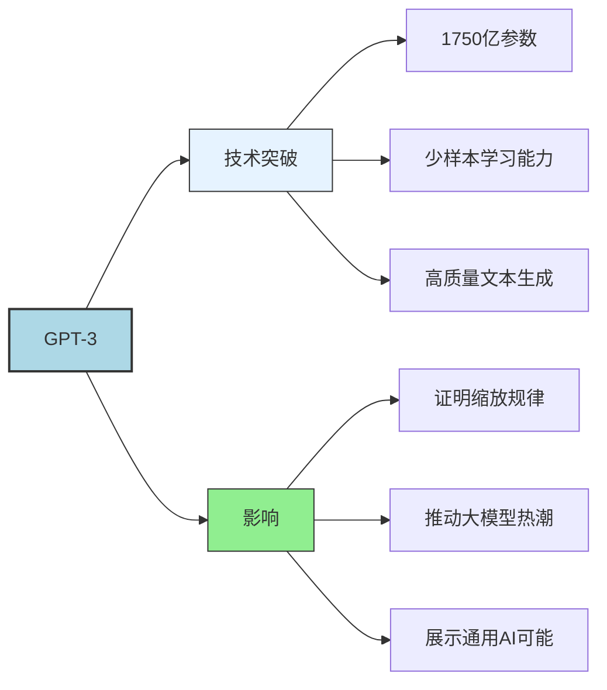
```mermaid
graph LR
    A[GPT-3] --> B[技术突破]
    A --> C[影响]
    
    B --> B1[1750亿参数]
    B --> B2[少样本学习能力]
    B --> B3[高质量文本生成]
    
    C --> C1[证明缩放规律]
    C --> C2[推动大模型热潮]
    C --> C3[展示通用AI可能]
    
    style A fill:#ADD8E6,stroke:#333,stroke-width:2px
    style B fill:#E6F3FF,stroke:#333,stroke-width:1px
    style C fill:#90EE90,stroke:#333,stroke-width:1px
```

### 1.2.4 2022年：ChatGPT引爆生成式AI——AI领域的"iPhone时刻"

2022年11月，OpenAI发布了ChatGPT，引发了全球AI热潮，生成式AI成为了AI领域的焦点，就像iPhone的发布改变了手机行业一样，ChatGPT改变了AI行业。

**技术突破**：
- 引入了强化学习人类反馈(RLHF)技术，让模型更符合人类价值观，就像是给AI装上了"道德指南针"，让它能够按照人类的价值观行事
- 进行了指令微调，使模型能够更好地理解人类指令，就像是给AI装上了"翻译器"，让它能够听懂人类的各种指令
- 优化了对话能力，能够进行连贯的多轮对话，就像是给AI装上了"记忆系统"，让它能够记住之前的对话内容

**影响**：
- 将AI从实验室推向大众，引发全球AI热潮，就像是AI领域的"iPhone时刻"，让AI真正走进了普通人的生活，几乎人人都在使用或讨论ChatGPT
- 加速了生成式AI的商业化进程，各大公司纷纷推出自己的生成式AI产品，就像是掀起了一场商业革命，吸引了大量的投资和创业公司
- 推动了AI在各个领域的应用，从内容创作到客户服务，从教育到医疗，AI的应用场景迅速扩展，就像互联网从信息传递扩展到了各个行业

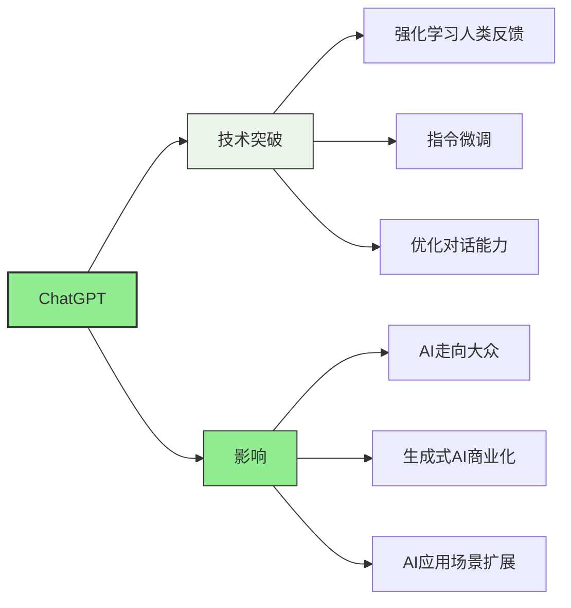
```mermaid
graph LR
    A[ChatGPT] --> B[技术突破]
    A --> C[影响]
    
    B --> B1[强化学习人类反馈]
    B --> B2[指令微调]
    B --> B3[优化对话能力]
    
    C --> C1[AI走向大众]
    C --> C2[生成式AI商业化]
    C --> C3[AI应用场景扩展]
    
    style A fill:#90EE90,stroke:#333,stroke-width:2px
    style B fill:#E8F5E8,stroke:#333,stroke-width:1px
    style C fill:#90EE90,stroke:#333,stroke-width:1px
```

### 小练习

你能说出ChatGPT与传统聊天机器人的本质区别吗？

**参考答案**：
- 传统聊天机器人：基于规则或简单的统计模型，只能处理预定义的场景，就像只会背台词的演员，只能按照剧本表演
- ChatGPT：基于大模型和生成式AI技术，能够理解复杂指令，生成高质量内容，进行连贯的多轮对话，就像一个能自由交谈的智者，能应对各种话题

---

## 1.3 AI当前发展阶段与特点：大模型与生成式AI的时代

### 1.3.1 大模型主导：就像航空母舰主导海洋

当前AI发展的一个显著特点是大模型主导，模型规模不断增长，能力边界不断扩展，就像航空母舰主导海洋一样，大模型主导着AI领域的发展方向。

**特点**：
- 模型参数规模从十亿级增长到万亿级，就像从"小船"发展到"航空母舰"，规模越来越大，能力越来越强
- 预训练+微调范式成为主流，就像"先上基础课，再上专业课"，先学习通用知识，再针对特定领域进行微调
- 开源模型与闭源模型并存发展，就像"公有云"和"私有云"并存，满足不同用户的需求
- 多模态能力逐渐成熟，就像从"单功能设备"发展到"多功能设备"，能够处理文本、图像、音频等多种数据

**代表模型**：
- GPT-4：OpenAI的旗舰模型，支持多模态，就像一个全能选手，能处理各种任务
- Gemini：Google的多模态模型，就像一个拥有多种感官的智能体，能看、能听、能理解
- Claude 3：Anthropic的长文本处理模型，就像一个能阅读长篇小说的读者，能处理数万字的长文本
- Llama 3：Meta的开源大模型，就像一个开放的知识库，任何人都可以使用和修改

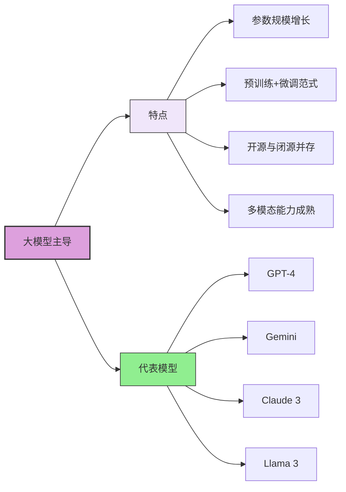
```mermaid
graph LR
    A[大模型主导] --> B[特点]
    A --> C[代表模型]
    
    B --> B1[参数规模增长]
    B --> B2[预训练+微调范式]
    B --> B3[开源与闭源并存]
    B --> B4[多模态能力成熟]
    
    C --> C1[GPT-4]
    C --> C2[Gemini]
    C --> C3[Claude 3]
    C --> C4[Llama 3]
    
    style A fill:#DDA0DD,stroke:#333,stroke-width:2px
    style B fill:#F0E6FA,stroke:#333,stroke-width:1px
    style C fill:#90EE90,stroke:#333,stroke-width:1px
```

### 1.3.2 生成式AI爆发：从"判断者"到"创造者"的转变

从判别式AI向生成式AI转变是当前AI发展的另一个重要趋势，就像从"裁判"到"运动员"的转变，AI不再只是判断和分类，而是能够创造和生成内容。

**特点**：
- 内容生成能力大幅提升：文本、图像、音频、视频，就像一个全能艺术家，能写文章、画画、作曲、制作视频
- 跨模态生成能力逐渐成熟，就像一个能将文字转化为图像，将图像转化为音频的多面手
- 生成质量接近甚至超过人类水平，就像一个天才艺术家，能创作出媲美人类的作品
- 应用场景从专业领域向通用领域扩展，就像从"专业工具"发展到"大众消费品"，人人都能使用

**代表应用**：
- 文本生成：ChatGPT、文心一言，就像一个能写各种风格文章的作家
- 图像生成：Midjourney、Stable Diffusion，就像一个能画各种风格画作的画家
- 音频生成：ElevenLabs、Adobe Podcast，就像一个能合成各种声音和音乐的音乐家
- 视频生成：Runway ML、Pika，就像一个能制作各种视频的导演

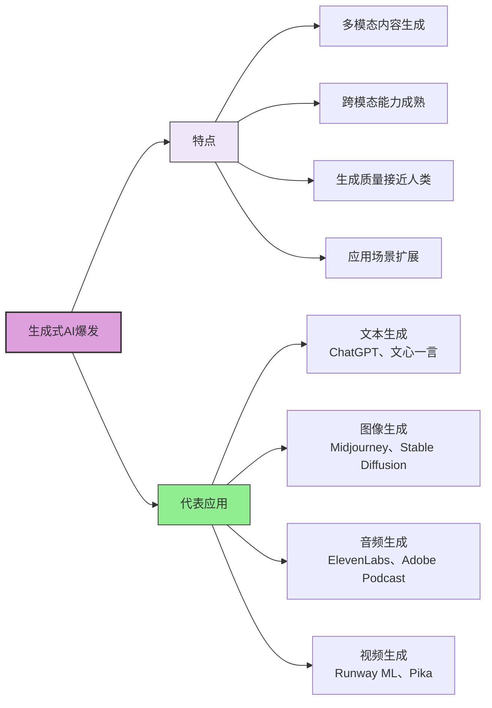
```mermaid
graph LR
    A[生成式AI爆发] --> B[特点]
    A --> C[代表应用]
    
    B --> B1[多模态内容生成]
    B --> B2[跨模态能力成熟]
    B --> B3[生成质量接近人类]
    B --> B4[应用场景扩展]
    
    C --> C1[文本生成<br>ChatGPT、文心一言]
    C --> C2[图像生成<br>Midjourney、Stable Diffusion]
    C --> C3[音频生成<br>ElevenLabs、Adobe Podcast]
    C --> C4[视频生成<br>Runway ML、Pika]
    
    style A fill:#DDA0DD,stroke:#333,stroke-width:2px
    style B fill:#F0E6FA,stroke:#333,stroke-width:1px
    style C fill:#90EE90,stroke:#333,stroke-width:1px
```

### 1.3.3 应用场景广泛：AI渗透到各行各业

AI应用场景从专业领域向通用领域扩展，覆盖了几乎所有行业，就像电力从照明扩展到了各个行业，AI已经成为了现代社会的基础设施。

**特点**：
- 从B端向C端扩展，就像从"商业工具"发展到"个人消费品"，人人都能使用AI
- 垂直行业应用不断深化，就像从"通用软件"发展到"行业专用软件"，针对不同行业提供定制化解决方案
- 个人用户与企业用户并重，就像"个人电脑"和"服务器"并存，满足不同用户的需求
- 从辅助工具向核心业务系统转变，就像从"辅助工具"发展到"核心设备"，成为企业运营的关键

**应用领域**：
- 金融：智能投顾、反欺诈，就像一个能为你理财和保护财产安全的金融顾问
- 医疗：辅助诊断、药物发现，就像一个能帮助医生诊断疾病和研发新药的医疗助手
- 制造：质量检测、预测性维护，就像一个能检测产品质量和预测设备故障的工厂工人
- 教育：个性化学习、智能答疑，就像一个能为你定制学习计划和解答问题的老师
- 零售：智能推荐、库存优化，就像一个能推荐你喜欢的商品和优化库存的店长

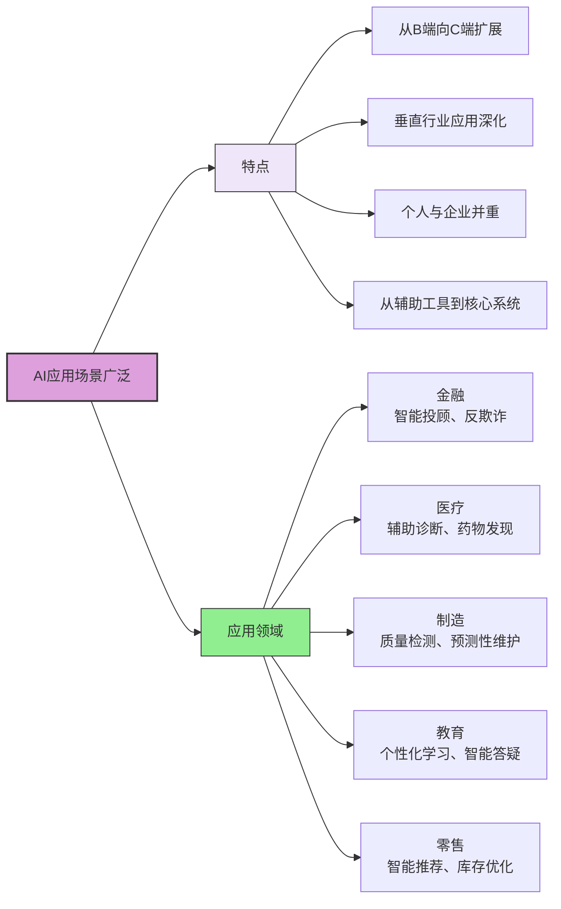
```mermaid
graph LR
    A[AI应用场景广泛] --> B[特点]
    A --> C[应用领域]
    
    B --> B1[从B端向C端扩展]
    B --> B2[垂直行业应用深化]
    B --> B3[个人与企业并重]
    B --> B4[从辅助工具到核心系统]
    
    C --> C1[金融<br>智能投顾、反欺诈]
    C --> C2[医疗<br>辅助诊断、药物发现]
    C --> C3[制造<br>质量检测、预测性维护]
    C --> C4[教育<br>个性化学习、智能答疑]
    C --> C5[零售<br>智能推荐、库存优化]
    
    style A fill:#DDA0DD,stroke:#333,stroke-width:2px
    style B fill:#F0E6FA,stroke:#333,stroke-width:1px
    style C fill:#90EE90,stroke:#333,stroke-width:1px
```

### 1.3.4 技术生态成熟：就像一个繁荣的城市生态系统

AI技术生态不断成熟，为AI应用提供了良好的基础设施和工具支持，就像一个繁荣的城市生态系统，有完善的基础设施、丰富的资源和活跃的社区。

**特点**：
- 云厂商提供完整的AI服务栈，就像城市的"基础设施"，提供水、电、气等必要资源
- 开源工具和框架丰富，就像城市的"公共设施"，提供公园、图书馆等公共资源
- 开发者生态活跃，就像城市的"居民"，活跃的社区促进了技术的发展和创新
- 标准和规范逐渐完善，就像城市的"规章制度"，保障了系统的有序运行

**代表生态**：
- 云服务：AWS SageMaker、Azure AI、Google Cloud AI，就像城市的"公共服务"，提供各种AI服务
- 开源框架：PyTorch、TensorFlow、LangChain，就像城市的"公共交通工具"，方便开发者使用
- 模型平台：Hugging Face、ModelScope，就像城市的"超市"，提供各种预训练模型

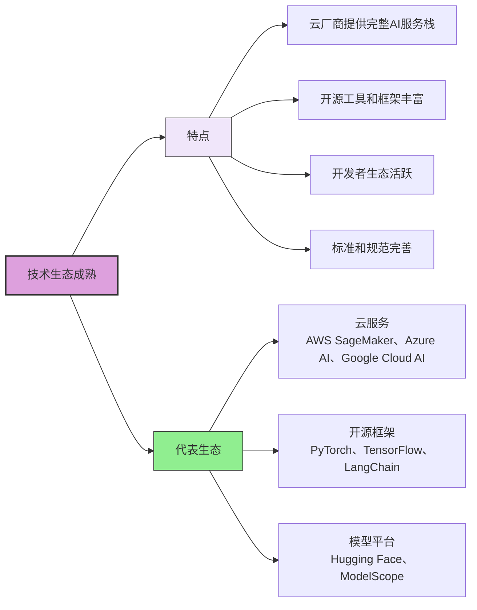
```mermaid
graph LR
    A[技术生态成熟] --> B[特点]
    A --> C[代表生态]
    
    B --> B1[云厂商提供完整AI服务栈]
    B --> B2[开源工具和框架丰富]
    B --> B3[开发者生态活跃]
    B --> B4[标准和规范完善]
    
    C --> C1[云服务<br>AWS SageMaker、Azure AI、Google Cloud AI]
    C --> C2[开源框架<br>PyTorch、TensorFlow、LangChain]
    C --> C3[模型平台<br>Hugging Face、ModelScope]
    
    style A fill:#DDA0DD,stroke:#333,stroke-width:2px
    style B fill:#F0E6FA,stroke:#333,stroke-width:1px
    style C fill:#90EE90,stroke:#333,stroke-width:1px
```

---

## 1.4 为什么现在AI"能用了"：四大因素的完美结合

就像人类发明电灯泡需要同时具备灯丝、真空玻璃泡、电源等多个条件一样，AI的爆发也需要多个因素的共同作用。现在AI"能用了"，是技术、工程、商业和社会四大因素完美结合的结果。

### 1.4.1 技术因素：就像汽车的发动机和变速箱

**算法突破**：
- Transformer架构解决了长序列依赖问题，就像"从马车到汽车的突破"，彻底改变了AI理解和生成语言的能力
- 深度学习算法不断优化，就像"从手动挡到自动挡的突破"，让AI更容易使用
- 强化学习技术的应用，就像"从普通汽车到自动驾驶汽车的突破"，让AI能够自主学习和优化

**算力提升**：
- GPU、TPU等专用硬件的发展，就像"从人力到蒸汽机的突破"，提供了强大的计算能力
- 云计算的普及，就像"从家庭发电机到电网的突破"，让任何人都能使用强大的计算资源
- 分布式训练技术的成熟，就像"从单匹马拉车到多匹马拉车的突破"，大大提高了训练速度

**数据积累**：
- 互联网时代产生的海量数据，就像"从竹简到印刷术的突破"，提供了海量的训练数据
- 数据标注技术的发展，就像"从手写笔记到打字机的突破"，提高了数据的质量和标注效率
- 开放数据集的丰富，就像"从私人图书馆到公共图书馆的突破"，让研究者能够共享数据资源

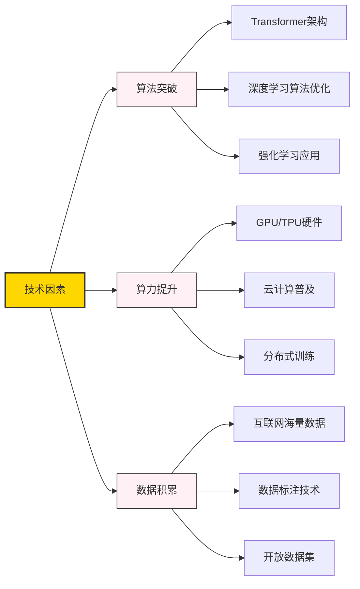
```mermaid
graph LR
    A[技术因素] --> B[算法突破]
    A --> C[算力提升]
    A --> D[数据积累]
    
    B --> B1[Transformer架构]
    B --> B2[深度学习算法优化]
    B --> B3[强化学习应用]
    
    C --> C1[GPU/TPU硬件]
    C --> C2[云计算普及]
    C --> C3[分布式训练]
    
    D --> D1[互联网海量数据]
    D --> D2[数据标注技术]
    D --> D3[开放数据集]
    
    style A fill:#FFD700,stroke:#333,stroke-width:2px
    style B fill:#FFF0F5,stroke:#333,stroke-width:1px
    style C fill:#FFF0F5,stroke:#333,stroke-width:1px
    style D fill:#FFF0F5,stroke:#333,stroke-width:1px
```

### 1.4.2 工程因素：就像汽车的生产工艺和供应链

**模型训练技术**：
- 分布式训练技术，就像"从手工制作到流水线生产的突破"，提高了模型训练的效率
- 混合精度训练，就像"从满负荷运行到智能调节的突破"，在保证精度的同时提高了速度
- 模型并行和数据并行，就像"从单条流水线到多条流水线的突破"，进一步提高了训练效率

**模型压缩技术**：
- 量化技术：降低模型精度，提高推理速度，就像"从大块头到便携设备的突破"，让AI可以在手机等小型设备上运行
- 剪枝技术：去除冗余参数，就像"从复杂机器到精简设计的突破"，减少了模型的大小和计算量
- 知识蒸馏：将大模型的知识迁移到小模型，就像"从专家到学徒的知识传递"，让小模型也能拥有大模型的能力

**部署优化**：
- 推理加速框架：TensorRT、ONNX Runtime，就像"从土路到高速公路的突破"，提高了AI的运行速度
- 服务化架构：模型即服务(MaaS)，就像"从定制设备到标准化服务的突破"，让AI可以通过API轻松使用
- 边缘计算的应用，就像"从中央厨房到社区厨房的突破"，让AI可以在靠近用户的地方运行，降低延迟

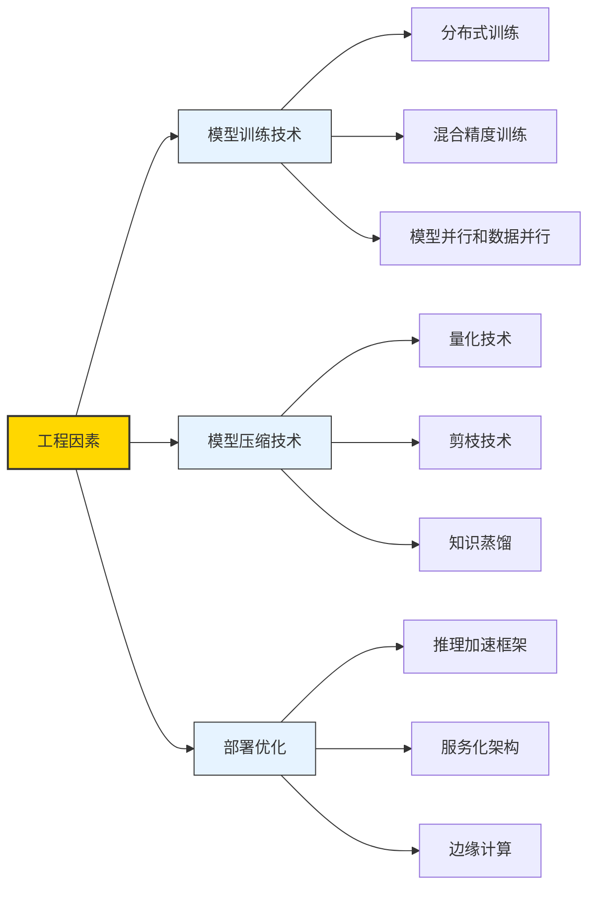
```mermaid
graph LR
    A[工程因素] --> B[模型训练技术]
    A --> C[模型压缩技术]
    A --> D[部署优化]
    
    B --> B1[分布式训练]
    B --> B2[混合精度训练]
    B --> B3[模型并行和数据并行]
    
    C --> C1[量化技术]
    C --> C2[剪枝技术]
    C --> C3[知识蒸馏]
    
    D --> D1[推理加速框架]
    D --> D2[服务化架构]
    D --> D3[边缘计算]
    
    style A fill:#FFD700,stroke:#333,stroke-width:2px
    style B fill:#E6F3FF,stroke:#333,stroke-width:1px
    style C fill:#E6F3FF,stroke:#333,stroke-width:1px
    style D fill:#E6F3FF,stroke:#333,stroke-width:1px
```

### 1.4.3 商业因素：就像汽车的市场和商业模式

**巨头投入**：
- OpenAI、Google、Meta等公司的大规模投入，就像"从个人发明到企业研发的突破"，提供了大量资源
- 创业公司的涌现，就像"从少数品牌到百花齐放的突破"，推动了创新和竞争
- 风险投资的支持，就像"从自有资金到风险投资的突破"，为AI创业提供了资金支持

**API化服务**：
- 降低了AI使用门槛，就像"从专业设备到消费电子产品的突破"，让任何人都能使用AI
- 标准化了AI服务接口，就像"从各种插头到统一插座的突破"，方便不同系统集成
- 推动了AI的普及，就像"从奢侈品到日用品的突破"，让AI走进了千家万户

**商业模式成熟**：
- 从科研走向商业化，就像"从实验室到市场的突破"，让AI产生了实际价值
- 多种商业模式并存：API调用、私有化部署、订阅制，就像"从单一产品到多种服务的突破"，满足不同用户需求
- 垂直行业解决方案的成熟，就像"从通用产品到定制服务的突破"，针对不同行业提供专业解决方案

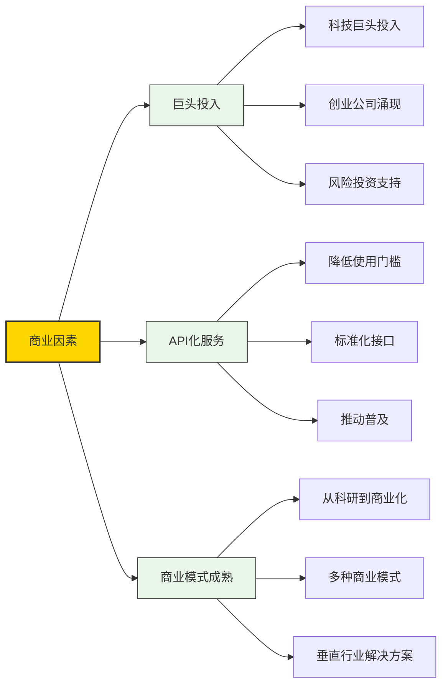
```mermaid
graph LR
    A[商业因素] --> B[巨头投入]
    A --> C[API化服务]
    A --> D[商业模式成熟]
    
    B --> B1[科技巨头投入]
    B --> B2[创业公司涌现]
    B --> B3[风险投资支持]
    
    C --> C1[降低使用门槛]
    C --> C2[标准化接口]
    C --> C3[推动普及]
    
    D --> D1[从科研到商业化]
    D --> D2[多种商业模式]
    D --> D3[垂直行业解决方案]
    
    style A fill:#FFD700,stroke:#333,stroke-width:2px
    style B fill:#E8F5E8,stroke:#333,stroke-width:1px
    style C fill:#E8F5E8,stroke:#333,stroke-width:1px
    style D fill:#E8F5E8,stroke:#333,stroke-width:1px
```

### 1.4.4 社会因素：就像汽车的道路和交通规则

**用户接受度提高**：
- AI产品逐渐普及，就像"从新奇事物到日常用品的转变"，AI已经融入人们的生活
- 用户对AI的信任度提高，就像"从怀疑到信任的转变"，人们开始放心使用AI
- AI成为日常生活的一部分，就像"从奢侈品到必需品的转变"，人们离不开AI

**政策支持**：
- 各国政府出台AI发展规划，就像"从自由发展到政策引导的转变"，为AI发展提供了方向
- 支持AI技术研发和应用，就像"从限制到鼓励的转变"，为AI发展提供了动力
- 制定AI伦理和规范，就像"从无序到有序的转变"，为AI发展提供了保障

**人才储备**：
- AI相关专业人才数量增长，就像"从少数专家到大量人才的转变"，为AI发展提供了人力资源
- 跨学科人才培养，就像"从单一学科到交叉学科的转变"，培养了复合型AI人才
- 开发者社区的壮大，就像"从少数爱好者到庞大社区的转变"，推动了AI技术的普及和创新

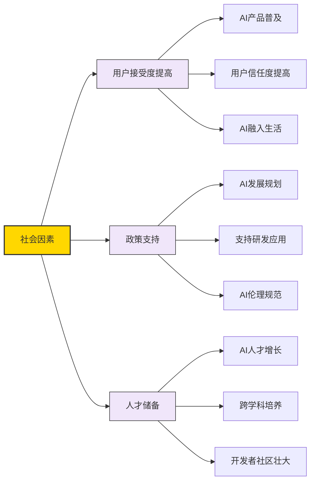
```mermaid
graph LR
    A[社会因素] --> B[用户接受度提高]
    A --> C[政策支持]
    A --> D[人才储备]
    
    B --> B1[AI产品普及]
    B --> B2[用户信任度提高]
    B --> B3[AI融入生活]
    
    C --> C1[AI发展规划]
    C --> C2[支持研发应用]
    C --> C3[AI伦理规范]
    
    D --> D1[AI人才增长]
    D --> D2[跨学科培养]
    D --> D3[开发者社区壮大]
    
    style A fill:#FFD700,stroke:#333,stroke-width:2px
    style B fill:#F0E6FA,stroke:#333,stroke-width:1px
    style C fill:#F0E6FA,stroke:#333,stroke-width:1px
    style D fill:#F0E6FA,stroke:#333,stroke-width:1px
```

### 四大因素的协同作用：就像一桌美味佳肴

AI"能用了"，是技术、工程、商业和社会四大因素协同作用的结果，就像一桌美味佳肴需要合适的食材、精湛的厨艺、良好的厨房设施和懂得欣赏的食客一样：

- **技术因素**是"食材"：优质的食材是美味佳肴的基础
- **工程因素**是"厨艺"：精湛的厨艺能让食材发挥最大的价值
- **商业因素**是"厨房设施"：良好的设施能提高烹饪效率
- **社会因素**是"食客"：懂得欣赏的食客能让美食得到认可和传播

### 小思考

你认为AI"能用了"的最关键因素是什么？为什么？

**参考答案**：
AI"能用了"是多个因素共同作用的结果，很难说哪个是最关键的。不过，如果一定要选一个，可能是**Transformer架构的提出**（技术因素），因为它是当前所有大语言模型的基础，就像蒸汽机是工业革命的核心一样，Transformer架构是AI革命的核心。当然，没有算力、数据、工程、商业和社会因素的支持，Transformer架构也不可能发挥出这么大的作用。

---

## 本章总结

### 知识回顾

1. **AI发展的三波浪潮**：
   - 第一波浪潮（1956-1980年代）：规则系统时代，基于明确的规则和逻辑推理
   - 第二波浪潮（1980年代-2010年代）：统计机器学习时代，基于统计模型和数据驱动
   - 第三波浪潮（2010年代至今）：深度学习时代，基于深度神经网络和海量数据

2. **关键技术转折点**：
   - 2012年：AlexNet横扫ImageNet，开启深度学习时代
   - 2017年：Transformer架构诞生，成为大模型基础
   - 2020年：GPT-3展示大模型的强大能力
   - 2022年：ChatGPT引爆生成式AI热潮

3. **当前AI发展阶段的特点**：
   - 大模型主导：模型规模持续增长
   - 生成式AI爆发：从判别式向生成式转变
   - 应用场景广泛：覆盖几乎所有行业
   - 技术生态成熟：云服务、开源框架丰富

4. **AI"能用了"的原因**：
   - 技术因素：算法突破、算力提升、数据积累
   - 工程因素：模型训练技术、模型压缩技术、部署优化
   - 商业因素：巨头投入、API化服务、商业模式成熟
   - 社会因素：用户接受度提高、政策支持、人才储备

### 知识体系梳理

```mermaid
graph LR
    A[AI发展历史] --> B[三波浪潮]
    A --> C[关键技术转折点]
    A --> D[当前发展阶段]
    A --> E[AI"能用了"的原因]
    
    B --> B1[规则系统时代]
    B --> B2[统计机器学习时代]
    B --> B3[深度学习时代]
    
    C --> C1[AlexNet 2012]
    C --> C2[Transformer 2017]
    C --> C3[GPT-3 2020]
    C --> C4[ChatGPT 2022]
    
    D --> D1[大模型主导]
    D --> D2[生成式AI爆发]
    D --> D3[应用场景广泛]
    D --> D4[技术生态成熟]
    
    E --> E1[技术因素]
    E --> E2[工程因素]
    E --> E3[商业因素]
    E --> E4[社会因素]
```

### 实践应用场景

**场景1：企业AI战略规划**

假设你是一家制造企业的管理者，想引入AI技术提升生产效率。通过本章学习，你可以：

1. 了解AI技术的发展阶段和特点
2. 分析当前AI技术在制造业的应用场景
3. 评估企业引入AI技术的时机和条件
4. 制定合理的AI战略规划

**场景2：AI解决方案设计**

假设你是一名售前工程师，需要为客户设计AI解决方案。通过本章学习，你可以：

1. 了解客户所在行业的AI应用现状
2. 分析客户需求与当前AI技术的匹配度
3. 选择合适的AI技术路线
4. 设计符合客户实际情况的解决方案

### 下一步学习建议

1. 深入学习AI核心概念与技术图谱（第2章）
2. 了解主流AI模型家族与应用场景（第3章）
3. 掌握AI产业链与商业模式（第4章）
4. 结合自己的行业，思考AI技术的应用机会

通过本章的学习，你已经对AI的发展历史和现状有了全面的了解。接下来，我们将深入学习AI的核心概念和技术图谱，为后续学习奠定更坚实的基础。

---

**小练习答案参考**

- **思考1**：如果把AI比作一个学生，那么三波浪潮分别对应：
  - 第一波浪潮：小学生，只会按照老师教的规则做题
  - 第二波浪潮：中学生，能够从例题中学习解题方法
  - 第三波浪潮：大学生，能够自主学习，举一反三

- **练习1**：ChatGPT与传统聊天机器人的本质区别：
  - 传统聊天机器人：基于规则或简单的统计模型，只能处理预定义的场景
  - ChatGPT：基于大模型和生成式AI技术，能够理解复杂指令，生成高质量内容，进行连贯的多轮对话

- **思考2**：AI"能用了"的最关键因素是多方面的，包括算法突破、算力提升、数据积累、工程优化、商业推动和社会接受度等。其中，Transformer架构的提出和大模型的发展是技术上的关键转折点，而ChatGPT的成功则是商业化的关键转折点。

---