# 第一篇 AI全景认知与商业语境

## 第2章 AI核心概念与技术图谱

### 学习线路图
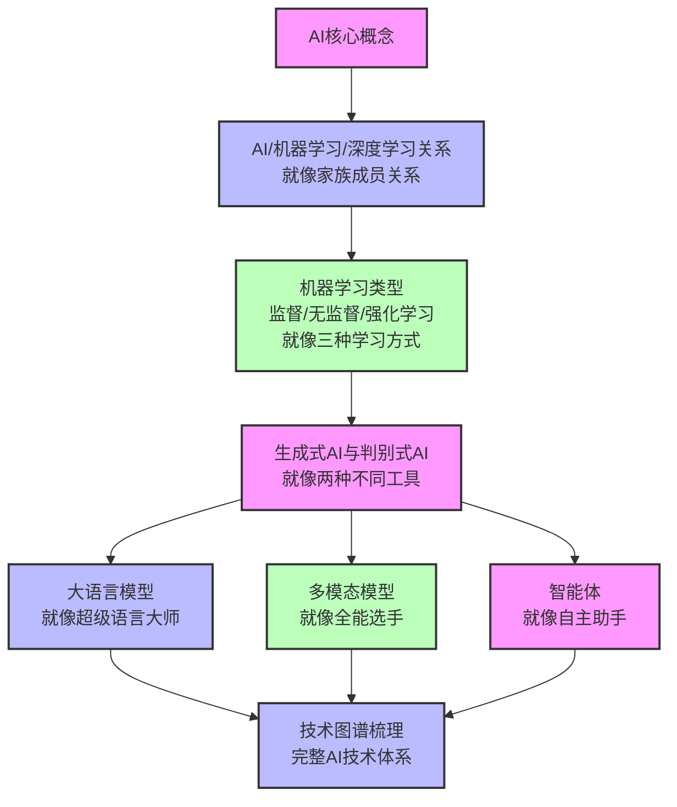

### 学习目标
1. 理解AI、机器学习、深度学习之间的关系，就像理解一个家族中不同成员的关系
2. 掌握机器学习的主要类型及其应用场景，就像了解三种不同的学习方式
3. 区分生成式AI与判别式AI，就像区分两种不同的工具
4. 了解大语言模型、多模态模型、智能体的基本概念，就像了解不同类型的智能助手
5. 建立完整的AI技术图谱，就像建立一个完整的知识地图

### 核心知识点
- AI、机器学习、深度学习的关系：从宏观到微观的层级关系
- 机器学习类型：监督学习、无监督学习、强化学习，三种不同的学习方式
- 生成式AI与判别式AI：从"判断"到"创造"的飞跃
- 大语言模型(LLM)：能够理解和生成人类语言的超级智能
- 多模态模型：能够处理多种数据类型的全能选手
- AI智能体：能够自主决策和行动的智能系统
- AI技术图谱：完整的AI技术体系

### 重点难点
- AI、机器学习、深度学习的层次关系：理清概念间的包含关系
- 不同机器学习类型的应用场景区分：知道什么时候用什么学习方式
- 生成式AI与判别式AI的本质区别：理解从"判断"到"创造"的本质不同

### 本章导读

你可能经常听到"人工智能"、"机器学习"、"深度学习"、"大语言模型"这些术语，但你是否真正理解它们之间的关系？它们就像是一个家族中的不同成员，有着密切的联系，但又各自有着不同的特点和能力。

比如，人工智能就像是一个大家庭，机器学习是这个家庭中的一个重要成员，而深度学习则是机器学习的一个分支。就像人类家族一样，AI家族也有不同的分支和成员，各自有着不同的能力和特点。

本章将带你梳理AI领域的核心概念，建立清晰的技术图谱。我们将使用生活化的比喻，把复杂的AI概念转化为你熟悉的事物，帮助你轻松理解AI的核心原理和技术关系。

让我们一起开启AI核心概念的学习之旅吧！

---

## 2.1 AI、机器学习、深度学习的关系

### 2.1.1 层次关系

AI、机器学习、深度学习是三个密切相关但又有所不同的概念，它们之间存在着明显的层次关系，就像是一个大家族中的不同成员：

**层次结构图**：
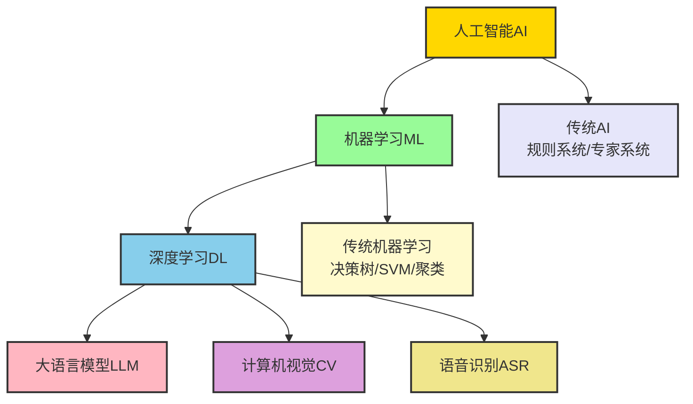

**生活化比喻**：
- **AI**：就像是一个"智能生物"，具备智能的各种能力，比如感知、思考、学习、决策
- **机器学习**：就像是这个生物的"学习能力"，能够从经验中学习，不断成长
- **深度学习**：就像是这个生物的"深度思考能力"，能够进行复杂的思考和推理，解决更难的问题
- **大语言模型**：就像是这个生物的"语言能力"，能够理解和生成人类语言
- **计算机视觉**：就像是这个生物的"视觉能力"，能够看懂图像和视频
- **语音识别**：就像是这个生物的"听觉能力"，能够听懂人类语言

**形象化例子**：
想象一下，你有一个智能机器人助手：
- **AI**：机器人整体，具备各种智能能力
- **机器学习**：机器人的学习模块，能够从你的使用习惯中学习（比如你喜欢早上8点听新闻）
- **深度学习**：机器人的大脑，能够处理复杂的任务（比如理解你说的"明天天气怎么样，要不要带伞？"）
- **大语言模型**：机器人的语言处理器，能够与你进行自然流畅的对话（比如陪你聊天、写邮件）
- **计算机视觉**：机器人的眼睛，能够识别物体和人脸（比如认出你回家，主动打招呼）
- **语音识别**：机器人的耳朵，能够听懂你的语音指令（比如你说"关灯"，它就会执行）

**实际企业案例**：
某电商平台使用AI技术提升用户体验：
- **AI**：整个智能推荐系统
- **机器学习**：从用户浏览、购买历史中学习用户偏好
- **深度学习**：分析用户行为的复杂模式，预测用户可能感兴趣的商品
- **大语言模型**：生成个性化的商品推荐文案
- **计算机视觉**：识别用户上传的商品图片，推荐相似商品
- **语音识别**：支持用户通过语音搜索商品

### 2.1.2 概念定义

**人工智能(AI)**：
- 定义：能够模拟人类智能的计算机系统
- 核心能力：感知、推理、学习、决策、交互
- 目标：让机器能够像人一样思考和行动

**机器学习(ML)**：
- 定义：AI的一个分支，让计算机能够从数据中学习，而不需要明确编程
- 核心思想：通过算法从数据中学习规律，然后应用这些规律解决新问题
- 类型：监督学习、无监督学习、强化学习

**深度学习(DL)**：
- 定义：机器学习的一个分支，使用深度神经网络进行学习
- 核心思想：通过多层神经网络模拟人类大脑的工作方式
- 特点：能够自动学习特征，处理复杂的非结构化数据

### 2.1.3 发展历程

AI的发展经历了从规则系统到机器学习，再到深度学习的演进过程：

| 阶段 | 核心技术 | 特点 |
|------|----------|------|
| 规则系统时代 | 专家系统、逻辑推理 | 基于明确的规则和逻辑 |
| 机器学习时代 | 决策树、SVM、聚类算法 | 基于统计模型和数据驱动 |
| 深度学习时代 | 神经网络、Transformer | 基于深度神经网络和海量数据 |

### 小思考

如果把AI比作一辆汽车，那么机器学习和深度学习分别对应汽车的什么部件？

---

## 2.2 机器学习的主要类型

机器学习主要分为三种类型：监督学习、无监督学习和强化学习。它们就像是三种不同的学习方式，适用于不同的场景。我们可以用一个简单的比喻来理解它们：

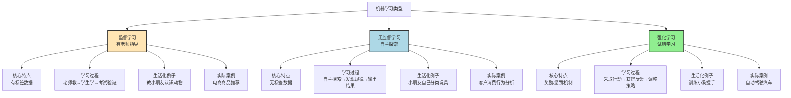

### 2.2.1 监督学习

**核心特点**：有老师指导的学习

监督学习就像是学生在老师的指导下学习，老师会告诉学生什么是对的，什么是错的。在机器学习中，"老师"就是带有标签的数据，比如图片上标注的"猫"或"狗"。

**学习过程**：
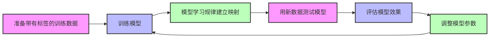

**代表性技术**：
- 分类算法：判断事物属于哪一类（如垃圾邮件分类）
- 回归算法：预测连续数值（如房价预测）

**应用场景**：
- 图像识别：识别图片中的物体（如人脸识别解锁手机）
- 语音识别：将语音转换为文本（如手机语音助手Siri）
- 推荐系统：根据用户历史行为推荐商品（如淘宝、京东的推荐）
- 信用评分：根据用户信息评估贷款风险（如银行贷款审批）
- 医疗诊断：辅助医生诊断疾病（如X光片识别）

**形象化例子**：
想象一下，你正在教小朋友认识水果：
1. 你拿出一张苹果的图片，告诉小朋友："这是苹果"
2. 你拿出一张香蕉的图片，告诉小朋友："这是香蕉"
3. 经过多次练习后，小朋友看到一张新的水果图片，就能自己说出"这是苹果"或"这是香蕉"

这就是监督学习的过程，小朋友就是"模型"，你就是"老师"，带有标签的图片就是"训练数据"。

**实际企业案例**：
某银行使用监督学习进行信用卡欺诈检测：
- **训练数据**：历史信用卡交易数据，标记为"正常交易"或"欺诈交易"
- **学习过程**：模型学习正常交易和欺诈交易的特征（如交易金额、时间、地点等）
- **应用效果**：实时监测新交易，识别可疑欺诈行为，准确率达到98%

### 2.2.2 无监督学习

**核心特点**：没有老师指导的学习

无监督学习就像是学生自己探索学习，没有老师告诉对错，学生需要自己从数据中发现规律和模式。在机器学习中，输入的数据是没有标签的。

**学习过程**：
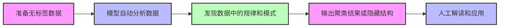

**代表性技术**：
- 聚类算法：将相似的数据分组（如客户分群）
- 降维算法：减少数据维度，保留关键信息（如PCA）
- 关联规则学习：发现数据中的关联关系（如购物篮分析）

**应用场景**：
- 客户分群：根据客户行为将客户分为不同群体（如电商客户画像）
- 异常检测：识别异常数据（如信用卡欺诈检测）
- 主题建模：从大量文本中提取主题（如新闻分类）
- 购物篮分析：发现商品之间的关联关系（如"啤酒+尿布"的经典案例）
- 图像压缩：减少图像文件大小，便于存储和传输

**形象化例子**：
想象一下，你给小朋友一堆不同的玩具，没有告诉他怎么分类：
1. 小朋友自己观察玩具的特点（颜色、形状、大小等）
2. 他发现有些玩具是红色的，有些是蓝色的
3. 他把红色的玩具放在一起，蓝色的玩具放在一起
4. 他还发现有些玩具是圆形的，有些是方形的
5. 他又把圆形的玩具放在一起，方形的玩具放在一起

这就是无监督学习的过程，小朋友自己发现了玩具的分类规律，不需要老师指导。

**实际企业案例**：
某电商平台使用无监督学习进行客户分群：
- **数据**：用户的浏览、购买、收藏等行为数据，无标签
- **学习过程**：模型自动分析用户行为，将用户分为"价格敏感型"、"品质追求型"、"时尚潮流型"等不同群体
- **应用效果**：针对不同群体制定差异化营销策略，转化率提升35%

### 2.2.3 强化学习

**核心特点**：通过试错学习

强化学习就像是动物通过试错学习，做对了得到奖励，做错了得到惩罚，逐渐学会最优的行为策略。在机器学习中，智能体会与环境交互，根据环境的反馈调整自己的行为。

**学习过程**：
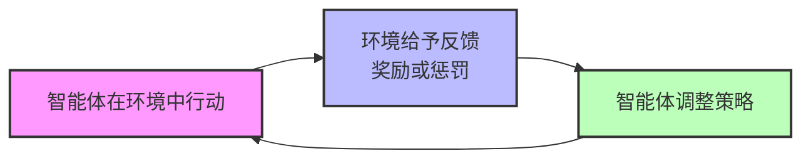

**代表性技术**：
- Q-learning：基于价值函数的强化学习
- 策略梯度：直接优化策略的强化学习
- 深度强化学习：结合深度学习和强化学习（如AlphaGo）

**应用场景**：
- 游戏AI：AlphaGo击败围棋世界冠军
- 自动驾驶：通过与环境交互学习最优驾驶策略
- 机器人控制：机器人学习抓取物体
- 资源调度：优化数据中心的资源分配
- 广告投放：动态调整广告出价，最大化ROI

**形象化例子**：
想象一下，你正在训练一只小狗学会握手：
1. 你伸出手，对小狗说："握手"
2. 小狗尝试做出各种动作（摇尾巴、坐下、伸手等）
3. 当小狗伸出爪子与你握手时，你给予奖励（食物）
4. 当小狗做出其他动作时，你不给予奖励
5. 经过多次尝试后，小狗学会了"听到握手指令就伸出爪子"的行为

这就是强化学习的过程，小狗就是"智能体"，你就是"环境"，食物就是"奖励"，小狗通过试错学习学会了最优策略。

**实际企业案例**：
某网约车平台使用强化学习优化司机调度：
- **智能体**：调度系统
- **环境**：实时的订单分布、司机位置、道路状况
- **奖励机制**：减少乘客等待时间、提高司机利用率
- **应用效果**：乘客平均等待时间减少40%，司机日收入增加25%

### 机器学习类型对比表

| 类型 | 核心特点 | 学习方式 | 代表算法 | 应用场景 | 形象比喻 |
|------|----------|----------|----------|----------|----------|
| 监督学习 | 有标签数据 | 老师指导 | 分类、回归 | 图像识别、推荐系统、信用评分 | 教小朋友认识水果 |
| 无监督学习 | 无标签数据 | 自主探索 | 聚类、降维、关联规则 | 客户分群、异常检测、购物篮分析 | 小朋友自己分类玩具 |
| 强化学习 | 奖励/惩罚机制 | 试错学习 | Q-learning、策略梯度 | 游戏AI、自动驾驶、资源调度 | 训练小狗握手 |

### 小练习

你能说出以下场景分别属于哪种机器学习类型吗？
1. 识别手写数字
2. 客户分群
3. 训练机器人走路
4. 预测股票价格
5. 发现商品关联关系

---

## 2.3 生成式AI与判别式AI

根据AI系统的输出类型，我们可以将AI分为生成式AI和判别式AI。它们就像是两种不同类型的工具，一种用于创作，一种用于判断。

### 2.3.1 判别式AI

**核心特点**：判断和分类

判别式AI就像是一个"裁判"，它的主要任务是判断和分类，给出一个明确的结果。

**工作原理**：
```mermaid
flowchart LR
    A[输入数据<br>图片/文本/语音] --> B[判别式AI模型]
    B --> C[输出判断结果<br>"这是猫"/"垃圾邮件"/"正面情感"]
    
    style A fill:#f9f,stroke:#333,stroke-width:2px
    style B fill:#bbf,stroke:#333,stroke-width:2px
    style C fill:#bfb,stroke:#333,stroke-width:2px
```

**代表性技术**：
- 图像分类：识别图片中的物体
- 语音识别：将语音转换为文本
- 垃圾邮件过滤：判断邮件是否为垃圾邮件
- 情感分析：分析文本的情感倾向

**应用场景**：
- 人脸识别：解锁手机、门禁系统
- 语音助手：识别用户指令（如Siri、小爱同学）
- 内容审核：过滤社交媒体违规内容
- 疾病诊断：辅助医生诊断疾病（如X光片识别）
- 金融风控：识别信用卡欺诈交易

**形象化例子**：
想象一下，你去参加一个水果识别比赛：
1. 主持人拿出一个水果（输入数据）
2. 你（判别式AI）观察水果的颜色、形状、大小
3. 你判断出这是一个苹果（输出判断结果）

这就是判别式AI的工作过程，它的核心是"判断"。

**实际企业案例**：
某短视频平台使用判别式AI进行内容审核：
- **输入数据**：用户上传的短视频
- **模型任务**：判断视频是否包含违规内容（如暴力、色情、虚假信息）
- **应用效果**：95%以上的违规内容在发布前被拦截，每天处理超过1000万条视频

### 2.3.2 生成式AI

**核心特点**：创造和生成

生成式AI就像是一个"创作者"，它的主要任务是创造新的内容，而不仅仅是判断。

**工作原理**：
```mermaid
flowchart LR
    A[输入提示词<br>"一只可爱的小猫在草地上玩耍"] --> B[生成式AI模型]
    B --> C[输出新内容<br>生成一张符合描述的图片]
    
    style A fill:#f9f,stroke:#333,stroke-width:2px
    style B fill:#bbf,stroke:#333,stroke-width:2px
    style C fill:#bfb,stroke:#333,stroke-width:2px
```

**代表性技术**：
- 生成对抗网络(GAN)：用于生成图像、视频
- 变分自编码器(VAE)：用于生成图像、音频
- 大语言模型(LLM)：用于生成文本（如ChatGPT）
- 扩散模型：用于生成高质量图像（如Midjourney、Stable Diffusion）

**应用场景**：
- 文本生成：写文章、写代码、聊天（如ChatGPT）
- 图像生成：根据文字描述生成图片（如Midjourney、Stable Diffusion）
- 音频生成：生成音乐、语音合成（如AI歌手）
- 视频生成：生成短视频、动画（如Runway）
- 代码生成：根据需求生成代码（如GitHub Copilot）

**形象化例子**：
想象一下，你是一个画家：
1. 有人告诉你："画一只可爱的小猫在草地上玩耍"（输入提示词）
2. 你根据自己的知识和想象，画出了一幅新的画（输出新内容）

这就是生成式AI的工作过程，它的核心是"创造"。

**实际企业案例**：
某广告公司使用生成式AI创作广告内容：
- **输入需求**："为一款新的奶茶品牌创作30张不同风格的宣传海报"
- **模型应用**：使用Midjourney生成符合品牌调性的海报
- **应用效果**：创作时间从1周缩短到1天，成本降低70%，创意多样性提升

### 2.3.3 两者的区别与联系

**直观对比**：
```mermaid
graph TD
    A[AI技术] --> B[判别式AI<br>就像裁判]
    A --> C[生成式AI<br>就像创作者]
    
    B --> B1[输入：图片/文本/语音]
    B --> B2[输出：判断结果<br>"这是猫"/"垃圾邮件"]
    B --> B3[核心能力：分类、识别、预测]
    B --> B4[代表应用：人脸识别、语音识别]
    
    C --> C1[输入：提示词/需求]
    C --> C2[输出：新内容<br>文本/图像/音频]
    C --> C3[核心能力：创作、生成、合成]
    C --> C4[代表应用：ChatGPT、Midjourney]
    
    B --> D[两者联系：可以结合使用]
    C --> D
    D --> D1[生成式AI生成内容]
    D1 --> D2[判别式AI审核内容]
    
    style A fill:#f9f,stroke:#333,stroke-width:2px
    style B fill:#ffcccb,stroke:#333,stroke-width:2px
    style C fill:#90ee90,stroke:#333,stroke-width:2px
    style D fill:#add8e6,stroke:#333,stroke-width:2px
```

**详细对比表**：

| 维度 | 判别式AI | 生成式AI |
|------|----------|----------|
| 核心任务 | 判断、分类 | 创造、生成 |
| 输出类型 | 明确的结果（如标签、概率） | 新的内容（如文本、图像） |
| 技术原理 | 学习输入到输出的映射 | 学习数据的分布规律 |
| 应用场景 | 识别、分类、预测 | 创作、生成、合成 |
| 代表应用 | 图像识别、语音识别 | ChatGPT、Midjourney |
| 形象比喻 | 裁判、评委、医生 | 作家、画家、音乐家 |
| 发展趋势 | 技术成熟，应用广泛 | 快速发展，潜力巨大 |

**联系与结合应用**：
- 生成式AI生成内容，判别式AI进行审核
- 判别式AI提供反馈，帮助生成式AI优化生成质量
- 两者结合形成更强大的AI系统

**实际结合案例**：
某电商平台使用生成式AI+判别式AI优化商品描述：
1. 生成式AI根据商品图片和基本信息生成多种商品描述
2. 判别式AI评估这些描述的质量、吸引力和合规性
3. 系统选择最优描述推荐给商家使用
4. 应用效果：商家商品描述质量提升60%，转化率提升25%

### 小思考

生成式AI和判别式AI就像是两种不同的职业，你能分别说出它们对应的职业吗？

---

## 2.4 大语言模型、多模态模型、智能体

### 2.4.1 大语言模型(LLM)

**核心特点**：处理和生成文本

大语言模型就像是一个"超级语言大师"，它能够理解和生成人类语言，处理各种文本任务。

**定义**：
- 基于Transformer架构的大型深度学习模型
- 训练数据包含海量文本（如书籍、网页、论文等）
- 能够理解和生成人类语言
- 支持多种语言任务

**工作原理**：
```mermaid
flowchart LR
    A[输入文本<br>"写一篇关于AI的短文"] --> B[大语言模型<br>如GPT-4]
    B --> C[输出文本<br>生成一篇关于AI的短文]
    
    style A fill:#f9f,stroke:#333,stroke-width:2px
    style B fill:#bbf,stroke:#333,stroke-width:2px
    style C fill:#bfb,stroke:#333,stroke-width:2px
```

**核心能力**：
- 文本生成：写文章、写代码、写邮件
- 文本理解：问答、摘要、翻译
- 对话交互：聊天机器人
- 逻辑推理：解决数学问题、推理任务
- 创意写作：故事、诗歌、剧本

**代表模型**：
| 模型名称 | 开发公司 | 特点 | 应用场景 |
|----------|----------|------|----------|
| GPT系列 | OpenAI | 通用能力强，支持多种任务 | 聊天、内容创作、代码生成 |
| Claude系列 | Anthropic | 擅长长文本处理，安全性高 | 文档分析、法律文本处理 |
| Llama系列 | Meta | 开源可定制 | 企业私有化部署、模型微调 |
| 文心一言 | 百度 | 中文优化，适合中文场景 | 中文内容创作、企业服务 |
| Gemini | Google | 多模态能力强 | 多模态内容生成、复杂任务处理 |

**应用场景**：
- 智能客服：自动回复客户咨询，减少人工成本
- 内容创作：生成营销文案、新闻稿、社交媒体内容
- 代码辅助：自动生成代码、修复bug、解释代码
- 教育辅导：解答学生问题、生成学习资料、个性化辅导
- 法律助手：合同审查、法律条文解释

**形象化例子**：
想象一下，你有一个无所不知的语言助手：
1. 你问它："如何写一份辞职信？"
2. 它马上生成了一份结构完整、语言得体的辞职信
3. 你又问它："请用莎士比亚风格改写这份辞职信"
4. 它立刻用优美的莎士比亚式语言重新写了一份

这就是大语言模型的能力，它就像是一个精通各种语言风格和知识领域的超级助手。

**实际企业案例**：
某科技公司使用大语言模型优化内部文档管理：
- **问题**：公司积累了大量技术文档，员工查找和理解困难
- **解决方案**：部署自定义大语言模型，建立文档问答系统
- **应用效果**：
  - 员工查找文档效率提升80%
  - 新员工入职培训时间缩短50%
  - 技术问题解决速度提升60%

### 2.4.2 多模态模型

**核心特点**：处理多种模态数据

多模态模型就像是一个"全能选手"，它能够处理多种类型的数据，如文本、图像、音频、视频等，并建立它们之间的关联。

**定义**：
- 能够理解和生成多种模态数据的AI模型
- 可以处理文本、图像、音频、视频等
- 能够建立不同模态之间的关联

**工作原理**：
```mermaid
flowchart LR
    A[输入多模态数据<br>图片+文字<br>"这张图片里有什么？"] --> B[多模态模型<br>如GPT-4V]
    B --> C[输出文本<br>"这张图片里有一只猫在草地上玩耍"]
    
    style A fill:#f9f,stroke:#333,stroke-width:2px
    style B fill:#bbf,stroke:#333,stroke-width:2px
    style C fill:#bfb,stroke:#333,stroke-width:2px
```

**核心能力**：
- 跨模态理解：图文理解、视频理解
- 跨模态生成：文生图、图生文、文生视频、图生视频
- 多模态对话：同时处理文本和图像输入
- 多模态检索：用文本检索图像，用图像检索文本

**代表模型**：
| 模型名称 | 开发公司 | 特点 | 应用场景 |
|----------|----------|------|----------|
| GPT-4V | OpenAI | 图文理解能力强 | 图文问答、图像分析 |
| Gemini | Google | 多模态融合能力强 | 复杂多模态任务 |
| Claude 3 Opus | Anthropic | 支持多模态输入 | 企业多模态应用 |
| DALL-E 3 | OpenAI | 文生图质量高 | 创意设计、广告创作 |
| Midjourney | Midjourney | 艺术风格多样 | 艺术创作、视觉设计 |

**应用场景**：
- 图文问答：根据图片提问，AI回答（如"这张X光片有什么问题？"）
- 图像描述：自动生成图片的文字描述（如无障碍辅助）
- 视频分析：分析视频内容，生成摘要（如监控视频分析）
- 多模态聊天：同时发送文本和图片，AI理解并回复
- 产品设计：根据文字描述生成产品设计图

**形象化例子**：
想象一下，你有一个全能的创意助手：
1. 你对它说："画一只穿着宇航服的猫在月球上行走"
2. 它立刻生成了一张符合描述的图片
3. 你又说："给这张图片配一首诗"
4. 它马上写了一首富有想象力的诗

这就是多模态模型的能力，它能够理解和生成多种类型的内容，就像是一个全能的创意大师。

**实际企业案例**：
某电商平台使用多模态模型提升商品搜索体验：
- **问题**：用户有时难以用准确的文字描述想要的商品
- **解决方案**：引入多模态搜索功能，支持"以图搜图"和"图文结合搜索"
- **应用效果**：
  - 搜索转化率提升45%
  - 用户搜索满意度提升60%
  - 新用户留存率提升30%

### 2.4.3 AI智能体(Agent)

**核心特点**：自主决策和行动

AI智能体就像是一个"自主助手"，它能够自主规划、决策和行动，完成复杂的多步骤任务。

**定义**：
- 能够感知环境、自主决策、执行行动的AI系统
- 具备规划能力、工具使用能力、记忆能力
- 能够完成复杂的多步骤任务

**工作原理**：
```mermaid
flowchart LR
    A[输入任务<br>"帮我订一张明天去上海的机票"] --> B[AI智能体]
    B --> C[规划子任务<br>1. 查明天的航班信息<br>2. 选择合适的航班<br>3. 预订机票<br>4. 发送确认信息]
    C --> D[执行子任务<br>调用航班API、支付API等]
    D --> E[获取反馈<br>航班信息、预订结果]
    E --> F[调整策略<br>如航班已满则选择其他航班]
    F --> D
    D --> G[完成任务<br>发送机票确认信息]
    
    style A fill:#f9f,stroke:#333,stroke-width:2px
    style B fill:#bbf,stroke:#333,stroke-width:2px
    style C fill:#bfb,stroke:#333,stroke-width:2px
    style D fill:#f9f,stroke:#333,stroke-width:2px
    style E fill:#bbf,stroke:#333,stroke-width:2px
    style F fill:#bfb,stroke:#333,stroke-width:2px
    style G fill:#f9f,stroke:#333,stroke-width:2px
```

**核心能力**：
- 规划能力：将复杂任务分解为子任务
- 工具使用：调用外部工具和API
- 记忆能力：记住过去的对话和行动
- 自主决策：根据环境反馈调整行动
- 多任务协作：同时处理多个任务

**代表应用**：
| 应用名称 | 特点 | 应用场景 |
|----------|------|----------|
| AutoGPT | 自主规划和执行 | 复杂任务自动化 |
| BabyAGI | 具备记忆和反思能力 | 长期任务管理 |
| 企业智能助手 | 集成企业系统 | 自动办公、流程自动化 |
| 游戏NPC | 自主行为和决策 | 游戏AI、虚拟角色 |
| 个性化学习助手 | 自适应学习路径 | 教育辅导、技能培训 |

**应用场景**：
- 自动办公：自动生成报告、安排会议、处理邮件
- 智能运维：自动检测和修复系统故障
- 虚拟助手：帮助用户完成各种任务（如购物、旅行规划）
- 教育辅导：个性化的学习助手，根据学生情况调整教学内容
- 科研助手：自动查找文献、分析数据、生成报告

**形象化例子**：
想象一下，你有一个全能的私人助理：
1. 你对它说："帮我安排一个周末的家庭旅行"
2. 它自动：
   - 查看天气情况
   - 选择合适的目的地
   - 预订酒店和门票
   - 制定详细的行程安排
   - 发送提醒信息
3. 整个过程不需要你过多干预，它就能完成所有任务

这就是AI智能体的能力，它能够自主规划和执行复杂任务，就像是一个有独立思考能力的助手。

**实际企业案例**：
某金融机构使用AI智能体提升客户服务：
- **问题**：客户咨询涉及多个系统和部门，处理效率低
- **解决方案**：部署AI智能体，集成多个业务系统
- **应用效果**：
  - 客户咨询响应时间从5分钟缩短到10秒
  - 人工客服工作量减少60%
  - 客户满意度提升75%

### 小练习

你能说出以下应用分别属于哪种AI类型吗？
1. ChatGPT
2. Midjourney
3. 人脸识别系统
4. GPT-4V
5. AutoGPT

---

## 2.5 AI技术图谱梳理

### 2.5.1 完整技术图谱

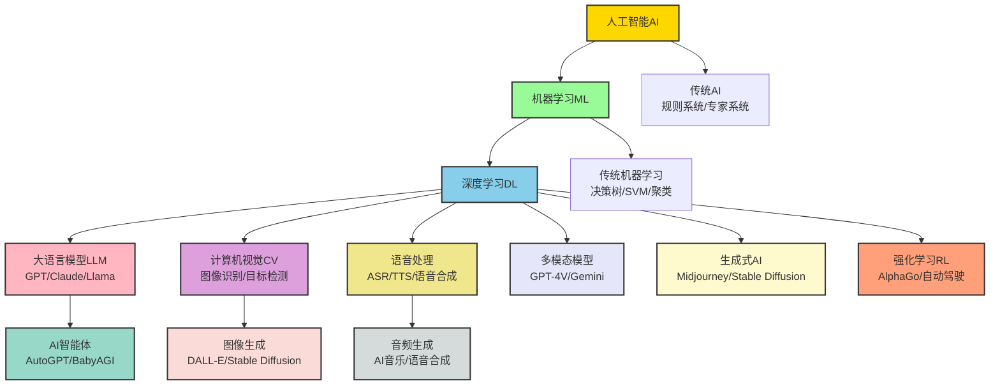

### 2.5.2 分层技术体系

AI技术体系可以分为四个主要层次，从基础到应用逐步递进：

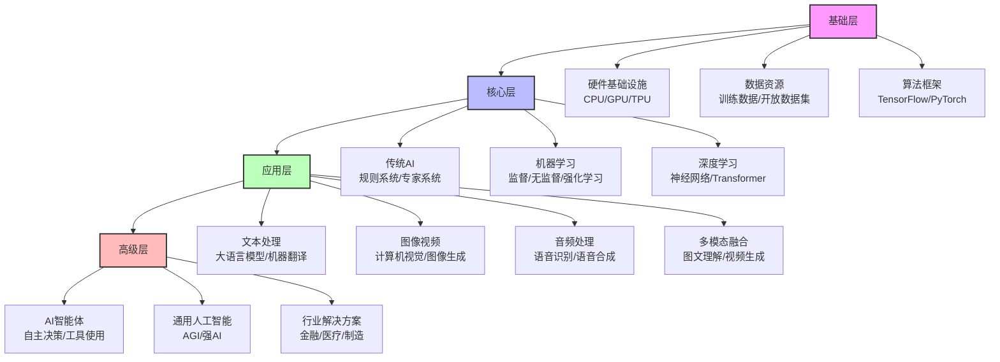

**各层次的核心作用**：
- **基础层**：为AI技术提供算力、数据和开发框架支持
- **核心层**：AI技术的核心算法和模型，是AI能力的基础
- **应用层**：将AI技术应用到具体的场景中，解决实际问题
- **高级层**：具备自主决策和通用能力的AI系统，是AI技术的发展方向

### 2.5.3 技术发展时间线

AI技术的发展经历了从简单到复杂、从单一到多样的过程：

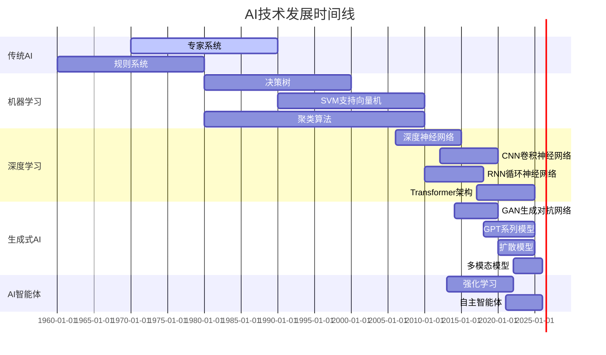

### 2.5.4 技术选择指南

根据不同的业务需求，选择合适的AI技术非常重要。以下是一个简单的技术选择指南：

| 业务需求 | 推荐技术 | 代表模型/工具 | 应用案例 |
|----------|----------|---------------|----------|
| 文本生成/聊天 | 大语言模型 | GPT-4、Claude | 智能客服、内容创作 |
| 图像生成 | 生成式AI | Midjourney、DALL-E | 广告设计、产品创意 |
| 图像识别 | 计算机视觉 | ResNet、YOLO | 人脸识别、质量检测 |
| 语音交互 | 语音处理 | Whisper、TTS | 语音助手、智能音箱 |
| 数据分析 | 机器学习 | 聚类算法、回归算法 | 客户分群、预测分析 |
| 复杂任务自动化 | AI智能体 | AutoGPT、企业智能助手 | 自动办公、流程自动化 |
| 个性化推荐 | 机器学习 | 协同过滤、深度学习推荐 | 电商推荐、内容推荐 |

**选择原则**：
1. **需求匹配**：根据具体业务需求选择合适的技术
2. **成本考虑**：评估技术的部署和使用成本
3. **易用性**：考虑技术的学习曲线和使用难度
4. **可扩展性**：考虑技术未来的扩展性和升级空间
5. **安全性**：评估技术的安全性和合规性

### 2.5.5 实际应用案例

**案例1：金融行业AI应用**
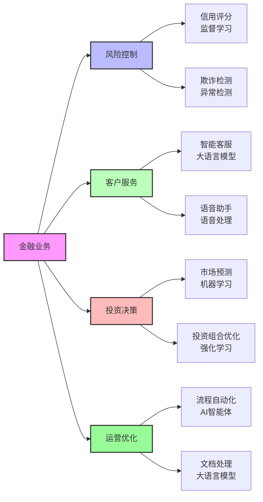

**案例2：医疗行业AI应用**
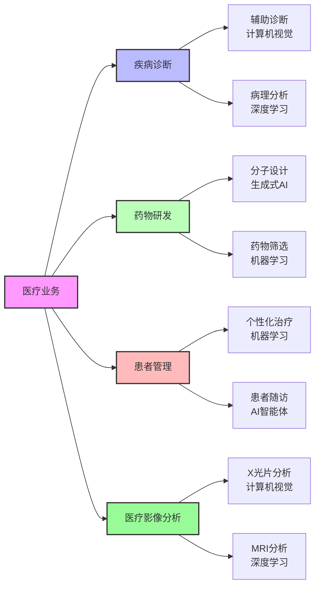

### 小思考

你认为未来AI技术的发展方向是什么？会有哪些新的技术出现？

---

## 本章总结

### 知识回顾

1. **AI、机器学习、深度学习的关系**：
   - AI是一个大概念，机器学习是AI的一个分支，深度学习是机器学习的一个分支
   - 它们之间是层次关系，从宽泛到具体
   - AI的发展经历了从规则系统到机器学习，再到深度学习的演进过程

2. **机器学习的主要类型**：
   - 监督学习：有老师指导的学习，用于分类和预测
   - 无监督学习：没有老师指导的学习，用于发现规律和模式
   - 强化学习：通过试错学习，用于决策和控制

3. **生成式AI与判别式AI**：
   - 判别式AI：判断和分类，如图像识别、语音识别
   - 生成式AI：创造和生成，如ChatGPT、Midjourney
   - 两者各有特点，应用场景不同

4. **大语言模型、多模态模型、智能体**：
   - 大语言模型：处理和生成文本，如GPT-4、Claude
   - 多模态模型：处理多种模态数据，如GPT-4V、Gemini
   - AI智能体：具备自主决策和行动能力，如AutoGPT

5. **AI技术图谱**：
   - 完整的AI技术图谱包括传统AI、机器学习、深度学习、各种应用技术
   - 技术之间存在着密切的联系，从基础层到应用层再到高级层
   - AI技术的发展趋势是模型越来越大、多模态能力越来越强、生成能力越来越强

### 知识体系梳理

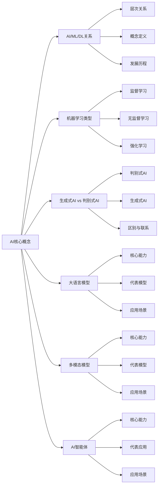

### 实践应用场景

**场景1：企业AI应用规划**

假设你是一家企业的管理者，想引入AI技术提升业务效率。通过本章学习，你可以：

1. 了解不同AI技术的特点和应用场景
2. 根据企业的实际需求，选择合适的AI技术
3. 制定合理的AI应用规划
4. 评估AI技术的可行性和投资回报率

**场景2：AI解决方案设计**

假设你是一名售前工程师，需要为客户设计AI解决方案。通过本章学习，你可以：

1. 分析客户的业务需求
2. 选择合适的AI技术路线
3. 设计解决方案的技术架构
4. 向客户解释解决方案的技术原理

### 下一步学习建议

1. 深入学习主流AI模型家族与应用场景（第3章）
2. 了解AI产业链与商业模式（第4章）
3. 掌握机器学习核心流程（第5章）
4. 结合自己的行业，思考AI技术的应用机会

通过本章的学习，你已经对AI的核心概念和技术图谱有了全面的了解。接下来，我们将深入学习主流AI模型家族与应用场景，为后续学习奠定更坚实的基础。

---

**小练习答案参考**

- **思考1**：如果把AI比作一辆汽车，那么机器学习就像是汽车的发动机，提供动力；深度学习就像是汽车的智能驾驶系统，提供高级功能。

- **练习1**：
  1. 识别手写数字：监督学习
  2. 客户分群：无监督学习
  3. 训练机器人走路：强化学习
  4. 预测股票价格：监督学习（回归）
  5. 发现商品关联关系：无监督学习（关联规则）

- **思考2**：生成式AI就像是作家、画家、音乐家等创作者；判别式AI就像是裁判、评委、医生等判断者。

- **练习2**：
  1. ChatGPT：大语言模型
  2. Midjourney：生成式AI
  3. 人脸识别系统：判别式AI
  4. GPT-4V：多模态模型
  5. AutoGPT：AI智能体

- **思考3**：未来AI技术的发展方向可能包括：更强大的多模态能力、更智能的AI智能体、更高效的小模型、更安全和可控的AI、更个性化的AI服务等。

---