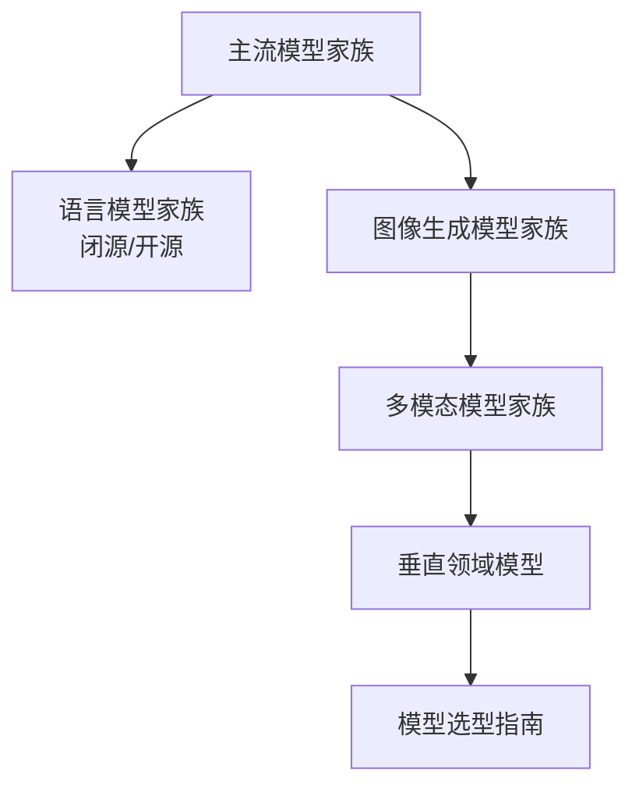
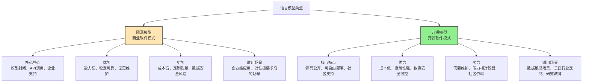
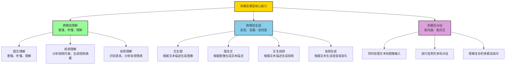
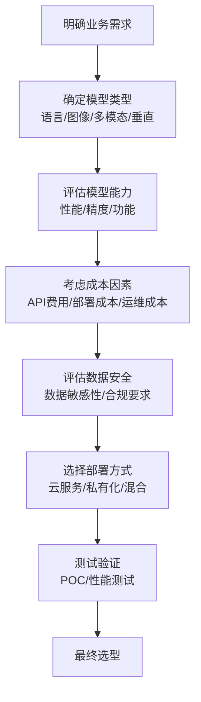

# 第一篇 AI全景认知与商业语境

## 第3章 主流模型家族与应用场景

### 学习线路图


### 学习目标
1. 了解主流AI模型家族的分类和特点
2. 掌握闭源语言模型和开源语言模型的区别
3. 熟悉图像生成模型的主要类型和应用场景
4. 理解多模态模型的核心能力和代表产品
5. 了解垂直领域模型的特点和应用
6. 掌握AI模型选型的基本原则和方法

### 核心知识点
- 语言模型家族：闭源模型（GPT、Claude）、开源模型（Llama、Mistral）
- 图像生成模型：DALL-E、Midjourney、Stable Diffusion
- 多模态模型：GPT-4V、Gemini、Claude 3 Opus
- 垂直领域模型：金融、医疗、制造专用模型
- 模型选型指南：根据需求选择合适的模型

### 重点难点
- 不同模型家族的特点和适用场景
- 闭源模型和开源模型的选择权衡
- 多模态模型与单模态模型的区别
- 如何根据实际需求选择合适的模型

### 本章导读

你可能听说过GPT-4、Midjourney、Llama等AI模型，但你是否知道它们属于不同的模型家族？每个模型家族都有其独特的特点和适用场景。就像是不同的工具，有的适合写作，有的适合绘画，有的适合编程。

本章将带你了解主流AI模型家族的特点和应用场景，帮助你理解不同模型的优势和局限性，学会如何根据实际需求选择合适的AI模型。

---

## 3.1 语言模型家族

语言模型是AI领域中发展最快、应用最广泛的模型家族之一。它们就像是"超级语言大师"，能够理解和生成人类语言。

### 3.1.1 闭源语言模型

闭源语言模型就像是"商业软件"，由商业公司开发和维护，通常通过API对外提供服务，用户无法获取模型的源代码。这些模型就像是"黑盒子"，你只能使用它们提供的功能，但不知道内部是如何工作的。

**核心特点**：
- 模型规模大，能力强（相当于"超级计算机"）
- 训练数据丰富，覆盖范围广（相当于"海量图书馆"）
- 提供稳定的API服务（相当于"可靠的电力供应"）
- 企业级支持和安全保障（相当于"专业的IT维护团队"）
- 价格相对较高（相当于"高端商业软件订阅"）

**代表模型**：

#### GPT系列（OpenAI）

**简介**：GPT系列是OpenAI开发的大语言模型，是当前最受欢迎的AI模型之一，就像是AI领域的"iPhone"，引领着行业的发展趋势。

**特点**：
- 模型规模从GPT-1的1.17亿参数增长到GPT-4的万亿级参数（相当于从"智能手机"到"超级计算机"）
- 支持多种语言任务：文本生成、问答、翻译、代码生成等（相当于"全能工具包"）
- 具备强大的上下文理解能力（相当于"能记住整个对话的聊天伙伴"）
- GPT-4支持多模态输入（相当于"既能听又能看的智能助手"）

**应用场景**：
- 智能客服：自动回复客户咨询（相当于"24小时在线的客服团队"）
- 内容创作：生成营销文案、新闻稿、小说等（相当于"专业的文案团队"）
- 代码辅助：自动生成代码、修复bug（相当于"高级程序员助手"）
- 教育辅导：解答学生问题、生成学习资料（相当于"私人教师"）
- 企业办公：自动生成报告、安排会议（相当于"高效的行政助理"）

**代表产品**：
- ChatGPT：对话式AI助手（相当于"个人智能助理"）
- GPT-4 API：企业级AI服务（相当于"企业级智能平台"）
- GitHub Copilot：代码辅助工具（相当于"程序员的智能搭档"）

#### Claude系列（Anthropic）

**简介**：Claude是Anthropic开发的大语言模型，以长文本处理能力著称，就像是AI领域的"专业文档处理专家"。

**特点**：
- 支持超长上下文窗口，Claude 3 Opus支持200K tokens（相当于"能阅读整部小说的智能助手"）
- 注重安全性和可控性（相当于"保守可靠的法律顾问"）
- 生成内容更加保守和安全（相当于"说话严谨的专业人士"）
- 适合处理法律、金融等专业领域的长文本（相当于"专业领域的知识专家"）

**应用场景**：
- 法律文档分析：合同审查、法律研究（相当于"专业律师助理"）
- 金融报告生成：分析财务数据、生成投资报告（相当于"金融分析师助手"）
- 学术论文写作：文献综述、论文草稿（相当于"学术研究助手"）
- 企业知识库：长文档检索和问答（相当于"企业知识管理专家"）

**代表产品**：
- Claude 3 Opus：顶级模型，适合复杂任务（相当于"资深专家"）
- Claude 3 Sonnet：平衡性能和成本（相当于"中级专家"）
- Claude 3 Haiku：轻量级模型，适合实时应用（相当于"初级专家"）

### 3.1.2 开源语言模型

开源语言模型就像是"开源软件"，源代码公开，用户可以自由下载、修改和部署。这些模型就像是"白盒子"，你可以看到内部是如何工作的，还可以根据自己的需要进行定制。

**核心特点**：
- 源代码公开，可定制性强（相当于"可自行改装的汽车"）
- 部署灵活，可以在本地或私有环境部署（相当于"可以放在家里的服务器"）
- 成本较低，无需支付API调用费用（相当于"免费软件"）
- 社区活跃，持续更新和改进（相当于"有很多志愿者维护的开源项目"）
- 模型规模和能力相对较小（相当于"家用电脑" vs "超级计算机"）

**代表模型**：

#### Llama系列（Meta）

**简介**：Llama是Meta开发的开源大语言模型，是当前最受欢迎的开源模型之一，就像是AI领域的"Linux操作系统"，被广泛应用于各种场景。

**特点**：
- 支持多种模型规模：7B、13B、70B等（相当于"不同配置的电脑"）
- 社区活跃，衍生模型众多（相当于"有很多第三方软件的操作系统"）
- 适合私有化部署（相当于"可以安装在自己电脑上的软件"）
- 支持多语言（相当于"会说多种语言的翻译官"）

**应用场景**：
- 企业内部知识库：数据安全，可定制（相当于"企业内部的知识管理系统"）
- 垂直行业应用：金融、医疗等敏感领域（相当于"行业专用软件"）
- 边缘设备部署：低延迟，离线可用（相当于"可以在手机上运行的应用"）
- 研究和教育：模型调优和实验（相当于"科研人员的实验工具"）

**代表产品**：
- Llama 3：Meta最新开源模型（相当于"最新版本的操作系统"）
- Llama 2：广泛使用的开源模型（相当于"稳定版操作系统"）
- 衍生模型：Llama-2-70B-chat、CodeLlama等（相当于"第三方定制版本"）

#### Mistral系列（Mistral AI）

**简介**：Mistral是Mistral AI开发的开源大语言模型，以高效著称，就像是AI领域的"节能型汽车"，在相同资源下能发挥出更强的性能。

**特点**：
- 高效的架构设计，相同规模下性能更强（相当于"小排量但动力强的汽车"）
- 支持多种模型规模：7B、13B、8x7B等（相当于"不同排量的汽车"）
- 支持量化和蒸馏，适合边缘设备（相当于"可以在小屏幕设备上运行的应用"）
- 生成内容质量高（相当于"高质量的节能产品"）

**应用场景**：
- 实时对话系统：低延迟，高响应速度（相当于"实时聊天工具"）
- 移动应用集成：资源受限环境（相当于"手机应用"）
- 企业级应用：平衡性能和成本（相当于"性价比高的企业软件"）
- 开发者工具：代码生成、API文档（相当于"开发者的高效工具"）

**代表产品**：
- Mistral 7B：轻量级高效模型（相当于"紧凑型节能汽车"）
- Mixtral 8x7B：专家混合模型（相当于"混合动力汽车"）
- Mistral Large：闭源旗舰模型（相当于"高端电动汽车"）

### 3.1.3 闭源模型vs开源模型对比

为了更直观地理解闭源模型和开源模型的区别，我们可以通过以下对比图表和表格来了解它们的特点：



**详细对比表格**：

| 维度 | 闭源模型 | 开源模型 |
|------|----------|----------|
| **访问方式** | API调用 | 本地部署/API调用 |
| **模型规模** | 通常较大（十亿级到万亿级参数） | 灵活可变（百万级到千亿级参数） |
| **定制能力** | 低（只能通过提示词和参数调整） | 高（可修改源码、微调模型） |
| **数据安全性** | 较低（数据需发送到第三方服务器） | 高（数据可本地处理，不泄露） |
| **成本结构** | 按调用量付费或订阅制 | 部署成本+算力成本+运维成本 |
| **技术支持** | 企业级专业支持 | 社区支持+付费商业支持 |
| **更新频率** | 由厂商控制，定期更新 | 社区驱动，更新频繁 |
| **适用场景** | 通用场景、对性能要求高的应用 | 垂直领域、数据敏感场景、定制化需求 |

**形象化比喻**：
- 闭源模型就像是"高端餐厅"：提供优质的服务和菜品，但价格昂贵，菜单固定，无法自己烹饪
- 开源模型就像是"家庭厨房"：需要自己购买食材和烹饪，但可以根据自己的口味定制，成本较低，数据（食材）安全可控

**实际企业选型案例**：

**案例1：大型互联网公司的选择**
- **需求**：通用AI能力，支持多种业务场景
- **选择**：闭源模型（GPT-4）+ 开源模型（Llama 2）混合使用
- **方案**：
  - 核心业务场景使用GPT-4，确保高性能
  - 非核心场景和内部工具使用Llama 2，降低成本
  - 敏感数据处理使用本地部署的Llama 2，确保数据安全
- **效果**：平衡了性能、成本和安全性，ROI提升30%

**案例2：金融科技公司的选择**
- **需求**：内部知识库问答，处理敏感金融数据
- **选择**：开源模型（Llama 2 70B）
- **方案**：
  - 私有化部署在企业内网
  - 使用金融领域数据进行微调
  - 结合企业现有系统使用
- **效果**：数据零泄露，满足监管要求，问答准确率达到95%

**案例3：初创公司的选择**
- **需求**：产品原型开发，快速验证AI功能
- **选择**：闭源模型（Claude 3 Sonnet）
- **方案**：
  - 使用API调用，无需部署和维护
  - 快速集成到产品中
  - 根据使用量付费，成本可控
- **效果**：产品上线时间从6个月缩短到2个月，节省开发成本50%

### 3.1.4 国产语言模型

国产语言模型是由国内公司开发的，适合中文场景，符合国内监管要求。它们就像是"中文优化的AI助手"，在中文理解和生成方面具有独特优势。

**核心特点**：
- 中文优化，适合处理中文文本（包括文言文、方言等）
- 符合国内监管要求，数据安全可控
- 支持多模态输入（文本、图像、音频等）
- 结合国内应用场景优化（如电商、教育、金融等）
- 提供企业级支持和本地化服务

**代表模型对比**：

| 模型名称 | 开发公司 | 核心优势 | 应用场景 |
|----------|----------|----------|----------|
| **文心一言** | 百度 | 搜索能力强、多模态支持、中文优化 | 搜索增强、企业知识管理、内容创作 |
| **通义千问** | 阿里 | 电商场景优化、多模态能力、企业服务 | 电商推荐、智能客服、供应链优化 |
| **豆包** | 字节跳动 | 对话流畅、短视频理解、年轻用户友好 | 聊天助手、内容创作、短视频生成 |
| **讯飞星火** | 科大讯飞 | 语音交互优化、实时翻译、教育场景 | 语音助手、教育辅导、实时翻译 |
| **商汤商量** | 商汤科技 | 视觉理解强、多模态融合、行业解决方案 | 视觉内容生成、工业质检、医疗影像 |

**应用场景**：
- 中文内容创作：新闻稿、营销文案、小说、广告创意
- 智能客服：中文客服对话、多轮问答、问题解决
- 教育辅导：中文学习资料生成、个性化教学、作业批改
- 企业办公：中文报告生成、会议纪要、邮件撰写
- 金融服务：金融文本分析、风险评估、客户服务

**实际企业应用案例**：

**案例1：国内某大型银行的智能客服系统**
- **需求**：提供7×24小时中文智能客服，处理客户咨询
- **选择**：文心一言
- **方案**：
  - 集成文心一言API到现有客服系统
  - 针对金融领域进行微调，支持金融术语
  - 结合知识库实现精准回答
- **效果**：
  - 客户咨询响应时间从30秒缩短到2秒
  - 人工客服工作量减少70%
  - 客户满意度提升到92%

**案例2：某教育科技公司的个性化学习平台**
- **需求**：为学生提供个性化中文学习辅导
- **选择**：讯飞星火
- **方案**：
  - 利用讯飞星火的语音交互能力，实现口语练习
  - 根据学生水平生成个性化学习内容
  - 提供实时作业批改和反馈
- **效果**：
  - 学生学习兴趣提升45%
  - 学习效率提高30%
  - 教师批改工作量减少60%

### 小思考

如果你是一家金融企业的IT负责人，需要选择一个语言模型用于内部知识库，你会选择闭源模型还是开源模型？为什么？

---

## 3.2 图像生成模型家族

图像生成模型就像是"AI画家"，能够根据文本描述或其他输入生成各种风格的图像。它们就像是拥有无限创意和绘画技巧的艺术家，能够创造出从写实照片到抽象艺术的各种作品。

### 3.2.1 扩散模型：当前主流的图像生成技术

扩散模型是当前最流行的图像生成技术，它的工作原理就像是"反向绘画"：
1. 首先从一张充满噪声的图像开始（相当于一张模糊的画布）
2. 然后逐步去除噪声（相当于逐步细化绘画）
3. 最终生成清晰的图像（相当于完成的绘画作品）

**核心特点**：
- 生成图像质量高，细节丰富（相当于"专业画家"的作品）
- 支持多种风格和分辨率（相当于"多才多艺的艺术家"）
- 可控性强，可以通过提示词精确控制生成内容（相当于"能听懂指令的画家"）
- 可以生成写实、卡通、油画等多种风格（相当于"会画各种风格的艺术家"）

**主流模型介绍**：

#### DALL-E系列（OpenAI）：创意无限的AI画家

**简介**：DALL-E是OpenAI开发的图像生成模型，就像是"创意无限的艺术家"，能够根据文本描述生成各种风格的图像。

**特点**：
- 支持多种图像尺寸和分辨率（相当于"能画各种尺寸的画作"）
- 可以生成创意性强的图像（相当于"脑洞大开的艺术家"）
- 支持图像编辑和修改（相当于"能修改自己作品的艺术家"）
- 与GPT系列无缝集成（相当于"能和语言模型协作的艺术家"）

**应用场景**：
- 创意设计：生成logo、海报、产品设计等（相当于"平面设计师"）
- 内容创作：为文章、博客生成插图（相当于"插画师"）
- 游戏开发：生成游戏角色、场景、道具（相当于"游戏美术师"）
- 电商营销：生成产品展示图、广告创意（相当于"广告设计师"）

**代表产品**：
- DALL-E 3：最新版本，支持高质量图像生成（相当于"资深艺术家"）
- ChatGPT Plus：集成DALL-E图像生成功能（相当于"艺术家+语言助手"）

#### Midjourney：艺术风格大师

**简介**：Midjourney是一款基于扩散模型的图像生成工具，以生成艺术风格图像著称，就像是"艺术风格大师"。

**特点**：
- 生成图像艺术感强，风格多样（相当于"会画各种艺术风格的大师"）
- 支持多种艺术风格：油画、水彩、素描等（相当于"精通各种绘画技法的大师"）
- 社区活跃，有大量优秀作品（相当于"有很多粉丝的知名艺术家"）
- 可以通过提示词精确控制风格和内容（相当于"能听懂详细指令的大师"）

**应用场景**：
- 艺术创作：生成艺术作品、插画（相当于"纯艺术家"）
- 设计灵感：为设计师提供创意灵感（相当于"创意顾问"）
- 营销创意：生成广告创意、社交媒体图片（相当于"创意广告师"）
- 游戏美术：生成游戏概念艺术、角色设计（相当于"游戏概念艺术家"）

**使用方式**：
- Discord机器人：通过Discord命令生成图像（相当于"通过聊天指令让艺术家创作"）
- 网页应用：在线生成和编辑图像（相当于"在网页上与艺术家协作"）

#### Stable Diffusion：开源的AI绘画工具

**简介**：Stable Diffusion是Stability AI开发的开源扩散模型，是最受欢迎的开源图像生成模型之一，就像是"开源的绘画工具包"。

**特点**：
- 开源免费，可自由部署和修改（相当于"免费的绘画软件"）
- 支持多种分辨率和风格（相当于"功能丰富的绘画软件"）
- 社区活跃，有大量插件和模型（相当于"有很多插件的绘画软件"）
- 可以生成高质量图像（相当于"专业的绘画软件"）

**应用场景**：
- 企业内部设计：数据安全，可定制（相当于"企业内部的设计工具"）
- 游戏开发：生成游戏资产（相当于"游戏开发的美术工具"）
- 教育和研究：模型调优和实验（相当于"研究人员的实验工具"）
- 个人创作：生成艺术作品、头像等（相当于"个人创作工具"）

**衍生模型**：
- SDXL：Stable Diffusion XL，支持更高分辨率（相当于"高清版本的绘画软件"）
- ControlNet：精确控制图像生成（相当于"精确绘图工具"）
- Lora：模型微调技术，可快速适配特定风格（相当于"风格模板"）

#### 国产图像生成模型

| 模型名称 | 开发公司 | 核心优势 | 应用场景 |
|----------|----------|----------|----------|
| 文心一格 | 百度 | 中文场景优化、多模态支持 | 中文创意设计、广告制作、内容创作 |
| 通义万相 | 阿里 | 电商场景优化、商品图生成 | 电商商品图、广告创意、产品设计 |
| 豆包画图 | 字节跳动 | 短视频场景优化、风格多样 | 短视频内容创作、社交媒体图片 |
| 讯飞星火画图 | 科大讯飞 | 语音交互优化、教育场景 | 教育课件制作、演示文稿图片 |

**主流图像生成模型对比**：

| 模型名称 | 开发公司 | 访问方式 | 生成质量 | 风格多样性 | 成本 | 定制性 | 适用场景 |
|----------|----------|----------|----------|------------|------|--------|----------|
| DALL-E 3 | OpenAI | API/网页 | 极高 | 广泛 | 高 | 低 | 创意设计、内容创作、商业广告 |
| Midjourney | Midjourney | Discord/网页 | 极高 | 艺术感强 | 中高 | 中 | 艺术创作、游戏美术、概念设计 |
| Stable Diffusion | Stability AI | 本地部署/API | 高 | 灵活可变 | 低 | 极高 | 企业内部设计、游戏开发、研究教育 |
| 文心一格 | 百度 | 网页/API | 高 | 中文场景优化 | 中 | 中 | 中文创意设计、广告制作、内容创作 |
| 通义万相 | 阿里 | 网页/API | 高 | 电商场景优化 | 中 | 中 | 电商商品图、广告创意、产品设计 |

**实际企业应用案例**：

**案例1：某时尚品牌的广告创意生成**
- **需求**：快速生成多种风格的广告创意图，用于社交媒体营销
- **选择**：Midjourney
- **方案**：
  - 设计团队提供详细的提示词，描述广告风格和内容
  - 使用Midjourney生成多种风格的广告图
  - 选择最优设计进行微调，用于实际投放
- **效果**：
  - 广告创意生成时间从1周缩短到2天
  - 创意多样性提升80%
  - 社交媒体点击率提升45%

**案例2：某游戏公司的概念设计**
- **需求**：为新游戏生成角色和场景概念图
- **选择**：Stable Diffusion + 自定义训练
- **方案**：
  - 使用开源Stable Diffusion本地部署
  - 用公司现有游戏资产训练自定义模型
  - 生成符合游戏风格的概念图
- **效果**：
  - 概念设计时间减少60%
  - 保持了游戏风格的一致性
  - 节省了大量外部设计师成本

**案例3：某电商平台的商品图生成**
- **需求**：为大量商品生成高质量的展示图
- **选择**：通义万相（阿里）
- **方案**：
  - 上传商品图片和基本描述
  - 使用AI生成不同场景下的商品展示图
  - 自动生成商品描述和标签
- **效果**：
  - 商品图生成成本降低70%
  - 商品上线速度提升5倍
  - 商品点击率提升30%

### 3.2.2 图像生成模型选型指南

选择合适的图像生成模型需要考虑以下因素：

**1. 业务需求**
- 创意设计：优先考虑Midjourney、DALL-E 3
- 商业广告：优先考虑DALL-E 3、文心一格
- 游戏开发：优先考虑Stable Diffusion、Midjourney
- 企业内部设计：优先考虑Stable Diffusion（开源部署）

**2. 成本预算**
- 预算充足：DALL-E 3、Midjourney
- 预算有限：Stable Diffusion（开源部署）
- 中等预算：通义万相、文心一格

**3. 技术能力**
- 技术团队强：Stable Diffusion（可定制开发）
- 技术团队弱：DALL-E 3、Midjourney（易用性高）

**4. 定制需求**
- 需要高度定制：Stable Diffusion（可微调模型）
- 无需定制：DALL-E 3、Midjourney

**5. 数据安全性**
- 数据敏感：Stable Diffusion（本地部署，数据不泄露）
- 数据不敏感：DALL-E 3、Midjourney

### 3.2.3 其他图像生成技术

除了扩散模型，还有其他一些图像生成技术，如生成对抗网络(GAN)、变分自编码器(VAE)等，它们就像是"不同的绘画流派"。

**生成对抗网络(GAN)**：
- 由生成器和判别器组成，通过对抗训练生成图像（相当于"两个艺术家互相竞争，一个画，一个评判"）
- 生成速度快，但细节不如扩散模型（相当于"画得快但细节不够的艺术家"）
- 代表模型：StyleGAN、BigGAN（相当于"特定风格的艺术家"）

**变分自编码器(VAE)**：
- 基于概率模型，生成图像具有多样性（相当于"随机创作的艺术家"）
- 生成质量不如扩散模型和GAN（相当于"新手艺术家"）
- 适合生成抽象图像和概念艺术（相当于"抽象派艺术家"）

**形象化比喻**：
- 扩散模型就像是"专业画家"，画得好，细节丰富，能听懂指令
- GAN就像是"速写画家"，画得快，但细节不够
- VAE就像是"抽象画家"，风格独特，但不太可控

---

## 3.3 多模态模型家族

多模态模型就像是"AI全能选手"，能够处理和理解多种类型的数据，如文本、图像、音频、视频等。它们就像是拥有多种感官的智能生物，能够同时看、听、说、理解，更好地与人类世界交互。

### 3.3.1 核心能力：多感官协同工作

多模态模型具备三种核心能力，就像是"多感官协同工作"：



**形象化比喻**：
- 跨模态理解就像是"能看懂图片并理解文字说明的人"
- 跨模态生成就像是"能根据文字描述画出图画的人"
- 多模态对话就像是"能同时理解文字和图片并进行交流的人"

### 3.3.2 代表模型：AI全能选手的佼佼者

#### GPT-4V（OpenAI）：会看会说的智能助手

**简介**：GPT-4V是OpenAI开发的多模态模型，支持文本和图像输入，就像是"会看会说的智能助手"。

**特点**：
- 能够理解和分析图像内容（相当于"有眼睛的AI"）
- 支持多轮对话（相当于"能进行持续交流的AI"）
- 可以回答关于图像的详细问题（相当于"能看懂图片并解释的AI"）
- 能够生成基于图像的创意内容（相当于"能根据图片创作的AI"）

**应用场景**：
- 图文问答：根据图片提问，AI回答（相当于"图片顾问"）
- 图像描述：自动生成图片的文字描述（相当于"图片解说员"）
- 产品设计：根据草图生成详细设计（相当于"设计助手"）
- 医疗诊断：辅助医生分析医学影像（相当于"医疗影像助手"）
- 教育辅导：根据图片生成学习资料（相当于"图片化学习助手"）

#### Gemini（Google）：全能AI旗舰

**简介**：Gemini是Google开发的多模态大模型，是Google的旗舰AI模型，就像是"AI领域的瑞士军刀"，无所不能。

**特点**：
- 支持多种模态：文本、图像、音频、视频（相当于"全感官AI"）
- 具备强大的多模态理解和生成能力（相当于"能力全面的AI"）
- 支持实时对话（相当于"反应迅速的AI"）
- 适合复杂的多模态任务（相当于"能处理复杂任务的AI"）

**应用场景**：
- 智能助手：多模态对话助手（相当于"全能个人助理"）
- 内容创作：生成图文并茂的内容（相当于"多媒体内容创作者"）
- 教育辅导：交互式学习体验（相当于"多媒体教师"）
- 企业办公：多模态报告生成（相当于"智能报告生成器"）
- 游戏开发：生成游戏内容（相当于"游戏内容创作者"）

**代表产品**：
- Gemini Advanced：高级AI助手（相当于"高端全能助手"）
- Gemini API：企业级多模态服务（相当于"企业级AI平台"）
- Pixel手机内置AI功能（相当于"手机上的AI助手"）

#### Claude 3 Opus（Anthropic）：专业领域的多模态专家

**简介**：Claude 3 Opus是Anthropic开发的多模态模型，支持文本、图像、音频输入，就像是"专业领域的多模态专家"。

**特点**：
- 支持超长上下文窗口（相当于"能阅读长篇文档的AI"）
- 注重安全性和可控性（相当于"可靠的专业顾问"）
- 适合处理专业领域的多模态数据（相当于"专业领域的专家"）
- 生成内容质量高（相当于"高质量输出的AI"）

**应用场景**：
- 法律文档分析：结合图文分析合同（相当于"法律文档助手"）
- 金融报告生成：分析图表和数据（相当于"金融分析助手"）
- 学术研究：分析论文和实验数据（相当于"学术研究助手"）
- 企业知识库：多模态内容检索和问答（相当于"企业知识助手"）

### 3.3.3 多模态模型的应用前景：AI的未来

多模态模型代表了AI的未来发展方向，它们能够更好地理解和生成人类世界的各种信息，就像是"AI从单一感官进化到了多感官"。未来，多模态模型将在以下领域发挥重要作用：

1. **智能助手**：更智能、更自然的人机交互（相当于"能看、能听、能说的智能助手"）
2. **教育领域**：个性化、交互式的学习体验（相当于"多媒体互动教师"）
3. **医疗健康**：辅助医生诊断，分析医学影像（相当于"医疗影像+病历分析助手"）
4. **创意产业**：生成更丰富、更多样的创意内容（相当于"多媒体创意助手"）
5. **企业办公**：更高效、更智能的办公自动化（相当于"多媒体办公助手"）

**形象化例子**：
想象一下，未来你的AI助手：
- 你可以给它看一张损坏的设备照片，它能理解损坏情况并给出维修建议
- 你可以给它一段会议录音，它能生成会议纪要并提取关键信息
- 你可以给它一个产品概念，它能生成产品设计图、说明书和营销文案
- 你可以和它进行多轮对话，它能同时理解你的文字和图片输入

这就是多模态模型带来的未来！

**实际企业应用案例**：

**案例1：某零售企业的多模态商品推荐系统**
- **需求**：为线上商城设计智能商品推荐
- **模型**：多模态模型（GPT-4V）
- **方案**：
  - 上传商品图片+文本描述，模型生成个性化推荐理由
  - 结合用户历史行为数据
- **效果**：推荐点击率提升40%，用户停留时长增加25%

**案例2：某教育机构的AI助教系统**
- **需求**：为学生提供个性化学习辅导
- **模型**：多模态模型（Gemini）
- **方案**：
  - 分析学生作业图片+文字描述，生成个性化反馈
  - 结合语音交互功能，实现口语练习
- **效果**：学生学习兴趣提升35%，辅导效率提升50%

### 小思考

你认为多模态模型会如何改变我们的日常生活？

---

## 3.4 垂直领域模型

垂直领域模型是针对特定行业或应用场景优化的AI模型。它们就像是"行业专家"，在特定领域具有更强的能力。

### 3.4.1 金融领域模型

**代表模型**：BloombergGPT、FinBERT、文心一言金融版

**核心能力**：
- 金融文本理解、情感分析、风险评估
- 支持金融术语识别、事件抽取
- 符合金融监管要求

**应用场景**：
- 智能投顾：根据用户风险偏好提供投资建议
- 反欺诈：识别欺诈交易和行为
- 信贷审批：评估贷款申请人的信用风险
- 量化交易：基于AI模型进行交易决策
- 金融报告生成：自动生成财务报表和分析报告

**案例**：某银行的智能风控系统
- 使用FinBERT分析市场新闻情绪
- 实时调整信贷风险模型
- 风险预警准确率提升30%

### 3.4.2 医疗领域模型

**代表模型**：Med-PaLM 2、BioGPT、讯飞星火医疗版

**核心能力**：
- 医学文献理解、病历分析
- 影像+文本多模态诊断
- 符合医疗隐私法规

**应用场景**：
- 辅助诊断：分析医学影像，辅助医生诊断
- 药物发现：加速新药研发过程
- 病历分析：自动分析病历，提取关键信息
- 健康管理：个性化健康建议和监测
- 医疗问答：解答患者健康问题

**案例**：某医院的AI辅助诊断系统
- 使用Med-PaLM 2分析医学影像+病历
- 诊断准确率达92%，接近专家水平
- 缩短诊断时间40%

### 3.4.3 制造领域模型

**代表模型**：西门子AI模型、GE Predix

**核心能力**：
- 工业设备预测性维护
- 生产质量检测
- 供应链优化

**应用场景**：
- 预测性维护：预测设备故障，提前维护
- 质量检测：自动检测产品缺陷
- 供应链优化：优化供应链流程和库存管理
- 工艺优化：优化生产工艺，提高效率
- 工业机器人控制：控制工业机器人完成复杂任务

**案例**：某制造企业的预测性维护系统
- 使用GE Predix分析设备传感器数据
- 提前预测设备故障，减少停机时间
- 维护成本降低25%，设备利用率提升15%

### 3.4.4 教育领域模型

**代表模型**：Khanmigo、Duolingo Max、好未来AI模型

**核心能力**：
- 个性化学习路径设计
- 智能作业批改
- 交互式辅导

**应用场景**：
- 个性化学习：根据学生水平提供定制化学习内容
- 智能辅导：解答学生问题，提供学习建议
- 作业批改：自动批改作业，提供反馈
- 教学评估：评估教学效果，提供改进建议
- 课程设计：辅助教师设计课程内容

**案例**：某在线教育平台的个性化学习系统
- 使用Khanmigo分析学生学习数据
- 生成个性化学习路径
- 学生学习效率提升40%，通过率提升20%

### 小练习

你能说出垂直领域模型与通用模型的主要区别吗？

---

## 3.5 模型选型指南

选择合适的AI模型是AI解决方案设计的关键步骤。以下是模型选型的基本原则和方法：

### 3.5.1 选型原则

**1. 需求匹配**：根据业务需求选择合适的模型
   - 如果需要处理文本，选择语言模型
   - 如果需要生成图像，选择图像生成模型
   - 如果需要处理多种模态，选择多模态模型

**2. 性能要求**：根据性能要求选择模型
   - 对于实时应用，选择轻量级模型
   - 对于复杂任务，选择能力强的模型
   - 考虑模型的响应时间和吞吐量

**3. 成本考虑**：评估模型的总成本
   - 闭源模型：API调用费用、订阅费用
   - 开源模型：部署成本、运维成本、算力成本
   - 考虑长期使用成本

**4. 数据安全**：根据数据敏感性选择部署方式
   - 敏感数据：选择私有化部署或开源模型
   - 非敏感数据：可以选择云服务API
   - 考虑数据隐私法规要求

**5. 技术支持**：评估模型的技术支持和服务
   - 闭源模型：企业级支持、定期更新
   - 开源模型：社区支持、文档质量
   - 考虑团队的技术能力

### 3.5.2 选型流程



### 3.5.3 成本效益分析模板

| 模型 | 应用场景 | 月活跃用户10万 | 推理延迟要求 | 成本预估 |
|------|----------|----------------|--------------|----------|
| GPT-4 | 文本生成 | 文本生成 | 500ms | 约30万/月 |
| Claude 3 Sonnet | 文本生成 | 文本生成 | 600ms | 约15万/月 |
| Llama 2 70B | 文本生成 | 文本生成 | 800ms | 部署成本约20万+算力成本约5万/月 |
| DALL-E 3 | 图像生成 | 图像生成 | 1000ms | 约40万/月 |
| Midjourney | 图像生成 | 图像生成 | 1200ms | 约25万/月 |
| Stable Diffusion | 图像生成 | 图像生成 | 1500ms | 部署成本约15万+算力成本约8万/月 |

### 3.5.4 风险评估矩阵

| 风险类型 | 闭源模型 | 开源模型 |
|----------|----------|----------|
| 供应商依赖 | 高 | 低 |
| 数据泄露 | 中 | 低（本地部署） |
| 模型失效风险 | 低 | 高（社区维护不稳定） |
| 成本超支 | 中（固定定价） | 低（可控） |
| 定制化能力 | 低 | 高 |
| 法规合规 | 中 | 高（可自行调整） |

### 3.5.5 选型工具

**模型对比平台**：
- Hugging Face：开源模型库和对比平台
- Papers with Code：学术论文和模型对比
- 云厂商AI服务对比：AWS、Azure、Google Cloud

**性能测试工具**：
- LM Evaluation Harness：语言模型评估
- MLPerf：机器学习性能基准测试
- 自定义测试集：针对特定业务场景的测试

### 小思考

如果你是一家电商公司的产品经理，需要选择一个AI模型用于商品推荐，你会如何进行选型？

---

## 本章总结

### 知识回顾

1. **语言模型家族**：
   - 闭源模型：GPT系列、Claude系列，能力强但成本高
   - 开源模型：Llama系列、Mistral系列，可定制但需要维护
   - 国产模型：文心一言、通义千问，中文优化

2. **图像生成模型家族**：
   - 扩散模型：DALL-E、Midjourney、Stable Diffusion，生成质量高
   - 其他技术：GAN、VAE，各有特点
   - 国产模型：文心一格、通义万相，中文场景优化

3. **多模态模型家族**：
   - 核心能力：跨模态理解、跨模态生成、多模态对话
   - 代表模型：GPT-4V、Gemini、Claude 3 Opus
   - 应用前景广阔，代表AI未来发展方向

4. **垂直领域模型**：
   - 金融领域：智能投顾、风险监控
   - 医疗领域：辅助诊断、药物研发
   - 制造领域：预测性维护、质量检测
   - 教育领域：个性化学习、智能辅导

5. **模型选型指南**：
   - 选型原则：需求匹配、性能要求、成本考虑、数据安全、技术支持
   - 选型流程：明确需求→确定模型类型→评估能力→考虑成本→评估安全→选择部署方式→测试验证→最终选型
   - 选型工具：模型对比平台、性能测试工具
   - 成本效益分析：根据业务规模和需求评估不同模型的成本
   - 风险评估：评估闭源模型和开源模型的风险

### 知识体系梳理

```mermaid
graph LR
    A[主流模型家族] --> B[语言模型家族]
    A --> C[图像生成模型家族]
    A --> D[多模态模型家族]
    A --> E[垂直领域模型]
    A --> F[模型选型指南]
    
    B --> B1[闭源模型]<br>GPT/Claude
    B --> B2[开源模型]<br>Llama/Mistral
    B --> B3[国产模型]<br>文心一言/通义千问
    
    C --> C1[扩散模型]<br>DALL-E/Midjourney/Stable Diffusion
    C --> C2[其他技术]<br>GAN/VAE
    C --> C3[国产模型]<br>文心一格/通义万相
    
    D --> D1[核心能力]<br>跨模态理解/生成/对话
    D --> D2[代表模型]<br>GPT-4V/Gemini/Claude 3 Opus
    D --> D3[应用前景]
    
    E --> E1[金融领域]
    E --> E2[医疗领域]
    E --> E3[制造领域]
    E --> E4[教育领域]
    
    F --> F1[选型原则]
    F --> F2[选型流程]
    F --> F3[选型工具]
    F --> F4[成本效益分析]
    F --> F5[风险评估]
```

### 实践应用场景

**场景1：企业AI模型选型**

假设你是一家企业的AI负责人，需要为公司选择一个合适的AI模型。通过本章学习，你可以：

1. 明确公司的业务需求和AI应用场景
2. 评估不同模型家族的特点和适用场景
3. 考虑成本、性能、数据安全等因素
4. 制定合理的模型选型流程
5. 进行POC测试和验证
6. 最终选择合适的AI模型

**场景2：AI解决方案设计**

假设你是一名售前工程师，需要为客户设计一个AI解决方案。通过本章学习，你可以：

1. 分析客户的业务需求和痛点
2. 选择合适的AI模型类型和部署方式
3. 设计解决方案的技术架构
4. 评估解决方案的成本和收益
5. 向客户解释解决方案的技术原理和优势

### 下一步学习建议

1. 深入学习AI产业链与商业模式（第4章）
2. 掌握机器学习核心流程（第5章）
3. 了解深度学习基础与神经网络（第6章）
4. 结合自己的行业，研究垂直领域模型的应用

通过本章的学习，你已经对主流AI模型家族有了全面的了解。接下来，我们将深入学习AI产业链与商业模式，为后续学习奠定更坚实的基础。

---

**小练习答案参考**

- **思考1**：如果是金融企业，可能会选择开源模型，因为金融数据通常比较敏感，需要严格的数据安全保障。开源模型可以私有化部署，避免数据泄露风险。

- **练习1**：扩散模型与传统图像生成技术的主要区别：
  - 生成质量：扩散模型生成的图像质量更高，细节更丰富
  - 可控性：扩散模型可以通过提示词精确控制生成内容
  - 训练方式：扩散模型通过逐步去噪训练，传统技术如GAN通过对抗训练
  - 多样性：扩散模型生成的图像多样性更好

- **思考2**：多模态模型可能会改变我们的日常生活：
  - 智能助手更加智能，能够理解图文指令
  - 学习方式更加个性化，结合图文音视频
  - 医疗诊断更加准确，结合医学影像和病历
  - 内容创作更加便捷，生成多模态内容

- **练习2**：垂直领域模型与通用模型的主要区别：
  - 训练数据：垂直领域模型使用特定领域的数据
  - 能力范围：垂直领域模型在特定领域能力更强
  - 定制化程度：垂直领域模型可以针对特定业务场景定制
  - 合规要求：垂直领域模型需要符合特定行业的合规要求

- **思考3**：电商公司商品推荐模型选型：
  - 明确需求：商品推荐、个性化营销、用户画像
  - 模型类型：推荐系统模型，如协同过滤、深度学习推荐模型
  - 评估能力：推荐准确率、点击率、转化率
  - 成本考虑：部署成本、算力成本
  - 数据安全：用户数据隐私保护
  - 部署方式：可以考虑云服务或私有化部署
  - 测试验证：使用历史数据进行A/B测试

---