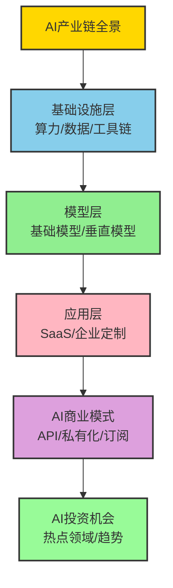
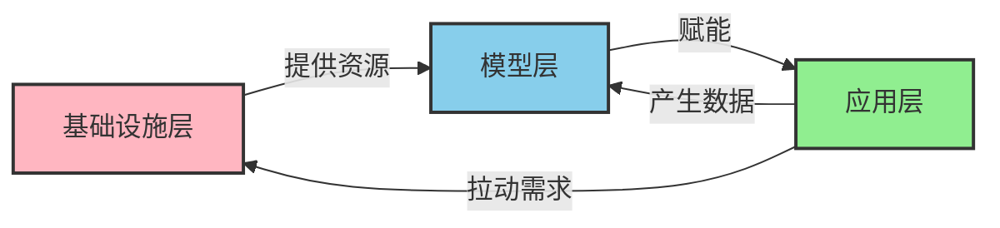
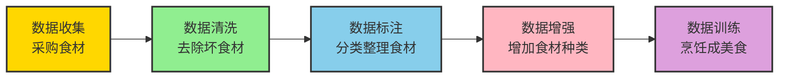
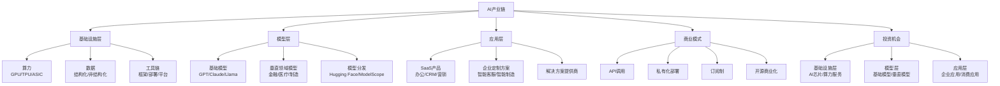

# 第一篇 AI全景认知与商业语境

## 第4章 AI产业链与商业模式

### 学习线路图


### 学习目标
1. 理解AI产业链的分层结构和各层的核心价值
2. 掌握基础设施层的主要组成部分和玩家
3. 了解模型层的分类和代表厂商
4. 熟悉应用层的主要应用场景和产品类型
5. 掌握AI主要商业模式及其适用场景
6. 了解AI领域的投资机会和发展趋势

### 核心知识点
- AI产业链分层：基础设施层、模型层、应用层
- 基础设施层：算力、数据、工具链
- 模型层：基础模型、垂直领域模型
- 应用层：SaaS产品、企业定制方案
- AI商业模式：API调用、私有化部署、订阅制、开源商业化
- AI投资机会：热点领域、发展趋势

### 重点难点
- 不同产业链层次之间的协同关系
- 各层次的核心竞争力和壁垒
- 商业模式的选择和优化
- 投资机会的识别和评估

### 本章导读

你是否想了解AI产业的整体生态？从底层的算力和数据，到中层的模型开发，再到顶层的应用落地，AI产业链就像是一座金字塔，每层都有其独特的价值和作用。

本章将带你深入了解AI产业链的分层结构，介绍各层次的主要玩家、技术特点和应用场景，分析AI的主要商业模式，并探讨AI领域的投资机会和发展趋势。通过本章学习，你将能够全面理解AI产业的整体生态，为后续学习奠定更坚实的基础。

---

## 4.1 AI产业链的分层结构

AI产业链是指从AI技术研发到应用落地的完整生态系统，就像是一棵"AI生态树"：
- 基础设施层是"树根"，提供养分和支撑
- 模型层是"树干"，连接上下层，输送AI能力
- 应用层是"树枝和树叶"，结出各种AI应用的果实

### 4.1.1 产业链金字塔结构

AI产业链就像是一座"金字塔"，从下到上依次是基础设施层、模型层和应用层。每一层都有其独特的价值和作用，就像是建造一座大楼：基础设施层是"地基"，模型层是"框架"，应用层是"大楼的功能和装修"。

```mermaid
graph TD
    subgraph 应用层[应用层<br>价值最终体现] 
        A1[SaaS产品] --> A2[企业定制方案]
        A3[AI解决方案提供商]
    end
    
    subgraph 模型层[模型层<br>技术核心] 
        B1[基础模型] --> B2[垂直领域模型]
        B3[模型分发平台]
    end
    
    subgraph 基础设施层[基础设施层<br>支撑底座] 
        C1[算力] --> C2[数据]
        C3[工具链]
    end
    
    应用层 --> 模型层 --> 基础设施层
    
    style 应用层 fill:#90EE90,stroke:#333,stroke-width:2px
    style 模型层 fill:#87CEEB,stroke:#333,stroke-width:2px
    style 基础设施层 fill:#FFB6C1,stroke:#333,stroke-width:2px
```

**各层特点和实际案例**：

| 层次 | 核心价值 | 主要组成 | 代表企业 | 形象化比喻 | 实际案例 |
|------|----------|----------|----------|------------|----------|
| **基础设施层** | 提供AI开发和运行的基础资源 | 算力、数据、工具链 | NVIDIA、AWS、Google Cloud | AI生态的"土壤"和"养分" | NVIDIA H100芯片供不应求，成为训练大模型的"黄金标准" |
| **模型层** | 提供AI核心能力 | 基础模型、垂直领域模型 | OpenAI、Google、Meta | AI生态的"树干"和"核心" | ChatGPT基于GPT-4模型，月活跃用户超过1亿 |
| **应用层** | 将AI能力转化为实际价值 | SaaS产品、企业定制方案 | Salesforce、微软、国内AI创业公司 | AI生态的"果实"和"价值体现" | 微软365 Copilot集成GPT-4，提高用户办公效率30% |

### 4.1.2 各层之间的协同关系

AI产业链各层之间存在着密切的协同关系，就像是"生态系统的循环"：



1. **基础设施层支撑模型层**：模型层需要基础设施层提供的算力和数据来训练和部署模型（就像是"土壤为植物提供养分"）
2. **模型层赋能应用层**：应用层基于模型层提供的AI能力开发各种应用（就像是"树干为树枝提供养分"）
3. **应用层反哺模型层**：应用层产生的数据可以用于模型的迭代和优化（就像是"果实落地为土壤提供养分"）
4. **应用层拉动基础设施层**：应用层的需求增长推动基础设施层的技术进步（就像是"树木生长需要更多的土壤和养分"）

这种协同关系形成了一个完整的生态系统，推动AI技术不断发展和应用落地。

### 小思考

你认为AI产业链中最具价值的是哪个层次？为什么？

---

## 4.2 基础设施层

基础设施层是AI产业链的底层支撑，提供AI开发和运行所需的各种资源，包括算力、数据和工具链。

### 4.2.1 算力

算力是AI发展的核心驱动力，就像是AI的"发动机"。如果把AI模型比作"工厂"，算力就是"电力"，没有足够的算力，AI工厂就无法开工。

**算力类型**：

1. **GPU**：图形处理器，是当前AI训练和推理的"主力军"
   - 代表厂商：NVIDIA、AMD、Intel
   - 代表产品：NVIDIA H100、A100、L40
   - 特点：并行计算能力强，适合深度学习任务，就像是"超级计算机集群"
   - **实际案例**：ChatGPT训练使用了上万张NVIDIA A100显卡，花费超过1亿美元

2. **TPU**：张量处理器，Google开发的"AI专用高铁"
   - 代表厂商：Google
   - 特点：针对TensorFlow优化，能效比高，就像是"为AI量身定制的高速列车"
   - **实际案例**：Google Gemini模型训练和推理大量使用TPU v4和v5e

3. **ASIC**：专用集成电路，为特定AI任务设计的"定制赛车"
   - 代表厂商：Cerebras、Graphcore
   - 特点：性能高，能效比高，但灵活性差，就像是"专为特定赛道设计的赛车"
   - **实际案例**：Cerebras WSE-2芯片拥有2.6万亿个晶体管，是世界上最大的AI芯片

4. **FPGA**：现场可编程门阵列，可灵活配置的"多功能工具"
   - 代表厂商：Xilinx、Intel
   - 特点：灵活性高，适合特定AI应用，就像是"可以根据需要调整的多功能工具"
   - **实际案例**：特斯拉自动驾驶系统使用FPGA加速图像处理

**算力服务**：

云厂商提供的AI算力服务，让企业无需自己购买昂贵的硬件设备，就像是"AI算力的共享充电宝"：

| 云厂商 | 算力服务 | 特点 | 实际案例 |
|--------|----------|------|----------|
| AWS | SageMaker | 完整的AI开发和部署服务 | 某金融科技公司使用SageMaker训练反欺诈模型，部署时间从6个月缩短到2周 |
| Google Cloud | AI Platform | 深度集成Google生态 | 某电商平台使用Google Cloud AI训练推荐模型，推荐准确率提升25% |
| Azure | Azure AI | 与微软365无缝集成 | 某制造企业使用Azure AI训练预测性维护模型，设备停机时间减少30% |
| 阿里云 | PAI | 国内领先的AI平台 | 某互联网公司使用PAI训练大模型，成本降低40% |
| 腾讯云 | TI-ONE | 针对国内场景优化 | 某教育科技公司使用TI-ONE开发智能辅导系统，用户活跃度提升50% |

### 4.2.2 数据

数据是AI的"燃料"，没有高质量的数据，就无法训练出优秀的AI模型。如果把AI比作"厨师"，数据就是"食材"，高质量的数据才能做出美味的"AI佳肴"。

**数据类型**：

1. **结构化数据**：如数据库中的表格数据，就像是"整理好的食材"，摆放在冰箱的格子里，取用方便
   - 特点：格式规范，易于处理
   - 应用：金融交易数据、用户信息数据
   - **实际案例**：银行使用结构化交易数据训练反欺诈模型，识别率超过95%

2. **非结构化数据**：如文本、图像、音频、视频，就像是"杂乱的食材"，堆放在厨房地上，需要整理
   - 特点：格式多样，处理难度大
   - 应用：社交媒体内容、医学影像、语音助手
   - **实际案例**：ChatGPT训练使用了约1万亿个单词的文本数据，包括书籍、网页、对话等

3. **半结构化数据**：如JSON、XML格式的数据，就像是"用保鲜袋装起来的食材"，有一定的整理，但还需要进一步处理
   - 特点：介于结构化和非结构化之间
   - 应用：API返回数据、日志数据
   - **实际案例**：电商平台使用JSON格式的用户行为数据，训练推荐系统

**数据来源**：

| 数据来源 | 特点 | 代表示例 | 实际价值 |
|----------|------|----------|----------|
| **公开数据集** | 免费获取，数据量大 | ImageNet、COCO、Wikipedia | 用于模型预训练，降低开发成本 |
| **企业内部数据** | 质量高，与业务相关 | 客户数据、交易数据、用户行为数据 | 是企业AI应用的核心竞争力，如淘宝的用户购物数据 |
| **第三方数据** | 专业性强，覆盖广 | 气象数据、交通数据、金融数据 | 补充企业内部数据不足，如保险公司购买外部气象数据评估风险 |
| **生成式数据** | 成本低，可定制 | AI生成的文本、图像、对话数据 | 用于数据增强，解决数据不足问题，如用AI生成的医学影像训练诊断模型 |

**数据处理流程**：

数据处理就像是"食材加工"，从采购到烹饪需要多个步骤：



**代表企业**：

- 数据标注：Scale AI、Labelbox、云测数据（就像是"专业食材处理公司"）
- 数据服务：Palantir、Splunk、TalkingData（就像是"食材配送和加工服务"）

**实际案例**：

某自动驾驶公司的数据处理流程：
1. **数据收集**：通过1000辆测试车的摄像头、雷达收集路测数据
2. **数据清洗**：去除模糊、重复的图像和无效数据
3. **数据标注**：雇佣5000名标注员，为图像中的车辆、行人、交通标志添加标签
4. **数据增强**：通过旋转、缩放、改变亮度等方式，将1000万张图像增强到1亿张
5. **模型训练**：使用增强后的数据训练自动驾驶模型，识别准确率从85%提升到98%

### 4.2.3 工具链

工具链是AI开发的"工具箱"，提供AI开发和部署所需的各种工具和框架。如果把AI开发比作"盖房子"，工具链就是"施工工具"，从设计到施工都需要不同的工具。

**开发框架**：

开发框架就像是"建筑设计软件"，帮助AI工程师设计和构建AI模型：

1. **深度学习框架**：AI开发的"基础工具套装"
   - TensorFlow：Google开发的"全能工具箱"，就像是"AutoCAD"，功能全面但学习曲线较陡
     - **实际案例**：Google搜索、YouTube推荐系统大量使用TensorFlow
   - PyTorch：Meta开发的"易用工具包"，就像是"SketchUp"，简单易用，深受开发者喜爱
     - **实际案例**：OpenAI的ChatGPT、Stability AI的Stable Diffusion都使用PyTorch
   - MXNet：Amazon开发的"高性能工具"，就像是"3ds Max"，适合大规模部署
   - MindSpore：华为开发的"国产工具"，就像是"国产CAD软件"，针对国内场景优化

2. **大模型开发框架**：训练大模型的"重型机械"
   - Hugging Face Transformers：提供预训练模型和工具，就像是"建筑预制构件库"
     - **实际案例**：超过90%的AI开发者使用Hugging Face模型库
   - DeepSpeed：Microsoft开发的"超级起重机"，用于训练大模型，提高训练效率
   - Megatron-LM：NVIDIA开发的"巨型推土机"，用于训练超大模型，如GPT-4级别的模型

**部署工具**：

部署工具就像是"装修工具"，帮助AI模型从"设计图"变成"实际可用的产品"：

1. **模型部署**：AI模型的"安装工具"
   - TensorRT：NVIDIA开发的"GPU加速器"，就像是"高速安装工具"，加速模型推理
   - ONNX Runtime：跨平台推理引擎，就像是"通用转换器"，让模型在不同设备上运行
   - Triton Inference Server：NVIDIA开发的"推理服务器"，就像是"智能管家"，管理多个模型的部署

2. **容器化**：AI应用的"标准化包装"
   - Docker：容器化技术，就像是"标准化快递箱"，让应用在任何环境中都能运行
   - Kubernetes：容器编排工具，就像是"智能物流系统"，管理大规模容器部署
     - **实际案例**：Netflix使用Kubernetes管理超过10万个容器，确保服务稳定运行

**开发平台**：

开发平台就像是"建筑工地"，提供AI开发的工作环境：

- Jupyter Notebook：交互式开发环境，就像是"工地临时办公室"，方便快速实验
- Google Colab：云端开发环境，就像是"共享工地"，免费提供GPU资源
- VS Code：支持AI开发的编辑器，就像是"多功能工具包"，集成各种AI开发插件
- PyCharm：Python IDE，支持AI开发，就像是"专业工作台"，适合大型项目开发

**实际案例**：

某AI创业公司的开发流程：
1. 使用PyTorch框架开发AI模型
2. 在Hugging Face上使用预训练模型进行微调
3. 使用DeepSpeed加速模型训练
4. 使用Docker打包模型
5. 使用Kubernetes在云端部署模型
6. 使用Triton Inference Server管理模型推理
7. 整个开发周期从6个月缩短到2个月，成本降低50%

### 小练习

你能说出算力、数据和工具链在AI产业链中的作用吗？

---

## 4.3 模型层

模型层是AI产业链的核心，提供各种AI能力，包括基础模型和垂直领域模型。

### 4.3.1 基础模型

基础模型是指在海量数据上训练的通用AI模型，具备广泛的能力，可以适应多种任务。就像是"AI领域的超级大脑"，可以学习各种知识和技能，然后适应不同的任务。

**特点**：

- 训练数据量大，模型规模大（就像是"读万卷书，行万里路"的智者）
- 具备通用能力，可适应多种任务（就像是"多才多艺的全能选手"）
- 可以通过微调适配特定场景（就像是"根据不同工作调整技能的专家"）
- 代表了当前AI技术的最高水平（就像是"AI领域的诺贝尔奖获得者"）

**分类**：

1. **语言基础模型**：AI领域的"语言大师"
   - 代表模型：GPT-4、Claude 3、Llama 3
   - 能力：文本生成、理解、翻译、代码生成等
   - **实际案例**：
     - GPT-4可以生成高质量的小说、代码、学术论文
     - Claude 3可以处理200K tokens的长文本，相当于一本完整的小说
     - Llama 3开源后，一周内下载量超过100万次

2. **视觉基础模型**：AI领域的"视觉专家"
   - 代表模型：CLIP、DINO、SAM
   - 能力：图像识别、理解、生成、分割等
   - **实际案例**：
     - SAM（Segment Anything Model）可以识别图像中的任何物体，分割准确率超过95%
     - CLIP可以将文本和图像关联，实现"以文搜图"功能

3. **多模态基础模型**：AI领域的"全能选手"
   - 代表模型：GPT-4V、Gemini、Claude 3 Opus
   - 能力：处理文本、图像、音频、视频等多种模态
   - **实际案例**：
     - GPT-4V可以分析图片中的内容，回答关于图片的详细问题
     - Gemini可以同时处理文本、图像、音频和视频，实现更自然的交互

**代表厂商**：

| 厂商类型 | 代表厂商 | 特点 | 实际案例 |
|----------|----------|------|----------|
| **闭源厂商** | OpenAI、Anthropic、Google DeepMind | 技术领先，模型能力强 | OpenAI的ChatGPT月活跃用户超过1亿 |
| **开源厂商** | Meta、Mistral AI、Stability AI | 开源协作，社区活跃 | Meta的Llama 3开源后，推动了开源大模型的发展 |
| **国内厂商** | 百度、阿里、腾讯、字节跳动 | 中文优化，符合国内监管 | 百度文心一言日调用量超过10亿次 |

### 4.3.2 垂直领域模型

垂直领域模型是针对特定行业或应用场景优化的AI模型，就像是"AI领域的行业专家"，在特定领域具有更强的能力和专业知识。

**特点**：

- 针对特定领域的数据和任务优化（就像是"专门研究某一领域的博士"）
- 具备领域专业知识（就像是"行业内的资深专家"）
- 符合行业监管要求（就像是"遵守行业规则的专业人士"）
- 部署方式灵活，可私有化部署（就像是"可以上门服务的专家"）

**分类**：

1. **金融领域模型**：AI领域的"金融分析师"
   - 代表模型：BloombergGPT、FinBERT、蚂蚁集团AI模型
   - 应用：智能投顾、反欺诈、信贷审批
   - **实际案例**：
     - BloombergGPT在金融文本理解任务上超过通用模型15%
     - 某银行使用FinBERT分析市场新闻情绪，提前预测股价波动

2. **医疗领域模型**：AI领域的"医生助理"
   - 代表模型：Med-PaLM 2、BioGPT、腾讯觅影
   - 应用：辅助诊断、药物发现、病历分析
   - **实际案例**：
     - Med-PaLM 2通过了美国医师执照考试，得分超过90%
     - 腾讯觅影可以识别30多种常见疾病，诊断准确率超过90%
     - 某医院使用AI辅助诊断系统，肺结节检出率从70%提升到95%

3. **制造领域模型**：AI领域的"工厂工程师"
   - 代表模型：Siemens AI模型、树根互联根云平台
   - 应用：质量检测、预测性维护、供应链优化
   - **实际案例**：
     - Siemens AI模型预测设备故障准确率超过90%，减少停机时间30%
     - 某汽车制造商使用AI质量检测系统，检测速度提升10倍，漏检率降低80%

4. **教育领域模型**：AI领域的"私人教师"
   - 代表模型：Khanmigo、好未来AI模型、讯飞星火教育版
   - 应用：个性化学习、智能辅导、作业批改
   - **实际案例**：
     - Khanmigo为学生提供个性化学习路径，学习效率提升40%
     - 某在线教育平台使用AI批改作文，批改速度提升100倍，一致性达到98%

**代表厂商**：

| 厂商类型 | 代表厂商 | 特点 | 实际案例 |
|----------|----------|------|----------|
| **行业巨头** | IBM、Siemens、Bloomberg | 行业经验丰富，数据资源多 | Siemens的AI模型在制造业广泛应用 |
| **国内厂商** | 华为、讯飞、商汤 | 中文优化，符合国内监管 | 讯飞星火教育版在国内2000多所学校使用 |
| **创业公司** | Cohere、Anthropic、Character.AI | 专注特定领域，创新能力强 | Cohere的金融模型被多家银行采用 |

### 4.3.3 模型分发平台

模型分发平台是连接模型开发者和使用者的桥梁，就像是"AI模型的应用商店"，让开发者可以上传和分享模型，让使用者可以方便地下载和使用模型。

**代表平台**：

1. **Hugging Face**：AI模型的"App Store"
   - 特点：开源模型库，支持多种框架，就像是"AI领域的GitHub"
   - 模型数量：超过300,000个模型，涵盖文本、图像、音频等多种模态
   - 社区活跃，开发者众多：超过100万开发者使用Hugging Face
   - **实际案例**：Stable Diffusion模型在Hugging Face上发布后，一周内下载量超过100万次

2. **ModelScope**：国内AI模型的"应用商店"
   - 特点：阿里开发的开源模型平台，聚焦国内AI生态
   - 支持中文模型：提供大量针对中文优化的模型
   - 集成阿里云算力：可以直接在平台上训练和部署模型
   - **实际案例**：某国内创业公司使用ModelScope上的中文预训练模型，开发周期缩短50%

3. **TensorFlow Hub**：Google生态的"模型仓库"
   - 特点：Google开发的模型库，主要支持TensorFlow模型
   - 集成Google Cloud：可以直接在Google Cloud上部署模型
   - **实际案例**：Google搜索使用TensorFlow Hub上的模型改进搜索结果

4. **PyTorch Hub**：Meta生态的"模型仓库"
   - 特点：Meta开发的模型库，主要支持PyTorch模型
   - 集成PyTorch生态：与PyTorch框架无缝集成
   - **实际案例**：Facebook使用PyTorch Hub上的模型改进推荐系统

### 小思考

你认为基础模型和垂直领域模型哪个更有发展前景？为什么？

---

## 4.4 应用层

应用层是AI产业链的顶层，将AI能力转化为实际的业务价值，包括SaaS产品和企业定制方案。

### 4.4.1 SaaS产品

SaaS（Software as a Service）产品是指通过云服务提供的AI应用，就像是"AI领域的在线办公软件"，用户可以直接使用，无需自己部署和维护。

**特点**：

- 易于使用，无需技术开发（就像是"可以直接使用的现成工具"）
- 按订阅付费，成本可控（就像是"按使用次数付费的共享工具"）
- 持续更新和优化（就像是"自动升级的智能工具"）
- 适合中小企业和个人用户（就像是"为大众设计的普及型工具"）

**分类和实际案例**：

1. **通用SaaS**：适合各种行业的"万能工具"
   - 办公软件：
     - Microsoft 365 Copilot：集成GPT-4的办公助手，就像是"智能秘书"
       - **实际案例**：某企业使用Copilot后，文档撰写时间减少40%，会议纪要生成准确率超过90%
     - Google Workspace：Google的智能办公套件，就像是"云端办公平台"
   - 客户关系管理：
     - Salesforce Einstein：智能CRM，就像是"客户管理专家"
       - **实际案例**：Salesforce客户使用Einstein后，销售线索转化率提升30%
   - 市场营销：
     - HubSpot AI：智能营销工具，就像是"营销策划师"

2. **垂直SaaS**：针对特定行业的"专业工具"
   - 金融科技：
     - Robinhood：AI驱动的股票交易平台，就像是"智能投资顾问"
     - Square：AI驱动的支付和商业平台，就像是"小商家的智能助手"
   - 医疗健康：
     - Teladoc：AI驱动的远程医疗平台，就像是"在线医生"
       - **实际案例**：Teladoc使用AI分诊系统，减少等待时间30%
     - Ro：AI驱动的虚拟诊所，就像是"在线健康顾问"
   - 教育科技：
     - Coursera：AI驱动的在线学习平台，就像是"在线大学"
     - Khan Academy：AI驱动的免费教育平台，就像是"免费在线学校"

3. **开发者工具**：为程序员设计的"AI助手"
   - GitHub Copilot：AI代码辅助工具，就像是"程序员的智能搭档"
     - **实际案例**：Copilot帮助程序员编写代码，开发速度提升50%
   - Postman AI：AI API开发工具，就像是"API开发助手"
   - Replit：AI编程平台，就像是"在线编程实验室"

### 4.4.2 企业定制方案

企业定制方案是指为企业特定需求定制的AI解决方案，就像是"AI领域的定制西装"，根据企业的具体需求量身打造。

**特点**：

- 针对企业特定需求定制（就像是"量体裁衣的定制服务"）
- 可以私有化部署，数据安全（就像是"放在自己家里的专属工具"）
- 提供专业的实施和运维服务（就像是"有专门的维护团队"）
- 适合大型企业和敏感行业（就像是"为高端客户定制的专属服务"）

**应用场景和实际案例**：

1. **智能客服**：企业的"AI客服团队"
   - 应用：银行、电信、电商等行业
   - 特点：支持多渠道，个性化训练，就像是"24小时在线的专业客服团队"
   - **实际案例**：
     - 某大型银行部署智能客服系统后，人工客服工作量减少70%，客户等待时间从30秒缩短到2秒
     - 某电商平台的智能客服可以处理95%的常见问题，解决率超过85%

2. **智能制造**：工厂的"AI工程师团队"
   - 应用：质量检测、预测性维护、供应链优化
   - 特点：与企业现有系统集成，就像是"融入企业生产流程的智能助手"
   - **实际案例**：
     - 某汽车制造商部署AI质量检测系统后，检测速度提升10倍，漏检率降低80%
     - 某家电企业使用AI预测性维护系统，设备故障率降低30%，维护成本减少25%

3. **智能金融**：金融机构的"AI风控专家"
   - 应用：反欺诈、智能投顾、信贷审批
   - 特点：符合金融监管要求，就像是"遵守金融法规的智能顾问"
   - **实际案例**：
     - 某保险公司使用AI反欺诈系统，识别欺诈案件数量增加50%，挽回损失超过1亿元
     - 某银行使用AI信贷审批系统，审批速度从3天缩短到3分钟，通过率提升20%

4. **智慧城市**：城市的"AI管理者"
   - 应用：智能交通、智能安防、环境监测
   - 特点：大规模部署，多系统集成，就像是"城市的智能大脑"
   - **实际案例**：
     - 某城市部署智能交通系统后，交通拥堵减少30%，交通事故率降低25%
     - 某城市使用AI智能安防系统，犯罪案件减少40%，破案时间缩短50%

### 4.4.3 AI解决方案提供商

AI解决方案提供商是连接模型层和应用层的桥梁，就像是"AI领域的建筑公司"，将AI技术转化为企业可用的解决方案。

**分类和实际案例**：

1. **大型科技公司**：AI解决方案的"大型建筑公司"
   - 国际：IBM、Microsoft、Google
     - **IBM**：提供企业级AI解决方案，就像是"AI领域的IBM咨询"，帮助企业数字化转型
     - **Microsoft**：通过Azure AI和Copilot，就像是"AI领域的微软服务"，提供从云到端的AI解决方案
     - **Google**：通过Google Cloud AI，就像是"AI领域的Google服务"，提供先进的AI技术
   - 国内：华为、阿里、腾讯、百度
     - **华为**：通过昇腾AI和华为云，就像是"国产AI解决方案的领军者"，提供全栈AI解决方案
     - **阿里**：通过阿里云PAI和通义千问，就像是"电商出身的AI解决方案提供商"，在零售和金融领域有优势
     - **腾讯**：通过腾讯云AI和混元大模型，就像是"社交出身的AI解决方案提供商"，在娱乐和社交领域有优势
     - **百度**：通过文心一言和百度智能云，就像是"搜索出身的AI解决方案提供商"，在搜索和自动驾驶领域有优势

2. **专业AI公司**：AI解决方案的"专业建筑公司"
   - 国际：Palantir、C3.ai、UiPath
     - **Palantir**：专注于数据分析和AI，就像是"数据领域的AI专家"，为政府和企业提供解决方案
     - **C3.ai**：专注于工业AI，就像是"工业领域的AI专家"，帮助企业实现智能制造
     - **UiPath**：专注于RPA（机器人流程自动化），就像是"自动化领域的AI专家"，帮助企业自动化业务流程
   - 国内：商汤、讯飞、旷视、云从
     - **商汤**：专注于计算机视觉，就像是"视觉领域的AI专家"，在安防和自动驾驶领域有优势
     - **讯飞**：专注于语音识别，就像是"语音领域的AI专家"，在教育和医疗领域有优势
     - **旷视**：专注于计算机视觉，就像是"零售领域的AI专家"，在智能零售和物流领域有优势
     - **云从**：专注于计算机视觉和人脸识别，就像是"金融领域的AI专家"，在金融和安防领域有优势

3. **创业公司**：AI解决方案的"创新工作室"
   - 专注于特定领域的AI解决方案，就像是"专注于特定建筑风格的设计工作室"
   - **Character.AI**：专注于AI角色和虚拟助手，就像是"虚拟人物设计工作室"
   - **Perplexity AI**：专注于AI搜索，就像是"下一代搜索引擎工作室"
   - **Runway ML**：专注于AI视频生成，就像是"AI视频制作工作室"
   - **实际案例**：某创业公司专注于AI驱动的客户服务解决方案，为中小企业提供定制服务，成立两年内获得融资超过1亿美元

### 小练习

你能说出SaaS产品和企业定制方案的主要区别吗？

---

## 4.5 AI商业模式

AI商业模式是指AI企业如何创造价值和获取收入，主要包括API调用模式、私有化部署、订阅制、开源商业化等。

### 4.5.1 API调用模式

API调用模式是指企业通过API调用AI服务，按使用量付费，就像是"AI领域的按需付费服务"，类似于按流量付费的手机套餐。

**特点**：

- 易于使用，无需自己部署和维护（就像是"直接使用自来水，无需自己挖井"）
- 按使用量付费，成本可控（就像是"按用水量付费，用多少付多少"）
- 适合快速验证和小规模应用（就像是"试用装产品，适合初次体验"）
- 数据需要发送到第三方服务器（就像是"把衣服送到洗衣店清洗，需要信任服务商"）

**代表企业和实际案例**：

| 企业 | API服务 | 特点 | 实际案例 |
|------|---------|------|----------|
| OpenAI | GPT系列API | 能力强，应用广 | 某创业公司使用GPT-4 API开发智能客服，上线时间从6个月缩短到2个月 |
| Anthropic | Claude系列API | 长文本处理能力强 | 某法律科技公司使用Claude API处理法律文档，效率提升40% |
| Google Cloud | AI API | 集成Google生态 | 某电商平台使用Google Cloud Vision API识别商品图片，准确率达到98% |
| 百度 | 文心一言API | 中文优化 | 某国内媒体使用文心一言API生成新闻稿，速度提升50% |

**定价方式**：

- 按Token计费：如OpenAI API，按生成的文本Token数量计费，就像是"按字数付费的写作服务"
- 按调用次数计费：如某些图像生成API，就像是"按次数付费的拍照服务"
- 按时间计费：如某些实时AI服务，就像是"按时间付费的咨询服务"

**实际案例**：

某电商平台使用AI图像识别API：
- 需求：自动识别商品图片中的商品类别和属性
- 选择：Google Cloud Vision API
- 方案：上传商品图片，API返回识别结果
- 成本：每月调用100万次，成本约5000美元
- 效果：商品上架时间从1天缩短到1小时，准确率达到98%

### 4.5.2 私有化部署

私有化部署是指将AI模型部署在企业自己的服务器上，数据不出企业边界，就像是"将AI模型放在自己家里"，而不是"放在别人家里"。

**特点**：

- 数据安全，符合合规要求（就像是"把钱放在自己的保险柜里"，避免数据泄露风险）
- 可以定制化开发和优化（就像是"定制化家具"，完全符合企业需求）
- 一次性投入较大，需要专业运维（就像是"买房子"，一次性投入大但长期成本可控）
- 适合大型企业和敏感行业（就像是"为高端客户定制的专属服务"）

**代表企业和实际案例**：

| 模型类型 | 代表模型 | 实际案例 |
|----------|----------|----------|
| 开源模型 | Llama、Mistral、Falcon | 某大型银行使用Llama 2私有化部署，处理金融交易数据，避免了数据泄露风险 |
| 商业模型 | Claude Enterprise、GPT-4 Enterprise | 某医疗集团部署Claude Enterprise，处理患者病历数据，符合医疗隐私法规 |
| 国内模型 | 文心一言私有化部署、通义千问私有化部署 | 某国内政府机构使用文心一言私有化部署，处理敏感政务数据 |

**定价方式**：

- 一次性授权费：购买模型的永久使用权，就像是"买房子的首付"，一次性投入较大
- 年度维护费：提供模型更新和技术支持，就像是"房子的物业费"，确保模型持续优化
- 定制开发费：根据企业需求进行定制开发，就像是"房子的装修费"，让模型完全符合企业需求

**实际案例**：

某金融科技公司的私有化部署方案：
- **需求**：处理敏感金融数据，避免数据泄露
- **选择**：Llama 2 70B开源模型私有化部署
- **方案**：在企业内网部署模型，使用金融领域数据进行微调
- **效果**：数据零泄露，满足监管要求，模型准确率达到95%
- **成本**：一次性部署成本约200万元，年度维护成本约20万元

私有化部署适合数据敏感、对安全性要求高的企业，如金融、医疗、政府等行业。

### 4.5.3 订阅制

订阅制是指用户按一定周期（月/年）支付费用，使用AI服务，就像是"AI领域的订阅制报纸"，定期付费获取最新的AI服务。

**特点**：

- 持续收入，现金流稳定（就像是"每月固定的工资收入"，企业可以稳定发展）
- 用户粘性高，便于长期合作（就像是"订阅的杂志"，用户会持续使用）
- 可以持续更新和优化服务（就像是"不断更新的APP"，用户可以获得最新功能）
- 适合SaaS产品和长期服务（就像是"为长期用户设计的服务"）

**代表企业和实际案例**：

| 企业 | 订阅服务 | 定价 | 实际案例 |
|------|----------|------|----------|
| OpenAI | ChatGPT Plus | 每月20美元 | 超过1000万用户订阅ChatGPT Plus，享受高级功能 |
| Midjourney | 图像生成服务 | 每月10-60美元 | 某设计公司订阅Midjourney，每月生成1000+张设计图，设计成本降低60% |
| Microsoft | 365 Copilot | 每月30美元 | 某企业为1000名员工订阅Copilot，办公效率提升30% |
| Adobe | Creative Cloud | 每月52.99美元起 | 某创意工作室使用Adobe Firefly AI生成设计素材，创作速度提升40% |

**定价方式**：

- **固定订阅费**：如每月/每年固定费用，就像是"固定月租的手机套餐"，简单明了
- **分层订阅**：不同层级提供不同功能和服务，就像是"不同档次的会员服务"，满足不同需求
  - 例如：ChatGPT Plus提供高级功能，ChatGPT免费版提供基础功能
- **按用户数量计费**：如企业级订阅，按用户数收费，就像是"按人数收费的团队服务"，适合企业用户

**实际案例**：

某营销公司订阅ChatGPT Plus：
- **需求**：生成营销文案、社交媒体内容
- **选择**：ChatGPT Plus订阅
- **方案**：团队10名成员共享5个ChatGPT Plus账号
- **效果**：每月生成500+篇营销文案，内容质量提升30%，成本降低50%
- **成本**：每月100美元（5个账号×20美元/月）

订阅制适合需要长期使用AI服务的用户，尤其是个人用户和中小企业。

### 4.5.4 开源商业化

开源商业化是指将模型开源，通过其他方式获取收入，就像是"AI领域的开源软件商业模式"，免费提供核心产品，通过增值服务获利。

**特点**：

- 加速技术传播和社区建设（就像是"免费赠送种子"，让更多人参与种植）
- 可以快速获取用户和反馈（就像是"免费试用产品"，收集用户意见改进）
- 需要其他商业模式支持（就像是"免费游戏"，通过增值服务获利）
- 适合建立生态和长期发展（就像是"开源操作系统"，建立庞大的生态系统）

**商业化方式和实际案例**：

1. **企业服务**：为企业提供开源模型的"定制开发和运维服务"，就像是"为开源软件提供商业支持"
   - 代表：Hugging Face Enterprise、Meta AI Services
   - **实际案例**：Hugging Face通过开源模型库吸引用户，然后向企业提供付费的企业级服务

2. **云服务**：在云平台上提供开源模型的"托管服务"，就像是"为开源软件提供云托管"
   - 代表：AWS SageMaker JumpStart、Google Cloud Vertex AI
   - **实际案例**：AWS SageMaker JumpStart提供150+开源模型的托管服务，企业可以直接使用

3. **双许可证**："开源版本免费，商业版本收费"，就像是"免费版和付费版软件"
   - 代表：MongoDB、Elasticsearch
   - **实际案例**：MongoDB开源版本免费，企业版提供高级功能和支持，年收入超过10亿美元

4. **周边产品**：销售与开源模型相关的"工具和服务"，就像是"销售开源软件的周边产品"
   - 代表：NVIDIA AI Enterprise、Intel oneAPI
   - **实际案例**：NVIDIA销售AI芯片和软件，与开源模型形成互补，年收入超过200亿美元

**开源商业化成功案例**：

- **Hugging Face**：通过开源模型库积累了超过100万开发者用户，然后推出企业级服务，估值超过40亿美元
- **Meta Llama**：开源Llama模型后，推动了开源大模型的发展，同时通过相关服务获利
- **Stability AI**：开源Stable Diffusion模型后，推出了企业版服务和API，估值超过10亿美元

开源商业化适合技术实力强、希望建立生态系统的企业，通过开源吸引用户，然后通过增值服务获利。

### 4.5.5 商业模式对比

| 商业模式 | 优点 | 缺点 | 适合场景 |
|----------|------|------|----------|
| API调用 | 易于使用，成本可控 | 数据安全风险，依赖网络 | 快速验证，小规模应用 |
| 私有化部署 | 数据安全，定制化 | 成本高，需要运维 | 大型企业，敏感行业 |
| 订阅制 | 现金流稳定，持续更新 | 用户可能流失 | SaaS产品，长期服务 |
| 开源商业化 | 加速传播，社区建设 | 商业化路径依赖 | 建立生态，长期发展 |

### 小思考

如果你是一家AI创业公司，你会选择哪种商业模式？为什么？

---

## 4.6 AI投资机会

AI领域存在着大量的投资机会，包括基础设施层、模型层和应用层的各种热点领域。

### 4.6.1 基础设施层投资机会

基础设施层是AI产业的"地基"，就像是"AI领域的房地产"，投资基础设施层就像是"投资城市建设"，具有长期价值。

1. **AI芯片**：AI领域的"核心硬件"，就像是"AI的发动机"，是最热门的投资方向之一
   - 针对特定AI任务的专用芯片：如NVIDIA H100、AMD MI300
   - 能效比高的AI芯片：适合数据中心大规模部署
   - 边缘计算AI芯片：适合边缘设备，如手机、汽车
   - **投资案例**：NVIDIA市值超过3万亿美元，成为全球市值最高的公司之一

2. **算力服务**：AI领域的"电力公司"，就像是"为AI提供动力的服务商"
   - 云厂商的AI算力服务：如AWS、Google Cloud、阿里云
   - 边缘计算服务：适合低延迟AI应用
   - 分布式算力网络：如ChatGPT使用的分布式计算集群
   - **投资案例**：某AI算力服务公司获得1亿美元融资，提供大模型训练服务

3. **数据服务**：AI领域的"加油站"，就像是"为AI提供燃料的服务商"
   - 高质量数据集：如ImageNet、COCO等公开数据集
   - 数据标注服务：如Scale AI、云测数据
   - 数据清洗和增强服务：提高数据质量的服务
   - **投资案例**：Scale AI估值超过70亿美元，提供高质量的数据标注服务

4. **工具链**：AI领域的"工具箱"，就像是"为AI开发者提供工具的服务商"
   - AI开发框架和工具：如PyTorch、TensorFlow
   - 推理加速技术：如TensorRT、ONNX Runtime
   - 模型管理平台：如Hugging Face、ModelScope
   - **投资案例**：Hugging Face估值超过40亿美元，成为AI开发者的重要平台

### 4.6.2 模型层投资机会

模型层是AI产业的"核心技术"，就像是"AI领域的高科技公司"，投资模型层就像是"投资前沿技术"，具有高风险高回报的特点。

1. **基础模型**：AI领域的"超级大脑"，就像是"AI领域的iPhone"，引领技术发展方向
   - 多模态基础模型：如GPT-4V、Gemini，能处理文本、图像、音频等多种模态
   - 高效小模型：如Mistral 7B、Llama 3 8B，性能接近大模型但资源消耗更低
   - 安全可控模型：符合伦理和合规要求的模型
   - **投资案例**：OpenAI估值超过1000亿美元，成为全球最有价值的AI公司之一

2. **垂直领域模型**：AI领域的"行业专家"，就像是"为特定行业定制的AI解决方案"
   - 金融领域专用模型：如BloombergGPT，处理金融文本和数据
   - 医疗领域专用模型：如Med-PaLM 2，辅助医生诊断
   - 制造领域专用模型：如Siemens AI模型，优化生产流程
   - **投资案例**：某医疗AI公司获得5亿美元融资，开发医疗专用大模型

3. **模型服务**：AI领域的"模型超市"，就像是"为AI模型提供增值服务的服务商"
   - 模型分发平台：如Hugging Face、ModelScope
   - 模型微调服务：为企业定制模型的服务
   - 模型评估和监控服务：确保模型安全可靠运行
   - **投资案例**：某模型微调服务公司获得2亿美元融资，帮助企业快速适配大模型

### 4.6.3 应用层投资机会

应用层是AI产业的"价值体现"，就像是"AI领域的消费品"，投资应用层就像是"投资终端产品"，直接面向用户，具有广阔的市场空间。

1. **企业级应用**：AI领域的"企业软件"，就像是"为企业提供智能工具的服务商"
   - 智能办公：如Microsoft 365 Copilot、Google Workspace，提高企业办公效率
     - **投资案例**：Microsoft 365 Copilot上线后，带动Microsoft股价上涨10%
   - 智能客服：如智齿科技、小i机器人，降低企业客服成本
     - **投资案例**：智齿科技获得1亿美元D轮融资，估值超过10亿美元
   - 智能制造：如西门子AI、树根互联，优化制造流程
     - **投资案例**：树根互联获得5亿元C轮融资，提供工业互联网平台服务
   - 智能金融：如蚂蚁集团AI、平安科技，提升金融服务效率
     - **投资案例**：平安科技估值超过500亿美元，提供金融科技解决方案

2. **消费级应用**：AI领域的"消费产品"，就像是"为普通用户提供智能服务的产品"
   - 生成式AI应用：如ChatGPT、Midjourney，生成文本、图像等内容
     - **投资案例**：Midjourney月收入超过1亿美元，成为最成功的AI消费应用之一
   - 个性化推荐：如Netflix、TikTok，提供个性化内容推荐
     - **投资案例**：TikTok母公司字节跳动估值超过3000亿美元，AI推荐算法是核心竞争力
   - 虚拟助手：如Siri、小爱同学，提供语音交互服务
     - **投资案例**：某虚拟助手公司获得5000万美元融资，开发AI陪伴机器人
   - 创意工具：如Canva、Adobe Firefly，辅助创意设计
     - **投资案例**：Canva估值超过400亿美元，集成AI功能后用户增长加速

3. **行业解决方案**：AI领域的"行业定制方案"，就像是"为特定行业提供智能解决方案"
   - 智慧城市：如阿里云城市大脑、百度智能交通，优化城市管理
     - **投资案例**：阿里云城市大脑落地超过50个城市，成为智慧城市标杆
   - 智慧医疗：如腾讯觅影、阿里健康，辅助医疗诊断
     - **投资案例**：腾讯觅影辅助诊断超过1亿人次，准确率超过90%
   - 智慧教育：如好未来AI、猿辅导，个性化学习
     - **投资案例**：好未来AI业务收入占比超过30%，成为公司增长引擎
   - 智慧零售：如京东物流AI、阿里智能零售，优化零售流程
     - **投资案例**：京东物流AI系统降低仓储成本20%，提升配送效率30%

### 4.6.4 投资趋势

AI投资呈现出明显的趋势变化，就像是"AI领域的投资风向标"，指引着未来的投资方向。

1. **从通用AI到垂直AI**：AI领域的"专业化趋势"
   - 通用AI竞争激烈：OpenAI、Google、Meta等巨头主导，创业公司机会减少
   - 垂直AI机会增多：金融、医疗、制造等垂直领域，行业知识和数据成为壁垒
   - **投资案例**：某金融AI公司获得3亿美元融资，专注于金融领域AI解决方案

2. **从模型到应用**：AI领域的"落地趋势"
   - 模型层竞争激烈：基础模型研发成本高，只有少数公司能够承担
   - 应用层机会增多：将AI技术应用到实际场景，解决用户痛点
   - 应用场景落地成为关键："AI+行业"的解决方案更受投资者青睐
   - **投资案例**：某AI应用公司获得5亿美元融资，为企业提供AI驱动的客户服务解决方案

3. **从云端到边缘**：AI领域的"去中心化趋势"
   - 边缘计算需求增长：物联网设备、自动驾驶等需要低延迟AI服务
   - 低延迟、隐私保护成为重要需求：边缘计算可以将数据留在本地，保护用户隐私
   - **投资案例**：某边缘AI芯片公司获得2亿美元融资，开发适合边缘设备的AI芯片

4. **从技术到生态**：AI领域的"生态化趋势"
   - 单一技术难以成功：AI解决方案需要整合多种技术，如算力、数据、模型
   - 需要构建生态：建立合作伙伴关系，形成完整的解决方案
   - 平台型公司更受青睐：如Hugging Face、AWS SageMaker等平台型公司
   - **投资案例**：某AI生态平台获得10亿美元融资，连接AI开发者、企业和投资者

5. **从国内到全球**：AI领域的"全球化趋势"
   - 中国AI公司走向全球：如字节跳动、商汤科技等中国AI公司在全球市场扩张
   - 全球AI合作加强：国际间的AI技术交流和合作增多
   - **投资案例**：某中国AI公司获得1亿美元海外融资，拓展海外市场

### 小练习

你认为AI领域的下一个投资热点是什么？为什么？

---

## 本章总结

### 知识回顾

1. **AI产业链分层结构**：
   - 基础设施层：提供算力、数据和工具链
   - 模型层：提供基础模型和垂直领域模型
   - 应用层：提供SaaS产品和企业定制方案

2. **基础设施层**：
   - 算力：GPU、TPU、ASIC、FPGA等
   - 数据：结构化、非结构化、半结构化数据
   - 工具链：开发框架、部署工具、开发平台

3. **模型层**：
   - 基础模型：通用AI模型，如GPT-4、Claude 3
   - 垂直领域模型：针对特定行业优化的模型
   - 模型分发平台：Hugging Face、ModelScope等

4. **应用层**：
   - SaaS产品：易于使用，按订阅付费
   - 企业定制方案：针对企业特定需求定制
   - AI解决方案提供商：连接模型层和应用层

5. **AI商业模式**：
   - API调用模式：按使用量付费
   - 私有化部署：数据安全，定制化
   - 订阅制：现金流稳定，持续更新
   - 开源商业化：加速传播，社区建设

6. **AI投资机会**：
   - 基础设施层：AI芯片、算力服务、数据服务
   - 模型层：基础模型、垂直领域模型、模型服务
   - 应用层：企业级应用、消费级应用、行业解决方案

### 知识体系梳理



### 实践应用场景

**场景1：企业AI战略规划**

假设你是一家企业的AI负责人，需要制定企业AI战略。通过本章学习，你可以：

1. 了解AI产业链的整体结构和各层的核心价值
2. 分析企业所处的产业链位置和优势
3. 选择适合企业的AI商业模式
4. 识别企业内部的AI应用场景
5. 制定合理的AI投资计划

**场景2：AI解决方案设计**

假设你是一名AI解决方案专家，需要为客户设计AI解决方案。通过本章学习，你可以：

1. 了解客户所处行业的AI应用现状
2. 选择合适的AI技术栈和模型
3. 设计符合客户需求的AI架构
4. 选择合适的商业模式和部署方式
5. 评估解决方案的成本和收益

### 下一步学习建议

1. 深入学习机器学习核心流程（第5章）
2. 了解深度学习基础与神经网络（第6章）
3. 掌握Transformer架构与大模型原理（第7章）
4. 结合自己的行业，研究AI应用场景和商业模式

通过本章的学习，你已经对AI产业链与商业模式有了全面的了解。接下来，我们将进入第二篇：AI技术架构与关键原理，深入学习AI技术的核心原理和架构设计。

---

**小练习答案参考**

- **思考1**：AI产业链中最具价值的层次可能因时间和视角而异。当前，模型层因为技术壁垒高，引领AI发展方向，可能最具价值；但长期来看，应用层直接创造业务价值，可能更具商业价值。

- **练习1**：算力、数据和工具链在AI产业链中的作用：
  - 算力：AI的"发动机"，提供AI训练和推理所需的计算能力
  - 数据：AI的"燃料"，用于训练和优化AI模型
  - 工具链：AI的"工具箱"，提供AI开发和部署所需的各种工具和框架

- **思考2**：基础模型和垂直领域模型都有发展前景。基础模型代表了AI技术的最高水平，适合通用场景；垂直领域模型在特定领域具有更强的能力，更适合行业应用。未来可能会出现基础模型+垂直领域微调的模式。

- **练习2**：SaaS产品和企业定制方案的主要区别：
  - SaaS产品：标准化，易于使用，按订阅付费，适合中小企业
  - 企业定制方案：定制化，可私有化部署，适合大型企业和敏感行业

- **思考3**：如果是AI创业公司，可能会选择API调用模式或开源商业化模式。API调用模式易于快速验证和获取收入；开源商业化模式可以加速传播和社区建设，适合长期发展。

- **练习3**：AI领域的下一个投资热点可能是垂直领域AI应用，因为通用AI竞争激烈，而垂直领域AI具有更高的壁垒和商业价值，尤其是在金融、医疗、制造等传统行业的AI应用。

---