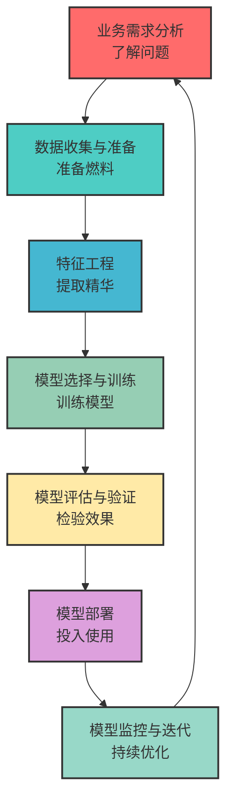
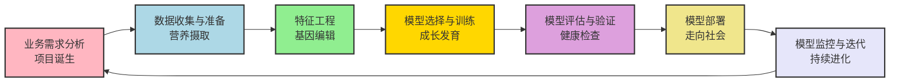
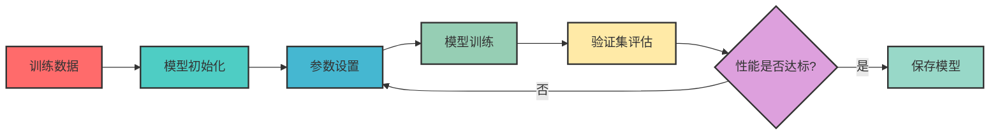
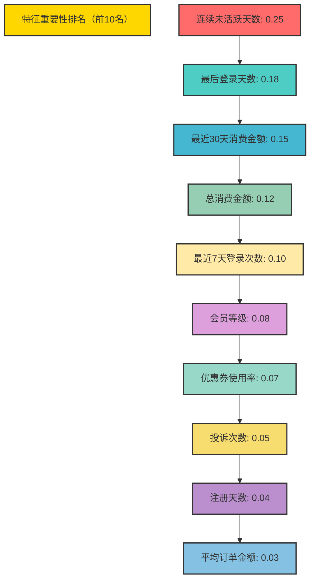
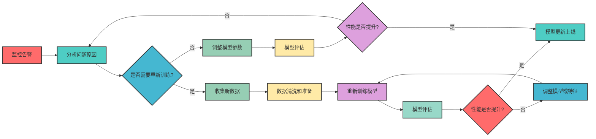

# 第二篇 AI技术架构与关键原理

## 第5章 机器学习核心流程

### 学习线路图

### 学习目标
1. 理解机器学习项目的全生命周期
2. 掌握机器学习核心流程的每个阶段
3. 了解每个阶段的核心任务和挑战
4. 学习如何评估机器学习模型的性能
5. 理解模型部署和监控的重要性
6. 掌握机器学习项目的成功要素

### 核心知识点
- 机器学习核心流程的七个阶段
- 业务需求分析的方法
- 数据收集与准备的关键步骤
- 特征工程的基本概念
- 模型选择与训练的原则
- 模型评估的常用指标
- 模型部署的方式
- 模型监控与迭代的方法

### 重点难点
- 业务需求到技术需求的转化
- 数据质量对模型效果的影响
- 特征工程的实践方法
- 模型评估指标的选择
- 模型部署的技术选型
- 模型监控的关键指标

### 本章导读

你知道吗？一个成功的机器学习项目不仅仅是训练一个模型，而是一个完整的流程，从业务需求分析到模型部署和监控。就像是建造一座房子，需要经过需求分析、土地准备、图纸设计、施工建造、质量验收、装修入住和日常维护等多个阶段。

本章将带你了解机器学习的核心流程，包括业务需求分析、数据收集与准备、特征工程、模型选择与训练、模型评估与验证、模型部署、模型监控与迭代。通过本章学习，你将能够理解机器学习项目的全生命周期，掌握每个阶段的核心任务和挑战，为后续学习奠定基础。

---

## 5.1 机器学习流程概览

### 5.1.1 完整流程：机器学习的"生命周期"

机器学习项目就像是一个"生命"，从诞生到成长，再到成熟和持续进化。完整的机器学习流程可以分为七个阶段：

1. **业务需求分析**：理解业务问题，定义机器学习目标（相当于"项目诞生"）
2. **数据收集与准备**：收集、清洗和准备数据（相当于"营养摄取"）
3. **特征工程**：提取和选择对模型有用的特征（相当于"基因编辑"）
4. **模型选择与训练**：选择合适的模型并进行训练（相当于"成长发育"）
5. **模型评估与验证**：评估模型性能，验证模型效果（相当于"健康检查"）
6. **模型部署**：将模型部署到生产环境（相当于"走向社会"）
7. **模型监控与迭代**：监控模型性能，持续优化模型（相当于"持续进化"）

### 5.1.2 流程比喻：机器学习就像"建造智能房子"

我们可以将机器学习流程比作"建造智能房子"，每个阶段都对应着建造房子的不同步骤：

| 机器学习阶段 | 建造房子阶段 | 核心任务 | 形象化比喻 |
|--------------|--------------|----------|------------|
| 业务需求分析 | 需求分析 | 确定要建什么样的房子 | 与业主沟通，了解他们想要什么样的房子 |
| 数据收集与准备 | 土地准备 | 准备建房子的土地 | 清理土地，确保地基稳固 |
| 特征工程 | 图纸设计 | 设计房子的图纸 | 根据业主需求设计房子的平面图和施工图 |
| 模型选择与训练 | 施工建造 | 按照图纸建造房子 | 按照图纸施工，建造房子的主体结构 |
| 模型评估与验证 | 质量验收 | 检查房子的质量 | 请专业人员验收房子的质量 |
| 模型部署 | 装修入住 | 搬入房子居住 | 装修房子，业主搬入居住 |
| 模型监控与迭代 | 日常维护 | 维护和更新房子 | 定期维护房子，根据业主反馈进行装修升级 |

### 5.1.3 迭代式流程：机器学习是"持续进化"

机器学习流程不是线性的，而是**迭代式**的，就像是生物的"持续进化"。在任何阶段发现问题，都可能需要回到之前的阶段重新进行：

- 如果模型效果不好（相当于"健康检查不合格"），可能需要重新进行**特征工程**（相当于"重新设计图纸"）或**数据准备**（相当于"重新整理土地"）
- 如果模型在生产环境中表现不佳（相当于"房子住得不舒服"），可能需要重新**训练模型**（相当于"重新装修"）或**调整模型参数**（相当于"微调装修细节"）
- 如果业务需求发生变化（相当于"业主改变主意"），可能需要重新进行**业务需求分析**（相当于"重新沟通需求"）

这种迭代式流程有助于持续改进模型，提高模型的性能和实用性，就像是生物在不断适应环境变化，持续进化一样。

### 小思考

你认为机器学习流程中最重要的是哪个阶段？为什么？

---

## 5.2 业务需求分析

### 5.2.1 核心任务

业务需求分析是机器学习项目的第一步，也是最关键的一步。其核心任务是：

1. **理解业务问题**：与业务人员沟通，了解实际业务问题和痛点
2. **定义机器学习目标**：将业务问题转化为可量化的机器学习目标
3. **确定成功指标**：定义衡量模型成功的指标
4. **评估可行性**：评估项目的技术可行性、数据可行性和商业可行性

### 5.2.2 实际项目案例：电商平台用户流失预测

让我们通过一个实际项目案例来理解业务需求分析的过程：

**案例背景**：
某电商平台最近发现用户流失率持续上升，业务团队希望通过AI技术预测哪些用户可能流失，并采取针对性措施挽留用户。

**业务需求分析过程**：

1. **与业务人员沟通**：
   - 业务背景：用户流失率从5%上升到8%，每月损失约1000万元
   - 业务痛点：无法识别高风险流失用户，挽留措施效果不佳
   - 期望成果：预测用户流失概率，提高挽留成功率

2. **转化为机器学习问题**：
   - 问题类型：**二分类问题**（用户会流失 vs 用户不会流失）
   - 预测目标：用户在未来30天内流失的概率

3. **定义成功指标**：
   - 业务指标：挽留成功率提升15%，月度流失减少500万元
   - 技术指标：
     - 精确率：至少80%（确保预测的流失用户中大部分真的会流失）
     - 召回率：至少70%（确保大部分流失用户被预测到）
     - F1分数：至少75%（平衡精确率和召回率）

4. **评估可行性**：
   - 技术可行性：二分类问题是机器学习的经典问题，技术成熟
   - 数据可行性：平台有丰富的用户数据（注册信息、浏览记录、购买历史、客服记录等）
   - 商业可行性：投资回报率高，预计每月可减少500万元损失

**案例总结**：
通过业务需求分析，我们将"降低用户流失率"这个模糊的业务需求，转化为一个具体的、可量化的机器学习问题，并明确了成功指标和可行性评估，为后续工作奠定了基础。

### 5.2.3 方法与步骤

**1. 与业务人员沟通**
- 了解业务背景和上下文
- 识别业务痛点和需求
- 明确期望的业务成果

**2. 转化为机器学习问题**
- 分类问题：如垃圾邮件识别、客户流失预测
- 回归问题：如房价预测、销量预测
- 聚类问题：如客户分群、异常检测
- 生成问题：如文本生成、图像生成

**3. 定义成功指标**
- 业务指标：如销售额提升、成本降低、客户满意度提升
- 技术指标：如准确率、召回率、F1分数、MAE、RMSE等

**4. 评估可行性**
- 技术可行性：当前技术是否能够解决这个问题
- 数据可行性：是否有足够的数据，数据质量如何
- 商业可行性：项目的投入产出比如何，是否值得实施

### 5.2.3 常见挑战

1. **需求不明确**：业务人员可能无法清晰表达需求
2. **目标不一致**：业务目标和技术目标可能存在差异
3. **数据不足**：可能没有足够的数据来训练模型
4. **期望过高**：业务人员可能对AI有过高的期望

### 5.2.4 实践建议

1. 与业务人员建立良好的沟通机制
2. 从简单的问题开始，逐步迭代
3. 明确成功的标准和衡量指标
4. 进行小范围的试点项目，验证可行性

### 小练习

假设你是一家电商公司的AI负责人，业务人员提出"希望提高用户转化率"，你会如何将这个业务需求转化为机器学习问题？

---

## 5.3 数据收集与准备

### 5.3.1 核心任务

数据是机器学习的"燃料"，没有高质量的数据，就无法训练出优秀的模型。数据收集与准备的核心任务是：

1. **数据收集**：从各种来源收集数据
2. **数据清洗**：去除噪声和异常数据
3. **数据标注**：为数据添加标签（如果需要）
4. **数据划分**：将数据划分为训练集、验证集和测试集

### 5.3.2 电商用户流失预测案例：数据收集与准备

继续以电商用户流失预测为例，展示数据收集与准备的具体过程：

**1. 数据收集**

- **数据来源**：
  - 用户注册信息：年龄、性别、地理位置、注册时间等
  - 用户行为数据：浏览记录、搜索记录、购买历史、加购行为等
  - 交易数据：订单金额、购买频率、支付方式等
  - 客服数据：投诉记录、咨询次数等
  - 营销数据：优惠券使用情况、活动参与记录等

- **数据量**：
  - 收集了过去12个月的用户数据，共包含50万用户
  - 其中流失用户（过去30天内未活跃）约4万，占比8%

**2. 数据清洗**

数据清洗流程如下：

- **处理缺失值**：
  - 年龄缺失：使用平均值填充（32.5岁）
  - 购买频率缺失：填充为0（表示新用户）
  - 客服记录缺失：填充为0（表示未联系客服）

- **处理异常值**：
  - 订单金额异常：删除单笔订单金额超过10万元的记录（可能是测试数据）
  - 登录频率异常：将单日登录次数超过100次的记录限制为100次（可能是爬虫或异常账号）

- **处理重复值**：
  - 删除完全重复的用户记录，共删除约1000条

- **数据类型转换**：
  - 将性别转换为数值：男=0，女=1
  - 将地理位置转换为独热编码：如北京=1000，上海=0100等
  - 将时间转换为数值特征：如注册天数、最后登录天数等

**3. 数据标注**

- **标签定义**：
  - 流失用户（标签=1）：过去30天内未登录或未购买
  - 活跃用户（标签=0）：过去30天内有登录或购买行为

- **标注结果**：
  - 流失用户：40,000人（占8%）
  - 活跃用户：460,000人（占92%）

**4. 数据划分**

- 训练集：35万用户（70%）
- 验证集：7.5万用户（15%）
- 测试集：7.5万用户（15%）

- **划分原则**：
  - 分层抽样：保持各数据集的流失率比例一致（约8%）
  - 时间顺序：训练集使用前9个月数据，验证集和测试集使用最近3个月数据

### 5.3.3 数据收集与准备的最佳实践

1. **确保数据质量**：
   - 建立数据质量评估机制
   - 定期检查数据完整性和准确性
   - 建立数据清洗的标准化流程

2. **考虑数据隐私**：
   - 遵守数据隐私法规（如GDPR、CCPA）
   - 对敏感数据进行匿名化处理
   - 建立数据访问权限管理机制

3. **数据版本控制**：
   - 记录数据收集和处理的每一步
   - 保存不同版本的数据，便于回溯
   - 建立数据更新机制，定期更新训练数据

### 小思考

你认为数据收集与准备阶段最耗时的是哪个步骤？为什么？

---

## 5.4 特征工程

### 5.4.1 核心任务

特征工程是机器学习的"艺术"，它决定了模型的上限。特征工程的核心任务是：

1. **特征提取**：从原始数据中提取有用的特征
2. **特征选择**：选择对模型有用的特征
3. **特征转换**：将特征转换为适合模型的形式
4. **特征组合**：将多个特征组合成新的特征

### 5.4.2 电商用户流失预测案例：特征工程

继续以电商用户流失预测为例，展示特征工程的具体过程：

**1. 特征提取**

从原始数据中提取了以下几类特征：

| 特征类别 | 具体特征 | 说明 |
|----------|----------|------|
| **用户基础特征** | 年龄、性别、注册天数、会员等级 | 反映用户基本属性 |
| **行为特征** | 最近7天登录次数、最近30天浏览时长、搜索次数 | 反映用户活跃度 |
| **交易特征** | 总消费金额、最近30天消费金额、购买频率、平均订单金额 | 反映用户消费能力 |
| **客服特征** | 投诉次数、咨询次数 | 反映用户满意度 |
| **营销特征** | 优惠券使用率、活动参与率 | 反映用户对营销活动的响应 |
| **流失倾向特征** | 最后登录天数、最后购买天数、连续未活跃天数 | 直接反映流失风险 |

**2. 特征选择**

使用了以下方法进行特征选择：

- **相关性分析**：计算各特征与流失标签的相关性，排除相关性较弱的特征
- **随机森林特征重要性**：使用随机森林模型评估特征重要性
- **递归特征消除(RFE)**：递归删除最不重要的特征，直到达到最佳性能

最终选择了20个最重要的特征，其中前5个重要特征如下：

| 特征 | 重要性 | 说明 |
|------|--------|------|
| 连续未活跃天数 | 0.25 | 连续未活跃时间越长，流失风险越高 |
| 最后登录天数 | 0.18 | 最后登录时间越久，流失风险越高 |
| 最近30天消费金额 | 0.15 | 最近消费越少，流失风险越高 |
| 总消费金额 | 0.12 | 总消费越少，流失风险越高 |
| 最近7天登录次数 | 0.10 | 最近登录越少，流失风险越高 |

**3. 特征转换**

对部分特征进行了转换：

- **归一化**：对数值型特征（如年龄、消费金额）进行归一化，缩放到[0,1]区间
- **标准化**：对连续特征（如登录次数、浏览时长）进行标准化，转换为均值为0，标准差为1的分布
- **分箱处理**：将连续特征（如注册天数）划分为多个区间，如：
  - 新用户：注册天数<30天
  - 活跃用户：30天≤注册天数<365天
  - 老用户：注册天数≥365天

**4. 特征组合**

创建了一些新的组合特征：

- **消费频率** = 总订单数 / 注册天数
- **活跃度评分** = 0.3×登录频率 + 0.5×购买频率 + 0.2×浏览频率
- **价值评分** = 0.6×总消费金额 + 0.4×平均订单金额
- **风险评分** = 0.4×连续未活跃天数 + 0.3×最后登录天数 + 0.3×最后购买天数

### 5.4.3 特征工程的最佳实践

1. **基于业务知识**：结合业务理解设计特征，如电商领域的"RFM"模型
2. **特征可视化**：使用散点图、直方图等可视化方法分析特征分布
3. **特征交互**：考虑特征之间的交互作用，创建组合特征
4. **特征验证**：使用统计检验验证特征的有效性
5. **自动化特征工程**：使用工具如Featuretools、AutoML自动生成特征

**特征工程可视化**：

### 小练习

假设你正在处理一个电商推荐系统的项目，你会提取哪些特征？

---

## 5.5 模型选择与训练

### 5.5.1 核心任务

模型选择与训练是机器学习的核心阶段，其核心任务是：

1. **选择合适的模型**：根据问题类型和数据特点选择合适的模型
2. **设置模型参数**：调整模型参数，优化模型性能
3. **训练模型**：使用训练数据训练模型
4. **调整模型**：根据验证集性能调整模型

### 5.5.2 电商用户流失预测案例：模型选择与训练

继续以电商用户流失预测为例，展示模型选择与训练的具体过程：

**1. 模型选择**

根据问题类型（二分类问题）和数据特点（结构化数据、50万样本），我们测试了以下几种模型：

| 模型 | 类型 | 特点 | 验证集F1分数 |
|------|------|------|--------------|
| 逻辑回归 | 线性模型 | 简单高效，可解释性强 | 0.72 |
| 决策树 | 树模型 | 易于理解，可处理非线性关系 | 0.75 |
| 随机森林 | 集成模型 | 泛化能力强，不易过拟合 | 0.80 |
| XGBoost | 集成模型 | 性能优异，适合结构化数据 | 0.83 |
| LightGBM | 集成模型 | 训练速度快，内存占用低 | 0.84 |
| 神经网络 | 深度学习 | 适合复杂模式，需要大量数据 | 0.82 |

通过对比，我们最终选择了**LightGBM**模型，因为它在验证集上表现最好，且训练速度快，适合大规模数据。

**2. 模型训练流程**

模型训练流程如下：

**3. 参数调优**

使用贝叶斯优化方法对LightGBM模型的关键参数进行了调优，调优后的主要参数如下：

| 参数 | 调优前 | 调优后 | 说明 |
|------|--------|--------|------|
| 学习率 | 0.1 | 0.05 | 控制模型学习速度 |
| 树的数量 | 100 | 500 | 模型复杂度 |
| 树的深度 | 6 | 8 | 每棵树的最大深度 |
| 子样本比例 | 1.0 | 0.8 | 训练每棵树时使用的样本比例 |
| 特征比例 | 1.0 | 0.7 | 训练每棵树时使用的特征比例 |

**4. 防止过拟合**

采用了以下方法防止过拟合：

- **早停**：在验证集性能连续10轮没有提升时停止训练
- **正则化**：添加L1和L2正则化项，防止模型过度复杂
- **子采样**：使用80%的样本训练每棵树，增加模型多样性
- **特征采样**：使用70%的特征训练每棵树，减少特征间的相关性

### 5.5.3 模型训练的最佳实践

1. **多种模型对比**：测试多种模型，选择最适合的模型
2. **参数调优**：使用自动化调优方法（如贝叶斯优化）调整参数
3. **防止过拟合**：采用早停、正则化、子采样等方法防止过拟合
4. **模型集成**：将多个模型的预测结果结合，提高预测性能
5. **训练监控**：实时监控训练过程，及时发现问题

### 5.5.4 模型训练结果

训练完成后，模型在验证集上的性能如下：

| 指标 | 验证集结果 |
|------|------------|
| 精确率 | 0.82 |
| 召回率 | 0.76 |
| F1分数 | 0.79 |
| AUC | 0.88 |

这些指标表明模型在验证集上表现良好，达到了预期的技术指标。

### 小思考

你认为在模型选择时，准确性和可解释性哪个更重要？为什么？

---

## 5.6 模型评估与验证

### 5.6.1 核心任务

模型评估与验证的核心任务是：

1. **评估模型性能**：使用测试集评估模型的性能
2. **验证模型泛化能力**：确保模型在新数据上也能表现良好
3. **比较不同模型**：比较不同模型的性能，选择最佳模型
4. **解释模型结果**：理解模型为什么做出这样的预测

### 5.6.2 电商用户流失预测案例：模型评估与验证

继续以电商用户流失预测为例，展示模型评估与验证的具体过程：

**1. 测试集评估**

使用独立的测试集对训练好的LightGBM模型进行评估，结果如下：

| 指标 | 测试集结果 | 目标值 | 是否达标 |
|------|------------|--------|----------|
| 精确率 | 0.81 | 80% | ✅ |
| 召回率 | 0.75 | 70% | ✅ |
| F1分数 | 0.78 | 75% | ✅ |
| AUC | 0.87 | - | ✅ |

测试集结果显示，模型的各项指标都达到了预期目标，说明模型具有良好的泛化能力。

**2. 模型解释**

使用SHAP值解释模型的预测结果，了解各个特征对预测的贡献：

**特征重要性可视化**：

**单个用户预测解释**：

以一个具体用户为例，解释模型为什么预测该用户会流失：

- 用户ID：U12345
- 预测流失概率：78%
- 实际结果：流失

| 特征 | 用户值 | 特征贡献 | 说明 |
|------|--------|----------|------|
| 连续未活跃天数 | 25天 | +0.35 | 连续25天未活跃，是最大的流失风险因素 |
| 最后登录天数 | 28天 | +0.28 | 最后登录是28天前，增加了流失风险 |
| 最近30天消费金额 | 0元 | +0.22 | 最近30天未消费，增加了流失风险 |
| 总消费金额 | 500元 | -0.15 | 总消费金额较高，降低了流失风险 |
| 最近7天登录次数 | 0次 | +0.10 | 最近7天未登录，增加了流失风险 |

**3. 模型对比**

将LightGBM模型与其他模型在测试集上的性能进行对比：

| 模型 | 精确率 | 召回率 | F1分数 | AUC | 推理速度（毫秒/样本） |
|------|--------|--------|--------|------|----------------------|
| 逻辑回归 | 0.70 | 0.65 | 0.67 | 0.80 | 0.1 |
| 决策树 | 0.73 | 0.70 | 0.71 | 0.82 | 0.2 |
| 随机森林 | 0.78 | 0.75 | 0.76 | 0.85 | 5.0 |
| XGBoost | 0.80 | 0.74 | 0.77 | 0.86 | 2.0 |
| LightGBM | 0.81 | 0.75 | 0.78 | 0.87 | 0.5 |
| 神经网络 | 0.80 | 0.73 | 0.76 | 0.85 | 1.0 |

通过对比，LightGBM模型在各项指标上都表现最佳，且推理速度快，适合在线部署。

### 5.6.3 模型评估与验证的最佳实践

1. **使用独立测试集**：确保测试集与训练集完全独立，避免数据泄露
2. **多种评估指标结合**：使用精确率、召回率、F1分数、AUC等多种指标评估模型
3. **交叉验证**：使用K折交叉验证，确保模型结果的稳定性
4. **模型解释**：使用SHAP、LIME等工具解释模型结果，提高模型可信度
5. **业务指标结合**：将技术指标与业务指标结合，评估模型的实际价值

### 5.6.4 模型上线决策

基于模型评估结果，我们做出了以下上线决策：

1. **模型版本**：LightGBM v1.0
2. **部署方式**：云端API部署，支持实时预测
3. **服务等级**：99.9%可用性，响应时间<100ms
4. **监控指标**：精确率、召回率、F1分数、AUC、响应时间
5. **更新频率**：每周重新训练一次模型，确保模型适应最新数据

这些决策确保了模型能够稳定上线，为业务提供可靠的用户流失预测服务。

### 小练习

假设你正在评估一个癌症诊断模型，你会选择哪些评估指标？为什么？

---

## 5.7 模型部署

### 5.7.1 核心任务

模型部署是将训练好的模型应用到生产环境中，其核心任务是：

1. **选择部署方式**：根据业务需求选择合适的部署方式
2. **模型优化**：优化模型性能和效率
3. **模型封装**：将模型封装为API或服务
4. **集成到现有系统**：将模型集成到企业的现有系统中

### 5.7.2 电商用户流失预测案例：模型部署

继续以电商用户流失预测为例，展示模型部署的具体过程：

**1. 部署方式选择**

根据业务需求（实时预测、高可用、数据安全），我们选择了**云端API+容器化部署**的方式：

| 部署方式 | 优点 | 缺点 | 适用场景 |
|----------|------|------|----------|
| 云端API | 易于部署和管理，弹性扩展 | 依赖网络，数据需要发送到云端 | 实时预测，高并发场景 |
| 容器化部署 | 环境隔离，易于管理和扩展 | 需要一定的容器化知识 | 大规模部署，复杂系统 |

**2. 模型优化**

为了提高模型的部署效率，我们对模型进行了以下优化：

- **模型压缩**：使用LightGBM的内置压缩功能，将模型大小从100MB压缩到10MB
- **特征优化**：移除了5个不重要的特征，减少了模型的计算量
- **推理优化**：使用ONNX Runtime加速推理，推理速度提升了3倍

**3. 模型封装与部署**

模型封装与部署流程如下：

**4. 集成到业务系统**

将模型API集成到电商平台的用户管理系统中，实现以下功能：

- **实时预测**：用户每次登录时，实时预测流失概率
- **批量预测**：每天凌晨对所有用户进行批量预测，生成流失风险报告
- **个性化挽留**：根据流失概率和用户特征，自动生成个性化挽留方案
  - 流失概率>80%：发送高额优惠券（满200减100）
  - 流失概率60%-80%：发送中等优惠券（满100减30）
  - 流失概率40%-60%：发送个性化推荐邮件

**5. 部署效果**

- 模型API响应时间：平均50ms，满足实时预测需求
- 可用性：99.9%，确保服务稳定运行
- 日调用量：超过100万次，支持高并发场景

### 5.7.3 模型部署的最佳实践

1. **选择合适的部署方式**：根据业务需求选择云端、私有化或边缘部署
2. **模型优化**：对模型进行压缩、加速，提高部署效率
3. **容器化部署**：使用Docker和Kubernetes，提高部署的可扩展性和可管理性
4. **API设计**：设计简洁、易用的API接口，便于业务系统集成
5. **监控和日志**：建立完善的监控和日志系统，及时发现和解决问题

### 小思考

你认为模型部署时最重要的考虑因素是什么？为什么？

---

## 5.8 模型监控与迭代

### 5.8.1 核心任务

模型监控与迭代是机器学习流程的最后一个阶段，也是持续改进的阶段，其核心任务是：

1. **监控模型性能**：持续监控模型的性能指标
2. **检测模型漂移**：检测数据漂移和模型性能漂移
3. **模型更新**：根据监控结果更新模型
4. **持续优化**：持续改进模型性能

### 5.8.2 电商用户流失预测案例：模型监控与迭代

继续以电商用户流失预测为例，展示模型监控与迭代的具体过程：

**1. 模型监控**

我们建立了完善的监控系统，监控以下指标：

| 监控类别 | 具体指标 | 阈值 | 告警方式 |
|----------|----------|------|----------|
| **性能监控** | 响应时间 | >100ms | 邮件+短信 |
|  | 可用性 | <99.9% | 电话+邮件 |
|  | QPS（每秒请求数） | >5000 | 邮件 |
| **效果监控** | 精确率 | <75% | 邮件+短信 |
|  | 召回率 | <65% | 邮件+短信 |
|  | F1分数 | <70% | 邮件+短信 |
| **数据监控** | 数据分布变化 | >20% | 邮件 |
|  | 特征缺失率 | >5% | 邮件 |
| **异常监控** | 异常请求比例 | >1% | 邮件+短信 |
|  | 预测概率异常值 | >0.05 | 邮件 |

**2. 模型漂移检测**

使用以下方法检测模型漂移：

- **性能漂移检测**：定期（每周）使用新数据评估模型性能，如果性能下降超过10%，则触发模型更新
- **数据漂移检测**：使用KS检验和PSI（Population Stability Index）检测输入数据分布的变化
- **概念漂移检测**：检测目标变量（用户流失）分布的变化

**3. 模型迭代**

当检测到模型漂移或性能下降时，我们执行以下迭代流程：

**4. 模型更新案例**

在模型上线3个月后，监控系统发现模型的召回率从75%下降到62%，触发了模型更新流程：

- **问题分析**：用户行为发生变化，新的流失模式出现
- **解决方案**：
  1. 收集了最近1个月的新数据（10万用户）
  2. 重新进行特征工程，新增了3个新特征（如最近30天浏览品类数、活动参与频率）
  3. 重新训练LightGBM模型，调整了模型参数
  4. 新模型在测试集上的召回率达到78%，精确率达到82%
  5. 使用A/B测试将新模型上线，逐步替换旧模型

**5. 持续优化效果**

通过持续监控和迭代，模型效果不断提升：

| 时间 | 精确率 | 召回率 | F1分数 | 业务效果 |
|------|--------|--------|--------|----------|
| 上线初期 | 81% | 75% | 78% | 挽留成功率提升15% |
| 第一次迭代后 | 82% | 78% | 80% | 挽留成功率提升18% |
| 第二次迭代后 | 83% | 80% | 81% | 挽留成功率提升20% |
| 第三次迭代后 | 84% | 81% | 82% | 挽留成功率提升22% |

### 5.8.3 模型监控与迭代的最佳实践

1. **建立完善的监控体系**：监控性能、效果、数据和异常等多个维度
2. **自动化模型更新**：实现从监控告警到模型更新的自动化流程
3. **A/B测试**：使用A/B测试验证新模型的效果，降低上线风险
4. **定期重新训练**：即使没有明显的漂移，也定期（如每月）重新训练模型
5. **持续收集反馈**：收集业务团队和用户的反馈，持续改进模型

### 5.8.4 机器学习项目成功要素

通过电商用户流失预测案例，我们总结了机器学习项目成功的关键要素：

1. **明确的业务目标**：将业务需求转化为可量化的机器学习目标
2. **高质量的数据**：数据是机器学习的基础，确保数据质量和完整性
3. **优秀的特征工程**：特征工程决定了模型的上限
4. **合适的模型选择**：根据问题类型和数据特点选择合适的模型
5. **全面的评估和解释**：确保模型的性能和可信度
6. **高效的部署和监控**：确保模型稳定运行并持续优化
7. **持续的迭代和改进**：根据业务变化和数据漂移持续更新模型

这些要素共同作用，确保机器学习项目能够成功落地，为企业创造实际价值。

### 小练习

你认为模型监控时最重要的指标是什么？为什么？

---

## 本章总结

### 知识回顾

1. **机器学习流程概览**：
   - 机器学习流程包括七个阶段：业务需求分析、数据收集与准备、特征工程、模型选择与训练、模型评估与验证、模型部署、模型监控与迭代
   - 流程是迭代式的，需要持续改进

2. **业务需求分析**：
   - 理解业务问题，定义机器学习目标
   - 将业务需求转化为机器学习问题
   - 定义成功指标，评估可行性

3. **数据收集与准备**：
   - 收集、清洗、标注和划分数据
   - 数据质量是模型成功的关键

4. **特征工程**：
   - 提取、选择、转换和组合特征
   - 特征工程决定了模型的上限

5. **模型选择与训练**：
   - 根据问题类型和数据特点选择合适的模型
   - 使用优化算法训练模型，防止过拟合

6. **模型评估与验证**：
   - 使用合适的评估指标评估模型性能
   - 使用交叉验证等方法验证模型泛化能力

7. **模型部署**：
   - 选择合适的部署方式，优化模型
   - 将模型集成到生产环境

8. **模型监控与迭代**：
   - 监控模型性能，检测模型漂移
   - 持续更新和优化模型

### 知识体系梳理

```mermaid
graph TD
    A[机器学习核心流程] --> B[业务需求分析]
    A --> C[数据收集与准备]
    A --> D[特征工程]
    A --> E[模型选择与训练]
    A --> F[模型评估与验证]
    A --> G[模型部署]
    A --> H[模型监控与迭代]
    
    B --> B1[理解业务问题]
    B --> B2[定义机器学习目标]
    B --> B3[确定成功指标]
    B --> B4[评估可行性]
    
    C --> C1[数据收集]
    C --> C2[数据清洗]
    C --> C3[数据标注]
    C --> C4[数据划分]
    
    D --> D1[特征提取]
    D --> D2[特征选择]
    D --> D3[特征转换]
    D --> D4[特征组合]
    
    E --> E1[选择模型]
    E --> E2[设置参数]
    E --> E3[训练模型]
    E --> E4[防止过拟合]
    
    F --> F1[评估指标]
    F --> F2[验证方法]
    F --> F3[模型解释]
    
    G --> G1[部署方式]
    G --> G2[模型优化]
    G --> G3[模型封装]
    
    H --> H1[性能监控]
    H --> H2[模型漂移]
    H --> H3[模型更新]
    H --> H4[持续优化]
```

### 实践应用场景

**场景1：企业AI项目规划**

假设你是一家企业的AI负责人，需要规划一个机器学习项目。通过本章学习，你可以：

1. 明确业务需求，将其转化为机器学习问题
2. 制定数据收集和准备计划
3. 设计特征工程方案
4. 选择合适的模型和训练方法
5. 制定模型评估和验证方案
6. 规划模型部署和监控策略

**场景2：AI解决方案设计**

假设你是一名AI解决方案专家，需要为客户设计一个机器学习解决方案。通过本章学习，你可以：

1. 分析客户的业务需求，确定机器学习目标
2. 评估项目的可行性和数据需求
3. 设计完整的机器学习流程
4. 选择合适的模型和部署方式
5. 制定模型监控和迭代策略
6. 评估项目的成本和收益

### 下一步学习建议

1. 深入学习深度学习基础与神经网络（第6章）
2. 掌握Transformer架构与大模型原理（第7章）
3. 了解大模型关键技术栈（第8章）
4. 学习AI系统架构与部署（第9章）
5. 结合自己的行业，思考如何应用机器学习流程

通过本章的学习，你已经对机器学习的核心流程有了全面的了解。接下来，我们将深入学习深度学习基础与神经网络，为后续学习奠定更坚实的基础。

---

**小练习答案参考**

- **思考1**：机器学习流程中最重要的可能是业务需求分析，因为如果业务需求不明确，后续的所有工作都可能白做。正确理解业务问题，定义清晰的机器学习目标，是项目成功的关键。

- **练习1**：将"提高用户转化率"转化为机器学习问题：
  - 可以定义为分类问题：预测用户是否会转化
  - 特征：用户 demographics、浏览行为、购买历史、营销活动等
  - 评估指标：精确率、召回率、F1分数、转化率提升幅度

- **思考2**：数据收集与准备阶段最耗时的可能是数据清洗和标注，尤其是对于非结构化数据，需要大量的人工工作。

- **练习2**：电商推荐系统的特征：
  - 用户特征：年龄、性别、地理位置、购买历史、浏览历史等
  - 商品特征：类别、价格、销量、评分等
  - 上下文特征：时间、设备、位置等
  - 交互特征：用户对商品的点击、收藏、购买等行为

- **思考3**：模型选择时，准确性和可解释性的重要性取决于具体场景。对于医疗诊断、金融风控等关键场景，可解释性可能更重要；对于推荐系统、广告投放等场景，准确性可能更重要。

- **练习3**：癌症诊断模型的评估指标：
  - 召回率：尽量不漏掉癌症患者
  - F1分数：平衡精确率和召回率
  - AUC：评估模型的整体性能

- **思考4**：模型部署时最重要的考虑因素可能是业务需求，包括性能要求、数据安全要求、成本预算等。不同的业务需求会影响部署方式的选择。

- **练习4**：模型监控时最重要的指标可能是模型的业务效果，如转化率、点击率、销售额等，因为这些指标直接反映了模型的实际价值。同时，也需要监控模型的技术指标，如响应时间、吞吐量等。

---