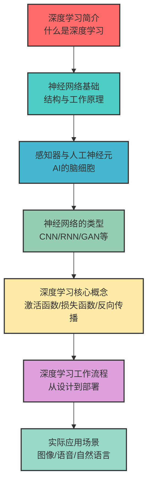
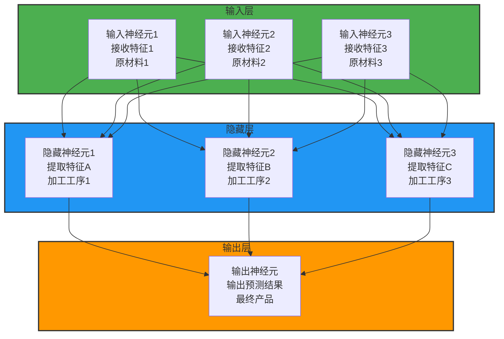
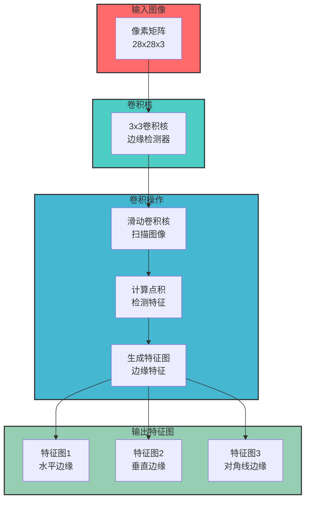
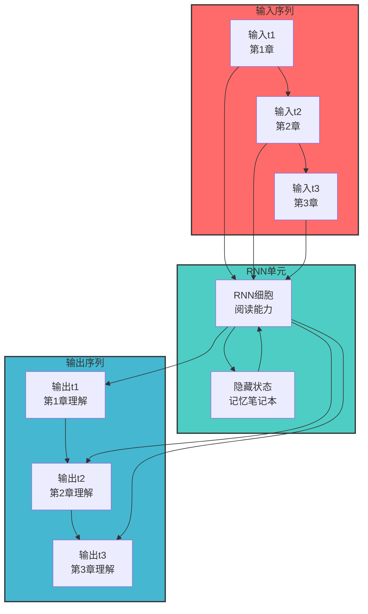
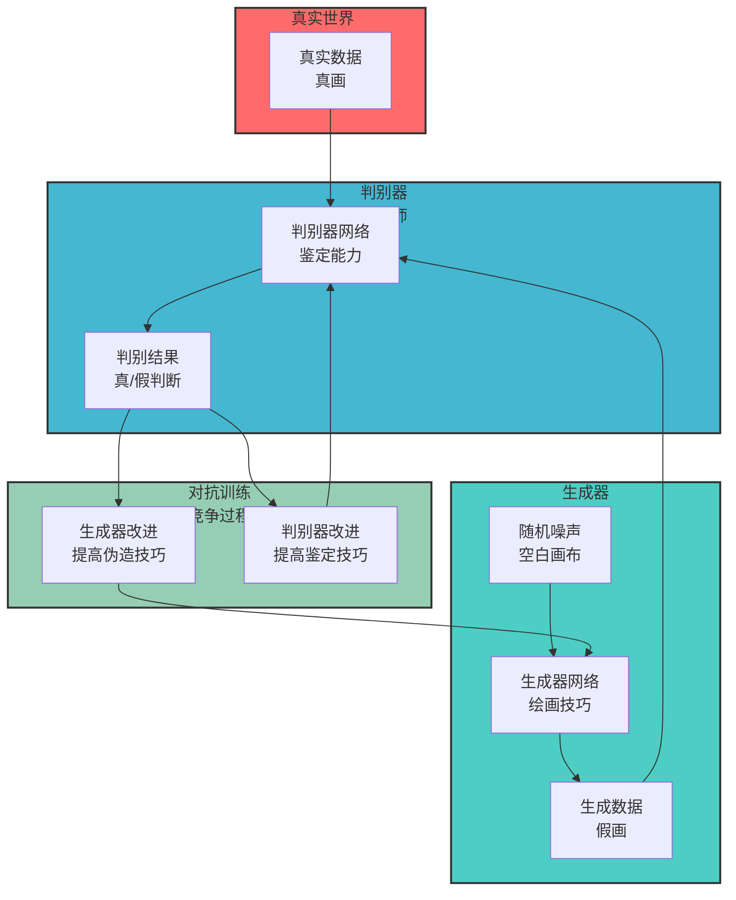
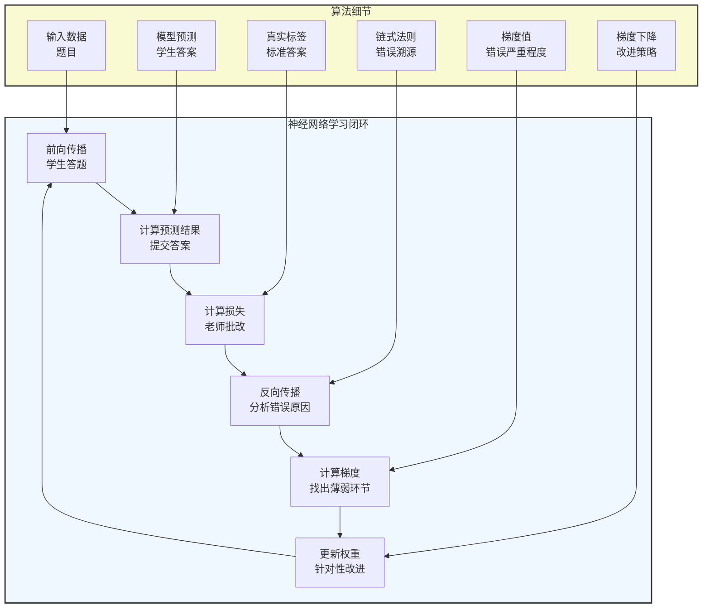
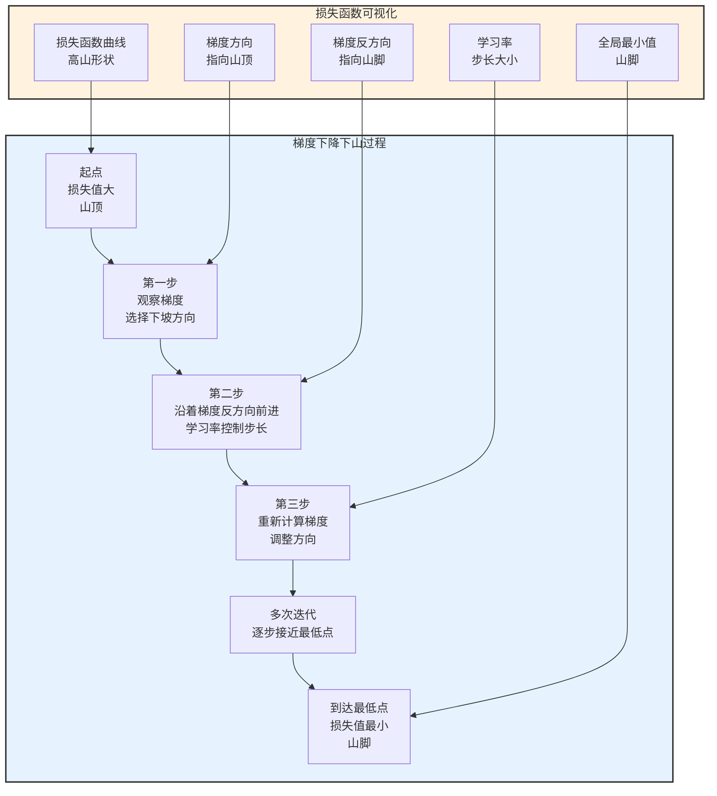
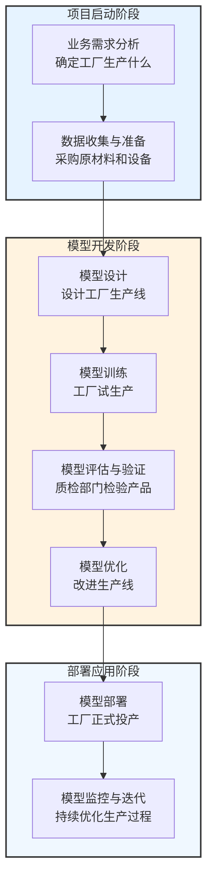

# 第二篇 AI技术架构与关键原理

## 第6章 深度学习基础与神经网络

### 学习线路图


### 学习目标
1. 理解深度学习的基本概念和优势
2. 掌握神经网络的基本结构和工作原理
3. 了解不同类型神经网络的特点和应用场景
4. 熟悉深度学习的核心概念和算法
5. 掌握深度学习的工作流程
6. 了解深度学习的实际应用案例

### 核心知识点
- 深度学习的定义和优势
- 神经网络的基本结构
- 感知器与人工神经元
- 常见神经网络类型（CNN、RNN、GAN等）
- 激活函数、损失函数、反向传播
- 深度学习工作流程
- 深度学习应用场景

### 重点难点
- 神经网络的工作原理
- 反向传播算法
- 不同神经网络类型的适用场景
- 深度学习与传统机器学习的区别

### 本章导读

你是否好奇，AI是如何像人类一样学习和识别事物的？当你使用手机进行面部解锁时，AI是如何准确识别你的面部的？当你与ChatGPT聊天时，它是如何理解你的问题并生成合理回答的？这些都是深度学习和神经网络的功劳。

深度学习是机器学习的一个分支，它模仿人类大脑的神经网络结构，通过多层神经元的连接和计算来学习和处理复杂的数据。就像是一个多层的信息过滤器，每一层都能提取数据中的不同特征，最终形成对数据的深刻理解。

本章将带你了解深度学习的基础知识和神经网络的工作原理，包括神经网络的结构、不同类型的神经网络、深度学习的核心概念和工作流程。通过本章学习，你将能够理解深度学习的基本原理，为后续学习Transformer架构和大模型打下基础。

---

## 6.1 深度学习简介

### 6.1.1 什么是深度学习

深度学习（Deep Learning）是机器学习的一个分支，它通过模拟人类大脑的神经网络结构，构建多层神经网络模型，从而实现对复杂数据的学习和处理。

**深度学习的核心特点**：
- **多层结构**：包含多个隐藏层，能够提取数据中的多层次特征
- **自动特征学习**：无需人工设计特征，模型自动从数据中学习特征
- **强大的表达能力**：能够处理复杂的非线性关系
- **适用于大数据**：随着数据量的增加，模型性能不断提升

### 6.1.2 深度学习与传统机器学习的区别

| 特性 | 传统机器学习 | 深度学习 |
|------|--------------|----------|
| 特征提取 | 人工设计特征 | 自动学习特征 |
| 模型复杂度 | 相对简单 | 非常复杂，包含多层结构 |
| 数据需求 | 适用于小数据 | 适用于大数据 |
| 计算资源需求 | 较低 | 较高，需要GPU/TPU |
| 适用场景 | 简单模式识别 | 复杂模式识别（图像、语音、自然语言） |

### 6.1.3 深度学习的优势

1. **自动特征学习**：无需人工设计特征，降低了对领域专家的依赖
2. **强大的表达能力**：能够处理复杂的非线性关系，适用于复杂任务
3. **端到端学习**：从原始数据直接到最终结果，简化了系统设计
4. **可迁移性**：预训练模型可以迁移到不同的任务中，提高开发效率
5. **持续学习能力**：可以不断学习新的数据，适应环境变化

### 小思考

你认为深度学习最适合解决哪些类型的问题？为什么？

---

## 6.2 神经网络基础

### 6.2.1 生物神经网络的启发：AI的"大脑"

深度学习的神经网络结构**灵感来源于人类大脑的生物神经网络**，就像是AI的"人造大脑"：
- 人类大脑包含约**1000亿个神经元**，每个神经元通过**突触**与其他神经元连接，形成复杂的神经网络
- 当我们学习新事物时，神经元之间的连接强度会发生变化，这就是所谓的"**突触可塑性**"
- 深度学习的神经网络正是模拟了这一过程，通过调整神经元之间的**连接权重**来学习

**形象化比喻**：
- 生物神经元 → 人工神经元（AI的"脑细胞"）
- 突触连接 → 权重连接（AI的"神经纤维"）
- 突触可塑性 → 权重调整（AI的"学习过程"）

### 6.2.2 人工神经网络的结构：AI的"神经网络"

人工神经网络由大量的**人工神经元**组成，通常分为三层，就像是一个"多层信息过滤器"，每一层都能提取数据中的不同特征，最终形成对数据的深刻理解。

我们可以把神经网络比作一家工厂的"生产流水线"：
- 输入层：接收原材料（原始数据）
- 隐藏层：对原材料进行加工和提炼（特征提取）
- 输出层：生产出最终产品（预测结果）



**各层的作用和形象比喻**：

| 神经网络层 | 作用 | 工厂流水线比喻 | 人类器官比喻 | 实际例子 |
|------------|------|----------------|--------------|----------|
| **输入层** | 接收原始数据输入 | 原材料接收部门 | 眼睛、耳朵 | 接收图像的像素值、文本的词向量 |
| **隐藏层** | 处理数据，提取特征 | 加工车间，每一层是不同的加工工序 | 大脑皮层，不同区域处理不同信息 | 第一层提取边缘特征，第二层提取形状特征，第三层提取物体特征 |
| **输出层** | 输出预测结果 | 成品输出部门 | 嘴巴、动作 | 输出图像分类结果、文本情感分析结果 |

**深度神经网络 vs 浅层神经网络**：
- 浅层神经网络：只有1-2个隐藏层，就像是"小型加工厂"，只能处理简单任务
- 深度神经网络：有3个以上隐藏层，就像是"大型现代化工厂"，可以处理复杂任务

现在的大语言模型（如ChatGPT）包含数百亿甚至数千亿个参数，相当于拥有一个"超级工厂"，能够处理极其复杂的自然语言任务。

### 6.2.3 人工神经元的工作原理：AI的"脑细胞"

人工神经元是神经网络的**基本单元**，就像是AI的"脑细胞"，它接收多个输入，经过加权求和和激活函数处理后，输出结果。我们可以把人工神经元比作一个"投票系统"：

- 每个输入是一张"选票"
- 权重是选票的"重要程度"
- 偏置是"投票门槛"
- 激活函数是"计票规则"
- 输出是"投票结果"

```mermaid
graph TD
    subgraph 输入[输入信号<br>选票]
        A[x1=2<br>特征1选票：支持]
        C[x2=3<br>特征2选票：支持]
        E[x3=1<br>特征3选票：反对]
    end
    
    subgraph 权重[连接权重<br>选票重要程度]
        B[w1=0.5<br>特征1权重：重要]
        D[w2=0.3<br>特征2权重：一般]
        F[w3=0.2<br>特征3权重：不重要]
    end
    
    subgraph 计算[内部计算<br>计票过程]
        G[加权求和<br>2*0.5+3*0.3+1*0.2=2.1<br>加权后支持票：2.1]
        H[偏置b=0.1<br>计票门槛：0.1]
        I[总和=2.1+0.1=2.2<br>最终支持度：2.2]
        J[激活函数f<br>ReLU(2.2)=2.2<br>计票结果：通过]
    end
    
    subgraph 输出[输出结果<br>投票结果]
        K[y=2.2<br>神经元激活：强烈支持]
    end
    
    A --> B
    C --> D
    E --> F
    B --> G
    D --> G
    F --> G
    G --> I
    H --> I
    I --> J
    J --> K
    
    style 输入 fill:#E8F5E8,stroke:#333,stroke-width:2px
    style 权重 fill:#E3F2FD,stroke:#333,stroke-width:2px
    style 计算 fill:#FFF3E0,stroke:#333,stroke-width:2px
    style 输出 fill:#FFEBEE,stroke:#333,stroke-width:2px
```

**人工神经元的工作流程**：

1. **接收输入信号**：从输入层或其他神经元接收输入值
   - 相当于：投票系统接收各种选票
   - 实际例子：接收图像的像素值、文本的词向量

2. **加权计算**：对每个输入乘以对应的权重
   - 相当于：给每张选票赋予不同的重要程度
   - 实际例子：对于图像分类，边缘特征的权重可能更高

3. **求和并加偏置**：将所有加权后的输入相加，并加上偏置
   - 相当于：计算总支持度，并设置计票门槛
   - 实际例子：偏置可以调整神经元对输入的敏感度

4. **激活函数处理**：通过激活函数处理求和结果
   - 相当于：根据计票规则决定是否通过
   - 实际例子：ReLU激活函数只允许正数通过，负数被截断为0

5. **输出结果**：将处理后的结果传递给下一层神经元
   - 相当于：公布投票结果
   - 实际例子：输出图像属于某个类别的概率

**激活函数的形象比喻**：

| 激活函数 | 特点 | 形象比喻 | 实际应用 |
|----------|------|----------|----------|
| **ReLU** | 只允许正数通过，负数为0 | 相当于"只有赞成票超过门槛才通过" | 广泛应用于CNN、MLP等模型 |
| **Sigmoid** | 输出范围(0,1)，平滑过渡 | 相当于"根据支持度给出概率" | 用于二分类问题的输出层 |
| **Tanh** | 输出范围(-1,1)，中心对称 | 相当于"支持度从强烈反对到强烈支持" | 用于RNN等序列模型 |
| **Softmax** | 输出概率分布，总和为1 | 相当于"多选项投票，选谁的概率最高" | 用于多分类问题的输出层 |

**实际计算示例**：

假设我们正在训练一个用于识别猫的神经网络，其中一个神经元负责检测"猫耳朵"特征：
- 输入：图像中猫耳朵区域的像素值
- 权重：猫耳朵特征的重要程度
- 偏置：调整神经元对猫耳朵的敏感度
- 激活函数：判断是否存在猫耳朵
- 输出：存在猫耳朵的置信度

如果输入的猫耳朵特征明显，神经元会输出高值；如果特征不明显，神经元会输出低值。

### 小练习

假设一个人工神经元有两个输入x1=2和x2=3，对应的权重w1=0.5和w2=0.3，偏置b=0.1，使用ReLU激活函数，那么该神经元的输出是多少？

---

## 6.3 感知器与神经网络的发展

### 6.3.1 感知器（Perceptron）

感知器是最基本的神经网络模型，由美国心理学家Frank Rosenblatt于1957年提出。它是一个二元分类器，可以将输入数据分为两类。

**感知器的工作原理**：
- 接收多个输入信号
- 对每个输入信号进行加权计算
- 将加权后的信号求和
- 通过阈值函数（阶跃函数）处理求和结果
- 输出二元结果（0或1）

**感知器的局限性**：
- 只能处理线性可分的问题
- 无法解决异或（XOR）问题

### 6.3.2 多层感知器（MLP）

为了克服感知器的局限性，科学家们提出了多层感知器（Multi-Layer Perceptron，MLP）。MLP包含多个隐藏层，能够处理非线性问题。

**MLP的结构**：
- 输入层：接收原始数据
- 隐藏层：一个或多个隐藏层，用于提取特征
- 输出层：输出预测结果

**MLP的优势**：
- 能够处理非线性问题
- 可以通过反向传播算法进行训练
- 具有强大的表达能力

### 6.3.3 神经网络的发展历程

| 时间 | 事件 | 意义 |
|------|------|------|
| 1943 | 麦卡洛克-皮茨神经元模型 | 奠定了神经网络的理论基础 |
| 1957 | 感知器模型 | 第一个可以训练的神经网络模型 |
| 1969 | 感知器局限性被证明 | 神经网络研究进入低谷 |
| 1986 | 反向传播算法提出 | 解决了多层神经网络的训练问题 |
| 2006 | 深度学习概念提出 | 开启了深度学习时代 |
| 2012 | AlexNet在ImageNet竞赛中获胜 | 证明了深度学习的强大能力 |
| 2017 | Transformer架构提出 | 推动了大语言模型的发展 |

---

## 6.4 常见神经网络类型

### 6.4.1 卷积神经网络（CNN）

卷积神经网络（Convolutional Neural Network，CNN）是一种专门用于处理网格数据（如图像）的神经网络，就像是一个"图像识别专家"。它通过卷积层、池化层和全连接层的组合，能够自动提取图像中的特征，从简单的边缘到复杂的物体。

我们可以把CNN比作一个"侦探破案"的过程：
- 卷积层：收集线索，提取特征（如嫌疑人的眼睛、鼻子、嘴巴）
- 池化层：筛选重要线索，去除冗余信息（如只关注最明显的特征）
- 全连接层：综合所有线索，做出最终判断（如确定嫌疑人是谁）

**CNN的核心组件和工作原理**：

| 组件 | 作用 | 侦探破案比喻 | 实际例子 |
|------|------|--------------|----------|
| **卷积层** | 使用卷积核提取图像特征 | 放大镜，仔细观察细节 | 第一层卷积提取边缘特征，第二层提取形状特征，第三层提取物体特征 |
| **池化层** | 降低特征图的维度，减少计算量 | 筛选重要线索，忽略无关细节 | 从多个相似特征中选择最明显的一个 |
| **全连接层** | 将提取的特征映射到输出类别 | 综合所有线索，做出最终判断 | 将猫的特征映射到"猫"类别，狗的特征映射到"狗"类别 |

**卷积层的工作原理**：

卷积层使用**卷积核**（也称为"过滤器"）在图像上滑动，提取局部特征。我们可以把卷积核比作一个"特征探测器"：



**CNN的实际应用场景**：

1. **图像分类**：
   - 识别图像中的物体类别
   - 应用：手机相册自动分类、商品识别、医学图像分析
   - **实际案例**：Google Photos使用CNN自动识别照片中的人物、动物和场景

2. **目标检测**：
   - 检测图像中多个物体的位置和类别
   - 应用：自动驾驶、安防监控、零售货架分析
   - **实际案例**：特斯拉自动驾驶系统使用CNN检测道路上的车辆、行人、交通标志

3. **图像分割**：
   - 将图像分割为不同的区域，每个区域对应一个物体或背景
   - 应用：医学图像分割、卫星图像分析、自动驾驶
   - **实际案例**：医生使用CNN分割医学影像，精确识别肿瘤边界

4. **人脸识别**：
   - 识别或验证图像中的人脸
   - 应用：手机解锁、安防监控、身份验证
   - **实际案例**：iPhone Face ID使用CNN进行面部识别

**经典CNN架构**：

| 架构 | 特点 | 应用 |
|------|------|------|
| **LeNet-5** | 第一个成功的CNN模型，用于手写数字识别 | 银行支票识别、邮政编码识别 |
| **AlexNet** | 2012年ImageNet冠军，使用ReLU激活函数和Dropout | 图像分类、目标检测 |
| **VGGNet** | 统一使用3x3卷积核，深度增加到16-19层 | 图像分类、特征提取 |
| **ResNet** | 引入残差连接，解决深度网络退化问题，深度可达1000层 | 图像分类、目标检测、图像分割 |
| **MobileNet** | 轻量级CNN，适合移动设备和边缘计算 | 手机图像识别、IoT设备 |

**CNN的优势**：
- **自动特征学习**：无需人工设计特征，模型自动从数据中学习
- **参数共享**：卷积核在整个图像上共享，减少参数数量
- **局部连接**：只关注局部区域，符合图像的局部相关性
- **平移不变性**：无论物体在图像的哪个位置，都能识别

现在的大模型如GPT-4V和Gemini也集成了CNN组件，能够处理图像输入，实现多模态理解。

### 6.4.2 循环神经网络（RNN）

循环神经网络（Recurrent Neural Network，RNN）是一种专门用于处理**序列数据**的神经网络，就像是一个"序列处理专家"。它通过**循环连接**，能够记住之前的信息，处理当前输入时考虑历史上下文。

我们可以把RNN比作一个"小说读者"：
- 当阅读第100页时，它会记住前面99页的内容
- 理解当前句子时，会考虑之前的上下文
- 预测下一句内容时，会基于整个故事的发展

**RNN的核心特点**：

| 特点 | 小说读者比喻 | 实际应用 |
|------|--------------|----------|
| **记忆能力** | 记住之前阅读的内容 | 理解句子时考虑上下文 |
| **处理变长序列** | 可以阅读不同长度的小说 | 处理不同长度的句子、音频 |
| **时序信息** | 理解故事的发展顺序 | 理解语言的语序、音频的时间顺序 |

**RNN的工作原理**：

RNN通过**隐藏状态**（也称为"记忆"）来保存之前的信息。我们可以把隐藏状态比作一个"记忆笔记本"：



**RNN的变种**：

RNN虽然有记忆能力，但存在**长期依赖问题**：当序列很长时，它会忘记早期的信息，就像读者读了1000页小说后，会忘记前100页的内容。为了解决这个问题，科学家们发明了RNN的变种：

1. **LSTM（长短期记忆网络）**：
   - 增加了"门控机制"，就像是"记忆管理器"，控制哪些信息要记住，哪些要忘记
   - 可以记住长达几百个时间步的信息
   - 应用：机器翻译、语音识别、情感分析
   - 比喻：相当于读者有了一个智能笔记本，可以自动筛选重要信息，忘记不重要的细节

2. **GRU（门控循环单元）**：
   - LSTM的简化版本，计算效率更高
   - 只有两个门（更新门和重置门），结构更简单
   - 应用：实时语音识别、视频分析
   - 比喻：相当于更轻量的智能笔记本，适合快速阅读

**RNN的实际应用场景**：

1. **自然语言处理**：
   - 文本生成：如ChatGPT生成连贯的文章
   - 机器翻译：如Google翻译将中文翻译成英文
   - 情感分析：分析用户评论的情感倾向
   - **实际案例**：Google翻译使用RNN/LSTM实现高质量的机器翻译

2. **语音识别**：
   - 将语音转换为文本
   - 应用：手机语音助手、会议转录、语音输入
   - **实际案例**：Apple Siri使用RNN处理语音输入

3. **时间序列预测**：
   - 预测未来的数值，如股票价格、天气
   - 应用：金融预测、天气预报、交通流量预测
   - **实际案例**：某金融机构使用RNN预测股票价格波动

4. **视频分析**：
   - 分析视频中的动作和场景
   - 应用：视频监控、动作识别、视频摘要
   - **实际案例**：安防系统使用RNN识别异常行为

**RNN与Transformer的关系**：

虽然RNN在序列处理中表现良好，但现在的大语言模型（如ChatGPT）主要使用**Transformer架构**，它通过注意力机制更好地处理长序列。我们将在第7章详细介绍Transformer架构。

### 6.4.3 生成对抗网络（GAN）

生成对抗网络（Generative Adversarial Network，GAN）是一种**生成模型**，由两个神经网络组成：**生成器**（Generator）和**判别器**（Discriminator）。它们通过**对抗训练**的方式，不断提高各自的能力，就像是一场"伪造者与鉴定师"的游戏。

我们可以把GAN比作一个"艺术伪造者和艺术鉴定师"的竞争：
- **生成器**：艺术伪造者，试图生成逼真的假画
- **判别器**：艺术鉴定师，试图区分真画和假画
- **对抗训练**：伪造者不断提高伪造技能，鉴定师不断提高鉴定技能，最终伪造者能生成以假乱真的作品

**GAN的工作原理**：

GAN的训练过程是一个**零和博弈**，生成器和判别器相互竞争，共同提高：



**GAN的训练目标**：

| 角色 | 目标 | 艺术比喻 |
|------|------|----------|
| **生成器** | 生成逼真的数据，欺骗判别器 | 伪造者试图画出与真画一模一样的假画 |
| **判别器** | 准确区分真实数据和生成数据 | 鉴定师试图准确判断一幅画是真还是假 |

**GAN的实际应用场景**：

1. **图像生成**：
   - 生成逼真的图像，如人脸、风景、动物
   - 应用：游戏开发、电影特效、创意设计
   - **实际案例**：Midjourney和DALL-E使用GAN/扩散模型生成高质量图像

2. **图像修复**：
   - 修复破损或缺失的图像部分
   - 应用：老照片修复、文物修复、图像编辑
   - **实际案例**：Google的PhotoScan使用GAN修复老照片的划痕和褪色

3. **风格迁移**：
   - 将一种图像风格转换为另一种风格
   - 应用：艺术创作、影视制作、广告设计
   - **实际案例**：Prisma应用使用GAN将普通照片转换为艺术风格

4. **文本生成**：
   - 生成逼真的文本内容
   - 应用：创意写作、内容生成、对话系统
   - **实际案例**：早期的文本生成模型使用GAN，现在主要使用Transformer

5. **其他应用**：
   - **音频生成**：生成逼真的语音和音乐
   - **视频生成**：生成短视频和动画
   - **3D模型生成**：生成3D物体模型
   - **数据增强**：生成更多训练数据，提高模型性能

**GAN的优点和挑战**：

| 优点 | 挑战 |
|------|------|
| 生成质量高，逼真度高 | 训练不稳定，容易出现模式崩溃 |
| 无需显式建模数据分布 | 需要大量计算资源 |
| 可以生成多样化的数据 | 调参困难，需要经验 |
| 应用场景广泛 | 判别器可能过于强大，生成器无法学习 |

**GAN的变种**：

- **DCGAN**：使用卷积神经网络的GAN，生成高质量图像
- **CycleGAN**：无需配对数据的风格迁移
- **StyleGAN**：可以控制生成图像的风格和属性
- **Diffusion Models**：目前最先进的生成模型，如DALL-E 3、Midjourney

Diffusion Models是GAN的升级版，通过逐步去噪生成高质量图像，已经成为当前生成式AI的主流技术。

### 6.4.4 其他常见神经网络

除了CNN、RNN和GAN，还有许多其他类型的神经网络，它们针对不同的数据类型和任务设计，就像是"各种专业工具"，适用于不同的场景。

**1. 自编码器（Autoencoder，AE）**：数据压缩和特征学习的"编码器-解码器"

自编码器是一种**无监督学习**模型，由编码器和解码器两部分组成，就像是一个"数据压缩器"：
- **编码器**：将输入数据压缩为低维特征表示（相当于"压缩文件"）
- **解码器**：将低维特征表示还原为原始数据（相当于"解压缩文件"）
- **训练目标**：使还原的数据与原始数据尽可能相似

| 特点 | 比喻 | 应用场景 |
|------|------|----------|
| 数据压缩 | 相当于"文件压缩工具" | 图像压缩、音频压缩 |
| 特征学习 | 相当于"自动提取关键信息" | 异常检测、数据去噪 |
| 无监督学习 | 相当于"自动学习，无需人工标注" | 自监督学习、预训练模型 |

**实际案例**：
- 使用自编码器检测信用卡欺诈交易
- 使用自编码器去除图像中的噪声

**2. 变分自编码器（Variational Autoencoder，VAE）**：生成模型的"概率编码器"

VAE是自编码器的变种，它生成的数据更加多样化，就像是一个"创意生成器"：
- 编码器将输入数据映射到**概率分布**，而不是固定的特征表示
- 解码器从概率分布中采样，生成新的数据
- 可以生成与训练数据相似但不同的新数据

| 特点 | 比喻 | 应用场景 |
|------|------|----------|
| 生成多样性 | 相当于"创意写作助手" | 图像生成、文本生成 |
| 概率建模 | 相当于"预测多种可能性" | 药物发现、推荐系统 |
| 可控生成 | 相当于"按要求生成" | 风格可控的图像生成 |

**实际案例**：
- 使用VAE生成新的分子结构，用于药物研发
- 使用VAE生成个性化的新闻推荐

**3. 图神经网络（Graph Neural Network，GNN）**：处理图结构数据的"社交网络专家"

GNN是专门用于处理**图结构数据**的神经网络，就像是一个"社交网络分析师"：
- 图结构数据：如社交网络、知识图谱、分子结构
- GNN能够学习节点之间的关系和图的全局结构
- 适用于需要考虑关系的任务

| 特点 | 比喻 | 应用场景 |
|------|------|----------|
| 处理关系数据 | 相当于"社交网络分析专家" | 社交网络推荐、影响力分析 |
| 图结构学习 | 相当于"理解网络全局结构" | 知识图谱补全、分子属性预测 |
| 节点分类 | 相当于"给网络节点贴标签" | 欺诈检测、用户画像 |

**实际案例**：
- 使用GNN预测蛋白质结构，加速药物研发
- 使用GNN进行社交网络推荐，提高推荐准确率

**4. 注意力机制网络（Attention Mechanism）**：关注重要信息的"智能过滤器"

注意力机制是一种**关注机制**，能够自动关注输入的重要部分，就像是一个"智能过滤器"：
- 在处理序列数据时，关注与当前位置相关的上下文信息
- 在机器翻译中，关注源语言中与目标词相关的词
- 在图像描述中，关注图像中与描述相关的区域

| 特点 | 比喻 | 应用场景 |
|------|------|----------|
| 关注重要信息 | 相当于"阅读时重点关注关键词" | 机器翻译、图像描述 |
| 长距离依赖 | 相当于"记住文章开头的重要信息" | 长文本理解、视频分析 |
| 可解释性 | 相当于"解释为什么关注这些信息" | 医疗诊断、金融分析 |

**实际案例**：
- Google翻译使用注意力机制提高翻译质量
- 自动驾驶系统使用注意力机制关注道路上的重要目标

**5. Transformer架构**：当前最先进的序列处理模型

Transformer是基于注意力机制的序列处理模型，已经成为**大语言模型**的基础架构，如ChatGPT、GPT-4、Claude等都基于Transformer。我们将在第7章详细介绍Transformer架构。

**总结**：

不同类型的神经网络适用于不同的任务和数据类型，我们可以根据具体需求选择合适的模型，就像是"根据不同的任务选择不同的工具"：

| 数据类型 | 推荐模型 | 实际应用 |
|----------|----------|----------|
| 图像数据 | CNN | 图像分类、目标检测 |
| 序列数据 | RNN/Transformer | 自然语言处理、语音识别 |
| 生成任务 | GAN/VAE/Diffusion | 图像生成、文本生成 |
| 图结构数据 | GNN | 社交网络、推荐系统 |
| 无监督学习 | AE/VAE | 异常检测、数据去噪 |

### 小思考

你认为哪种神经网络最适合处理自然语言文本？为什么？

---

## 6.5 深度学习核心概念

深度学习核心概念就像是神经网络的"操作系统"，它们决定了神经网络如何学习和处理数据。让我们用更生动的方式理解这些概念。

### 6.5.1 激活函数：神经网络的"开关"机制

激活函数是神经网络的**关键组件**，它决定了神经元是否应该被激活，就像是一个"智能开关"，只有当输入信号足够强时才会打开。

我们可以把激活函数比作一个"门禁系统"：
- 当访客（输入信号）的身份验证足够强时，门禁（激活函数）会打开
- 不同的门禁系统（激活函数）有不同的验证规则

**常见激活函数**：

| 激活函数 | 公式 | 特点 | 形象比喻 | 实际应用 |
|----------|------|------|----------|----------|
| **ReLU** | f(x) = max(0, x) | 只允许正数通过，负数为0 | 相当于"只有体温正常才允许进入" | 广泛应用于CNN、MLP等模型 |
| **Sigmoid** | f(x) = 1 / (1 + e^(-x)) | 输出范围(0,1)，平滑过渡 | 相当于"根据体温给出健康概率" | 用于二分类问题的输出层 |
| **Tanh** | f(x) = (e^x - e^(-x)) / (e^x + e^(-x)) | 输出范围(-1,1)，中心对称 | 相当于"体温从过低到过高的评分" | 用于RNN等序列模型 |
| **Softmax** | f(x_i) = e^x_i / Σ(e^x_j) | 输出概率分布，总和为1 | 相当于"给多个候选者评分，总和为100分" | 用于多分类问题的输出层 |

```mermaid
graph TD
    subgraph 输入信号[输入信号<br>访客信息]
        A[输入值x=2<br>体温正常]
        B[输入值x=-1<br>体温过低]
        C[输入值x=0<br>体温临界]
    end
    
    subgraph ReLU[ReLU激活函数<br>体温检测门禁]
        D[ReLU(2)=2<br>允许进入]
        E[ReLU(-1)=0<br>禁止进入]
        F[ReLU(0)=0<br>禁止进入]
    end
    
    subgraph Sigmoid[Sigmoid激活函数<br>健康概率门禁]
        G[Sigmoid(2)=0.88<br>88%健康概率]
        H[Sigmoid(-1)=0.27<br>27%健康概率]
        I[Sigmoid(0)=0.5<br>50%健康概率]
    end
    
    A --> D
    A --> G
    B --> E
    B --> H
    C --> F
    C --> I
    
    style 输入信号 fill:#bbf,stroke:#333,stroke-width:2px
    style ReLU fill:#bfb,stroke:#333,stroke-width:2px
    style Sigmoid fill:#f9f,stroke:#333,stroke-width:2px
```

**激活函数的重要性**：
- 没有激活函数，神经网络就退化为线性模型，无法处理复杂问题
- 激活函数引入非线性，使得神经网络能够学习复杂的非线性关系
- 不同的激活函数适用于不同的任务，选择合适的激活函数可以提高模型性能

### 6.5.2 损失函数：神经网络的"评分老师"

损失函数是神经网络的**"评分老师"**，它衡量模型预测结果与真实值之间的差异，就像是考试中的"扣分规则"：
- 当模型预测准确时，损失值小（扣分少）
- 当模型预测错误时，损失值大（扣分多）
- 模型训练的目标就是要让损失值尽可能小（获得高分）

我们可以把损失函数比作一个"裁判"，根据预测结果与真实情况的差异给出分数：

**常见损失函数**：

| 损失函数 | 公式 | 特点 | 形象比喻 | 实际应用 |
|----------|------|------|----------|----------|
| **均方误差（MSE）** | MSE = (1/n) * Σ(y_pred - y_true)^2 | 计算预测值与真实值的平均平方差 | 相当于"射击比赛，测量子弹与靶心的距离平方" | 回归问题（如房价预测、股票预测） |
| **交叉熵损失（CE）** | CE = -Σ(y_true * log(y_pred)) | 衡量概率分布之间的差异 | 相当于"判断学生答案与标准答案的差异程度" | 多分类问题（如图像分类、手写数字识别） |
| **二元交叉熵损失（BCE）** | BCE = -Σ(y_true * log(y_pred) + (1-y_true) * log(1-y_pred)) | 专门用于二分类问题 | 相当于"判断题评分，对了给分，错了扣分" | 二分类问题（如垃圾邮件检测、疾病诊断） |
| **KL散度** | KL(p||q) = Σ(p(x) * log(p(x)/q(x))) | 衡量两个概率分布的差异 | 相当于"比较两个候选人的得票分布差异" | 生成模型（如VAE、GAN） |

**损失函数的实际应用**：

假设我们要训练一个模型来预测房价：
- 真实房价：100万元
- 模型预测1：95万元 → MSE损失：(95-100)² = 25
- 模型预测2：80万元 → MSE损失：(80-100)² = 400
- 显然，预测1更准确，损失值更小

**损失函数的重要性**：
- 它是模型训练的"指南针"，指导模型向正确的方向学习
- 不同的损失函数适合不同的任务，选择合适的损失函数可以提高模型性能
- 损失函数的设计直接影响模型的学习效果和收敛速度

### 6.5.3 反向传播算法：神经网络的"错题本+纠错机制"

反向传播算法是神经网络的**核心训练算法**，它就像是一个"错题本+纠错机制"：
- 首先，模型尝试答题（前向传播）
- 然后，老师批改并指出错误（计算损失）
- 接着，模型分析错误原因，找出哪些知识点（权重）需要加强（反向传播计算梯度）
- 最后，模型针对性地复习和改进（更新权重）

我们可以把反向传播算法比作一个"学习闭环"：

**反向传播算法的工作流程**：



**反向传播算法的通俗解释**：

1. **前向传播（学生答题）**：
   - 模型接收输入数据（题目）
   - 通过各层神经元的计算，得到预测结果（学生答案）
   - 就像是学生拿到一套试卷，通过所学知识答题

2. **计算损失（老师批改）**：
   - 将预测结果与真实标签（标准答案）比较
   - 计算损失值，衡量预测错误的程度
   - 就像是老师批改试卷，给出分数和错题

3. **反向传播（分析错误原因）**：
   - 从输出层开始，逐层向前计算损失对各层权重的梯度
   - 梯度表示权重对损失的影响程度：梯度越大，说明该权重需要调整的幅度越大
   - 就像是学生分析错题，找出哪些知识点掌握不好

4. **权重更新（针对性改进）**：
   - 使用梯度下降法，按照梯度的反方向更新各层权重
   - 就像是学生针对薄弱知识点进行复习和强化

5. **重复迭代（持续学习）**：
   - 重复上述过程，直到模型收敛（损失值足够小）
   - 就像是学生不断练习，直到考试成绩达到目标

**反向传播算法的核心思想**：
- 使用**链式法则**（微积分中的求导法则）计算梯度
- 从输出层向输入层反向传播误差
- 逐层调整权重，使模型逐渐逼近正确答案

**实际例子：手写数字识别**

假设我们训练一个神经网络识别手写数字"5"：
1. **前向传播**：输入手写数字"5"的图像，模型预测为"3"
2. **计算损失**：预测错误，损失值较大
3. **反向传播**：分析哪些权重导致了错误预测，计算各权重的梯度
4. **权重更新**：调整相关权重，使模型下次更可能预测正确
5. **重复迭代**：经过多次训练，模型最终能准确识别手写数字"5"

反向传播算法的发明是深度学习的里程碑，它解决了深层神经网络的训练问题，使得训练具有数百层的深度神经网络成为可能。

### 6.5.4 梯度下降法：神经网络的"下山算法"

梯度下降法是神经网络的**核心优化算法**，它就像是一个"下山导航系统"：
- 想象你站在一座高山上，想要找到山脚（损失函数的最小值）
- 你会观察周围的坡度（梯度），然后朝着最陡的下坡方向走（梯度的反方向）
- 每走一步，你会重新观察坡度，调整方向
- 最终，你会到达山脚或一个比较低的山谷（局部最小值）

**梯度下降法的核心思想**：
- 梯度：表示函数在某一点的变化率（坡度）
- 梯度下降：沿着梯度的反方向移动，逐步降低损失值
- 学习率：每一步的步长，决定了下山的速度



**常见梯度下降变体**：

不同的梯度下降变体就像是"不同的下山策略"，各有优缺点：

| 梯度下降变体 | 工作方式 | 优点 | 缺点 | 形象比喻 | 实际应用 |
|--------------|----------|------|------|----------|----------|
| **批量梯度下降（BGD）** | 使用所有训练数据计算梯度 | 梯度计算准确，方向稳定 | 计算量大，速度慢 | 相当于"查看整个山的地图后再下山" | 小数据集，需要精确结果 |
| **随机梯度下降（SGD）** | 使用单个训练样本计算梯度 | 计算速度快，内存占用小 | 梯度波动大，容易迷路 | 相当于"只看脚下的路，走一步算一步" | 大数据集，需要快速训练 |
| **小批量梯度下降（Mini-batch GD）** | 使用一小批训练样本计算梯度 | 平衡了计算速度和梯度准确性 | 需要调整批次大小 | 相当于"查看周围10米的路况后下山" | 最常用的梯度下降变体，适用于大多数场景 |
| **Adam优化器** | 结合动量和自适应学习率 | 收敛速度快，参数调整简单，鲁棒性好 | 计算稍微复杂 | 相当于"带有惯性导航的下山系统，会根据路况调整步长" | 广泛应用于深度学习模型，如CNN、RNN、Transformer |

**学习率的重要性**：

学习率就像是"下山的步长"，它的大小非常重要：
- **学习率太小**：下山速度太慢，需要很多步才能到达山脚
- **学习率太大**：可能会一步跨过大山，直接跳到山的另一边，甚至越走越高
- **合适的学习率**：能够快速而稳定地到达山脚

**梯度下降的实际应用**：

假设我们要训练一个模型预测房价：
1. 初始时，模型的预测误差很大（站在山顶）
2. 使用梯度下降法，计算损失函数对各权重的梯度
3. 沿着梯度的反方向更新权重，减小预测误差
4. 重复这个过程，直到预测误差足够小（到达山脚）

**梯度下降的挑战**：

- **局部最小值**：可能会陷入一个较低的山谷，而不是全局最低点
- **鞍点**：在某些点，梯度为0，但不是最小值
- **学习率调整**：需要合适的学习率才能快速收敛

现在的深度学习框架（如TensorFlow、PyTorch）都内置了各种优化器，包括Adam、SGD等，我们可以直接使用，无需手动实现梯度下降算法。

---

## 6.6 深度学习工作流程：从想法到应用

深度学习工作流程就像是一个"AI产品开发流水线"，从最初的想法到最终的应用，需要经过多个步骤的精心设计和迭代。让我们用更生动的方式理解这个流程。

### 6.6.1 完整流程：AI产品开发流水线

深度学习项目的完整流程就像是**"建造一座智能工厂"**，每个步骤都有其特定的任务和目标：



**深度学习工作流程的详细解释**：

1. **业务需求分析**：
   - 相当于"确定工厂生产什么产品"
   - 理解业务问题，定义深度学习目标
   - 明确模型的输入输出和性能指标
   - **实际案例**：电商企业需要设计一个商品图像分类模型，用于自动归类商品图片

2. **数据收集与准备**：
   - 相当于"采购原材料和设备"
   - 收集、清洗和准备数据
   - 数据标注：给数据添加标签
   - 数据划分：将数据分为训练集、验证集和测试集
   - **实际案例**：收集10万张商品图片，标注它们的类别（服装、家电、食品等），然后划分为70%训练集、20%验证集和10%测试集

3. **模型设计**：
   - 相当于"设计工厂生产线"
   - 选择合适的神经网络结构和参数
   - 输入层设计：根据数据特点确定输入大小
   - 隐藏层设计：确定隐藏层数量和神经元数量
   - 输出层设计：根据任务类型确定输出大小
   - **实际案例**：选择CNN作为商品图像分类模型，设计包含卷积层、池化层和全连接层的网络结构

4. **模型训练**：
   - 相当于"工厂试生产"
   - 使用训练数据训练模型
   - 前向传播计算预测结果
   - 反向传播更新权重
   - 监控训练过程和损失变化
   - **实际案例**：使用GPU训练CNN模型，训练100个轮次，观察损失值逐渐降低

5. **模型评估与验证**：
   - 相当于"质检部门检验产品"
   - 评估模型性能，验证模型效果
   - 使用验证集评估模型泛化能力
   - 常用指标：准确率、精确率、召回率、F1值等
   - **实际案例**：使用验证集评估模型，准确率达到95%

6. **模型优化**：
   - 相当于"改进生产线"
   - 调整模型结构和参数，优化性能
   - 超参数调优：调整学习率、batch大小等
   - 防止过拟合：使用Dropout、数据增强等技术
   - **实际案例**：调整CNN模型的学习率和网络深度，将准确率提高到97%

7. **模型部署**：
   - 相当于"工厂正式投产"
   - 将模型部署到生产环境
   - 模型压缩：减小模型体积，提高推理速度
   - 部署方式：API服务、本地部署、边缘部署等
   - **实际案例**：将优化后的CNN模型部署为API服务，供电商网站调用

8. **模型监控与迭代**：
   - 相当于"持续优化生产过程"
   - 监控模型性能，持续优化模型
   - 收集生产环境中的数据和反馈
   - 定期重新训练模型，适应新的数据分布
   - **实际案例**：监控模型在生产环境中的表现，当准确率下降到94%时，使用新数据重新训练模型

### 6.6.2 模型设计要点：打造高效生产线

**1. 网络结构设计**：

| 网络层 | 设计要点 | 工厂流水线比喻 | 实际例子 |
|--------|----------|----------------|----------|
| **输入层** | 根据数据特点设计输入层大小 | 原材料入口，根据原材料大小设计 | 图像分类：输入层大小为224x224x3（RGB图像） |
| **隐藏层** | 确定隐藏层的数量和神经元数量 | 加工车间，根据产品复杂度设计 | 简单任务：1-2个隐藏层；复杂任务：10个以上隐藏层 |
| **输出层** | 根据任务类型设计输出层大小 | 成品出口，根据产品类型设计 | 二分类：输出层大小为1；多分类：输出层大小为类别数 |

**2. 超参数调整**：

超参数就像是"工厂的生产参数"，需要根据实际情况调整：

| 超参数 | 作用 | 工厂参数比喻 | 建议值 |
|--------|------|--------------|--------|
| **学习率** | 控制权重更新的步长 | 生产线的运行速度 | 0.001（常用默认值） |
| **batch大小** | 每次训练使用的样本数量 | 每次加工的原材料数量 | 32、64、128（根据GPU内存调整） |
| **迭代次数** | 模型训练的轮数 | 生产线的运行轮次 | 100-1000（根据模型复杂度调整） |
| **正则化参数** | 防止过拟合 | 质量控制参数，防止生产次品 | 0.0001（常用默认值） |

**3. 防止过拟合的方法**：

过拟合就像是"工厂生产的产品只适合特定客户，不适合大众"，需要采取措施防止：

| 方法 | 作用 | 工厂比喻 | 实际应用 |
|------|------|----------|----------|
| **Dropout** | 训练过程中随机丢弃部分神经元 | 定期关闭部分生产线，防止过度依赖 | 训练时随机丢弃20%-50%的神经元 |
| **权重正则化** | 在损失函数中添加权重惩罚项 | 限制生产线的复杂度，防止过度设计 | L1/L2正则化，防止权重过大 |
| **数据增强** | 通过变换生成更多的训练数据 | 多样化原材料，提高产品适应性 | 图像旋转、缩放、翻转等 |
| **早停** | 在验证集性能开始下降时停止训练 | 当产品质量不再提高时停止生产 | 监控验证集损失，停止训练 |

### 6.6.3 模型训练要点：高效生产

1. **硬件要求**：
   - 深度学习模型训练需要大量的计算资源，通常需要GPU或TPU加速，就像是"工厂需要高性能的机器设备"
   - 对于大型模型，可能需要多GPU或多机分布式训练，就像是"大型工厂需要多条生产线"

2. **训练技巧**：

| 技巧 | 作用 | 工厂比喻 | 实际应用 |
|------|------|----------|----------|
| **预训练模型** | 可以加速训练过程，提高模型性能 | 购买现成的生产线蓝图，修改后使用 | 使用ImageNet预训练的ResNet模型，微调后用于商品分类 |
| **学习率调度** | 根据训练进度调整学习率 | 生产线开始时快速运行，接近完成时慢速运行 | 学习率衰减、余弦退火等 |
| **梯度裁剪** | 防止梯度爆炸 | 限制机器的运行速度，防止设备损坏 | 设置梯度阈值，超过阈值则裁剪 |
| **混合精度训练** | 使用半精度浮点数加速训练 | 使用更高效的能源，提高生产效率 | 使用FP16混合精度训练，加速训练过程 |

### 小练习

假设你正在设计一个用于图像分类的CNN模型，你会如何设计网络结构？

**提示**：
1. 考虑输入数据的特点（图像大小、通道数）
2. 设计合适的卷积层、池化层和全连接层
3. 选择合适的激活函数和损失函数
4. 考虑防止过拟合的方法

### 小练习答案参考

```
输入层：224x224x3（RGB图像）

卷积层1：32个3x3卷积核，ReLU激活，输出224x224x32
池化层1：2x2最大池化，输出112x112x32

卷积层2：64个3x3卷积核，ReLU激活，输出112x112x64
池化层2：2x2最大池化，输出56x56x64

卷积层3：128个3x3卷积核，ReLU激活，输出56x56x128
池化层3：2x2最大池化，输出28x28x128

全连接层1：1024个神经元，ReLU激活，Dropout(0.5)
输出层：根据类别数设计，Softmax激活

损失函数：交叉熵损失
优化器：Adam
学习率：0.001
Batch大小：32
```

---

## 6.7 深度学习应用场景

### 6.7.1 计算机视觉

计算机视觉是深度学习应用最广泛的领域之一，包括：

1. **图像分类**：
   - 识别图像中的物体类别
   - 应用：ImageNet竞赛、商品识别、医学图像分析

2. **目标检测**：
   - 检测图像中多个物体的位置和类别
   - 应用：自动驾驶、安防监控、零售货架分析

3. **图像分割**：
   - 将图像分割为不同的区域，每个区域对应一个物体或背景
   - 应用：医学图像分割、卫星图像分析、自动驾驶

4. **人脸识别**：
   - 识别或验证图像中的人脸
   - 应用：手机解锁、安防监控、身份验证

### 6.7.2 自然语言处理

自然语言处理是深度学习的另一个重要应用领域，包括：

1. **文本分类**：
   - 将文本分类到不同的类别
   - 应用：垃圾邮件检测、情感分析、新闻分类

2. **机器翻译**：
   - 将一种语言的文本翻译成另一种语言
   - 应用：Google翻译、百度翻译

3. **问答系统**：
   - 根据用户的问题，从文本中提取答案
   - 应用：Siri、Alexa、智能客服

4. **文本生成**：
   - 生成符合语法和语义的文本
   - 应用：ChatGPT、文章生成、诗歌创作

### 6.7.3 语音识别与合成

1. **语音识别**：
   - 将语音转换为文本
   - 应用：语音助手、语音输入、会议转录

2. **语音合成**：
   - 将文本转换为自然流畅的语音
   - 应用：有声书、语音导航、虚拟助手

3. **声纹识别**：
   - 根据语音识别说话人的身份
   - 应用：身份验证、语音解锁

### 6.7.4 其他应用领域

1. **推荐系统**：
   - 根据用户的历史行为推荐商品或内容
   - 应用：电商推荐、视频推荐、音乐推荐

2. **金融科技**：
   - 欺诈检测、信用评分、算法交易
   - 应用：银行风控、保险定价、股票预测

3. **医疗健康**：
   - 医学图像分析、疾病诊断、药物发现
   - 应用：癌症检测、心电图分析、新药研发

4. **自动驾驶**：
   - 环境感知、决策规划、控制执行
   - 应用：自动驾驶汽车、无人配送车

---

## 本章总结

### 知识回顾

1. **深度学习简介**：
   - 深度学习是机器学习的一个分支，通过多层神经网络实现自动特征学习
   - 深度学习具有自动特征学习、强大的表达能力、适用于大数据等优势
   - 深度学习与传统机器学习的主要区别在于特征提取方式和模型复杂度

2. **神经网络基础**：
   - 神经网络由输入层、隐藏层和输出层组成
   - 人工神经元是神经网络的基本单元，通过加权求和和激活函数处理输入
   - 神经网络的发展经历了感知器、多层感知器、深度学习等阶段

3. **常见神经网络类型**：
   - CNN：适用于图像处理任务，通过卷积层提取特征
   - RNN：适用于序列数据处理，具有记忆能力
   - GAN：由生成器和判别器组成，用于生成新数据
   - 其他神经网络：AE、VAE、GNN、注意力机制网络等

4. **深度学习核心概念**：
   - 激活函数：引入非线性，使神经网络能够处理复杂问题
   - 损失函数：衡量模型预测结果与真实值之间的差异
   - 反向传播算法：训练神经网络的核心算法
   - 梯度下降法：优化模型参数的算法

5. **深度学习工作流程**：
   - 包括业务需求分析、数据收集与准备、模型设计、模型训练、模型评估与验证、模型优化、模型部署、模型监控与迭代等阶段
   - 模型设计需要考虑网络结构、超参数调整和防止过拟合等问题
   - 模型训练需要大量的计算资源，通常使用GPU或TPU加速

6. **深度学习应用场景**：
   - 计算机视觉：图像分类、目标检测、图像分割、人脸识别
   - 自然语言处理：文本分类、机器翻译、问答系统、文本生成
   - 语音识别与合成：语音识别、语音合成、声纹识别
   - 其他领域：推荐系统、金融科技、医疗健康、自动驾驶

### 知识体系梳理

```mermaid
graph TD
    A[深度学习] --> B[神经网络基础]
    A --> C[常见神经网络类型]
    A --> D[深度学习核心概念]
    A --> E[深度学习工作流程]
    A --> F[深度学习应用场景]
    
    B --> B1[生物神经网络启发]
    B --> B2[人工神经网络结构]
    B --> B3[人工神经元工作原理]
    B --> B4[感知器与MLP]
    
    C --> C1[CNN]
    C --> C2[RNN]
    C --> C3[GAN]
    C --> C4[其他神经网络]
    
    D --> D1[激活函数]
    D --> D2[损失函数]
    D --> D3[反向传播算法]
    D --> D4[梯度下降法]
    
    E --> E1[业务需求分析]
    E --> E2[数据收集与准备]
    E --> E3[模型设计]
    E --> E4[模型训练]
    E --> E5[模型评估与验证]
    E --> E6[模型优化]
    E --> E7[模型部署]
    E --> E8[模型监控与迭代]
    
    F --> F1[计算机视觉]
    F --> F2[自然语言处理]
    F --> F3[语音识别与合成]
    F --> F4[其他应用领域]
```



### 实践应用场景

**场景1：企业图像识别系统**

假设你是一家制造企业的AI负责人，需要设计一个产品缺陷检测系统。通过本章学习，你可以：

1. 选择CNN作为核心模型，因为它适合图像处理任务
2. 设计合适的网络结构，包括卷积层、池化层和全连接层
3. 收集和标注产品图像数据，进行数据增强
4. 训练模型，评估模型性能
5. 部署模型到生产线上，实现实时缺陷检测
6. 监控模型性能，持续优化模型

**场景2：智能客服系统**

假设你是一家电商企业的AI负责人，需要设计一个智能客服系统。通过本章学习，你可以：

1. 选择RNN或Transformer作为核心模型，因为它们适合处理自然语言文本
2. 收集和预处理客服对话数据
3. 设计模型结构，包括编码器和解码器
4. 训练模型，实现自动回复功能
5. 部署模型到客服系统中，与人工客服协作
6. 监控模型性能，根据用户反馈持续优化模型

### 下一步学习建议

1. 深入学习Transformer架构与大模型原理（第7章）
2. 掌握大模型关键技术栈（第8章）
3. 了解AI系统架构与部署（第9章）
4. 结合自己的行业，思考如何应用深度学习技术
5. 尝试使用开源深度学习框架（如TensorFlow、PyTorch）进行简单的模型训练

通过本章的学习，你已经对深度学习和神经网络有了基本的了解。深度学习是当前AI领域的核心技术，它推动了计算机视觉、自然语言处理、语音识别等领域的快速发展。接下来，我们将深入学习Transformer架构与大模型原理，这是当前最先进的AI技术之一，也是构建和应用大模型的基础。

---

**小练习答案参考**

- **思考1**：深度学习最适合解决复杂的非线性问题，如图像识别、语音识别、自然语言处理等。因为这些问题需要处理大量的复杂数据，深度学习能够自动学习数据中的特征，具有强大的表达能力。

- **练习1**：输出计算过程：
  - 加权求和：2*0.5 + 3*0.3 + 0.1 = 1.0 + 0.9 + 0.1 = 2.0
  - ReLU激活函数：max(0, 2.0) = 2.0
  - 输出结果：2.0

- **思考2**：循环神经网络（RNN）及其变种（如LSTM、GRU）最适合处理自然语言文本，因为它们具有记忆能力，能够捕捉文本中的时序信息和上下文关系。

- **练习2**：图像分类CNN模型设计示例：
  - 输入层：根据图像大小设计，如224x224x3
  - 卷积层：多个卷积层，如Conv2D(32, 3, activation='relu') → Conv2D(64, 3, activation='relu')
  - 池化层：在卷积层之间添加池化层，如MaxPooling2D(2, 2)
  - 全连接层：Flatten() → Dense(128, activation='relu')
  - 输出层：根据类别数量设计，如Dense(10, activation='softmax')
  - Dropout层：在全连接层之间添加Dropout(0.5)防止过拟合

---