# 第二篇 AI技术架构与关键原理

## 第7章 Transformer架构与大模型原理

### 学习线路图
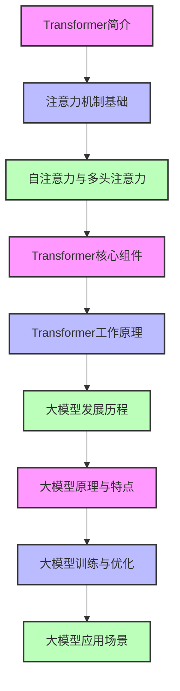

### 学习目标
1. 理解Transformer架构的基本概念和核心组件
2. 掌握注意力机制的工作原理
3. 了解自注意力和多头注意力的实现方式
4. 熟悉Transformer的完整工作流程
5. 掌握大模型的发展历程和原理
6. 了解大模型的训练和优化方法
7. 熟悉大模型的应用场景和未来发展

### 核心知识点
- Transformer架构的基本结构
- 注意力机制的工作原理
- 自注意力和多头注意力
- Transformer的编码器和解码器
- 位置编码
- 大模型的发展历程
- 大模型的规模效应
- 大模型的训练方法
- 大模型的应用场景

### 重点难点
- 注意力机制的理解
- Transformer的工作流程
- 大模型的训练原理
- 大模型的规模效应

### 本章导读

你是否好奇，像ChatGPT、GPT-4这样的大语言模型为什么能够理解和生成如此自然流畅的文本？它们背后的核心技术是什么？答案就是Transformer架构。

2017年，Google发表了一篇名为《Attention Is All You Need》的论文，提出了Transformer架构。这个架构彻底改变了自然语言处理领域，成为了当前所有大语言模型的基础。Transformer架构的核心创新是注意力机制，它让模型能够关注输入文本的不同部分，从而更好地理解上下文关系。

本章将带你了解Transformer架构的基本原理和大模型的工作机制，包括注意力机制、自注意力、多头注意力、Transformer的核心组件和工作流程，以及大模型的发展历程、原理、训练方法和应用场景。通过本章学习，你将能够理解大语言模型背后的核心技术，为后续学习大模型的应用和解决方案设计打下基础。

---

## 7.1 Transformer架构简介

### 7.1.1 什么是Transformer

Transformer是一种基于注意力机制的深度学习模型架构，由Google于2017年在《Attention Is All You Need》论文中提出。它彻底抛弃了传统的循环神经网络（RNN）和卷积神经网络（CNN）的结构，完全基于注意力机制来处理序列数据。

**Transformer的核心优势**：
- **并行计算能力**：能够同时处理序列中的所有元素，大大提高了训练速度
- **长距离依赖建模**：能够有效捕捉序列中的长距离依赖关系
- **强大的表达能力**：能够处理复杂的非线性关系
- **可扩展性**：易于扩展到大规模模型

### 7.1.2 Transformer的应用

Transformer架构一经提出，就迅速在自然语言处理领域取得了巨大成功，成为了当前最主流的模型架构。它的应用包括：

- **机器翻译**：如Google翻译、百度翻译
- **文本生成**：如ChatGPT、GPT-4、文心一言
- **文本分类**：如情感分析、新闻分类
- **问答系统**：如Siri、Alexa、智能客服
- **图像描述**：生成图像的文字描述
- **语音识别**：将语音转换为文本

### 7.1.3 Transformer与传统模型的对比

| 特性 | RNN/LSTM | CNN | Transformer |
|------|----------|-----|-------------|
| 并行计算能力 | 差（序列处理） | 好 | 优秀 |
| 长距离依赖建模 | 差（梯度消失问题） | 中 | 优秀 |
| 模型复杂度 | 中 | 中 | 高 |
| 训练速度 | 慢 | 快 | 快 |
| 可扩展性 | 差 | 中 | 优秀 |
| 适用场景 | 序列数据 | 图像、序列数据 | 序列数据、图像、多模态数据 |

---

## 7.2 注意力机制基础：AI的"聚焦能力"

### 7.2.1 什么是注意力机制：AI的"聚光灯"

注意力机制（Attention Mechanism）是一种让模型能够**关注输入数据中重要部分**的机制，就像是AI的"聚光灯"：
- 当我们阅读文章时，会重点关注关键词和关键句，忽略不重要的内容
- 当我们看图片时，会重点关注主体物体，忽略背景
- 注意力机制正是模拟了这种**人类注意力分配方式**

**注意力机制的核心思想**：
- 计算输入数据中每个元素的**重要性权重**（相当于"聚光灯的亮度"）
- 根据权重对输入数据进行**加权求和**（相当于"聚焦重要信息"）
- 输出加权后的结果，作为模型的输入（相当于"处理聚焦后的信息"）

### 7.2.2 注意力机制的工作原理：AI如何"聚焦"

注意力机制的工作流程可以分为以下几个步骤，就像是"AI在看照片时聚焦重要物体"：

```mermaid
graph TD
    subgraph 输入[输入信息<br>照片内容]
        A[查询 Query<br>我想看什么？] --> A1[我想关注照片中的猫]
        C[键 Keys<br>照片中有什么？] --> C1[猫、狗、树、房子]
        F[值 Values<br>每个物体的详细信息] --> F1[猫的颜色、狗的大小、树的形状、房子的颜色]
    end
    
    subgraph 计算[注意力计算<br>聚焦过程]
        B[计算注意力分数<br>每个物体与"猫"的相关性] --> B1[猫:0.8, 狗:0.1, 树:0.05, 房子:0.05]
        D[Softmax归一化<br>调整权重总和为1] --> D1[猫:0.8, 狗:0.1, 树:0.05, 房子:0.05]
        E[注意力权重<br>最终聚焦权重] --> E1[猫:0.8, 狗:0.1, 树:0.05, 房子:0.05]
        G[加权求和<br>聚焦后的信息] --> G1[主要关注猫的信息，少量关注其他物体]
    end
    
    subgraph 输出[注意力输出<br>聚焦结果]
        H[最终输出<br>处理后的聚焦信息] --> H1[猫的详细信息，附带少量其他物体信息]
    end
    
    A --> B
    C --> B
    B --> D
    D --> E
    F --> G
    E --> G
    G --> H
    
    style 输入 fill:#E8F5E8,stroke:#333,stroke-width:2px
    style 计算 fill:#FFF3E0,stroke:#333,stroke-width:2px
    style 输出 fill:#FFEBEE,stroke:#333,stroke-width:2px
```

**详细步骤**：
1. **计算注意力分数**：计算**查询**（我想看什么）与每个**键**（照片中有什么）之间的相似度，得到注意力分数（相当于"每个物体与我关注目标的相关性"）
2. **归一化注意力分数**：使用Softmax函数将注意力分数归一化，确保权重总和为1（相当于"调整聚光灯亮度，确保总和合适"）
3. **加权求和**：根据注意力权重对**值**（每个物体的详细信息）进行加权求和，得到注意力输出（相当于"聚焦重要物体，忽略次要物体"）

### 7.2.3 注意力机制的直观理解：AI读句子

我们可以用一个简单的例子来理解注意力机制，就像是"AI在读句子时理解上下文"：

**例句**："The cat sat on the mat."（猫坐在垫子上）

当AI读到"sat"（坐）这个词时：
- 它会**自动关注**与"sat"关系最密切的词：
  - "cat"（猫）：谁在坐？
  - "mat"（垫子）：坐在哪里？
- 而**较少关注**关系不大的词：
  - "The"：只是冠词
  - "on"：只是介词

**注意力权重示例**：
| 词 | 注意力权重 | 说明 |
|----|------------|------|
| cat | 0.6 | 最关注的词，因为是主语 |
| mat | 0.3 | 次关注的词，因为是宾语 |
| sat | 0.05 | 自身，权重较低 |
| The | 0.03 | 冠词，权重很低 |
| on | 0.02 | 介词，权重很低 |

这样，AI就能**准确理解**"sat"这个词在句子中的含义，因为它聚焦了最重要的上下文信息！

### 小思考

你认为注意力机制在自然语言处理中最有价值的应用是什么？为什么？

---

## 7.3 自注意力与多头注意力：AI的"上下文理解能力"

### 7.3.1 自注意力（Self-Attention）：AI的"上下文感知器"

#### 通俗解释：AI的"阅读理解助手"

自注意力机制（Self-Attention）是Transformer架构的**核心秘密武器**，它让AI能够像人类一样理解上下文关系：
- 当你读到句子"小明告诉小红，他今天要去公园"时，你会自动知道"他"指的是"小明"
- 当你读到"苹果发布了新款手机"时，你会知道"苹果"指的是公司，而不是水果
- 自注意力机制就是让AI拥有了这种**自动关联上下文**的能力

#### 生动类比：自注意力就像"班级关系图"

我们可以把自注意力比作绘制"班级关系图"：
- **序列中的每个词** = 班级里的每个学生
- **自注意力计算** = 调查每个学生与其他学生的关系强度
- **注意力权重** = 学生之间的"亲密程度"
- **最终输出** = 每个学生的"社交档案"，包含他与所有人的关系

**具体类比**：
```
句子："The cat sat on the mat."（猫坐在垫子上）

想象班级里有5个学生：The、cat、sat、on、mat
- 当调查"sat"（坐）这个学生时：
  - 他和"cat"（猫）关系最亲密（谁在坐？）
  - 他和"mat"（垫子）关系也不错（坐在哪里？）
  - 他和"The"、"on"关系一般（只是冠词和介词）
- 自注意力会把这些关系记录下来，形成每个词的"社交档案"
```

#### 可视化理解：自注意力的工作流程

```mermaid
graph TD
    subgraph 输入[输入句子<br>班级学生]
        A["The"<br>学生A] --> A1[词向量<br>个人特征]
        B["cat"<br>学生B] --> B1[词向量<br>个人特征]
        C["sat"<br>学生C] --> C1[词向量<br>个人特征]
        D["on"<br>学生D] --> D1[词向量<br>个人特征]
        E["mat"<br>学生E] --> E1[词向量<br>个人特征]
    end
    
    subgraph 关系调查[自注意力计算<br>关系强度调查]
        A1 --> F[查询向量<br>我想了解谁?]
        B1 --> F
        C1 --> F
        D1 --> F
        E1 --> F
        
        A1 --> G[键向量<br>我是谁?]
        B1 --> G
        C1 --> G
        D1 --> G
        E1 --> G
        
        A1 --> H[值向量<br>我能提供什么信息?]
        B1 --> H
        C1 --> H
        D1 --> H
        E1 --> H
        
        F --> I[计算关系强度<br>谁和我关系好?]
        G --> I
        I --> J[Softmax归一化<br>关系强度打分]
        J --> K[注意力权重<br>最终关系分数]
        H --> L[加权求和<br>整合好朋友信息]
        K --> L
    end
    
    subgraph 社交档案[自注意力输出<br>带有关系的词向量]
        L --> M["The"的社交档案<br>知道自己是冠词]
        L --> N["cat"的社交档案<br>知道自己是"sat"的主语]
        L --> O["sat"的社交档案<br>知道主语是"cat"，宾语是"mat"]
        L --> P["on"的社交档案<br>知道自己是介词]
        L --> Q["mat"的社交档案<br>知道自己是"sat"的宾语]
    end
    
    style 输入 fill:#E6F3FF,stroke:#333,stroke-width:2px
    style 关系调查 fill:#FFF3E0,stroke:#333,stroke-width:2px
    style 社交档案 fill:#E8F5E8,stroke:#333,stroke-width:2px
    style M fill:#F0F8FF,stroke:#333,stroke-width:1px
    style N fill:#F0F8FF,stroke:#333,stroke-width:1px
    style O fill:#F0F8FF,stroke:#333,stroke-width:1px
    style P fill:#F0F8FF,stroke:#333,stroke-width:1px
    style Q fill:#F0F8FF,stroke:#333,stroke-width:1px
```

#### 核心优势：为什么自注意力如此强大？

| 优势 | 通俗解释 | 实际效果 |
|------|----------|----------|
| **长距离依赖处理** | 无论词之间距离多远，都能建立联系 | AI能理解长句子中代词的指代关系 |
| **并行计算能力** | 可以同时计算所有词之间的关系 | 训练速度比传统RNN快数十倍 |
| **自适应学习** | 自动学习词之间的重要性关系 | AI能自动识别句子中的关键词 |
| **多语言通用性** | 同样的机制适用于所有语言 | 一套架构可以处理数百种语言 |
| **可扩展性** | 可以轻松扩展到更长的序列 | 支持处理数万甚至数百万token的长文本 |

#### 实际案例：自注意力如何帮助AI理解句子

**例句**："虽然今天下雨了，但是他仍然坚持去跑步，因为这是他保持健康的重要方式。"

- 当AI处理"他"这个词时，自注意力会告诉它：
  - 第一个"他"指的是句子的主语（未明确写出，但可以推断）
  - 第二个"他"同样指的是这个主语
- 当AI处理"这"这个词时，自注意力会告诉它：
  - "这"指的是"坚持去跑步"
- 这样，AI就能**完整理解**整个句子的逻辑关系，而不会产生混淆

自注意力机制的发明，让AI真正具备了理解复杂文本的能力，为后续大模型的发展奠定了坚实基础！

### 7.3.2 多头注意力（Multi-Head Attention）：AI的"多维度思考能力"

多头注意力（Multi-Head Attention）是自注意力的**增强版本**，它就像是AI有了"多双眼睛"，可以从**不同角度**观察序列中的关系：
- 第一双眼睛：关注语法关系（主谓宾结构）
- 第二双眼睛：关注语义关系（词义相近的词）
- 第三双眼睛：关注逻辑关系（因果关系）
- 最终，AI将所有观察结果整合起来，得到更全面的理解

我们可以把多头注意力比作一个"多人专家组"：
- 每个注意力头都是一个"专家"
- 每个专家从不同角度分析问题
- 最终，专家组汇总所有意见，做出更准确的判断

**多头注意力的工作原理**：

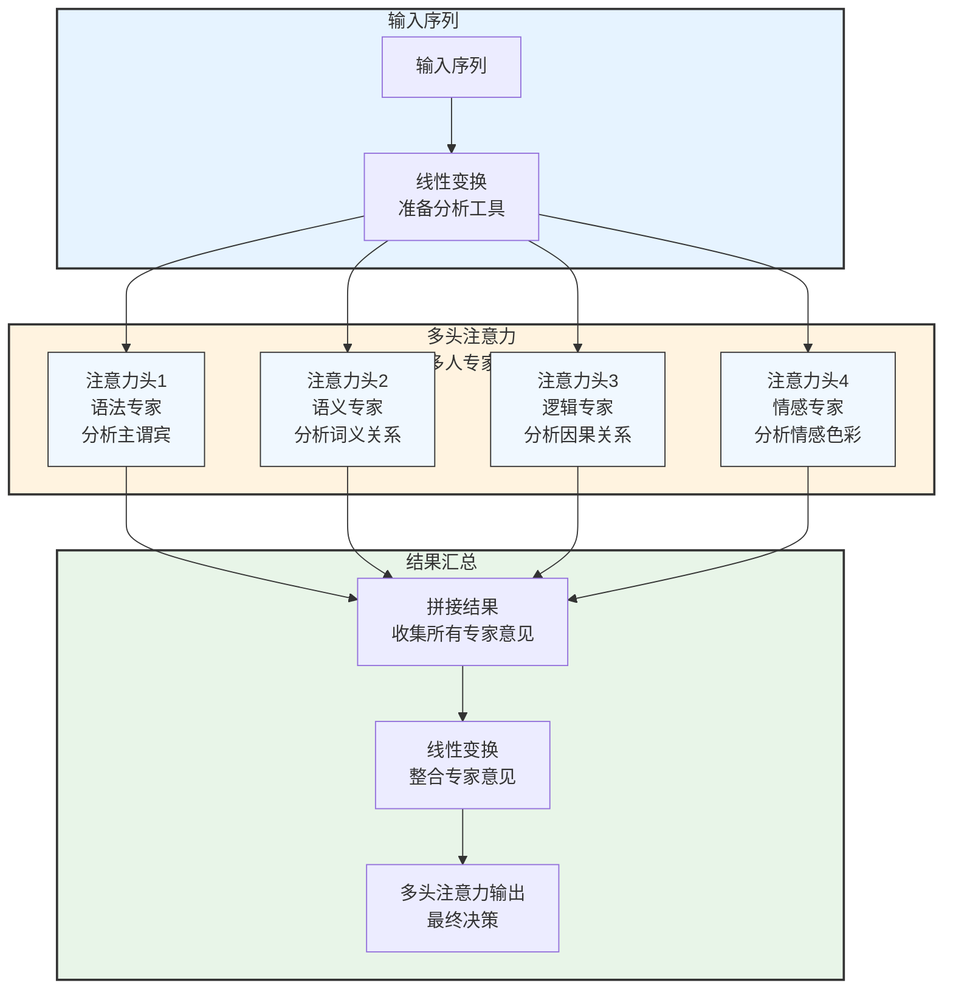

**多头注意力的优势**：
- **多角度理解**：从不同维度捕捉序列中的关系
- **更丰富的特征**：每个注意力头捕捉不同的特征，整合后特征更丰富
- **更高的表达能力**：能够处理更复杂的语言现象

### 7.3.3 自注意力的生动示例：AI理解句子

让我们用一个简单的例子来理解自注意力，就像是"AI在分析一个朋友圈句子"：

**例句**："我今天在公园看到一只可爱的猫，它的毛色是橘色的，它正在追一只蝴蝶。"

当AI分析这个句子时：
1. 当处理"它"这个词时，自注意力会自动找到它指代的是"猫"
2. 当处理"橘色的"这个词时，自注意力会知道它描述的是"猫的毛色"
3. 当处理"蝴蝶"这个词时，自注意力会知道它是"追"的对象

**注意力权重示例**：

| 当前词 | 关注的词 | 注意力权重 | 说明 |
|--------|----------|------------|------|
| 它 | 猫 | 0.8 | 最关注"猫"，因为是指代关系 |
| 它 | 橘色的 | 0.1 | 次关注"橘色的"，因为描述猫的毛色 |
| 它 | 蝴蝶 | 0.05 | 关注"蝴蝶"，因为猫在追蝴蝶 |
| 它 | 其他词 | 0.05 | 其他词关系不大，权重很低 |

这样，AI就能**准确理解**每个词在句子中的含义，因为它掌握了完整的上下文关系！

### 小思考

如果没有自注意力机制，AI会遇到什么问题？请举例说明。

---

## 7.4 Transformer核心组件

### 7.4.1 Transformer整体结构

Transformer架构由编码器（Encoder）和解码器（Decoder）两部分组成，每部分都包含多个相同的层。

**编码器**：
- 由N个相同的编码器层组成（论文中N=6）
- 每个编码器层包含两个子层：多头注意力层和前馈神经网络层
- 每个子层都有一个残差连接和层归一化

**解码器**：
- 由N个相同的解码器层组成（论文中N=6）
- 每个解码器层包含三个子层：掩码多头注意力层、编码-解码注意力层和前馈神经网络层
- 每个子层都有一个残差连接和层归一化

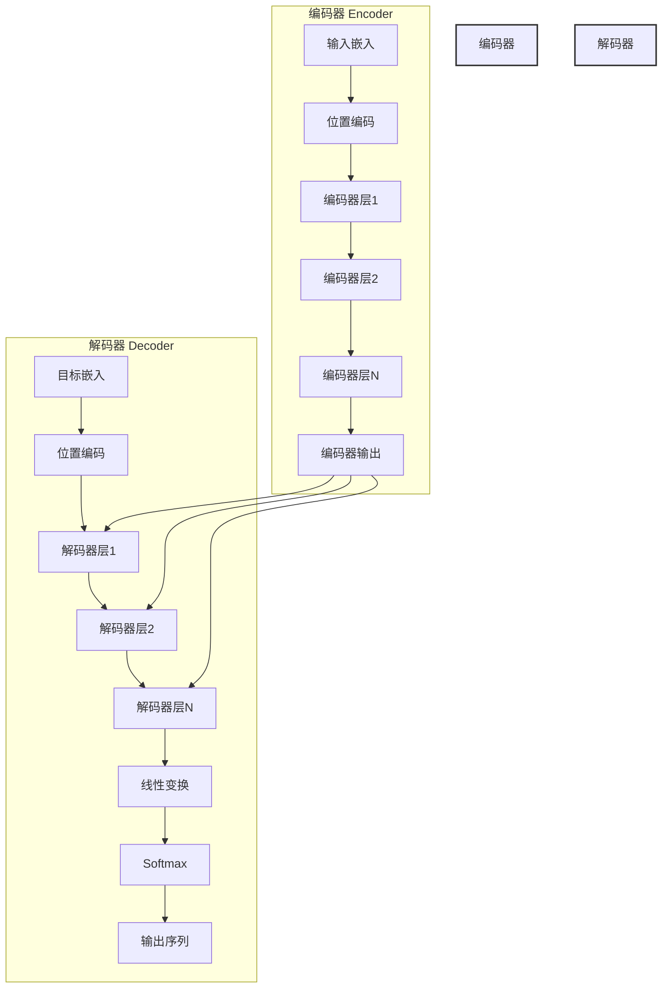

### 7.4.2 编码器层（Encoder Layer）

编码器层是Transformer架构的核心组件之一，它由两个子层组成：

1. **多头注意力层**：处理输入序列的自注意力
2. **前馈神经网络层**：对多头注意力层的输出进行非线性变换

每个子层都包含一个残差连接（Residual Connection）和层归一化（Layer Normalization），这有助于缓解梯度消失问题，加速模型训练。

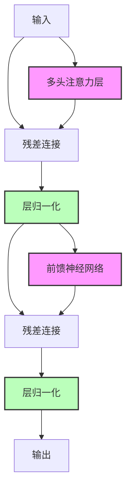

### 7.4.3 解码器层（Decoder Layer）

解码器层也是Transformer架构的核心组件之一，它由三个子层组成：

1. **掩码多头注意力层**：处理目标序列的自注意力，使用掩码防止模型关注未来的位置
2. **编码-解码注意力层**：处理编码器输出与解码器输入之间的注意力
3. **前馈神经网络层**：对编码-解码注意力层的输出进行非线性变换

每个子层同样包含残差连接和层归一化。

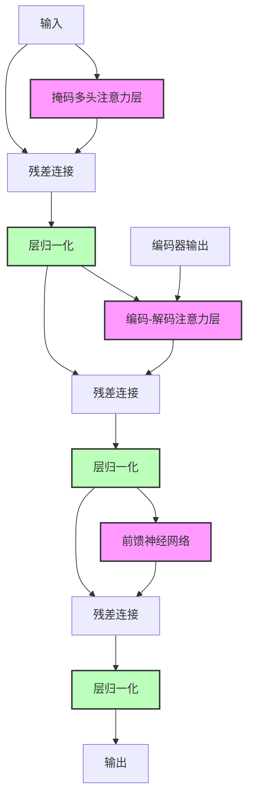

### 7.4.4 位置编码（Position Embedding）：AI的"序列记忆卡"

Transformer架构的一个**致命缺陷**是：它本身**不知道词的顺序**！

想象一下，如果没有位置编码：
- "猫追狗"和"狗追猫"对Transformer来说是完全一样的
- 因为Transformer是并行处理所有词的，没有顺序概念
- 这就像是把一句话的所有词放进一个袋子里摇匀，然后让AI理解句子的意思

为了解决这个问题，Transformer使用**位置编码**，就像是给每个词添加一个"序列记忆卡"：
- 每个位置都有一个唯一的编码，就像是每个词的"座位号"
- 这样AI就能知道每个词在句子中的位置
- 从而理解句子的顺序关系

我们可以把位置编码比作"会议座位牌"：
- 在会议上，每个人都有自己的座位号
- 通过座位号，你可以知道谁坐在哪里
- 即使大家同时发言，你也能知道发言的顺序

**位置编码的工作原理**：

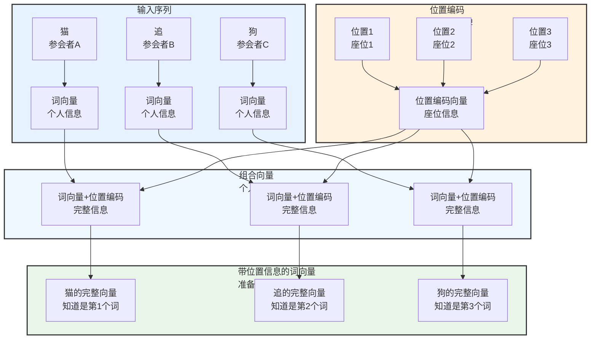

**位置编码的实现方式**：

| 实现方式 | 原理 | 优点 | 缺点 | 形象比喻 |
|----------|------|------|------|----------|
| **正弦位置编码** | 使用正弦和余弦函数生成位置编码 | 计算简单，支持任意长度序列 | 位置信息固定，缺乏灵活性 | 相当于"固定座位号，如1、2、3..." |
| **可学习位置编码** | 通过训练学习位置编码 | 更灵活，能适应不同任务 | 增加模型参数，需要更多数据 | 相当于"动态座位号，根据会议内容调整" |

**位置编码的重要性**：

位置编码是Transformer架构的**关键创新之一**，它解决了并行处理与顺序信息的矛盾：
- 并行处理：提高训练速度
- 顺序信息：保证模型理解能力
- 位置编码：让鱼和熊掌可以兼得

现在，Transformer不仅能并行处理所有词，还能准确理解词的顺序关系，这就是为什么它能成为大模型的基础架构！

---

## 7.5 Transformer工作原理：AI的"翻译工厂"

Transformer的工作原理就像是一个**现代化的翻译工厂**，有专门的"理解部门"（编码器）和"生成部门"（解码器），还有完善的"流程管理"（位置编码、注意力机制等）：

### 7.5.1 完整工作流程：翻译工厂的一天

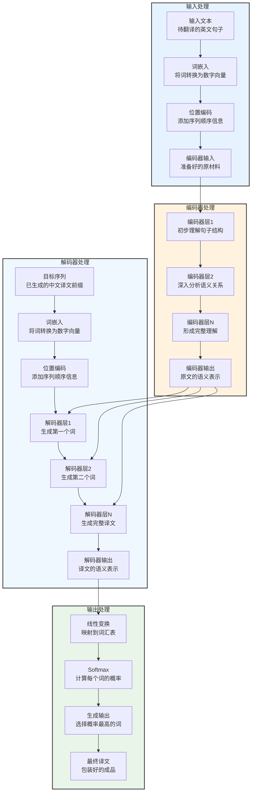

**Transformer的完整工作流程**：

1. **输入处理**：
   - 将输入序列转换为词向量（相当于给每个词分配一个数字ID）
   - 添加位置编码（相当于给每个词添加座位号）
   - 输入到编码器（相当于将原材料送到理解部门）

2. **编码器处理**：
   - 多个编码器层依次处理输入（相当于多个专家依次分析原文）
   - 每个编码器层通过多头注意力层捕捉序列内部的依赖关系（相当于分析句子的语法和语义）
   - 通过前馈神经网络层进行非线性变换（相当于整合分析结果）
   - 输出编码器表示（相当于形成对原文的完整理解）

3. **解码器处理**：
   - 将目标序列转换为词向量（相当于将已生成的译文前缀转换为数字向量）
   - 添加位置编码（相当于给每个词添加座位号）
   - 多个解码器层依次处理输入（相当于多个专家依次生成译文）
   - 每个解码器层通过掩码多头注意力层捕捉目标序列内部的依赖关系（相当于分析已生成译文的结构）
   - 通过编码-解码注意力层捕捉编码器输出与解码器输入之间的依赖关系（相当于参考原文的理解结果）
   - 通过前馈神经网络层进行非线性变换（相当于整合信息生成新的词）
   - 输出解码器表示（相当于生成译文的语义表示）

4. **输出处理**：
   - 通过线性变换将解码器输出映射到词汇表大小（相当于将语义表示转换为词汇表中的词）
   - 使用Softmax函数计算每个词的概率（相当于给每个候选词打分）
   - 选择概率最大的词作为输出（相当于选择得分最高的词）

### 7.5.2 机器翻译示例："I love you" → "我爱你"

让我们用一个具体的例子来理解Transformer的工作流程，就像是"翻译工厂处理一个简单订单"：

**订单**：将英文句子"I love you"翻译成中文

**处理过程**：

1. **输入处理**：
   - 将"I love you"转换为词向量：[I的向量, love的向量, you的向量]
   - 添加位置编码：[I的向量+位置1, love的向量+位置2, you的向量+位置3]
   - 输入到编码器

2. **编码器处理**：
   - 编码器层1：分析"I"、"love"、"you"之间的基本关系
   - 编码器层2：深入理解"I love you"的语义
   - 编码器输出：形成对"I love you"的完整语义表示

3. **解码器处理**：
   - 第一步：输入空序列，生成第一个词
     - 掩码多头注意力：处理空序列
     - 编码-解码注意力：关注编码器输出中的"I"
     - 生成第一个词："我"
   - 第二步：输入"我"，生成第二个词
     - 掩码多头注意力：分析"我"的上下文
     - 编码-解码注意力：关注编码器输出中的"love"
     - 生成第二个词："爱"
   - 第三步：输入"我爱"，生成第三个词
     - 掩码多头注意力：分析"我爱"的上下文
     - 编码-解码注意力：关注编码器输出中的"you"
     - 生成第三个词："你"
   - 第四步：输入"我爱你"，生成结束符
     - 掩码多头注意力：分析"我爱你"的上下文
     - 编码-解码注意力：确认所有内容已翻译
     - 生成结束符：表示翻译完成

4. **输出处理**：
   - 将解码器输出映射到中文词汇表
   - 计算每个词的概率
   - 选择概率最高的词，生成最终译文："我爱你"

### 7.5.3 Transformer的优势：为什么是现代化工厂？

Transformer架构相比传统模型，就像是现代化工厂相比传统手工作坊，具有以下**显著优势**：

| 优势 | 传统模型（手工作坊） | Transformer（现代化工厂） | 形象比喻 |
|------|----------------------|---------------------------|----------|
| **并行计算能力** | 差（顺序处理，只能一个人做） | 优秀（并行处理，多人同时做） | 手工作坊只有一个工人 vs 现代化工厂有多条生产线 |
| **长距离依赖建模** | 差（容易忘记前面的内容） | 优秀（能记住整个句子的信息） | 只能记住最近的几句话 vs 能记住整本书的内容 |
| **强大的表达能力** | 中（只能处理简单任务） | 优秀（能处理复杂任务） | 只能做简单手工 vs 能生产精密产品 |
| **可扩展性** | 差（难以扩大规模） | 优秀（容易扩展到大规模） | 手工作坊难以扩大 vs 现代化工厂可以轻松扩建 |
| **通用性** | 中（只能处理特定任务） | 优秀（适用于多种任务） | 只能做一种产品 vs 能生产多种产品 |

这些优势使得Transformer架构成为当前大模型的**核心基础**，支撑起了ChatGPT、GPT-4等一系列革命性的AI产品。

---

## 7.6 大模型的发展历程：从玩具到超级大脑

大模型的发展就像是一部**AI进化史**，从最初的简单模型（玩具），逐渐发展成为拥有超强能力的超级大脑。让我们一起回顾大模型的成长历程：

### 7.6.1 大模型的定义：什么是"大"模型？

大模型（Large Language Model，LLM）是指**参数量达到数十亿甚至数千亿**的深度学习模型，主要用于自然语言处理任务。

我们可以把大模型比作一个"**超级图书馆**"：
- 参数量：相当于图书馆的藏书量
- 训练数据：相当于图书馆的书籍内容
- 模型性能：相当于图书馆的知识检索和应用能力

**大模型的核心特点**：
| 特点 | 描述 | 比喻 |
|------|------|------|
| 参数量大 | 数十亿甚至数千亿参数 | 图书馆有数十亿册书 |
| 训练数据多 | 海量文本数据 | 涵盖人类所有知识领域 |
| 模型复杂度高 | 多层Transformer架构 | 复杂的知识组织体系 |
| 表达能力强 | 能理解和生成复杂文本 | 能回答各种复杂问题 |

### 7.6.2 大模型的发展阶段：AI的成长之路

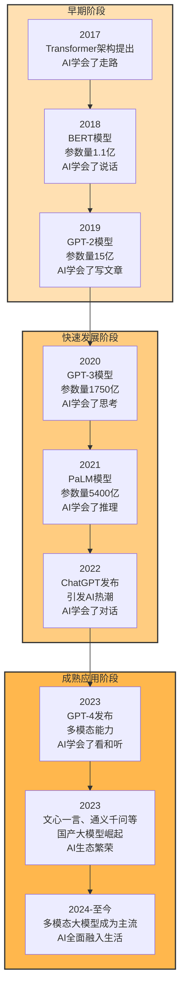

**大模型发展的三个关键阶段**：

1. **婴儿期（2017-2019）：蹒跚学步**
   - 2017年：Transformer架构提出，AI学会了"走路"（掌握了基础架构）
   - 2018年：BERT模型发布，参数量1.1亿，AI学会了"说话"（理解语言）
   - 2019年：GPT-2模型发布，参数量15亿，AI学会了"写文章"（生成文本）
   - **特点**：模型规模较小，能力有限，但奠定了基础

2. **少年期（2020-2022）：茁壮成长**
   - 2020年：GPT-3模型发布，参数量1750亿，AI学会了"思考"（具有推理能力）
   - 2021年：PaLM模型发布，参数量5400亿，AI学会了"复杂推理"（解决数学问题）
   - 2022年：ChatGPT发布，引发全球AI热潮，AI学会了"自然对话"（与人交互）
   - **特点**：模型规模呈指数增长，涌现能力显现，开始进入实用阶段

3. **成年期（2023-至今）：风华正茂**
   - 2023年：GPT-4发布，具备多模态能力，AI学会了"看和听"（理解图像和语音）
   - 2023年：文心一言、通义千问等国产大模型崛起，AI生态繁荣
   - 2024年至今：多模态大模型成为主流，AI全面融入生活
   - **特点**：模型能力全面，应用场景广泛，开始改变人类生活和工作方式

### 7.6.3 大模型的规模效应：越大越聪明？

大模型的一个**神奇现象**是：**模型越大，性能越好**！这就是所谓的"规模效应"（Scaling Law）。

我们可以把规模效应比作"**图书馆藏书越多，知识越丰富**"：
- 当图书馆只有100本书时，只能回答简单问题
- 当图书馆有100万本书时，可以回答中等难度问题
- 当图书馆有10亿本书时，可以回答复杂问题，甚至进行创新

**规模效应的表现**：

| 规模维度 | 效果 | 比喻 |
|----------|------|------|
| 参数量 | 参数量越大，模型表达能力越强 | 图书馆藏书越多，知识越丰富 |
| 训练数据 | 训练数据越多，模型泛化能力越强 | 书籍内容越全面，知识覆盖越广 |
| 计算资源 | 计算资源越充足，模型训练效果越好 | 图书馆管理系统越先进，检索效率越高 |

**规模效应的影响**：
- **推动了大模型的快速发展**：各大公司争相开发更大规模的模型
- **改变了AI的研究方向**：从算法创新转向规模扩展
- **促进了AI技术的普及**：大模型的强大能力让更多人受益
- **引发了AI伦理讨论**：大模型的能力越强，伦理问题越突出

现在，大模型的规模效应已经成为AI领域的共识，各大公司都在不断扩大模型规模，追求更强的AI能力。

---

## 7.7 大模型的原理与特点：AI的"超级大脑"奥秘

大模型的原理和特点就像是**AI超级大脑的奥秘**，让我们一起揭开它的神秘面纱。

### 7.7.1 大模型的核心原理：预测下一个词的魔法

大模型的核心原理其实很简单：**预测下一个词**！

想象一下，你正在玩一个"续写故事"的游戏：
- 给你一个开头："今天天气很好，我决定去"
- 你需要预测下一个词："公园"
- 接着继续："今天天气很好，我决定去公园"
- 再预测下一个词："散步"

大模型就是在玩这样的游戏，但它玩得**超级好**！它通过**大规模参数和海量数据**，学习到了语言的统计规律和语义知识。

**大模型的训练过程**就像是一个"**疯狂阅读者**"：
1. 读遍了互联网上的几乎所有文本（书籍、网页、文章等）
2. 每读完一个词，就尝试预测下一个词
3. 不断纠正自己的错误，调整参数
4. 经过数周甚至数月的训练，终于掌握了语言的奥秘

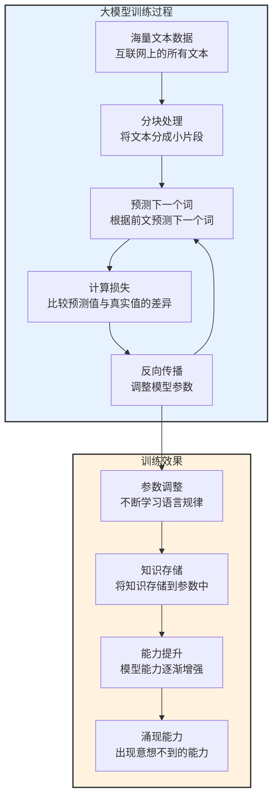

**大模型的训练目标**：
- 预测下一个词：根据前面的文本，预测下一个词是什么
- 理解上下文：理解文本的上下文关系和语义信息
- 生成连贯文本：生成符合语法和语义的连贯文本

### 7.7.2 大模型的特点：超级大脑的特质

大模型具有以下**独特特质**，就像是一个"超级大脑"：

| 特点 | 描述 | 比喻 | 实际表现 |
|------|------|------|----------|
| **参数量大** | 数十亿甚至数千亿的参数量 | 大脑神经元数量多 | 能够存储海量知识 |
| **训练数据多** | 海量的文本数据 | 阅读了大量书籍和文章 | 知识面广，见多识广 |
| **表达能力强** | 能够处理复杂的语言任务 | 能说会道，出口成章 | 能生成高质量的文章和对话 |
| **泛化能力好** | 能够适应不同的任务和领域 | 一专多能，举一反三 | 无需专门训练就能处理新任务 |
| **涌现能力** | 随着模型规模增大，出现意想不到的能力 | 突然开窍，智慧涌现 | 能进行推理、数学计算、代码生成等 |

### 7.7.3 涌现能力：AI的"突然开窍"

涌现能力（Emergent Abilities）是大模型最**神奇**的特点：
- 当模型规模较小时，只有基本的语言理解能力
- 当模型规模达到一定阈值时，**突然出现**了一些在小规模模型中不存在的能力
- 就像是一个孩子，突然在某一天"开窍"了，能够理解复杂的概念

我们可以把涌现能力比作"**拼图游戏**"：
- 当只有几片拼图时，只能看到零散的图案
- 当拼图数量达到一定程度时，**突然**就能看到完整的图像
- 大模型的涌现能力也是如此，当参数和数据达到一定规模时，突然就具备了复杂能力

**常见的涌现能力**：

| 涌现能力 | 描述 | 实际例子 |
|----------|------|----------|
| **推理能力** | 能够进行逻辑推理和数学计算 | 解决数学应用题，如"如果小明有5个苹果，吃了2个，还剩几个？" |
| **知识问答** | 能够回答各种知识问题 | 回答"地球的直径是多少？"，"爱因斯坦的相对论主要内容是什么？" |
| **多轮对话** | 能够进行连贯的多轮对话 | 像人类一样进行长时间的聊天，理解上下文 |
| **代码生成** | 能够生成符合语法的代码 | 根据描述生成Python函数，修复代码bug |
| **创意写作** | 能够生成小说、诗歌等创意文本 | 生成一首关于春天的诗，写一个短篇小说 |
| **跨语言能力** | 能够理解和生成多种语言 | 无需专门训练就能进行语言翻译 |

**涌现能力的原因**：

1. **大规模参数**：能够存储更多的知识和信息，就像是大脑神经元数量足够多时，就能产生意识
2. **海量训练数据**：能够覆盖更多的场景和任务，见多识广，自然就能处理各种问题
3. **复杂的模型结构**：Transformer架构的注意力机制能够捕捉复杂的语义关系，就像是大脑的神经网络能够处理复杂信息
4. **自监督学习**：通过预测下一个词的方式，模型能够自动学习语言的深层结构和规律

**涌现能力的意义**：
- 它改变了我们对AI的认知，AI不再只是简单的工具，而是具备了一定的"智能"
- 它为AI的应用打开了广阔的前景，大模型能够处理以前无法处理的复杂任务
- 它也带来了挑战，我们需要理解和控制大模型的涌现能力，确保其安全可靠地使用

涌现能力是大模型最迷人的特点之一，它让我们看到了AI未来发展的无限可能。

---

## 7.8 大模型的训练与优化：打造超级大脑的工程学

大模型的训练与优化就像是**建造一座超级摩天大楼**：
- 需要大量的资源（资金、材料、人力）
- 需要先进的工程技术（设计、施工、管理）
- 需要解决各种挑战（地质条件、天气、安全）

### 7.8.1 大模型训练的挑战：建造超级摩天大楼的困难

大模型训练面临着**前所未有的挑战**，就像是建造一座1000层的超级摩天大楼：

| 挑战 | 描述 | 建造摩天大楼比喻 | 实际影响 |
|------|------|------------------|----------|
| **计算资源需求大** | 需要大量的GPU/TPU计算资源 | 需要大量的起重机、挖掘机等重型设备 | 训练成本高昂，只有少数公司能够承担 |
| **训练时间长** | 可能需要数周甚至数月的时间 | 建造时间长，需要持续投入 | 研发周期长，难以快速迭代 |
| **数据质量要求高** | 需要高质量的训练数据 | 需要高质量的建筑材料 | 数据质量直接影响模型性能 |
| **模型优化困难** | 需要解决梯度消失、过拟合等问题 | 需要解决建筑结构稳定性问题 | 模型可能无法收敛或性能不佳 |
| **能源消耗大** | 训练过程消耗大量的能源 | 施工过程消耗大量的电力和燃料 | 环境影响大，可持续性问题 |

### 7.8.2 大模型训练方法：建造超级摩天大楼的工程技术

为了应对这些挑战，研究人员开发了多种**先进的训练方法**，就像是建造超级摩天大楼的创新工程技术：

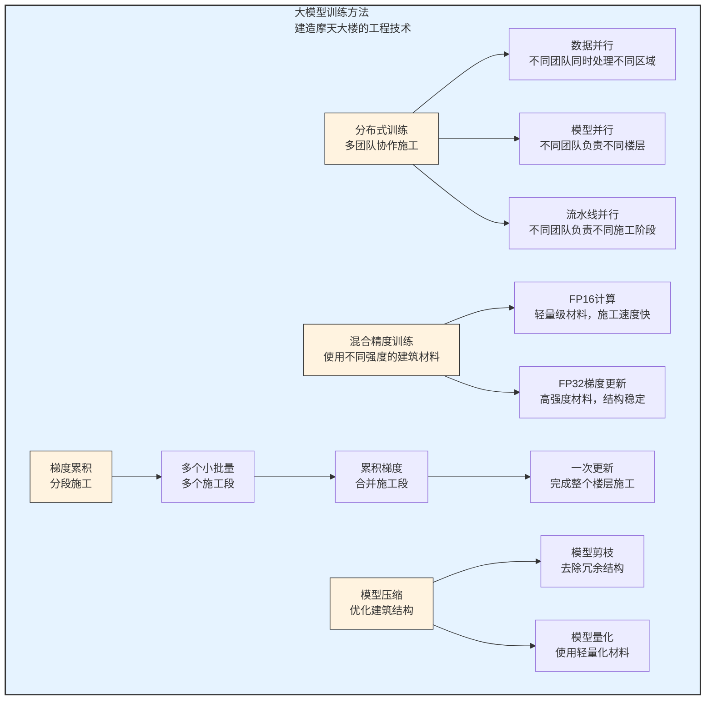

**1. 分布式训练：多团队协作施工**

分布式训练是大模型训练的**核心技术**，它将训练任务分配到多个设备上，就像是多个团队同时建造摩天大楼：

- **数据并行**：将训练数据分配到多个设备上，每个设备训练完整的模型，然后合并梯度
  - 比喻：不同团队同时建造大楼的不同侧面
  - 优点：简单易实现，加速比高
  - 缺点：通信开销大

- **模型并行**：将模型分配到多个设备上，每个设备只负责模型的一部分
  - 比喻：不同团队负责大楼的不同楼层
  - 优点：减少内存占用
  - 缺点：通信开销大，负载不均衡

- **流水线并行**：将模型的不同层分配到不同设备上，形成流水线
  - 比喻：不同团队负责不同的施工阶段（地基、框架、装修）
  - 优点：减少通信开销，提高设备利用率
  - 缺点：存在流水线气泡，影响效率

**2. 混合精度训练：使用不同强度的建筑材料**

混合精度训练使用**半精度浮点数（FP16）**进行计算，**全精度浮点数（FP32）**进行梯度更新：
- 优点：减少内存占用，提高计算速度
- 比喻：使用轻量级材料（FP16）进行施工，使用高强度材料（FP32）进行关键结构固定

**3. 梯度累积：分段施工**

梯度累积将多个小批量的梯度累积起来，再进行一次参数更新：
- 优点：减少内存占用，相当于增大了批量大小
- 比喻：先完成多个小的施工段，然后再统一进行结构加固

**4. 模型压缩：优化建筑结构**

模型压缩技术用于减小模型体积，提高推理速度：
- **模型剪枝**：去除模型中的冗余参数，就像是去除大楼中的冗余结构
- **模型量化**：降低模型参数的精度，就像是使用轻量化材料替代高强度材料

### 7.8.3 大模型优化技术：让超级大脑更高效

除了训练方法外，还有一些**优化技术**可以提高大模型的效率：

| 优化技术 | 描述 | 比喻 | 实际效果 |
|----------|------|------|----------|
| **注意力优化** | 优化注意力机制的计算 | 优化大楼的电梯系统，提高运输效率 | 减少计算量，提高训练速度 |
| **激活函数优化** | 使用更高效的激活函数 | 使用更高效的建筑材料，提高施工速度 | 减少计算量，提高模型性能 |
| **优化器改进** | 使用更高效的优化器 | 使用更智能的施工管理系统 | 加快模型收敛速度 |
| **知识蒸馏** | 将大模型的知识迁移到小模型 | 将摩天大楼的设计经验应用到普通建筑 | 提高小模型的性能，降低部署成本 |

**大模型训练的未来趋势**：

- **更高效的硬件**：如专用AI芯片、量子计算等
- **更智能的训练算法**：如自适应学习率、自动混合精度等
- **更绿色的训练方法**：如低能耗训练、可再生能源等
- **更自动化的训练流程**：如AutoML、自动化调参等

通过这些先进的训练方法和优化技术，大模型的训练成本和时间正在逐渐降低，让更多的组织和个人能够使用和开发大模型。

---

## 7.9 大模型的应用场景：超级助手的多才多艺

大模型就像是一个**无所不能的超级助手**，它可以在各种场景下为人类提供帮助：

### 7.9.1 通用应用场景：超级助手的日常工作

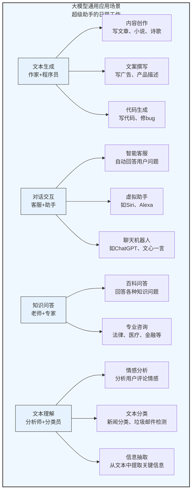

**1. 文本生成：AI作家+程序员**

大模型可以生成各种类型的文本，就像是一个**全能作家+程序员**：

- **内容创作**：生成文章、博客、小说、诗歌等
  - 实际案例：ChatGPT可以根据一个主题生成一篇完整的文章
  - 比喻：就像是一个随叫随到的作家，能写各种风格的作品

- **文案撰写**：生成广告文案、产品描述、营销邮件等
  - 实际案例：电商平台使用大模型自动生成商品描述
  - 比喻：就像是一个专业的营销人员，能写出吸引人的文案

- **代码生成**：生成代码、修复bug、解释代码等
  - 实际案例：GitHub Copilot可以根据注释生成代码
  - 比喻：就像是一个资深程序员，能快速写出高质量代码

**2. 对话交互：AI客服+助手**

大模型可以进行自然的对话交互，就像是一个**贴心的客服+助手**：

- **智能客服**：自动回答用户问题，解决常见问题
  - 实际案例：银行使用大模型处理客户的常见问题
  - 比喻：就像是一个24小时在线的客服，随时为你服务

- **虚拟助手**：帮助用户完成各种任务，如日程安排、提醒等
  - 实际案例：Siri、Alexa等语音助手
  - 比喻：就像是一个私人助理，能帮你处理各种琐事

- **聊天机器人**：进行日常聊天，提供情感支持
  - 实际案例：ChatGPT、文心一言等
  - 比喻：就像是一个永远不会厌烦的聊天伙伴

**3. 知识问答：AI老师+专家**

大模型可以回答各种知识问题，就像是一个**无所不知的老师+专家**：

- **百科问答**：回答各种常识性问题
  - 实际案例：使用ChatGPT查询历史事件、科学知识等
  - 比喻：就像是一本活的百科全书

- **专业咨询**：提供法律、医疗、金融等专业领域的咨询
  - 实际案例：使用大模型获取初步的法律建议
  - 比喻：就像是一个多领域的专家顾问

**4. 文本理解：AI分析师+分类员**

大模型可以理解和分析文本，就像是一个**敏锐的分析师+分类员**：

- **情感分析**：分析文本的情感倾向，如正面、负面、中性
  - 实际案例：企业使用大模型分析用户评论的情感
  - 比喻：就像是一个情感专家，能读懂文字背后的情绪

- **文本分类**：将文本分类到不同的类别
  - 实际案例：使用大模型进行新闻分类、垃圾邮件检测
  - 比喻：就像是一个高效的分类员，能快速整理大量文本

- **信息抽取**：从文本中提取关键信息，如人名、地名、事件等
  - 实际案例：使用大模型从新闻中提取事件信息
  - 比喻：就像是一个信息侦探，能从文本中找出关键线索

### 7.9.2 垂直行业应用：超级助手在各行各业

大模型已经深入到各个垂直行业，为行业带来了革命性的变化：

| 行业 | 应用场景 | 实际案例 | 比喻 |
|------|----------|----------|------|
| **金融行业** | 智能投顾、风险控制、客户服务 | 银行使用大模型进行欺诈检测 | 就像是一个金融顾问，能分析市场趋势，识别风险 |
| **医疗行业** | 医学影像分析、药物研发、健康咨询 | 医生使用大模型辅助诊断疾病 | 就像是一个医学专家，能帮助医生做出更准确的诊断 |
| **教育行业** | 智能辅导、自动批改、课程设计 | 学生使用大模型进行个性化学习 | 就像是一个私人教师，能根据学生的情况制定学习计划 |
| **制造业** | 故障诊断、质量控制、供应链优化 | 工厂使用大模型检测设备故障 | 就像是一个设备维修专家，能提前发现并解决问题 |
| **零售行业** | 个性化推荐、库存管理、客户服务 | 电商平台使用大模型进行商品推荐 | 就像是一个购物顾问，能根据你的喜好推荐商品 |
| **媒体行业** | 内容生成、自动摘要、个性化推送 | 新闻媒体使用大模型生成新闻摘要 | 就像是一个新闻编辑，能快速整理和生成新闻内容 |

### 7.9.3 多模态应用：超级助手的全能表现

大模型的应用已经从单一的文本模态扩展到了**多模态**，包括图像、语音、视频等：

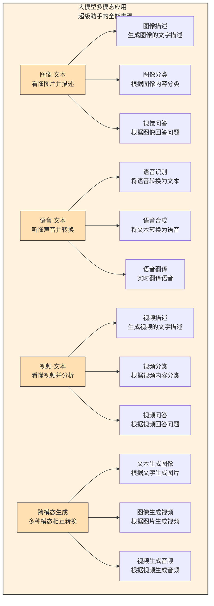

**1. 图像-文本多模态**：AI能看懂图片

- **图像描述**：生成图像的文字描述，如"一只猫坐在沙发上"
- **图像分类**：将图像分类到不同类别，如"猫"、"狗"、"汽车"
- **视觉问答**：根据图像回答问题，如"图片中有几只猫？"

**2. 语音-文本多模态**：AI能听懂声音

- **语音识别**：将语音转换为文本，如会议转录
- **语音合成**：将文本转换为自然流畅的语音，如有声书
- **语音翻译**：实时将一种语言的语音翻译成另一种语言

**3. 视频-文本多模态**：AI能看懂视频

- **视频描述**：生成视频的文字描述
- **视频分类**：将视频分类到不同类别，如"新闻"、"娱乐"、"教育"
- **视频问答**：根据视频回答问题，如"视频中的人物在做什么？"

**4. 跨模态生成**：AI能在不同模态间转换

- **文本生成图像**：根据文字描述生成图片，如Midjourney、DALL-E
- **图像生成视频**：根据图片生成短视频
- **视频生成音频**：根据视频生成配音或背景音乐

大模型的多模态能力让它能够**更全面地理解和生成内容**，就像是一个拥有视觉、听觉和语言能力的全能助手。

**大模型应用的未来趋势**：

- 更深入的行业应用：大模型将在更多垂直行业发挥作用
- 更自然的人机交互：通过语音、图像、视频等多种方式与AI交互
- 更个性化的服务：大模型将根据用户的需求提供个性化的帮助
- 更强大的多模态能力：AI将能够同时处理多种模态的信息

大模型的应用场景正在不断扩展，它正在改变我们的生活和工作方式，让我们的生活更加便捷和高效。

---

## 本章总结

### 知识回顾

1. **Transformer架构简介**：
   - Transformer是一种基于注意力机制的深度学习模型架构
   - 由编码器和解码器两部分组成
   - 具有并行计算能力强、长距离依赖建模能力好等优势

2. **注意力机制基础**：
   - 注意力机制让模型能够关注输入数据中重要的部分
   - 工作流程包括计算注意力分数、归一化注意力分数、加权求和
   - 模拟了人类在处理信息时的注意力分配方式

3. **自注意力与多头注意力**：
   - 自注意力让序列中的每个元素都能关注到序列中的其他元素
   - 多头注意力通过多个注意力头并行计算自注意力，提高模型的表达能力
   - 能够捕捉序列中的长距离依赖关系

4. **Transformer核心组件**：
   - 编码器：由多个编码器层组成，每个编码器层包含多头注意力层和前馈神经网络层
   - 解码器：由多个解码器层组成，每个解码器层包含掩码多头注意力层、编码-解码注意力层和前馈神经网络层
   - 位置编码：为每个位置添加位置信息，使模型能够捕捉序列的顺序关系

5. **Transformer工作原理**：
   - 输入处理：将输入序列转换为词向量，添加位置编码
   - 编码器处理：通过多个编码器层处理输入，捕捉序列内部的依赖关系
   - 解码器处理：通过多个解码器层处理输入，捕捉目标序列内部的依赖关系和编码器输出与解码器输入之间的依赖关系
   - 输出处理：通过线性变换和Softmax函数生成最终输出

6. **大模型的发展历程**：
   - 从早期的BERT、GPT-2到现在的GPT-4、文心一言
   - 参数量从数亿到数千亿
   - 训练数据从数百万到数千亿

7. **大模型的原理与特点**：
   - 基于Transformer架构，通过大规模参数和数据训练
   - 具有参数量大、训练数据多、表达能力强、泛化能力好等特点
   - 随着模型规模的增大，出现涌现能力

8. **大模型的训练与优化**：
   - 面临计算资源需求大、训练时间长等挑战
   - 采用分布式训练、混合精度训练、梯度累积等方法
   - 使用注意力优化、激活函数优化、优化器改进等技术

9. **大模型的应用场景**：
   - 通用应用：文本生成、对话交互、知识问答、文本理解
   - 垂直行业应用：金融、医疗、教育、制造业
   - 多模态应用：图像-文本、语音-文本、视频-文本

### 知识体系梳理

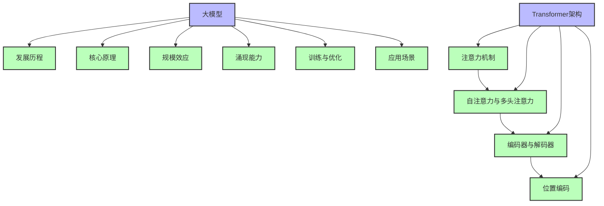

### 实践应用场景

**场景1：企业大模型应用规划**

假设你是一家企业的AI负责人，需要规划大模型在企业中的应用。通过本章学习，你可以：

1. 了解大模型的基本原理和特点
2. 分析企业的业务需求和应用场景
3. 选择合适的大模型（开源模型或商用模型）
4. 制定大模型的部署和应用方案
5. 评估大模型的效果和 ROI
6. 持续优化和迭代大模型应用

**场景2：大模型解决方案设计**

假设你是一名AI解决方案专家，需要为客户设计一个大模型解决方案。通过本章学习，你可以：

1. 分析客户的业务需求和痛点
2. 选择合适的大模型架构和技术栈
3. 设计解决方案的架构和流程
4. 制定数据收集和准备方案
5. 设计模型训练和优化方案
6. 制定模型部署和监控方案
7. 评估解决方案的可行性和效果

### 下一步学习建议

1. 深入学习大模型关键技术栈（第8章）
2. 掌握AI系统架构与部署（第9章）
3. 了解AI安全与合规（第10章）
4. 学习AI解决方案模式库（第11章）
5. 尝试使用开源大模型进行微调或部署
6. 关注大模型的最新研究进展和技术趋势

通过本章的学习，你已经对Transformer架构和大模型原理有了基本的了解。Transformer架构是当前大模型的核心，它的注意力机制让模型能够更好地理解上下文关系，从而生成更自然流畅的文本。大模型的涌现能力和广泛应用前景，正在改变我们的生活和工作方式。接下来，我们将深入学习大模型关键技术栈，包括大模型的微调、部署、监控等方面的知识。

---

**小练习答案参考**

- **思考1**：注意力机制在自然语言处理中最有价值的应用是文本生成和机器翻译，因为这些任务需要模型能够理解上下文关系，生成连贯的文本。注意力机制能够让模型关注输入文本中的重要部分，从而生成更准确、更自然的输出。

---