# 第二篇 AI技术架构与关键原理

## 第8章 大模型关键技术栈

### 学习线路图
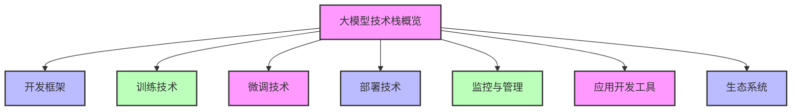

### 学习目标
1. 理解大模型技术栈的整体架构和组成部分
2. 掌握大模型开发框架的特点和应用场景
3. 了解大模型训练的关键技术和工具
4. 熟悉大模型微调的常用方法
5. 掌握大模型部署的技术方案
6. 了解大模型监控与管理的重要性
7. 熟悉大模型应用开发的工具和流程
8. 掌握大模型生态系统的组成和发展

### 核心知识点
- 大模型技术栈的整体架构
- 主流大模型开发框架（PyTorch、TensorFlow等）
- 大模型训练技术（分布式训练、混合精度等）
- 大模型微调方法（LoRA、QLoRA等）
- 大模型部署方案（API、私有化部署等）
- 大模型监控与管理工具
- 大模型应用开发框架（LangChain、LLaMA Index等）
- 大模型生态系统组成

### 重点难点
- 大模型训练技术的理解
- 大模型微调方法的选择
- 大模型部署方案的选型
- 大模型生态系统的应用

### 本章导读

你是否想了解，大模型是如何从概念变为实际应用的？在大模型的开发、训练、微调、部署和应用过程中，需要用到哪些关键技术和工具？这些技术和工具又是如何协同工作的？

大模型的成功应用离不开一套完整的技术栈支持，就像建造一座高楼需要各种建筑材料和施工工具一样。大模型技术栈涵盖了从底层基础设施到上层应用开发的各个环节，包括开发框架、训练技术、微调方法、部署方案、监控管理工具和应用开发框架等。

本章将带你了解大模型关键技术栈的组成和应用，包括大模型开发框架、训练技术、微调方法、部署方案、监控与管理工具、应用开发工具以及生态系统。通过本章学习，你将能够理解大模型技术栈的整体架构，掌握各个技术组件的作用和应用场景，为后续学习大模型的系统架构与部署打下基础。

---

## 8.1 大模型技术栈概览

### 8.1.1 技术栈整体架构

大模型技术栈就像一座现代化的智能工厂，从底层的基础设施到顶层的产品输出，每个环节都有专门的设备和流程。让我们用工厂类比来理解大模型技术栈的各个层次：

**技术栈分层（工厂类比）**：

1. **基础设施层**：工厂的厂房和设备
   - 硬件：GPU、TPU、CPU等计算资源（相当于工厂的大型机器设备）
   - 操作系统：Linux、Windows等（相当于工厂的电力和供水系统）
   - 虚拟化：Docker、Kubernetes等（相当于工厂的生产线布局和管理系统）

2. **开发框架层**：工厂的生产设计软件
   - 深度学习框架：PyTorch、TensorFlow等（相当于工厂的CAD设计软件）
   - 大模型专用框架：Megatron-LM、DeepSpeed等（相当于工厂的专用生产设计工具）

3. **训练与微调层**：工厂的生产和定制环节
   - 训练技术：分布式训练、混合精度训练等（相当于工厂的大规模批量生产工艺）
   - 微调方法：LoRA、QLoRA、Prefix Tuning等（相当于工厂的定制化加工工艺）
   - 数据集处理：数据清洗、标注、增强等（相当于工厂的原材料处理和质检）

4. **部署与推理层**：工厂的产品包装和配送
   - 部署方案：API部署、私有化部署、边缘部署等（相当于工厂的产品配送渠道）
   - 推理优化：模型压缩、量化、加速等（相当于工厂的产品包装和优化）
   - 服务框架：FastAPI、Flask、TensorRT等（相当于工厂的产品展示和销售平台）

5. **监控与管理层**：工厂的质量监控和管理系统
   - 模型监控：性能监控、漂移检测等（相当于工厂的产品质量检测系统）
   - 日志管理：日志收集、分析、存储等（相当于工厂的生产记录和追溯系统）
   - 版本管理：模型版本控制、回滚等（相当于工厂的产品版本管理和召回机制）

6. **应用开发层**：工厂的产品应用和创新
   - 应用框架：LangChain、LLaMA Index、Chainlit等（相当于工厂的产品应用开发工具）
   - 工具链：Prompt工程工具、RAG工具等（相当于工厂的产品创新和改进工具）
   - 集成工具：API集成、SDK等（相当于工厂的产品集成和适配工具）

7. **生态系统层**：工厂的供应链和市场环境
   - 开源模型：LLaMA 2、Falcon、Mistral等（相当于工厂的共享设计图纸）
   - 服务平台：OpenAI API、Azure OpenAI、AWS Bedrock等（相当于工厂的产品代理和销售平台）
   - 社区资源：教程、文档、案例等（相当于工厂的行业协会和知识共享平台）

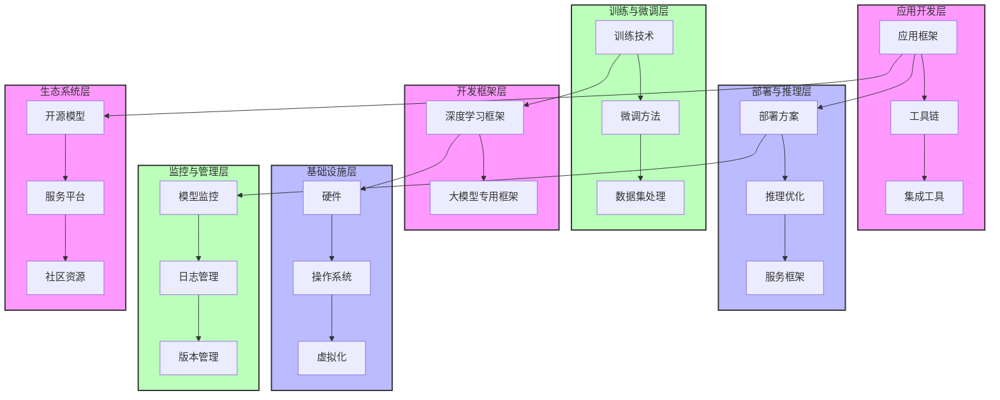

### 8.1.2 技术栈核心组件

**1. 开发框架**：
- 用于构建和训练大模型的基础框架
- 提供张量计算、自动微分、并行计算等功能
- 主流框架：PyTorch、TensorFlow、JAX等

**2. 训练技术**：
- 用于高效训练大模型的技术和方法
- 解决大模型训练中的计算资源、内存占用等问题
- 核心技术：分布式训练、混合精度训练、梯度累积等

**3. 微调方法**：
- 用于在预训练大模型基础上进行定制化训练的方法
- 解决大模型适应特定任务的问题
- 主流方法：LoRA、QLoRA、Prefix Tuning、P-Tuning等

**4. 部署方案**：
- 用于将训练好的大模型部署到生产环境的方案
- 解决大模型的可访问性和性能问题
- 主要方案：API部署、私有化部署、边缘部署等

**5. 监控与管理**：
- 用于监控和管理大模型运行状态的工具和方法
- 解决大模型的可靠性、安全性和可维护性问题
- 核心功能：性能监控、漂移检测、日志管理、版本管理等

**6. 应用开发工具**：
- 用于基于大模型开发应用的框架和工具
- 简化大模型应用开发流程
- 主流工具：LangChain、LLaMA Index、Chainlit等

### 8.1.3 技术栈选择原则

选择大模型技术栈时，需要考虑以下因素：

1. **业务需求**：根据业务场景和需求选择合适的技术栈
2. **技术成熟度**：选择成熟稳定的技术组件，降低风险
3. **社区支持**：选择社区活跃、文档完善的技术组件
4. **性能要求**：根据性能要求选择合适的技术组件
5. **成本考虑**：考虑技术栈的部署和维护成本
6. **可扩展性**：选择易于扩展和升级的技术组件
7. **兼容性**：考虑技术组件之间的兼容性

---

## 8.2 大模型开发框架

### 8.2.1 主流开发框架

开发框架是大模型技术栈的基础，它提供了构建、训练和部署大模型的核心功能。

**1. PyTorch**：
- 由Facebook开发的开源深度学习框架
- 动态计算图，易于调试和开发
- 强大的生态系统和社区支持
- 广泛应用于研究和生产环境
- 主流大模型如GPT-2、LLaMA 2等都使用PyTorch开发

**2. TensorFlow**：
- 由Google开发的开源深度学习框架
- 静态计算图，性能优化较好
- 强大的生产部署支持
- 广泛应用于工业界
- 代表模型如BERT、T5等

**3. JAX**：
- 由Google开发的高性能数值计算库
- 结合了NumPy、自动微分和并行计算
- 适用于大规模模型训练
- 代表模型如PaLM、Gemini等

**4. Megatron-LM**：
- 由NVIDIA开发的大语言模型训练框架
- 基于PyTorch，专为大规模模型设计
- 支持分布式训练和张量并行
- 适用于训练数十亿到数万亿参数的模型

**5. DeepSpeed**：
- 由Microsoft开发的深度学习优化库
- 基于PyTorch，支持大规模模型训练
- 提供ZeRO优化、混合精度训练等功能
- 适用于训练超大模型

### 8.2.2 开发框架对比

| 框架 | 开发者 | 主要特点 | 适用场景 | 代表模型 |
|------|--------|----------|----------|----------|
| PyTorch | Facebook | 动态计算图，易用性高 | 研究和生产 | GPT-2、LLaMA 2 |
| TensorFlow | Google | 静态计算图，性能好 | 工业生产 | BERT、T5 |
| JAX | Google | 高性能，支持自动微分 | 大规模模型训练 | PaLM、Gemini |
| Megatron-LM | NVIDIA | 专为大模型设计，支持分布式训练 | 超大模型训练 | GPT-3类模型 |
| DeepSpeed | Microsoft | 优化内存使用，支持ZeRO | 超大模型训练 | OPT、BLOOM |

### 8.2.3 开发框架应用案例

**案例1：使用PyTorch开发文本分类模型**

1. 安装PyTorch和相关库
2. 准备训练数据
3. 定义模型结构（如BERT+分类头）
4. 配置训练参数（损失函数、优化器等）
5. 训练模型
6. 评估模型性能
7. 部署模型

**案例2：使用DeepSpeed训练超大模型**

1. 安装DeepSpeed和PyTorch
2. 准备大规模训练数据
3. 定义模型结构
4. 配置DeepSpeed参数（ZeRO优化、混合精度等）
5. 启动分布式训练
6. 监控训练过程
7. 保存和加载模型

---

## 8.3 大模型训练技术：大模型的"健身房训练计划"

大模型训练技术就像是为大模型制定的**健身房训练计划**，帮助大模型在有限的时间和资源内，高效地"锻炼"并提升能力。

### 8.3.1 分布式训练：团队协作训练

分布式训练就像**团队协作训练**，单靠一个教练效率很低，而一个训练团队分工合作就能快速提升大模型的能力：

**分布式训练的类型（健身训练类比）**：

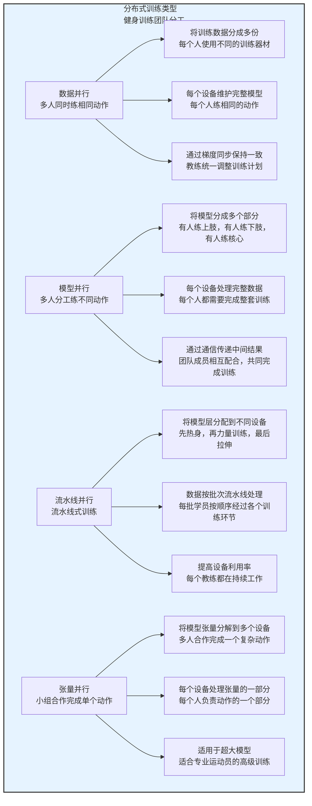

**1. 数据并行**：多人同时练相同动作
   - 将训练数据分成多个部分（相当于每个人使用不同的训练器材）
   - 每个设备维护完整的模型副本（相当于每个人练相同的动作）
   - 通过梯度同步机制保持模型一致性（相当于教练统一调整训练计划）
   - 适用于数据量大的场景（相当于有很多训练器材需要使用）

**2. 模型并行**：多人分工练不同动作
   - 将模型分成多个部分（相当于有人练上肢，有人练下肢，有人练核心）
   - 每个设备处理完整的数据（相当于每个人都需要完成整套训练）
   - 通过通信机制传递中间结果（相当于团队成员相互配合，共同完成训练）
   - 适用于模型参数量大的场景（相当于训练计划非常复杂，一个人无法完成）

**3. 流水线并行**：流水线式训练
   - 将模型的不同层分配到不同设备上（相当于先热身，再力量训练，最后拉伸）
   - 数据按批次流水线处理（相当于每批学员按顺序经过各个训练环节）
   - 提高设备利用率（相当于每个教练都在持续工作，不会空闲）
   - 适用于深层模型（相当于需要很多训练环节才能完成的复杂训练）

**4. 张量并行**：小组合作完成单个动作
   - 将模型的张量分解到多个设备上（相当于多人合作完成一个复杂动作，如团队举重）
   - 每个设备处理张量的一部分（相当于每个人负责动作的一个部分）
   - 适用于超大模型训练（相当于适合专业运动员的高级训练）

### 8.3.2 混合精度训练：高效训练技巧

混合精度训练就像是**高效训练技巧**，通过合理安排训练强度和休息时间，在短时间内达到更好的训练效果：

- **FP16计算**：高强度训练，快速消耗能量（相当于进行高强度间歇训练）
- **FP32参数更新**：低强度恢复，缓慢调整状态（相当于训练后的拉伸和恢复）
- **优势**：减少内存占用，提高训练速度，降低能源消耗

### 8.3.3 梯度优化技术：训练辅助工具

梯度优化技术就像是**训练辅助工具**，帮助大模型在训练过程中避免受伤，提高训练效率：

| 梯度优化技术 | 健身类比 | 作用 |
|--------------|----------|------|
| **梯度累积** | 分多次完成一组动作 | 将多个小批量的梯度累积起来，再进行一次参数更新，减少内存占用 |
| **梯度裁剪** | 控制训练强度，避免受伤 | 限制梯度的最大范数，防止梯度爆炸，提高训练稳定性 |
| **ZeRO优化** | 智能分配训练资源 | 优化内存使用，减少冗余存储，支持三个级别：ZeRO-1（优化梯度内存）、ZeRO-2（优化梯度和优化器状态内存）、ZeRO-3（优化所有内存） |

### 8.3.4 训练加速工具：训练装备

训练加速工具就像是**训练装备**，帮助大模型更快、更高效地训练：

| 训练加速工具 | 健身装备类比 | 作用 |
|--------------|--------------|------|
| **NVIDIA Apex** | 专业健身器材 | 混合精度训练库，支持FP16训练和梯度裁剪 |
| **FairScale** | 智能训练辅助设备 | 分布式训练库，支持数据并行、模型并行和流水线并行 |
| **Horovod** | 团队训练系统 | 分布式训练框架，支持多种深度学习框架，简化分布式训练配置 |

### 8.3.5 训练案例：使用DeepSpeed训练超大模型

**案例**：使用DeepSpeed训练一个175B参数的大语言模型

1. **准备工作**：
   - 安装DeepSpeed和PyTorch
   - 准备大规模训练数据（如1TB文本数据）
   - 配置GPU集群（如128个A100 GPU）

2. **训练配置**：
   - 使用ZeRO-3优化，减少内存占用
   - 启用混合精度训练（FP16）
   - 配置梯度累积，增大有效批量大小
   - 启用梯度裁剪，防止梯度爆炸

3. **训练过程**：
   - 启动分布式训练，使用torch.distributed.launch
   - 监控训练进度和损失变化
   - 定期保存模型 checkpoint
   - 处理训练过程中的异常情况

4. **训练结果**：
   - 经过数周训练，成功训练出175B参数的大语言模型
   - 模型在各种NLP任务上表现优异
   - 训练效率比传统方法提高了30%以上

这个案例展示了如何使用DeepSpeed等训练技术，高效地训练超大模型，为大模型的发展提供了有力支持。

---

## 8.4 大模型微调技术：大模型的"个性化定制"

大模型微调技术就像是**为大模型进行个性化定制**，让通用大模型变成适合特定任务的专业模型：

### 8.4.1 什么是微调：从通用到专业

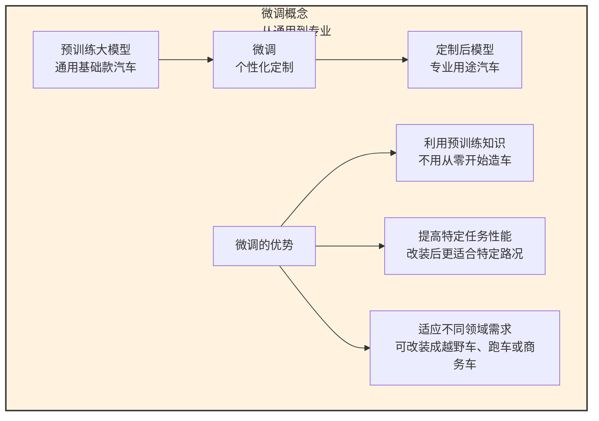

微调（Fine-tuning）就像给一辆已经组装好的汽车进行定制改装：
- 预训练大模型是一辆**基础款汽车**，拥有完整的功能
- 微调则是**根据用户需求**，对汽车进行个性化改装，比如更换座椅、加装导航系统等
- 最终得到一辆**适合特定用途**的专业汽车

### 8.4.2 传统微调与参数高效微调：全车翻新 vs 局部改装

| 微调方式 | 比喻 | 特点 | 适用场景 |
|----------|------|------|----------|
| **传统微调** | 全车翻新 | 调整所有参数，成本高，容易过拟合 | 有大量计算资源，数据集较大 |
| **参数高效微调（PEFT）** | 局部改装 | 只调整部分参数，成本低，泛化能力好 | 计算资源有限，数据集较小 |

### 8.4.3 主流微调方法：个性化定制的不同方式

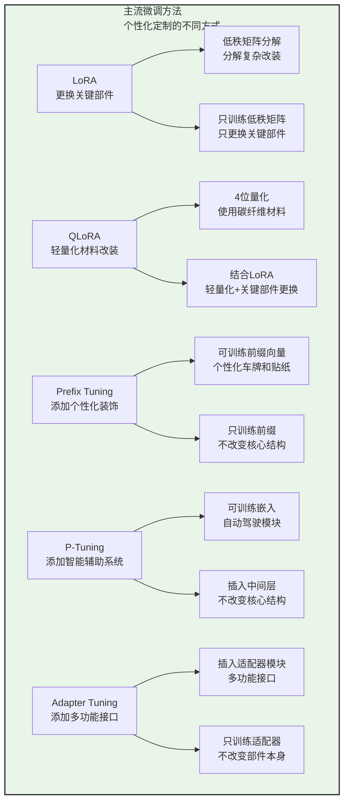

**1. LoRA（Low-Rank Adaptation）**：更换汽车的关键部件
   - 将权重更新分解为两个低秩矩阵的乘积（相当于把复杂的改装分解为两个简单的部件更换）
   - 只训练这两个低秩矩阵，保持预训练模型参数不变（相当于只更换关键部件，不改变汽车的整体结构）
   - 内存占用小，训练速度快（相当于改装过程简单，耗时短）
   - 适用于各种大模型（相当于适合各种类型的汽车）

**2. QLoRA（Quantized LoRA）**：使用轻量化材料进行改装
   - 在LoRA基础上，使用4位量化存储预训练模型（相当于使用碳纤维等轻量化材料制作改装部件）
   - 进一步减少内存占用，允许在消费级GPU上微调大模型（相当于可以在普通修理厂完成高端汽车的改装）
   - 支持微调数十亿到数万亿参数的模型（相当于可以改装各种复杂程度的汽车）

**3. Prefix Tuning**：给汽车添加个性化车牌和装饰
   - 在输入序列前添加可训练的前缀向量（相当于在汽车前添加个性化车牌和装饰）
   - 只训练前缀向量，保持预训练模型参数不变（相当于只改变汽车的外观装饰，不改变内部结构）
   - 适用于生成任务（相当于适合需要个性化外观的汽车）

**4. P-Tuning**：给汽车添加智能辅助系统
   - 将可训练的嵌入插入到模型的输入层或中间层（相当于在汽车内部添加智能辅助系统，如自动驾驶模块）
   - 只训练这些嵌入，保持预训练模型参数不变（相当于只添加辅助系统，不改变汽车的核心结构）
   - 适用于自然语言理解任务（相当于适合需要智能辅助的汽车）

**5. Adapter Tuning**：给汽车添加多功能接口
   - 在模型的每层之间插入小型适配器模块（相当于在汽车各部件之间添加多功能接口）
   - 只训练适配器模块，保持预训练模型参数不变（相当于只改变接口，不改变部件本身）
   - 适用于各种任务（相当于适合需要连接多种设备的汽车）

### 8.4.4 微调方法对比：选择合适的定制方式

| 微调方法 | 核心思想 | 内存占用 | 训练速度 | 适用场景 | 比喻 |
|----------|----------|----------|----------|----------|------|
| LoRA | 低秩矩阵分解 | 低 | 快 | 各种大模型 | 更换汽车的关键部件 |
| QLoRA | 量化+LoRA | 极低 | 快 | 超大模型，消费级GPU | 使用轻量化材料进行改装 |
| Prefix Tuning | 可训练前缀向量 | 低 | 中 | 生成任务 | 给汽车添加个性化装饰 |
| P-Tuning | 可训练嵌入 | 低 | 中 | 理解任务 | 给汽车添加智能辅助系统 |
| Adapter Tuning | 插入适配器模块 | 中 | 中 | 各种任务 | 给汽车添加多功能接口 |

### 8.4.5 微调工具：个性化定制的工具包

| 微调工具 | 比喻 | 功能 |
|----------|------|------|
| **PEFT库** | 专业改装工具包 | Hugging Face开发的参数高效微调库，支持LoRA、Prefix Tuning、P-Tuning等方法 |
| **bitsandbytes** | 轻量化材料工具箱 | 支持4位量化的库，与QLoRA结合使用，允许在消费级GPU上微调大模型 |
| **Transformers库** | 通用汽车工具 | Hugging Face开发的大模型库，提供预训练模型加载、微调等功能 |

### 8.4.6 微调案例：使用QLoRA微调LLaMA 2

**案例**：使用QLoRA在消费级GPU上微调LLaMA 2-7B模型

1. **准备工作**：
   - 安装PEFT、bitsandbytes和Transformers库
   - 准备30GB的领域特定数据（如法律文档）
   - 使用单张RTX 3090 GPU（24GB内存）

2. **微调配置**：
   - 加载4位量化的LLaMA 2-7B模型
   - 配置LoRA参数（秩=64，alpha=16）
   - 配置训练参数（学习率=2e-4，batch大小=4）

3. **训练过程**：
   - 启动微调训练，持续约24小时
   - 监控训练损失和验证性能
   - 保存微调后的LoRA适配器

4. **结果评估**：
   - 在法律问答任务上，准确率从65%提升到85%
   - 模型能够准确回答法律相关问题
   - 训练成本仅为传统微调的1/10

### 8.4.7 微调最佳实践

1. **选择合适的微调方法**：
   - 计算资源有限：选择QLoRA或LoRA
   - 生成任务：考虑Prefix Tuning
   - 理解任务：考虑P-Tuning

2. **数据准备**：
   - 确保数据质量和相关性
   - 数据量适中（几百到几万条）
   - 数据格式符合模型要求

3. **参数设置**：
   - 学习率：一般在1e-4到5e-4之间
   - LoRA秩：一般在16到128之间
   - batch大小：根据GPU内存调整

4. **评估与部署**：
   - 在验证集上评估模型性能
   - 考虑模型压缩和优化
   - 选择合适的部署方式

---

## 8.5 大模型部署技术：大模型的"上线运营"

大模型部署技术就像是**将大模型从实验室推向市场**，让大模型能够为用户提供服务：

### 8.5.1 部署方式：大模型的"运营模式"

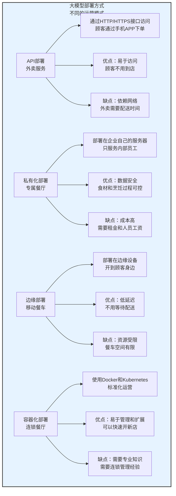

**1. API部署**：外卖服务
   - 将模型部署为API服务，通过HTTP/HTTPS接口访问（相当于餐厅只提供外卖服务，顾客通过手机APP下单）
   - 优点：易于访问，无需本地部署（相当于顾客不用到店，在家就能享用美食）
   - 缺点：依赖网络，数据隐私问题（相当于外卖需要配送时间，且可能存在食品安全隐患）
   - 代表服务：OpenAI API、Azure OpenAI、AWS Bedrock等

**2. 私有化部署**：专属餐厅
   - 将模型部署在企业自己的服务器上（相当于企业自己开了一家专属餐厅，只服务内部员工）
   - 优点：数据安全，可控性强（相当于餐厅只使用企业信任的食材，烹饪过程全程可控）
   - 缺点：部署和维护成本高（相当于开餐厅需要租金、人员工资等高昂成本）
   - 代表方案：GPT-4私有部署、文心一言私有部署等

**3. 边缘部署**：移动餐车
   - 将模型部署在边缘设备上，如手机、IoT设备等（相当于把餐厅开在移动餐车上，可以开到顾客身边）
   - 优点：低延迟，数据不出设备（相当于顾客不用等待配送，且餐品制作过程透明）
   - 缺点：设备资源受限（相当于餐车空间有限，能提供的菜品有限）
   - 代表方案：MobileBERT、TinyBERT等

**4. 容器化部署**：连锁餐厅
   - 使用Docker和Kubernetes部署模型（相当于开连锁餐厅，每家店的装修、菜品、服务都标准化）
   - 优点：环境隔离，易于管理和扩展（相当于每家店独立运营，互不影响，且可以快速开新店）
   - 缺点：需要容器化知识（相当于需要专业的连锁管理经验）
   - 代表工具：Docker、Kubernetes、Helm等

### 8.5.2 部署优化技术：大模型的"减肥与提速"

为了让大模型能够快速、高效地为用户提供服务，需要对模型进行**减肥与提速**：

| 优化技术 | 比喻 | 作用 | 代表工具 |
|----------|------|------|----------|
| **模型压缩** | 给模型减肥 | 减少模型参数量和大小 | TensorRT、ONNX Runtime |
| **模型量化** | 降低模型精度要求 | 从FP32降到INT8或INT4，减少内存占用和计算量 | TensorRT、bitsandbytes |
| **模型剪枝** | 去除模型冗余 | 去除模型中的冗余参数和连接 | TorchPrune、PruneKit |
| **知识蒸馏** | 大模型教小模型 | 将大模型的知识迁移到小模型中，提高小模型性能 | 各种蒸馏框架 |

### 8.5.3 部署框架与工具：大模型的"运营工具"

| 部署工具 | 比喻 | 功能 | 适用场景 |
|----------|------|------|----------|
| **FastAPI** | 快速搭建的小店 | 高性能API框架，用于构建RESTful API | 快速部署小中型模型API |
| **Flask** | 灵活的街头摊位 | 轻量级Web框架，用于构建API服务 | 简单的模型演示和原型 |
| **TensorRT** | 专业的高端餐厅厨房 | NVIDIA开发的推理加速框架 | NVIDIA GPU上的高性能推理 |
| **ONNX Runtime** | 跨平台的移动餐车 | 跨平台推理引擎，支持ONNX格式 | 各种硬件平台的推理 |
| **vLLM** | 高效的快餐连锁 | 高性能LLM推理库，支持动态批处理 | 提高LLM推理吞吐量 |
| **Text Generation Inference（TGI）** | 专业的餐饮服务公司 | Hugging Face开发的LLM推理服务 | 企业级LLM推理服务 |

### 8.5.4 部署案例：从模型到服务

**案例1：使用FastAPI部署LLM API**

```python
from fastapi import FastAPI
from transformers import pipeline

# 加载预训练模型
pipe = pipeline("text-generation", model="gpt2")

# 创建FastAPI应用
app = FastAPI()

# 定义文本生成接口
@app.post("/generate")
def generate_text(prompt: str, max_length: int = 50):
    result = pipe(prompt, max_length=max_length, num_return_sequences=1)
    return {"generated_text": result[0]["generated_text"]}

# 运行服务：uvicorn app:app --host 0.0.0.0 --port 8000
```

**案例2：使用vLLM加速LLM推理**

1. 安装vLLM库：`pip install vllm`
2. 启动推理服务：`python -m vllm.entrypoints.api_server --model facebook/opt-125m`
3. 测试推理性能：使用curl或Python调用API

### 8.5.5 部署最佳实践

1. **选择合适的部署方式**：
   - 中小企业：优先考虑API部署，降低成本
   - 大型企业：考虑私有化部署，保证数据安全
   - 边缘场景：选择边缘部署，降低延迟

2. **优化模型性能**：
   - 根据部署环境选择合适的优化技术
   - 量化模型，减少内存占用
   - 使用推理加速框架，提高吞吐量

3. **监控与维护**：
   - 监控模型性能指标（响应时间、吞吐量、错误率）
   - 定期更新模型，适应新数据
   - 建立故障备份和恢复机制

---

## 8.6 大模型监控与管理：大模型的"健康管理"

大模型监控与管理就像是**为大模型进行健康管理**，确保大模型始终保持良好的状态：

### 8.6.1 监控的重要性：大模型的"体检"

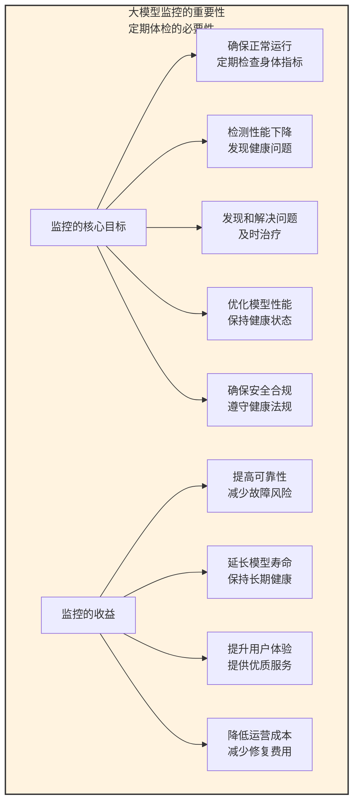

监控就像是大模型的**定期体检**：
- 定期检查大模型的各项指标
- 及时发现和解决健康问题
- 确保大模型始终保持良好的状态

### 8.6.2 监控的关键指标：大模型的"健康指标"

| 指标类别 | 具体指标 | 比喻 | 作用 |
|----------|----------|------|------|
| **性能指标** | 响应时间 | 反应速度 | 模型处理请求的时间 |
| | 吞吐量 | 工作量 | 单位时间内处理的请求数量 |
| | 资源利用率 | 体力消耗 | GPU、CPU、内存等资源的使用率 |
| | 错误率 | 失误率 | 请求失败的比例 |
| **效果指标** | 准确率 | 准确率 | 模型预测的准确程度 |
| | 精确率 | 精确率 | 预测为正类的样本中实际为正类的比例 |
| | 召回率 | 召回率 | 实际为正类的样本中被预测为正类的比例 |
| | F1分数 | 综合分数 | 精确率和召回率的调和平均数 |
| **漂移指标** | 数据漂移 | 环境变化 | 输入数据分布的变化 |
| | 概念漂移 | 需求变化 | 目标变量分布的变化 |
| | 性能漂移 | 健康状况下降 | 模型性能的下降 |
| **安全指标** | 恶意请求检测 | 抵御攻击 | 检测恶意输入和攻击 |
| | 敏感信息泄露 | 保护隐私 | 检测敏感信息的泄露 |
| | 偏见和公平性 | 公平对待 | 检测模型的偏见和不公平性 |

### 8.6.3 监控工具：大模型的"健康管理工具"

| 监控工具 | 比喻 | 功能 | 适用场景 |
|----------|------|------|----------|
| **Prometheus + Grafana** | 专业体检中心 | 开源监控系统+可视化平台 | 企业级系统监控 |
| **MLflow** | 健康管理平台 | 机器学习生命周期管理平台 | 模型版本管理和实验跟踪 |
| **Weights & Biases（W&B）** | 智能健康手环 | 实验跟踪和模型监控平台 | 机器学习实验和模型监控 |
| **Evidently AI** | 家庭健康监测仪 | 机器学习模型监控开源库 | 数据漂移和性能监控 |
| **Arize AI** | 高级健康顾问 | 机器学习模型监控平台 | 实时监控和根因分析 |

### 8.6.4 模型管理：大模型的"生命周期管理"

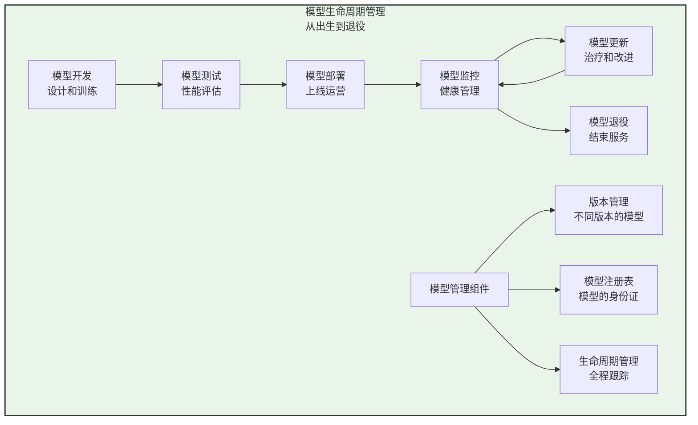

**1. 模型版本管理**：
   - 管理模型的不同版本（相当于人的不同年龄段的健康记录）
   - 支持模型回滚和比较（相当于可以回溯和比较不同时期的健康状况）
   - 代表工具：MLflow、Git LFS等

**2. 模型注册表**：
   - 存储和管理模型的元数据（相当于人的身份证和健康档案）
   - 支持模型搜索和发现（相当于可以快速找到所需的模型）
   - 代表工具：MLflow Model Registry、Hugging Face Hub等

**3. 模型生命周期管理**：
   - 管理模型从开发到部署再到退役的整个生命周期（相当于人的从出生到去世的全程健康管理）
   - 包括模型训练、测试、部署、监控、更新、退役等阶段
   - 代表工具：MLflow、Kubeflow等

### 8.6.5 监控与管理案例：企业大模型平台

**案例**：某企业构建的大模型监控与管理平台

1. **平台架构**：
   - 使用Prometheus + Grafana收集和展示指标
   - 使用MLflow管理模型版本和实验
   - 使用Evidently AI检测数据漂移
   - 使用自定义工具进行安全监控

2. **监控流程**：
   - 实时监控模型性能和资源使用情况
   - 每天生成模型健康报告
   - 当检测到异常时，自动发送告警
   - 定期进行模型性能评估和更新

3. **管理流程**：
   - 所有模型都注册到模型注册表
   - 每个模型都有完整的版本记录
   - 模型更新需要经过测试和审批
   - 定期对模型进行评估，决定是否退役

### 8.6.6 最佳实践

1. **建立完整的监控体系**：
   - 覆盖性能、效果、漂移和安全等多个维度
   - 使用多种监控工具，相互补充
   - 建立告警机制，及时发现问题

2. **实施模型生命周期管理**：
   - 对所有模型进行版本管理
   - 建立模型注册表，统一管理模型
   - 制定模型更新和退役的标准和流程

3. **持续优化模型**：
   - 根据监控数据，持续优化模型性能
   - 定期更新模型，适应新的数据和需求
   - 不断改进模型的安全性和公平性

---

## 8.7 大模型应用开发工具：大模型的"应用开发工具箱"

大模型应用开发工具就像是**为大模型应用开发提供的工具箱**，帮助开发者快速构建各种大模型应用：

### 8.7.1 应用开发框架：大模型的"应用构建工具"

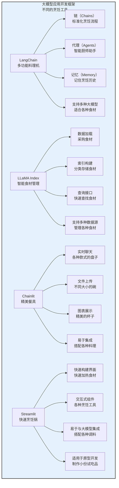

**1. LangChain**：多功能厨房料理机
   - 用于构建基于大模型的应用框架（相当于一台集多种功能于一体的料理机）
   - 提供链（Chains）、代理（Agents）、记忆（Memory）等核心组件（相当于料理机的搅拌、切碎、加热等功能）
   - 支持多种大模型和工具集成（相当于可以搭配不同的食材和配件）
   - 适用于构建聊天机器人、问答系统、摘要系统等（相当于可以制作果汁、汤品、沙拉等多种美食）

**2. LLaMA Index**：智能食材管理系统
   - 用于构建基于私有数据的大模型应用框架（相当于一套智能食材管理系统）
   - 提供数据加载、索引构建、查询接口等功能（相当于食材采购、分类存储、快速查找等功能）
   - 支持多种数据源和索引类型（相当于可以管理各种类型的食材）
   - 适用于构建基于私有文档的问答系统（相当于可以根据库存食材快速制定食谱）

**3. Chainlit**：精美餐具套装
   - 用于构建大模型应用UI的开源框架（相当于一套精美的餐具）
   - 支持实时聊天、文件上传、图表展示等功能（相当于不同款式的盘子、碗、杯子）
   - 易于与LangChain、LLaMA Index等集成（相当于可以搭配各种料理）
   - 适用于构建大模型应用的前端界面（相当于可以把做好的美食盛在精美的餐具中）

**4. Streamlit**：快速烹饪锅
   - 用于构建数据应用的Python库（相当于一口可以快速烹饪的锅）
   - 支持快速构建交互式界面（相当于可以快速加热食材，做出美味佳肴）
   - 易于与大模型集成（相当于可以搭配各种调料）
   - 适用于构建原型和演示应用（相当于适合快速制作小份试吃品）

### 8.7.2 检索增强生成（RAG）工具：大模型的"知识检索系统"

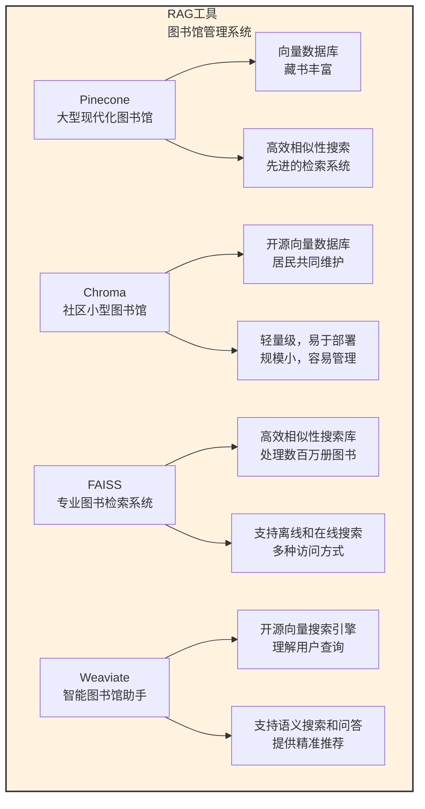

**1. Pinecone**：大型现代化图书馆
   - 向量数据库，用于存储和检索向量嵌入（相当于一个大型现代化图书馆，藏书丰富）
   - 支持高效的相似性搜索（相当于图书馆有先进的检索系统，能快速找到相关书籍）
   - 适用于RAG应用（相当于图书馆对所有读者开放，提供优质服务）

**2. Chroma**：社区小型图书馆
   - 开源向量数据库（相当于一个社区小型图书馆，由居民共同维护）
   - 轻量级，易于部署（相当于图书馆规模小，容易建立和管理）
   - 支持多种嵌入模型（相当于图书馆收藏了各种类型的书籍）
   - 适用于开发和测试环境（相当于图书馆主要用于学习和研究）

**3. FAISS**：专业图书检索系统
   - Facebook开发的高效相似性搜索库（相当于一套专业的图书检索系统）
   - 支持大规模向量搜索（相当于可以处理数百万册图书的检索）
   - 适用于离线和在线搜索（相当于可以在图书馆内使用，也可以通过网络访问）

**4. Weaviate**：智能图书馆助手
   - 开源向量搜索引擎（相当于一个智能图书馆助手）
   - 支持语义搜索、问答等功能（相当于助手可以理解用户的自然语言查询，提供精准的图书推荐）
   - 适用于各种RAG应用（相当于助手可以为不同类型的读者提供服务）

### 8.7.3 Prompt工程工具：大模型的"指令优化工具"

| Prompt工具 | 比喻 | 功能 | 适用场景 |
|------------|------|------|----------|
| **PromptLayer** | 专业食谱管理软件 | 管理和监控Prompt，支持版本控制和性能分析 | 企业级Prompt管理 |
| **LangSmith** | 智能烹饪助手 | 调试、测试和监控大模型应用，管理Prompt和链 | LangChain应用开发 |
| **PromptHero** | 食谱分享社区 | 分享和发现优秀Prompt，提供各种场景的模板 | 学习和参考Prompt |

### 8.7.4 应用开发案例：从工具到应用

**案例1：使用LangChain构建聊天机器人**

```python
from langchain import OpenAI, ConversationChain

# 加载模型
llm = OpenAI(temperature=0.7)

# 创建对话链
conversation = ConversationChain(llm=llm, verbose=True)

# 开始对话
response = conversation.predict(input="你好，我想了解一下大模型技术栈")
print(response)
```

**案例2：使用LLaMA Index构建基于私有文档的问答系统**

```python
from llama_index import VectorStoreIndex, SimpleDirectoryReader

# 加载私有文档
documents = SimpleDirectoryReader("data").load_data()

# 构建索引
index = VectorStoreIndex.from_documents(documents)

# 创建查询引擎
query_engine = index.as_query_engine()

# 开始问答
response = query_engine.query("请解释一下大模型的微调技术")
print(response.response)
```

---

## 8.8 大模型生态系统：大模型的"生态社区"

大模型生态系统就像是一个**繁荣的社区**，包含了各种角色和资源：

### 8.8.1 生态系统概览：繁荣的社区

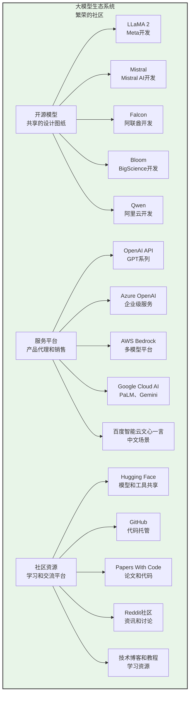

### 8.8.2 开源模型：共享的设计图纸

| 开源模型 | 开发者 | 参数量 | 特点 | 适用场景 |
|----------|--------|--------|------|----------|
| **LLaMA 2** | Meta | 7B、13B、70B | 支持商业用途，性能优异 | 各种自然语言处理任务 |
| **Mistral** | Mistral AI | 7B、13B | 性能优异，推理速度快 | 高效推理场景 |
| **Falcon** | UAE Technology Innovation Institute | 7B、40B | 支持商业用途 | 各种NLP任务 |
| **Bloom** | BigScience | 176B | 支持46种语言 | 多语言任务 |
| **Qwen** | 阿里云 | 7B、14B、72B | 支持中文和英文 | 中文场景优先 |

### 8.8.3 服务平台：便捷的访问方式

| 服务平台 | 提供的模型 | 特点 | 适用场景 |
|----------|------------|------|----------|
| **OpenAI API** | GPT-3.5、GPT-4等 | 易于使用，功能丰富 | 快速开发原型 |
| **Azure OpenAI** | GPT系列 | 企业级安全性和合规性 | 企业级应用 |
| **AWS Bedrock** | Claude、LLaMA 2、Titan等 | 无服务器部署 | 云原生应用 |
| **Google Cloud AI** | PaLM、Gemini等 | 全流程服务 | 端到端AI解决方案 |
| **百度智能云文心一言** | 文心系列 | 中文优先 | 中文场景应用 |

### 8.8.4 社区资源：学习和交流的平台

| 社区资源 | 类型 | 功能 | 适用场景 |
|----------|------|------|----------|
| **Hugging Face** | 开源平台 | 模型、数据集、工具库共享 | 模型开发和研究 |
| **GitHub** | 代码托管 | 开源项目和工具 | 协作开发 |
| **Papers With Code** | 学术平台 | 最新研究论文和代码 | 学术研究和学习 |
| **Reddit社区** | 讨论平台 | 大模型资讯和讨论 | 了解最新趋势 |
| **技术博客和教程** | 学习资源 | 教程、案例和最佳实践 | 学习和参考 |

---

## 本章总结：大模型技术栈的全景图

### 知识回顾：从底层到上层

大模型技术栈是一个**多层次的架构体系**，从底层的基础设施到上层的应用开发，每个层次都有专门的技术和工具：

1. **基础设施层**：硬件、操作系统、虚拟化
2. **开发框架层**：PyTorch、TensorFlow、JAX等
3. **训练与微调层**：分布式训练、混合精度训练、LoRA、QLoRA等
4. **部署与推理层**：API部署、私有化部署、模型压缩等
5. **监控与管理层**：性能监控、效果监控、模型版本管理等
6. **应用开发层**：LangChain、LLaMA Index、Chainlit等
7. **生态系统层**：开源模型、服务平台、社区资源等

### 技术栈选择原则：适合的才是最好的

选择大模型技术栈时，需要考虑以下因素：
- 业务需求：根据业务场景选择合适的技术
- 技术成熟度：选择成熟稳定的技术组件
- 社区支持：选择社区活跃、文档完善的技术
- 性能要求：根据性能要求选择合适的技术
- 成本考虑：考虑技术的部署和维护成本
- 可扩展性：选择易于扩展和升级的技术
- 兼容性：考虑技术组件之间的兼容性

### 实践应用：从理论到实践

通过本章学习，你可以：
1. 搭建企业内部的大模型平台
2. 开发基于大模型的智能客服系统
3. 构建基于私有数据的问答系统
4. 设计大模型的训练和微调方案
5. 优化大模型的部署和推理性能
6. 监控和管理大模型的运行状态

### 未来趋势：持续发展的技术

大模型技术栈正在持续发展，未来的趋势包括：
- 更高效的训练方法和框架
- 更强大的微调技术
- 更优化的部署方案
- 更智能的监控和管理工具
- 更丰富的应用开发框架
- 更繁荣的生态系统

通过掌握大模型技术栈，你将能够更好地理解和应用大模型，为企业和社会创造价值。

---
