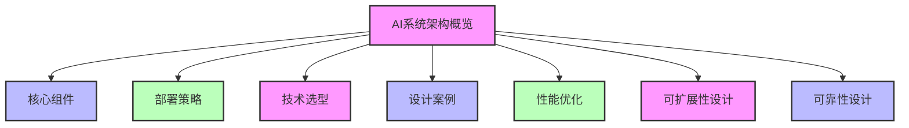
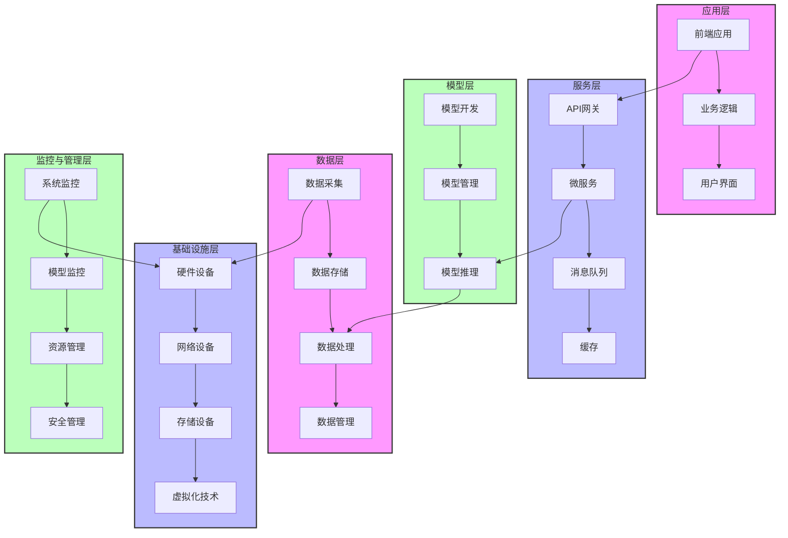
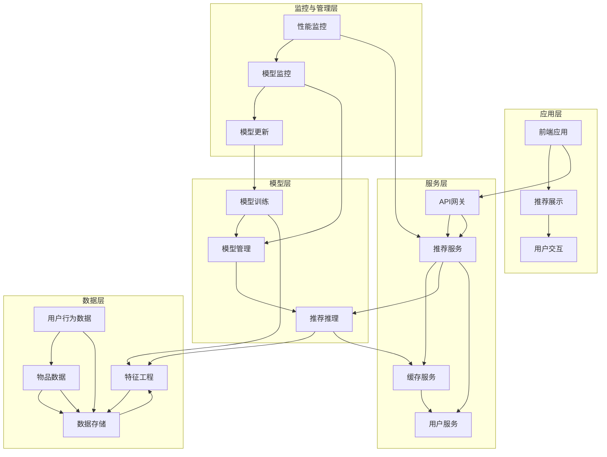
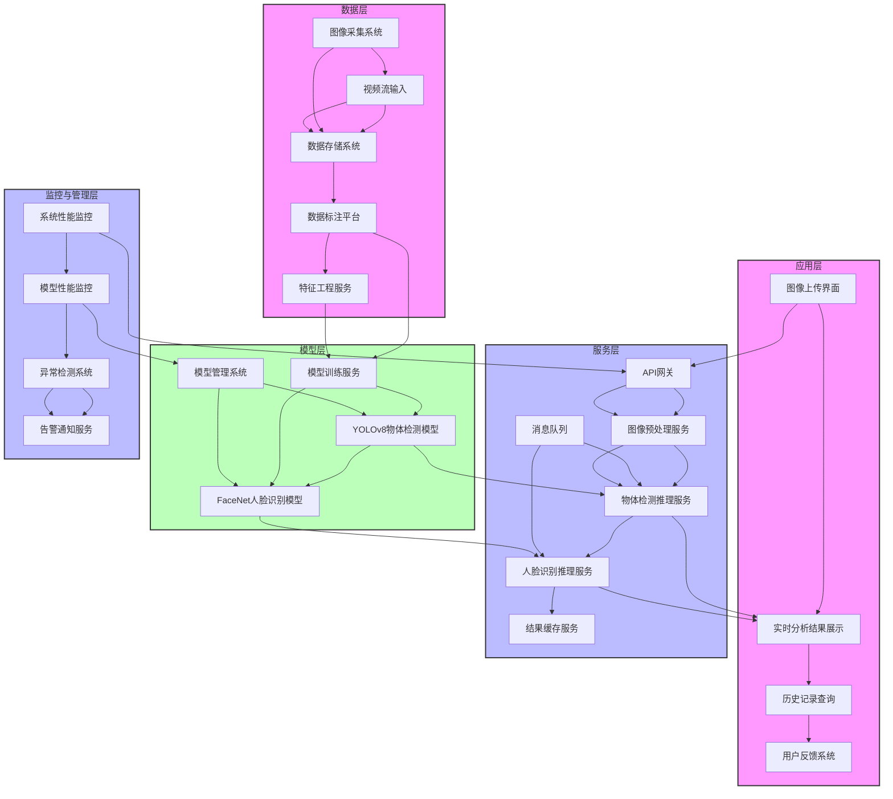
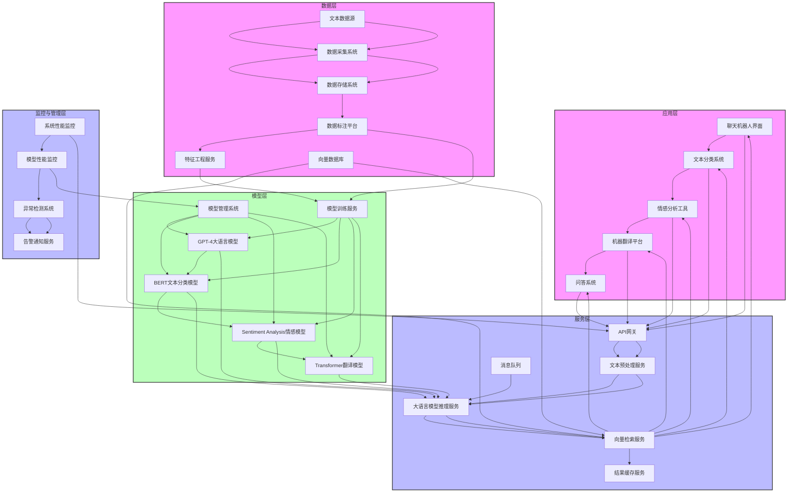
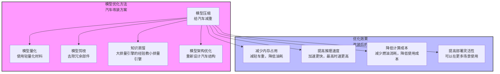

# 第二篇 AI技术架构与关键原理

## 第9章 AI系统架构与部署

### 学习线路图

### 学习目标
1. 理解AI系统架构的基本概念和重要性
2. 掌握AI系统的核心组件和分层架构
3. 了解AI系统的部署策略和模式
4. 熟悉AI系统的技术选型原则
5. 掌握AI系统设计的典型案例
6. 了解AI系统性能优化的方法
7. 掌握AI系统可扩展性设计的原则
8. 熟悉AI系统可靠性设计的方法

### 核心知识点
- AI系统的分层架构
- 核心组件（数据层、模型层、服务层、应用层、监控与管理层）
- 部署策略（云部署、本地部署、混合部署、边缘部署）
- 技术选型原则
- 典型AI系统架构案例
- 性能优化方法
- 可扩展性设计原则
- 可靠性设计方法

### 重点难点
- AI系统的分层架构设计
- 部署策略的选择
- 技术选型的权衡
- 性能优化的实践
- 可扩展性和可靠性设计

### 本章导读

你是否想了解，一个完整的AI系统是如何设计和部署的？从底层基础设施到上层应用，AI系统包含哪些核心组件？不同的部署策略有什么优缺点？如何设计一个高性能、可扩展、可靠的AI系统？

AI系统架构与部署是AI解决方案落地的关键环节，它决定了系统的性能、可靠性、可扩展性和维护成本。一个良好的架构设计能够确保AI系统高效运行，满足业务需求，并能够随着业务的发展而扩展。

本章将带你了解AI系统架构与部署的核心概念和实践方法，包括AI系统的分层架构、核心组件、部署策略、技术选型、设计案例、性能优化、可扩展性设计和可靠性设计。通过本章学习，你将能够理解AI系统架构的整体框架，掌握AI系统部署的关键技术和方法，为设计和部署高质量的AI系统打下基础。

---

## 9.1 AI系统架构概览

### 9.1.1 什么是AI系统架构（城市规划类比）

AI系统架构就像一座城市的总体规划，它定义了城市的各个组成部分（如住宅区、商业区、工业区）、道路网络、公共设施布局以及它们之间的关系。一个好的城市规划能够确保城市高效运行，居民生活便利，同时能够适应未来的发展。

同样，AI系统架构是指AI系统的整体结构设计，包括系统的组件划分、组件之间的关系、数据流向、部署方式等。它定义了AI系统的各个部分如何协同工作，以实现系统的功能和性能目标。

**AI系统架构的重要性（城市规划的好处）**：
- 确保系统的高性能和可靠性（相当于城市交通流畅，基础设施完善）
- 提高系统的可扩展性和可维护性（相当于城市能够容纳更多人口，基础设施易于维护）
- 降低系统的开发和运营成本（相当于城市建设和管理成本合理）
- 支持系统的快速迭代和更新（相当于城市能够快速适应新的发展需求）
- 确保系统的安全性和合规性（相当于城市有完善的安保和法律法规）

### 9.1.2 AI系统的分层架构（城市分层类比）

AI系统通常采用分层架构设计，就像一座城市的分层结构：地下基础设施、地面建筑、商业服务、居民生活和城市管理。每个层次负责特定的功能，层次之间通过清晰的接口通信。

**典型的AI系统分层架构（城市分层对应）**：

1. **基础设施层**：城市的地下基础设施
   - 硬件设备：CPU、GPU、TPU等计算资源（相当于城市的电力、供水、供气系统）
   - 网络设备：交换机、路由器等（相当于城市的道路和桥梁）
   - 存储设备：磁盘阵列、对象存储等（相当于城市的仓库和 storage）
   - 虚拟化技术：Docker、Kubernetes等（相当于城市的土地规划和 zoning）

2. **数据层**：城市的资源和原材料
   - 数据采集：从各种数据源收集数据（相当于城市的资源采集和运输）
   - 数据存储：数据库、数据仓库、数据湖等（相当于城市的仓库和图书馆）
   - 数据处理：数据清洗、转换、集成等（相当于城市的资源加工和处理）
   - 数据管理：数据质量、数据安全、数据治理等（相当于城市的资源管理和规划）

3. **模型层**：城市的工厂和生产设施
   - 模型开发：模型设计、训练、调优等（相当于城市的工厂设计和生产）
   - 模型管理：模型版本控制、模型注册、模型部署等（相当于城市的工厂管理和生产调度）
   - 模型推理：模型预测、模型解释等（相当于工厂的产品生产和质量检测）

4. **服务层**：城市的商业和服务设施
   - API网关：请求路由、负载均衡、认证授权等（相当于城市的交通枢纽和安保系统）
   - 微服务：各种功能模块，如用户服务、推荐服务等（相当于城市的各种商业服务，如超市、医院、学校等）
   - 消息队列：异步通信、流量削峰等（相当于城市的快递和物流系统）
   - 缓存：提高系统性能（相当于城市的便利店和快捷服务点）

5. **应用层**：城市的居民生活和活动
   - 前端应用：Web应用、移动应用等（相当于城市的居民住宅和公共空间）
   - 业务逻辑：实现具体的业务功能（相当于城市居民的各种活动和生活方式）
   - 用户界面：与用户交互的界面（相当于城市的街道和公共设施，供居民使用和交互）

6. **监控与管理层**：城市的管理和监控中心
   - 系统监控：性能监控、日志管理、告警等（相当于城市的交通监控和治安系统）
   - 模型监控：模型性能、数据漂移、概念漂移等（相当于城市的产品质量监管和市场监督）
   - 资源管理：资源调度、容量规划等（相当于城市的资源管理和城市规划）
   - 安全管理：身份认证、访问控制、数据加密等（相当于城市的安保系统和法律法规）

### 9.1.3 架构设计原则

设计AI系统架构时，需要遵循以下原则：

1. **模块化设计**：将系统划分为独立的模块，每个模块负责特定的功能，模块之间通过清晰的接口通信。
2. **松耦合高内聚**：模块内部的组件高度相关，模块之间的依赖关系尽可能少。
3. **可扩展性**：系统能够随着业务需求的增长而扩展，支持水平扩展和垂直扩展。
4. **高性能**：系统能够处理大量的请求，具有低延迟和高吞吐量。
5. **可靠性**：系统能够持续稳定运行，具有容错能力和灾备机制。
6. **安全性**：系统能够保护数据和模型的安全，防止未经授权的访问和攻击。
7. **可维护性**：系统易于维护和更新，具有良好的文档和监控机制。
8. **成本效益**：系统的设计和部署成本合理，能够提供良好的投资回报率。

---

## 9.2 AI系统核心组件

### 9.2.1 数据层

数据层是AI系统的基础，它负责数据的采集、存储、处理和管理。

**核心功能**：
- **数据采集**：从各种数据源收集数据，如传感器、日志、数据库、API等。
- **数据存储**：将数据存储在合适的存储系统中，如关系型数据库、NoSQL数据库、数据仓库、数据湖等。
- **数据处理**：对数据进行清洗、转换、集成、特征工程等处理，使其适合用于模型训练和推理。
- **数据管理**：确保数据的质量、安全性和合规性，包括数据质量管理、数据安全管理、数据治理等。

**常用技术和工具**：
- **数据采集**：Flume、Kafka、Logstash、Fluentd等。
- **数据存储**：MySQL、PostgreSQL、MongoDB、Redis、HDFS、S3等。
- **数据处理**：Spark、Flink、Hive、Pig等。
- **数据管理**：Apache Atlas、Great Expectations、Deequ等。

### 9.2.2 模型层

模型层是AI系统的核心，它负责模型的开发、管理和推理。

**核心功能**：
- **模型开发**：包括模型设计、数据准备、模型训练、模型调优等。
- **模型管理**：包括模型版本控制、模型注册、模型部署、模型更新等。
- **模型推理**：使用训练好的模型进行预测，包括在线推理和离线推理。

**常用技术和工具**：
- **模型开发**：PyTorch、TensorFlow、Scikit-learn、XGBoost等。
- **模型管理**：MLflow、Kubeflow、ModelDB、Hugging Face Hub等。
- **模型推理**：TensorRT、ONNX Runtime、vLLM、TGI等。

### 9.2.3 服务层

服务层是连接模型层和应用层的桥梁，它负责处理请求路由、负载均衡、认证授权等。

**核心功能**：
- **API网关**：处理请求的路由、负载均衡、认证授权、限流熔断等。
- **微服务**：将系统拆分为多个独立的服务，每个服务负责特定的功能。
- **消息队列**：实现异步通信、流量削峰、系统解耦等。
- **缓存**：提高系统性能，减少数据库访问压力。

**常用技术和工具**：
- **API网关**：Kong、APISIX、Zuul、Gateway等。
- **微服务**：Spring Cloud、Django、FastAPI等。
- **消息队列**：Kafka、RabbitMQ、RocketMQ、Pulsar等。
- **缓存**：Redis、Memcached、Caffeine等。

### 9.2.4 应用层

应用层是AI系统的用户界面，它负责与用户交互，提供具体的业务功能。

**核心功能**：
- **前端应用**：Web应用、移动应用等，负责与用户交互。
- **业务逻辑**：实现具体的业务功能，如推荐、预测、分类等。
- **用户界面**：提供友好的用户体验，包括可视化界面、交互式图表等。

**常用技术和工具**：
- **前端应用**：React、Vue、Angular、Flutter等。
- **业务逻辑**：Python、Java、Go、Node.js等。
- **用户界面**：D3.js、ECharts、Plotly等。

### 9.2.5 监控与管理层

监控与管理层是AI系统的保障，它负责监控系统的运行状态，管理系统的资源和安全。

**核心功能**：
- **系统监控**：监控系统的性能、日志、告警等。
- **模型监控**：监控模型的性能、数据漂移、概念漂移等。
- **资源管理**：管理系统的计算、存储、网络等资源。
- **安全管理**：管理系统的身份认证、访问控制、数据加密等。

**常用技术和工具**：
- **系统监控**：Prometheus、Grafana、ELK Stack、Datadog等。
- **模型监控**：MLflow、Evidently AI、Arize AI、Weights & Biases等。
- **资源管理**：Kubernetes、YARN、Mesos等。
- **安全管理**：OAuth 2.0、JWT、HashiCorp Vault、AWS KMS等。

---

## 9.3 AI系统部署策略（办公模式类比）

AI系统部署策略就像选择办公模式，不同的模式适合不同的企业需求和工作方式。

### 9.3.1 云部署：共享办公空间

云部署是将AI系统部署在公有云平台上，如AWS、Azure、Google Cloud、阿里云、腾讯云等，就像企业使用共享办公空间一样。

**优势**：
- **快速部署**：可以快速创建和配置资源，缩短部署时间（相当于共享办公空间可以立即入驻，无需装修）
- **弹性扩展**：根据业务需求自动扩展或缩减资源（相当于可以根据员工数量灵活调整办公空间）
- **降低成本**：按需付费，无需购买和维护硬件设备（相当于按月支付租金，无需购买办公家具）
- **高可用性**：云平台提供高可用性保障，减少系统 downtime（相当于共享办公空间有专业的物业维护，确保正常运营）
- **丰富的服务**：云平台提供各种AI服务和工具（相当于共享办公空间提供会议室、打印设备、咖啡等配套服务）

**劣势**：
- **数据隐私**：数据存储在云端，可能存在数据隐私和安全风险（相当于共享办公空间人多眼杂，可能泄露商业机密）
- **网络依赖**：依赖网络连接，网络延迟可能影响系统性能（相当于共享办公空间依赖外部网络，网络不稳定时影响工作）
- **供应商锁定**：可能难以迁移到其他云平台（相当于与共享办公空间签订长期合同，难以更换）
- **成本不可控**：如果使用不当，可能导致高昂的云服务费用（相当于共享办公空间的额外服务可能产生高额费用）

**适用场景**：
- 初创企业，需要快速部署AI系统（相当于初创公司资金有限，需要灵活的办公空间）
- 业务波动较大，需要弹性扩展的场景（相当于业务季节性波动大的公司）
- 缺乏专业IT团队，需要云平台提供的托管服务（相当于缺乏专业行政人员的公司）

### 9.3.2 本地部署：自有办公大楼

本地部署是将AI系统部署在企业自己的数据中心或服务器上，就像企业拥有自己的办公大楼一样。

**优势**：
- **数据安全**：数据存储在本地，安全性和可控性高（相当于自有办公大楼有完善的安保系统，商业机密安全）
- **网络独立**：不依赖外部网络，避免网络延迟和中断（相当于自有办公大楼有独立的网络系统，不受外部影响）
- **成本可控**：一次性购买硬件设备，长期成本较低（相当于购买办公大楼，长期使用成本较低）
- **完全控制**：企业可以完全控制系统的配置和管理（相当于企业可以自由装修和管理办公大楼）

**劣势**：
- **部署周期长**：需要购买和配置硬件设备，部署时间长（相当于建造或购买办公大楼需要很长时间）
- **扩展困难**：扩展资源需要购买新的硬件设备，成本高且时间长（相当于扩建办公大楼需要大量资金和时间）
- **维护成本高**：需要专业的IT团队维护硬件和软件（相当于需要专业的物业团队维护办公大楼）
- **技术更新慢**：硬件设备更新周期长，可能导致技术落后（相当于办公大楼的设施更新需要大量投入）

**适用场景**：
- 对数据安全要求极高的行业，如金融、医疗、政府等（相当于对安保要求极高的企业）
- 业务稳定，资源需求可预测的场景（相当于业务稳定的成熟企业）
- 拥有专业IT团队的大型企业（相当于拥有专业物业团队的大型企业）

### 9.3.3 混合部署：混合办公模式

混合部署是将AI系统的部分组件部署在云端，部分组件部署在本地，两者协同工作，就像企业采用混合办公模式一样。

**优势**：
- **灵活性高**：可以根据业务需求选择合适的部署方式（相当于员工可以自由选择在家办公或在办公室办公）
- **数据安全与成本平衡**：敏感数据存储在本地，非敏感数据存储在云端（相当于核心团队在办公室工作，非核心团队在家办公）
- **弹性扩展**：可以利用云端的弹性扩展能力，同时保持本地数据的安全性（相当于可以根据业务需求灵活调整办公方式）

**劣势**：
- **架构复杂**：需要设计复杂的混合架构，确保云端和本地系统的协同工作（相当于需要复杂的管理系统协调不同办公模式）
- **集成难度大**：需要解决云端和本地系统的集成问题（相当于需要解决不同办公模式之间的沟通和协作问题）
- **管理复杂**：需要同时管理云端和本地的资源和系统（相当于需要同时管理办公室和远程员工）

**适用场景**：
- 对数据安全有一定要求，但也需要云端弹性扩展能力的场景（相当于对数据安全有要求，但也需要灵活办公的企业）
- 已有本地IT基础设施，希望逐步迁移到云端的企业（相当于已有办公大楼，希望引入远程办公模式）
- 业务场景复杂，需要多种部署方式结合的情况（相当于业务复杂，需要多种办公模式结合的企业）

### 9.3.4 边缘部署：现场办公

边缘部署是将AI系统部署在边缘设备上，如物联网设备、移动设备、边缘服务器等，靠近数据生成的位置，就像企业员工在客户现场办公一样。

**优势**：
- **低延迟**：数据不需要传输到云端，减少了网络延迟（相当于员工在现场办公，响应速度快）
- **带宽节省**：减少了数据传输的带宽消耗（相当于员工在现场办公，不需要频繁往返公司）
- **数据隐私**：数据在本地处理，不需要传输到云端，提高了数据隐私性（相当于敏感数据在现场处理，不传回公司）
- **离线运行**：可以在没有网络连接的情况下运行（相当于员工在没有网络的现场也能工作）

**劣势**：
- **资源受限**：边缘设备的计算、存储和网络资源有限（相当于现场办公条件有限，设备和资源不足）
- **管理复杂**：需要管理大量分散的边缘设备（相当于需要管理分散在各地的现场员工）
- **更新困难**：边缘设备的更新和维护比较困难（相当于现场员工的培训和管理比较困难）

**适用场景**：
- 对延迟要求极高的场景，如自动驾驶、工业自动化等（相当于需要实时响应的现场服务）
- 数据量巨大，传输成本高的场景，如视频监控、物联网等（相当于需要处理大量现场数据的场景）
- 网络连接不稳定或不可靠的场景，如偏远地区、移动设备等（相当于网络条件差的现场环境）

### 9.3.5 部署策略对比

| 部署策略 | 优势 | 劣势 | 适用场景 |
|----------|------|------|----------|
| 云部署 | 快速部署、弹性扩展、降低成本、高可用性 | 数据隐私风险、网络依赖、供应商锁定 | 初创企业、业务波动大的场景 |
| 本地部署 | 数据安全、网络独立、成本可控、完全控制 | 部署周期长、扩展困难、维护成本高 | 金融、医疗、政府等对数据安全要求高的行业 |
| 混合部署 | 灵活性高、数据安全与成本平衡、弹性扩展 | 架构复杂、集成难度大、管理复杂 | 需要平衡数据安全和弹性扩展的场景 |
| 边缘部署 | 低延迟、带宽节省、数据隐私、离线运行 | 资源受限、管理复杂、更新困难 | 自动驾驶、工业自动化、视频监控等 |

---

## 9.4 AI系统技术选型

### 9.4.1 基础设施选型

基础设施选型包括硬件设备、网络设备、存储设备等的选择。

**硬件设备**：
- **CPU**：适用于一般计算任务，如数据处理、模型推理等。
- **GPU**：适用于并行计算任务，如模型训练、深度学习推理等。
- **TPU**：Google开发的专用AI芯片，适用于深度学习任务。
- **NPU**：华为等公司开发的AI芯片，适用于边缘设备和云端推理。

**网络设备**：
- **交换机**：用于连接服务器和存储设备，确保高速数据传输。
- **路由器**：用于连接不同网络，确保网络通信。
- **负载均衡器**：用于分配网络流量，提高系统可用性和性能。

**存储设备**：
- **磁盘阵列**：适用于需要高性能和高可靠性的存储场景。
- **对象存储**：适用于大规模非结构化数据存储，如图片、视频、日志等。
- **分布式存储**：适用于大规模数据存储和处理，如HDFS、Ceph等。

### 9.4.2 框架与工具选型

**深度学习框架**：
- **PyTorch**：动态计算图，易于调试和开发，适合研究和生产。
- **TensorFlow**：静态计算图，性能优化较好，适合工业生产。
- **JAX**：高性能数值计算库，适合大规模模型训练。

**机器学习库**：
- **Scikit-learn**：简单易用的机器学习库，适合传统机器学习任务。
- **XGBoost**：高性能梯度提升库，适合结构化数据分类和回归任务。
- **LightGBM**：轻量级梯度提升库，适合大规模数据。

**大数据处理框架**：
- **Spark**：分布式数据处理框架，适合大规模数据处理和分析。
- **Flink**：流处理框架，适合实时数据处理。
- **Hive**：基于Hadoop的数据仓库，适合离线数据处理和分析。

### 9.4.3 数据库选型

**关系型数据库**：
- **MySQL**：开源关系型数据库，适合一般应用场景。
- **PostgreSQL**：功能丰富的开源关系型数据库，支持复杂查询和空间数据。
- **Oracle**：商业关系型数据库，适合大型企业应用。

**NoSQL数据库**：
- **MongoDB**：文档型数据库，适合存储非结构化数据。
- **Redis**：内存数据库，适合缓存和实时数据处理。
- **Cassandra**：分布式列存储数据库，适合大规模写入和读取。

**数据仓库**：
- **Snowflake**：云原生数据仓库，适合大规模数据分析。
- **BigQuery**：Google Cloud的无服务器数据仓库，适合大规模数据分析。
- **Redshift**：AWS的云数据仓库，适合大规模数据分析。

### 9.4.4 中间件选型

**消息队列**：
- **Kafka**：分布式消息队列，适合高吞吐量的数据流处理。
- **RabbitMQ**：可靠的消息队列，适合异步通信和流量削峰。
- **Pulsar**：云原生消息和流平台，适合大规模数据处理。

**API网关**：
- **Kong**：开源API网关，支持插件扩展。
- **APISIX**：基于Nginx的开源API网关，性能优异。
- **Gateway**：Spring Cloud的API网关，适合Java生态。

**容器编排**：
- **Kubernetes**：开源容器编排平台，用于管理容器化应用。
- **Docker Swarm**：Docker的容器编排工具，简单易用。

---

## 9.5 AI系统设计案例

### 9.5.1 智能推荐系统架构

智能推荐系统是一种常见的AI应用，用于向用户推荐个性化内容，如商品、新闻、视频等。

**系统架构**：

1. **数据层**：
   - 收集用户行为数据，如浏览、点击、购买等。
   - 收集物品数据，如商品信息、新闻内容等。
   - 存储数据到数据库或数据仓库中。
   - 对数据进行清洗、转换、特征工程等处理。

2. **模型层**：
   - 开发推荐模型，如协同过滤、矩阵分解、深度学习模型等。
   - 训练模型，使用历史数据进行模型训练。
   - 部署模型，提供推荐服务。

3. **服务层**：
   - API网关，处理推荐请求。
   - 推荐服务，根据用户特征和行为生成推荐结果。
   - 缓存服务，缓存热门推荐结果，提高性能。

4. **应用层**：
   - 前端应用，展示推荐结果。
   - 业务逻辑，处理用户交互和反馈。

5. **监控与管理层**：
   - 监控推荐系统的性能，如点击率、转化率等。
   - 监控模型的性能，如准确率、召回率等。
   - 管理推荐模型的版本和更新。

### 9.5.2 计算机视觉系统架构

计算机视觉系统就像是给计算机装上了一双智能眼睛，能够识别图像或视频中的物体、场景和人物，就像人类通过视觉理解世界一样。

**系统架构**：

**详细工作流程**：

1. **数据层**：
   - **图像采集**：从摄像头、无人机、手机等设备收集图像或视频数据（就像人类用眼睛观察世界）
   - **视频流输入**：处理实时视频流，如监控摄像头、直播视频等
   - **数据存储**：将原始图像和视频存储到对象存储中，如Amazon S3、阿里云OSS等（就像人类的记忆存储）
   - **数据标注**：使用人工或自动标注工具标记图像中的物体、边界框和类别（就像老师教导学生认识不同的物体）
   - **特征工程**：提取图像的关键特征，如颜色、纹理、形状等（就像人类通过特征识别物体）

2. **模型层**：
   - **物体检测模型**：使用YOLOv8等算法检测图像中的物体（就像人类识别不同的物体）
   - **人脸识别模型**：使用FaceNet等算法识别图像中的人脸（就像人类认人）
   - **模型训练服务**：使用标注数据训练模型，不断提高模型的识别准确率（就像人类通过学习提高认知能力）
   - **模型管理系统**：管理模型的版本、部署和更新（就像人类整理和更新知识库）

3. **服务层**：
   - **API网关**：处理外部请求，进行路由、负载均衡和认证授权（就像公司的前台接待）
   - **图像预处理服务**：对输入图像进行缩放、裁剪、增强等处理，使其适合模型输入（就像人类整理和准备观察对象）
   - **推理服务**：使用训练好的模型进行实时推理，识别图像中的物体或人脸（就像人类快速识别和判断）
   - **消息队列**：处理异步请求，如批量图像分析（就像人类处理多个任务的优先级）
   - **结果缓存服务**：缓存常用图像的分析结果，提高系统响应速度（就像人类记住常见物体的特征）

4. **应用层**：
   - **图像上传界面**：允许用户上传图像或视频（就像人类提供观察对象）
   - **实时分析结果展示**：实时显示图像分析结果，如物体类别、位置、置信度等（就像人类描述观察结果）
   - **历史记录查询**：允许用户查询过去的分析结果（就像人类回忆过去的观察）
   - **用户反馈系统**：允许用户对分析结果进行反馈，帮助模型改进（就像人类从错误中学习）

5. **监控与管理层**：
   - **系统性能监控**：监控系统的CPU、内存、网络等资源使用情况（就像人类关注自己的身体状况）
   - **模型性能监控**：监控模型的准确率、召回率、推理时间等指标（就像人类评估自己的认知能力）
   - **异常检测系统**：检测系统和模型的异常情况，如性能下降、错误率升高等（就像人类发现自己身体不适）
   - **告警通知服务**：当检测到异常时，通过短信、邮件等方式通知管理员（就像人类生病时去看医生）

**应用案例**：智能监控系统

某商场部署了一套智能监控系统，用于检测商场内的异常行为和安全隐患：

1. **数据层**：商场内的多个监控摄像头实时采集视频流，存储到本地数据中心。
2. **模型层**：使用YOLOv8模型检测视频中的人物和物体，使用自定义模型检测异常行为，如打架、偷窃、跌倒等。
3. **服务层**：API网关接收来自监控摄像头的视频流，推理服务实时分析视频内容，消息队列处理大量的视频流请求。
4. **应用层**：监控中心的大屏幕实时显示分析结果，当检测到异常行为时，自动弹出告警信息并播放声音提醒。
5. **监控与管理层**：系统监控平台实时显示各摄像头的状态和系统资源使用情况，模型监控平台跟踪模型的准确率和误报率。

这套智能监控系统大大提高了商场的安全性，减少了人工监控的成本和工作量，同时能够及时发现和处理安全隐患。

### 9.5.3 自然语言处理系统架构

自然语言处理系统就像是给计算机装上了一个智能大脑，能够理解和处理人类的自然语言，就像人类通过语言交流和理解世界一样。

**系统架构**：

**详细工作流程**：

1. **数据层**：
   - **文本数据源**：包括新闻文章、社交媒体评论、聊天记录、书籍等各种文本数据（就像人类获取知识的各种渠道）
   - **数据采集系统**：从各种数据源收集文本数据，如网络爬虫、API接口等（就像人类阅读和收集信息）
   - **数据存储系统**：将文本数据存储到数据库或数据仓库中，如MySQL、MongoDB、HDFS等（就像人类存储知识到大脑或书籍中）
   - **数据标注平台**：对文本数据进行标注，如分类标签、情感标签、实体标签等（就像老师给学生的作业打分和批改）
   - **特征工程服务**：提取文本的关键特征，如词频、TF-IDF、词嵌入等（就像人类提取文章的核心思想和关键词）
   - **向量数据库**：存储文本的向量表示，用于高效的相似度搜索和匹配（就像人类建立知识之间的关联）

2. **模型层**：
   - **大语言模型**：如GPT-4、LLaMA 2等，用于理解和生成自然语言（就像人类的大脑，能够理解和生成复杂语言）
   - **文本分类模型**：如BERT，用于将文本分类到不同类别（就像人类将事物分类到不同类别）
   - **情感分析模型**：用于分析文本的情感倾向，如正面、负面、中性（就像人类识别和理解他人的情绪）
   - **机器翻译模型**：如Transformer，用于将一种语言翻译成另一种语言（就像人类进行语言翻译）
   - **模型训练服务**：使用标注数据训练模型，不断提高模型的性能（就像人类通过学习提高语言能力）
   - **模型管理系统**：管理模型的版本、部署和更新（就像人类整理和更新知识库）

3. **服务层**：
   - **API网关**：处理外部请求，进行路由、负载均衡和认证授权（就像公司的前台接待）
   - **文本预处理服务**：对输入文本进行分词、去停用词、词嵌入等处理，使其适合模型输入（就像人类整理和准备要理解的文本）
   - **大语言模型推理服务**：使用训练好的大语言模型进行实时推理，生成文本或回答问题（就像人类快速思考和回答问题）
   - **向量检索服务**：根据文本向量进行相似度搜索，找到相关的文本或知识（就像人类从记忆中检索相关信息）
   - **消息队列**：处理异步请求，如批量文本分析（就像人类处理多个任务的优先级）
   - **结果缓存服务**：缓存常用文本的分析结果，提高系统响应速度（就像人类记住常见问题的答案）

4. **应用层**：
   - **聊天机器人界面**：允许用户与AI进行自然语言对话（就像人类之间的对话）
   - **文本分类系统**：将文本自动分类到不同类别，如新闻分类、邮件分类等（就像人类将文件分类归档）
   - **情感分析工具**：分析文本的情感倾向，如产品评论、社交媒体情绪等（就像人类理解他人的情感和态度）
   - **机器翻译平台**：将一种语言翻译成另一种语言，支持实时翻译和批量翻译（就像人类进行跨语言交流）
   - **问答系统**：根据用户的问题，从知识库中找到答案并回答（就像人类回答问题）

5. **监控与管理层**：
   - **系统性能监控**：监控系统的CPU、内存、网络等资源使用情况（就像人类关注自己的身体状况）
   - **模型性能监控**：监控模型的准确率、召回率、推理时间等指标（就像人类评估自己的语言能力）
   - **异常检测系统**：检测系统和模型的异常情况，如性能下降、错误率升高等（就像人类发现自己身体不适）
   - **告警通知服务**：当检测到异常时，通过短信、邮件等方式通知管理员（就像人类生病时去看医生）

**应用案例**：智能客服系统

某电商平台部署了一套智能客服系统，用于处理用户的咨询和投诉：

1. **数据层**：收集用户的历史聊天记录、产品说明书、常见问题等文本数据，存储到数据库中，并进行标注和特征工程处理。
2. **模型层**：使用GPT-4大语言模型作为核心，结合BERT文本分类模型和情感分析模型，训练出能够理解用户意图、回答问题并识别情感的智能客服模型。
3. **服务层**：API网关接收用户的咨询请求，文本预处理服务对用户输入进行处理，大语言模型推理服务生成回答，向量检索服务从知识库中查找相关信息，结果缓存服务缓存常见问题的回答。
4. **应用层**：用户可以通过电商平台的聊天界面与智能客服进行对话，智能客服能够回答产品咨询、订单查询、投诉处理等问题，并根据用户的情感调整回答方式。
5. **监控与管理层**：系统监控平台实时显示智能客服的在线状态、响应时间和解决率，模型监控平台跟踪模型的准确率和用户满意度，当检测到异常情况时，自动发送告警通知管理员。

这套智能客服系统大大提高了电商平台的客户服务效率，减少了人工客服的工作量和成本，同时能够24小时为用户提供服务，提高了用户满意度。

---

## 9.6 AI系统性能优化：让系统跑起来更快更稳

AI系统性能优化就像是给汽车做保养和改装，通过各种方法让系统跑起来更快、更稳、更高效。

### 9.6.1 模型优化：给模型"减肥"和"提速"

模型优化是提高AI系统性能的核心，就像是给模型进行"减肥"和"提速"改造：

**模型量化**：就像是给汽车更换轻量化材料
- 降低模型参数的精度，如从FP32（普通钢材）降到INT8（铝合金）或INT4（碳纤维）
- 减少内存占用和计算量，提高推理速度
- 常用工具：TensorRT（专业改装厂）、ONNX Runtime（通用改装工具）、bitsandbytes（轻量化材料供应商）

**模型剪枝**：就像是去除汽车的冗余部件
- 去除模型中的冗余参数和连接，就像去掉汽车上不必要的装饰和设备
- 减少模型大小和计算量，提高运行效率
- 常用方法：
  - 结构化剪枝：去掉整个汽车部件（如拆除后排座椅）
  - 非结构化剪枝：去掉部件中的部分元素（如拆除座椅上的多余缝线）

**知识蒸馏**：就像是让资深赛车手教新手开车
- 将大模型（教师模型，资深赛车手）的知识迁移到小模型（学生模型，新手司机）中
- 提高小模型的性能，同时保持较小的模型大小
- 就像新手通过学习资深赛车手的经验，能够驾驶普通汽车跑出接近赛车的速度

**模型架构优化**：就像是重新设计汽车结构
- 优化模型的网络结构，如使用更高效的注意力机制、激活函数等
- 减少计算复杂度，提高模型效率
- 就像设计更符合空气动力学的汽车车身，减少风阻，提高速度

**优化案例**：将GPT-3模型优化后部署到手机端
- 原始GPT-3模型有175B参数，无法在手机上运行
- 使用模型量化将精度从FP32降到INT8，减少内存占用75%
- 使用模型剪枝去除30%的冗余参数
- 使用知识蒸馏将大模型知识迁移到1B参数的小模型
- 最终得到的模型可以在手机上实时运行，响应时间小于1秒

### 9.6.2 服务优化：让系统"多车道"和"智能调度"

服务优化就像是优化城市交通系统，通过各种方法提高系统的处理能力和响应速度：

**API优化**：就像是优化道路设计
- 优化API设计，减少请求次数和数据传输量（就像拓宽道路，减少拥堵）
- 使用异步API，提高并发处理能力（就像设置潮汐车道，根据流量调整方向）
- 优化API响应格式，减少数据大小（就像使用小型车辆，提高道路利用率）

**缓存优化**：就像是在交通繁忙的地方设置停车场和临时停靠点
- 使用缓存存储常用数据和计算结果（就像在商场附近设置停车场）
- 选择合适的缓存策略：
  - LRU（最近最少使用）：就像停车场只保留最近使用的车辆
  - LFU（最少使用频率）：就像停车场只保留经常使用的车辆
- 定期更新缓存，确保数据一致性（就像定期清理停车场，确保车辆信息准确）

**负载均衡**：就像是交通警察指挥交通
- 使用负载均衡器分配请求（就像交通警察指挥车辆进入不同车道）
- 选择合适的负载均衡算法：
  - 轮询：就像交通警察按顺序指挥车辆进入不同车道
  - 最少连接：就像交通警察将车辆引导到车辆较少的车道
  - IP哈希：就像交通警察根据车辆牌照引导到固定车道
- 配置健康检查，自动移除故障节点（就像交通警察封闭损坏的道路）

**服务优化案例**：某电商平台的API优化
- 优化前：API响应时间平均2秒，每秒处理1000个请求
- 优化后：
  - 使用缓存存储常用商品数据，响应时间减少到500ms
  - 实现API异步处理，每秒处理能力提升到5000个请求
  - 使用负载均衡器分配请求，系统可用性从99.5%提升到99.99%

### 9.6.3 数据优化：让数据"快速通行"和"高效存储"

数据优化就像是优化物流系统，通过各种方法提高数据的传输和处理效率：

**数据预处理优化**：就像是提前准备好货物
- 优化数据预处理流程，减少预处理时间（就像提前包装好货物，减少运输时间）
- 使用并行处理，提高数据预处理效率（就像多辆货车同时运输货物）
- 缓存预处理结果，避免重复计算（就像提前将货物运到仓库，减少运输次数）

**数据存储优化**：就像是优化仓库设计
- 选择合适的数据库和存储方式（就像根据货物类型选择合适的仓库）
- 优化数据库索引，提高查询速度（就像在仓库中设置清晰的货架编号）
- 分区和分表，提高大数据量下的查询性能（就像将仓库分成多个区域，便于管理）

**数据传输优化**：就像是优化运输路线和方式
- 压缩数据，减少数据传输量（就像将货物打包，减少运输体积）
- 使用高效的数据传输协议，如gRPC、Protocol Buffers（就像使用高速运输工具，如高铁、飞机）
- 批量传输数据，减少网络请求次数（就像集中运输货物，减少运输次数）

### 9.6.4 基础设施优化：给系统"升级硬件"和"优化环境"

基础设施优化就像是升级汽车的硬件和优化驾驶环境：

**硬件优化**：就像是更换高性能发动机和轮胎
- 使用高性能硬件设备，如GPU、TPU等（就像更换大排量发动机，提高动力）
- 优化硬件配置，如内存大小、磁盘类型等（就像更换高性能轮胎，提高抓地力）
- 选择合适的硬件组合，根据工作负载优化配置（就像根据赛道特点调整汽车配置）

**网络优化**：就像是优化道路和交通信号灯
- 优化网络拓扑，减少网络延迟和丢包率（就像修建高速公路，减少拥堵）
- 使用高速网络设备，如万兆交换机、路由器等（就像安装智能交通信号灯，提高通行效率）
- 配置网络QoS，确保关键流量的优先级（就像设置公交专用道，确保公共交通优先）

**虚拟化优化**：就像是共享汽车和智能停车场
- 使用容器化技术，如Docker、Kubernetes（就像共享汽车，提高资源利用率）
- 优化容器配置，如资源限制、镜像大小等（就像优化共享汽车的使用规则）
- 使用裸金属服务器，避免虚拟化开销（就像使用专用赛车，提高性能）

**基础设施优化案例**：某AI公司的GPU集群优化
- 优化前：GPU利用率仅为30%，训练一个模型需要7天
- 优化后：
  - 使用分布式训练框架，GPU利用率提升到80%
  - 升级到高速网络（100Gbps），通信延迟减少50%
  - 使用容器化技术，部署时间从几小时减少到几分钟
  - 训练同一个模型的时间从7天减少到1天

### 9.6.5 性能优化最佳实践：系统"全面保养"指南

1. **从瓶颈开始优化**：先找出系统的性能瓶颈（就像先检查汽车的故障点）
2. **逐步优化**：从最容易实现的优化方法开始（就像先换机油，再考虑大的改装）
3. **持续监控**：定期监控系统性能，及时发现新的瓶颈（就像定期检查汽车性能）
4. **根据场景选择优化方法**：不同的场景需要不同的优化方法（就像赛车和家用车的改装方案不同）
5. **平衡优化效果和成本**：优化效果越好，成本通常越高，需要找到平衡点（就像平衡汽车性能和改装成本）

通过以上优化方法，AI系统的性能可以得到显著提升，就像经过精心保养和改装的汽车，能够在各种场景下高效运行。

---

## 9.7 AI系统可扩展性设计（餐厅扩张类比）

AI系统的可扩展性设计就像餐厅的扩张策略，需要根据业务需求选择合适的扩张方式。

### 9.7.1 水平扩展 vs 垂直扩展（餐厅扩张方式）

**水平扩展**：开连锁餐厅
- 通过增加服务器数量来扩展系统容量（相当于通过开设多家连锁餐厅来扩大业务规模）
- 优点：成本低、可扩展性强、容错性好（相当于一家餐厅出现问题，其他餐厅仍能正常运营）
- 缺点：需要设计分布式系统，增加了系统复杂度（相当于需要建立连锁管理体系，协调多家餐厅的运营）

**垂直扩展**：升级现有餐厅
- 通过增加单台服务器的资源（CPU、内存、存储等）来扩展系统容量（相当于通过升级现有餐厅的设施和规模来扩大业务）
- 优点：设计简单，无需修改系统架构（相当于不需要改变餐厅的经营模式，只需要升级设施）
- 缺点：成本高、扩展性有限、单点故障风险大（相当于升级成本高，且如果餐厅出现问题，整个业务会受到影响）

**选择原则（餐厅扩张决策）**：
- 对于计算密集型任务，如模型训练，适合垂直扩展（相当于需要高端厨房设备的餐厅，适合升级现有设施）
- 对于IO密集型任务，如数据处理、API服务，适合水平扩展（相当于主要依靠服务员的餐厅，适合开连锁）
- 对于大规模分布式系统，通常采用水平扩展（相当于大型餐饮集团，通常采用连锁经营模式）

### 9.7.2 微服务架构

微服务架构是将系统拆分为多个独立的服务，每个服务负责特定的功能，服务之间通过API通信。

**优势**：
- **独立部署**：每个服务可以独立部署和更新，不影响其他服务。
- **独立扩展**：可以根据每个服务的需求独立扩展资源。
- **技术多样性**：每个服务可以使用不同的技术栈。
- **容错性好**：单个服务故障不会导致整个系统崩溃。

**挑战**：
- **分布式系统复杂度**：需要处理分布式事务、服务发现、负载均衡等问题。
- **服务间通信**：需要设计高效可靠的服务间通信机制。
- **数据一致性**：需要确保多个服务之间的数据一致性。

**最佳实践**：
- 服务拆分要合理，避免服务过大或过小。
- 使用API网关统一管理服务访问。
- 使用服务注册和发现机制，如Eureka、Consul等。
- 使用分布式追踪系统，如Zipkin、Jaeger等，监控服务间调用。

### 9.7.3 容器化与编排

**容器化**：
- 使用Docker等容器技术，将应用及其依赖打包成容器镜像。
- 确保应用在不同环境中运行一致，提高部署效率。
- 减少环境配置和依赖问题。

**容器编排**：
- 使用Kubernetes等容器编排平台，管理和调度容器化应用。
- 提供自动部署、扩展、滚动更新、故障恢复等功能。
- 提高系统的可用性和可扩展性。

**优势**：
- **快速部署**：可以快速创建和销毁容器，缩短部署时间。
- **弹性扩展**：根据业务需求自动扩展或缩减容器数量。
- **资源利用率高**：多个容器可以共享主机资源，提高资源利用率。
- **高可用性**：自动重启故障容器，确保系统稳定运行。

### 9.7.4 分布式系统设计

分布式系统设计是实现系统可扩展性的关键，包括分布式存储、分布式计算、分布式协调等。

**分布式存储**：
- 使用分布式存储系统，如HDFS、Ceph、S3等，存储大规模数据。
- 提供高可用性、高可靠性和可扩展性。

**分布式计算**：
- 使用分布式计算框架，如Spark、Flink等，处理大规模数据。
- 支持并行计算，提高计算效率。

**分布式协调**：
- 使用分布式协调服务，如ZooKeeper、etcd等，管理分布式系统的配置和状态。
- 提供一致性保证，确保分布式系统的正确运行。

**分布式事务**：
- 处理跨多个服务或数据库的事务，确保数据一致性。
- 常用方法：两阶段提交（2PC）、补偿事务（TCC）、消息事务等。

---

## 9.8 AI系统可靠性设计

### 9.8.1 容错设计

容错设计是确保系统在出现故障时能够继续运行的设计方法。

**冗余设计**：
- 对关键组件进行冗余部署，如服务器、网络设备、存储设备等。
- 确保单个组件故障不会导致整个系统崩溃。

**故障隔离**：
- 将系统划分为多个独立的模块或服务，确保单个模块故障不会影响其他模块。
- 使用微服务架构，实现服务间的故障隔离。

**自动恢复**：
- 配置自动恢复机制，如自动重启故障服务、自动切换到备用节点等。
- 使用容器编排平台，如Kubernetes，实现自动故障恢复。

### 9.8.2 灾备设计

灾备设计是确保系统在发生灾难时能够快速恢复的设计方法。

**灾备级别**：
- **RTO（Recovery Time Objective）**：系统从故障恢复到正常运行所需的时间。
- **RPO（Recovery Point Objective）**：系统恢复后允许丢失的数据量。

**灾备策略**：
- **冷备份**：定期备份数据，发生灾难时手动恢复。
- **温备份**：备份数据实时更新，发生灾难时需要手动切换到备用系统。
- **热备份**：主备系统实时同步，发生灾难时自动切换到备用系统。

**灾备中心**：
- **同城灾备**：在同一城市建立灾备中心，距离较近，数据同步快。
- **异地灾备**：在不同城市建立灾备中心，距离较远，抗灾能力强。
- **多活架构**：多个数据中心同时运行，任何一个数据中心故障都不会影响系统运行。

### 9.8.3 高可用性设计

高可用性（HA）是指系统在规定时间内能够正常运行的概率。

**计算高可用性**：
- 高可用性 = （总时间 - 宕机时间）/ 总时间 × 100%
- 常见的高可用性目标：99.9%（每年宕机时间约8.76小时）、99.99%（每年宕机时间约52.56分钟）、99.999%（每年宕机时间约5.26分钟）。

**实现高可用性的方法**：
- **冗余部署**：对关键组件进行冗余部署。
- **负载均衡**：分配请求到多个服务器，提高系统可用性和性能。
- **自动故障转移**：发生故障时自动切换到备用系统。
- **定期维护**：定期进行系统维护和升级，减少故障风险。

### 9.8.4 监控与告警

监控与告警是确保系统可靠性的重要手段，它能够及时发现和处理系统故障。

**监控指标**：
- **系统指标**：CPU使用率、内存使用率、磁盘使用率、网络流量等。
- **应用指标**：请求数、响应时间、错误率、吞吐量等。
- **业务指标**：用户数、交易量、转化率等。
- **模型指标**：准确率、召回率、F1分数、数据漂移等。

**告警策略**：
- 设置合理的告警阈值，避免误告警和漏告警。
- 配置多级告警，如短信、邮件、电话等，确保告警能够及时送达。
- 配置告警升级机制，确保故障能够得到及时处理。

**监控工具**：
- **系统监控**：Prometheus、Grafana、Zabbix等。
- **应用监控**：New Relic、Datadog、AppDynamics等。
- **日志管理**：ELK Stack、Graylog、Splunk等。
- **分布式追踪**：Zipkin、Jaeger、OpenTelemetry等。

---

## 本章总结

### 知识回顾

1. **AI系统架构概览**：
   - AI系统架构是指系统的整体结构设计，包括组件划分、关系、数据流向、部署方式等。
   - 典型的AI系统采用分层架构，包括基础设施层、数据层、模型层、服务层、应用层、监控与管理层。
   - 架构设计应遵循模块化、松耦合高内聚、可扩展性、高性能、可靠性、安全性、可维护性、成本效益等原则。

2. **AI系统核心组件**：
   - 数据层：负责数据的采集、存储、处理和管理。
   - 模型层：负责模型的开发、管理和推理。
   - 服务层：负责处理请求路由、负载均衡、认证授权等。
   - 应用层：负责与用户交互，提供具体的业务功能。
   - 监控与管理层：负责监控系统运行状态，管理资源和安全。

3. **AI系统部署策略**：
   - 云部署：将系统部署在公有云平台上，具有快速部署、弹性扩展等优势。
   - 本地部署：将系统部署在企业自己的数据中心，具有数据安全、网络独立等优势。
   - 混合部署：将部分组件部署在云端，部分组件部署在本地，具有灵活性高、数据安全与成本平衡等优势。
   - 边缘部署：将系统部署在边缘设备上，具有低延迟、带宽节省等优势。

4. **AI系统技术选型**：
   - 基础设施选型：包括硬件设备、网络设备、存储设备等。
   - 框架与工具选型：包括深度学习框架、机器学习库、大数据处理框架等。
   - 数据库选型：包括关系型数据库、NoSQL数据库、数据仓库等。
   - 中间件选型：包括消息队列、API网关、容器编排等。

5. **AI系统设计案例**：
   - 智能推荐系统架构：包括数据层、模型层、服务层、应用层、监控与管理层。
   - 计算机视觉系统架构：用于处理和分析图像或视频数据。
   - 自然语言处理系统架构：用于处理和分析文本数据。

6. **AI系统性能优化**：
   - 模型优化：包括模型压缩、量化、剪枝、知识蒸馏等。
   - 服务优化：包括API优化、缓存优化、负载均衡等。
   - 数据优化：包括数据预处理优化、数据存储优化、数据传输优化等。
   - 基础设施优化：包括硬件优化、网络优化、虚拟化优化等。

7. **AI系统可扩展性设计**：
   - 水平扩展 vs 垂直扩展：水平扩展通过增加服务器数量扩展容量，垂直扩展通过增加单台服务器资源扩展容量。
   - 微服务架构：将系统拆分为多个独立服务，提高可扩展性和容错性。
   - 容器化与编排：使用Docker和Kubernetes，提高资源利用率和部署效率。
   - 分布式系统设计：包括分布式存储、分布式计算、分布式协调等。

8. **AI系统可靠性设计**：
   - 容错设计：通过冗余设计、故障隔离、自动恢复等方法，确保系统在出现故障时能够继续运行。
   - 灾备设计：通过冷备份、温备份、热备份等策略，确保系统在发生灾难时能够快速恢复。
   - 高可用性设计：通过冗余部署、负载均衡、自动故障转移等方法，提高系统的可用性。
   - 监控与告警：通过监控系统指标、应用指标、业务指标、模型指标，及时发现和处理系统故障。

### 知识体系梳理

```mermaid
graph TD
    A[AI系统架构与部署] --> B[系统架构概览]
    A --> C[核心组件]
    A --> D[部署策略]
    A --> E[技术选型]
    A --> F[设计案例]
    A --> G[性能优化]
    A --> H[可扩展性设计]
    A --> I[可靠性设计]
    
    B --> B1[分层架构]
    B --> B2[设计原则]
    
    C --> C1[数据层]
    C --> C2[模型层]
    C --> C3[服务层]
    C --> C4[应用层]
    C --> C5[监控与管理层]
    
    D --> D1[云部署]
    D --> D2[本地部署]
    D --> D3[混合部署]
    D --> D4[边缘部署]
    
    E --> E1[基础设施选型]
    E --> E2[框架与工具选型]
    E --> E3[数据库选型]
    E --> E4[中间件选型]
    
    F --> F1[智能推荐系统]
    F --> F2[计算机视觉系统]
    F --> F3[自然语言处理系统]
    
    G --> G1[模型优化]
    G --> G2[服务优化]
    G --> G3[数据优化]
    G --> G4[基础设施优化]
    
    H --> H1[水平扩展 vs 垂直扩展]
    H --> H2[微服务架构]
    H --> H3[容器化与编排]
    H --> H4[分布式系统设计]
    
    I --> I1[容错设计]
    I --> I2[灾备设计]
    I --> I3[高可用性设计]
    I --> I4[监控与告警]
```

### 实践应用场景

**场景1：企业AI平台架构设计**

假设你是一家企业的AI负责人，需要设计一个企业级AI平台。通过本章学习，你可以：

1. 采用分层架构设计，包括基础设施层、数据层、模型层、服务层、应用层、监控与管理层。
2. 选择合适的部署策略，如混合部署，将敏感数据存储在本地，非敏感数据和计算资源使用云端。
3. 选择合适的技术栈，如PyTorch、TensorFlow、Kubernetes、Docker等。
4. 设计微服务架构，将平台拆分为多个独立服务，如数据服务、模型服务、推理服务等。
5. 配置监控与告警系统，确保平台的高性能和可靠性。
6. 设计可扩展的架构，支持平台的未来发展。

**场景2：AI应用部署方案设计**

假设你是一名AI解决方案专家，需要为客户设计一个AI应用的部署方案。通过本章学习，你可以：

1. 分析客户的业务需求和技术要求，选择合适的部署策略。
2. 设计系统架构，包括组件划分、关系、数据流向等。
3. 选择合适的技术栈，如框架、数据库、中间件等。
4. 设计性能优化方案，确保应用的高性能。
5. 设计可靠性方案，确保应用的高可用性和容错能力。
6. 设计监控与告警方案，确保应用的可维护性。

### 下一步学习建议

1. 深入学习AI安全与合规（第10章）
2. 学习AI解决方案模式库（第11章）
3. 了解需求分析与方案设计（第12章）
4. 尝试使用Kubernetes和Docker部署AI应用
5. 学习使用Prometheus和Grafana监控AI系统
6. 关注AI系统架构的最新发展趋势，如Serverless、边缘计算等

通过本章的学习，你已经对AI系统架构与部署有了基本的了解。AI系统架构与部署是AI解决方案落地的关键环节，它决定了系统的性能、可靠性、可扩展性和维护成本。一个良好的架构设计能够确保AI系统高效运行，满足业务需求，并能够随着业务的发展而扩展。接下来，我们将深入学习AI安全与合规，了解如何确保AI系统的安全性和合规性。

---
