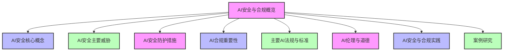
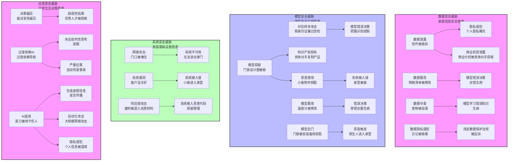
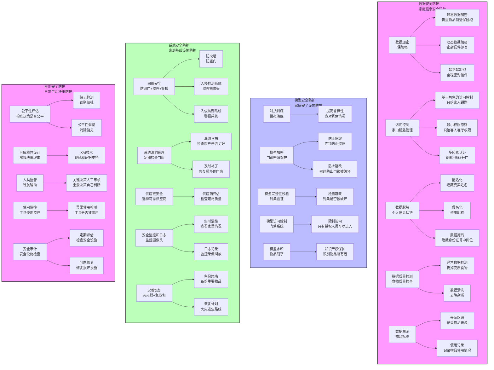
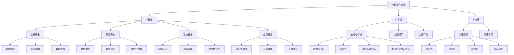

# 第二篇 AI技术架构与关键原理

## 第10章 AI安全与合规

### 学习线路图

### 学习目标
1. 理解AI安全与合规的基本概念和重要性
2. 掌握AI安全的主要威胁和风险
3. 熟悉AI安全防护的核心措施和技术
4. 了解AI合规的主要法规和标准
5. 掌握AI伦理和道德的基本准则
6. 熟悉AI安全与合规的实践方法
7. 了解AI安全与合规的典型案例
8. 掌握AI安全与合规的评估和审计方法

### 核心知识点
- AI安全的基本概念和重要性
- AI安全的主要威胁（数据泄露、模型攻击、系统漏洞等）
- AI安全防护措施（数据安全、模型安全、系统安全、应用安全等）
- AI合规的重要性和挑战
- 主要AI法规和标准（GDPR、CCPA、AI Act等）
- AI伦理和道德准则
- AI安全与合规的实践方法
- AI安全与合规的评估和审计

### 重点难点
- AI安全威胁的识别和防护
- 主要AI法规和标准的理解和应用
- AI伦理和道德问题的处理
- AI安全与合规的实践落地

### 本章导读

随着AI技术的快速发展和广泛应用，AI安全与合规问题日益凸显。AI系统不仅面临传统的网络安全威胁，还面临着独特的安全挑战，如数据泄露、模型攻击、算法偏见等。同时，全球各国和地区也在不断推出AI相关的法规和标准，对AI系统的开发、部署和使用提出了严格的要求。

AI安全与合规是AI解决方案落地的重要保障，它关系到企业的声誉、客户的信任、以及法律法规的遵守。作为AI解决方案专家，了解AI安全与合规的核心概念、主要威胁、防护措施和法规要求，是设计和部署安全可靠AI系统的关键。

本章将带你了解AI安全与合规的核心概念和实践方法，包括AI安全的基本概念、主要威胁、防护措施，AI合规的重要性、主要法规和标准，AI伦理和道德准则，以及AI安全与合规的实践方法和案例研究。通过本章学习，你将能够理解AI安全与合规的重要性，掌握AI安全防护的核心措施，了解主要AI法规和标准，以及AI伦理和道德准则，为设计和部署安全合规的AI系统打下基础。

---

## 10.1 AI安全概览（AI安全与家的安全类比）

AI安全就像保护我们的家一样重要。我们的家需要锁门、安装监控、防止火灾和盗窃，同样，AI系统也需要各种安全措施来保护它免受威胁。

### 10.1.1 什么是AI安全（家的安全类比）

AI安全是指保护AI系统免受各种安全威胁和风险的技术、策略和实践，就像我们保护家免受盗窃、火灾和其他危险一样。它涵盖了AI系统生命周期的各个阶段，包括设计、开发、训练、部署和使用。

**AI安全的核心目标（家的安全目标对应）**：
- 保护AI系统的数据安全和隐私（相当于保护家里的贵重物品和个人隐私）
- 防止AI模型被攻击或篡改（相当于防止家里的门锁被撬开或监控被破坏）
- 确保AI系统的可靠性和可用性（相当于确保家里的水电系统正常运行）
- 防止AI系统被滥用或用于恶意目的（相当于防止家里的工具被用于非法活动）
- 确保AI系统的决策公平、透明和可解释（相当于确保家庭决策公平合理，成员都能理解）

### 10.1.2 AI安全的重要性（家的安全重要性对应）

**1. 数据安全和隐私保护**：
AI系统通常处理大量敏感数据，如个人信息、商业机密等，就像家里存放着贵重物品和个人日记。确保这些数据的安全和隐私，是AI系统的基本要求。

**2. 模型安全**：
AI模型是AI系统的核心资产，就像家的房产证和保险柜钥匙。一旦被攻击或篡改，可能导致严重的后果，如错误决策、财产损失、声誉损害等。

**3. 系统可靠性和可用性**：
AI系统在许多关键领域得到应用，如医疗、金融、交通等，就像家的水电系统和安全设施。确保这些系统的可靠性和可用性，关系到人们的生命和财产安全。

**4. 防止滥用**：
AI技术如果被滥用，可能导致严重的社会问题，如生成虚假信息、自动化攻击、隐私侵犯等，就像家里的工具被用于非法活动一样。

**5. 合规要求**：
全球各国和地区正在不断推出AI相关的法规和标准，对AI系统的安全和合规提出了严格的要求，就像社区的安全规定和法律法规一样。遵守这些法规和标准，是企业的法律义务。

### 10.1.3 AI安全的独特挑战（日常生活类比）

AI系统面临着传统信息系统的安全威胁，同时还面临着独特的安全挑战，就像我们的家除了面临普通的安全威胁外，还可能面临一些独特的挑战：

**1. 数据依赖性**：
AI系统高度依赖数据，就像植物依赖阳光和水分一样。数据的质量和安全性直接影响AI系统的性能和安全性，就像阳光和水分的质量直接影响植物的生长。

**2. 模型黑箱性**：
许多AI模型，尤其是深度学习模型，具有黑箱特性，难以解释其决策过程，就像一个神秘的黑盒子，我们只知道它能做什么，但不知道它是如何做的。这给安全审计和监控带来了挑战，就像我们无法检查黑盒子内部是否有问题一样。

**3. 对抗样本攻击**：
攻击者可以通过精心设计的输入样本，误导AI模型做出错误决策，就像骗子通过精心伪装来欺骗我们一样。例如，在图像中添加细微的扰动，导致图像分类模型将猫识别为狗，就像给猫穿上狗的衣服来欺骗我们的眼睛一样。

**4. 模型中毒**：
攻击者可以通过污染训练数据，导致AI模型学习到错误的知识，就像有人在我们的食物中添加有害物质一样。例如，在训练数据中添加错误的标签，导致模型在部署后做出错误决策。

**5. 算法偏见**：
AI模型可能会学习到训练数据中的偏见，导致不公平的决策，就像孩子从有偏见的环境中学习到偏见一样。例如，如果训练数据中存在性别歧视，模型可能会在招聘或贷款决策中歧视女性。

**6. 模型窃取**：
攻击者可以通过API调用或其他方式，窃取AI模型的参数或结构，就像小偷窃取我们的设计图纸或配方一样。这可能导致知识产权损失，就像我们的商业机密被窃取一样。

---

## 10.2 AI安全主要威胁：AI系统的"安全隐患"（日常生活类比）

AI安全威胁就像我们日常生活中面临的各种安全威胁一样，需要我们保持警惕并采取相应的防护措施。让我们通过生动的比喻和可视化图表来理解这些威胁：

### 10.2.1 数据安全威胁：AI系统的"敏感信息泄露"

**1. 数据泄露**：
- 未经授权的数据访问、传输或存储导致的数据泄露，就像家里的信件被偷拆或日记被偷看一样
- **实际案例**：2023年，某医疗AI公司发生数据泄露，导致100万患者的医疗记录被曝光，引发大规模隐私担忧
- **影响**：个人隐私侵犯、商业机密泄露、违反数据保护法规

**2. 数据篡改**：
- 攻击者篡改AI系统的训练数据或输入数据，就像有人修改了我们的购物清单，导致我们买错东西一样
- **实际案例**：2022年，某金融AI系统遭到攻击，攻击者篡改了训练数据，导致模型在贷款审批中做出错误决策，造成数百万美元损失
- **影响**：模型错误决策、业务损失、声誉损害

**3. 数据中毒**：
- 攻击者通过污染训练数据，导致AI模型学习到错误的知识，就像有人在我们的食物中添加有害物质一样
- **实际案例**：2021年，某社交媒体平台的AI推荐系统遭到数据中毒攻击，攻击者在训练数据中植入大量虚假信息，导致推荐系统向用户推送有害内容
- **影响**：模型错误决策、用户体验下降、平台声誉损害

**4. 数据隐私侵犯**：
- 未经授权的个人数据收集、使用或共享，就像有人未经允许收集我们的个人信息并分享给他人一样
- **实际案例**：2020年，某AI语音助手公司被曝光收集用户的私人对话，引发全球范围内的隐私争议
- **影响**：违反数据保护法规、用户信任丧失、法律诉讼

### 10.2.2 模型安全威胁：AI系统的"大脑被攻击"

**1. 对抗样本攻击**：
- 攻击者通过精心设计的输入样本，误导AI模型做出错误决策，就像骗子通过精心伪装来欺骗我们一样
- **实际案例**：2023年，研究人员发现自动驾驶汽车的视觉系统可以被对抗样本攻击，通过在道路上粘贴特定图案，导致车辆误判交通标志
- **影响**：模型错误决策、安全风险、财产损失

**2. 模型窃取**：
- 攻击者通过API调用或其他方式，窃取AI模型的参数或结构，就像小偷窃取我们的设计图纸或配方一样
- **实际案例**：2022年，某AI图像生成公司的模型被攻击者通过API调用窃取，导致该公司的核心技术泄露
- **影响**：知识产权损失、商业竞争劣势、恶意使用风险

**3. 模型篡改**：
- 攻击者篡改已部署的AI模型，导致其做出错误决策，就像有人修改了我们的指南针，导致我们迷失方向一样
- **实际案例**：2021年，某工业AI控制系统被攻击者篡改，导致生产设备故障，造成严重的生产损失
- **影响**：错误决策、设备故障、生产损失

**4. 模型后门**：
- 攻击者在AI模型中植入后门，在特定条件下触发恶意行为，就像有人在我们的门锁上安装了备用钥匙，可以随时进入我们家一样
- **实际案例**：2020年，研究人员发现某开源AI模型中存在后门，在特定输入下会生成有害内容
- **影响**：恶意行为、安全风险、系统被控制

### 10.2.3 系统安全威胁：AI系统的"基础设施被破坏"

**1. 网络攻击**：
- 传统的网络攻击，如DDoS攻击、SQL注入、跨站脚本攻击等，就像有人在我们家的门口大声喧哗，导致我们无法正常进出家门一样
- **实际案例**：2023年，某大型AI服务提供商遭遇DDoS攻击，导致服务中断数小时，影响数百万用户
- **影响**：系统可用性下降、业务中断、用户投诉

**2. 系统漏洞**：
- AI系统的软件或硬件漏洞，就像我们家的窗户没有关好，存在安全隐患一样
- **实际案例**：2022年，某AI芯片公司的固件被发现存在严重漏洞，可能导致攻击者远程控制芯片
- **影响**：系统被入侵、数据泄露、设备被控制

**3. 供应链攻击**：
- 攻击者通过攻击AI系统的供应链，如硬件供应商、软件供应商等，就像有人在我们家的建材中混入了劣质材料，导致房屋存在安全隐患一样
- **实际案例**：2021年，某AI软件供应商的代码库被攻击者植入恶意代码，导致数千家企业的系统被感染
- **影响**：系统植入恶意代码、数据泄露、业务中断

### 10.2.4 应用安全威胁：AI系统的"决策被滥用"

**1. 决策偏见**：
- AI模型学习到训练数据中的偏见，导致不公平的决策，就像面试官对某类人有偏见，导致招聘决策不公平一样
- **实际案例**：2020年，某知名科技公司的AI招聘系统被发现存在性别偏见，对女性求职者评分较低
- **影响**：歧视性结果、法律诉讼、声誉损害

**2. 过度依赖AI**：
- 人类过度依赖AI系统的决策，失去了批判性思考能力，就像过度依赖导航软件而失去了方向感一样
- **实际案例**：2021年，某航空公司的飞行员过度依赖自动驾驶系统，导致在异常情况下未能及时接管，引发事故
- **影响**：失去批判性思考、事故风险、人员伤亡

**3. AI滥用**：
- AI技术被用于恶意目的，如生成虚假信息、自动化攻击、隐私侵犯等，就像有人用菜刀伤人一样，工具本身没有问题，但被用于恶意目的
- **实际案例**：2023年，某国家的选举受到AI生成的虚假信息影响，导致选民误解候选人立场
- **影响**：虚假信息传播、社会动荡、民主受到威胁

### 10.2.5 威胁矩阵：AI安全威胁速查表

| 威胁类型 | 具体威胁 | 影响 | 防护措施 | 类比 |
|----------|----------|------|----------|------|
| 数据安全 | 数据泄露 | 隐私侵犯、商业机密泄露 | 加密、访问控制、数据脱敏 | 信件被偷拆 |
| 数据安全 | 数据篡改 | 模型错误决策 | 数据完整性校验、溯源机制 | 购物清单被修改 |
| 数据安全 | 数据中毒 | 模型错误决策 | 数据质量检测、异常检测 | 食物被投毒 |
| 模型安全 | 对抗样本攻击 | 模型错误决策 | 对抗训练、输入验证 | 假身份证骗过安检 |
| 模型安全 | 模型窃取 | 知识产权损失 | 模型加密、访问控制 | 门锁设计图被偷 |
| 模型安全 | 模型篡改 | 模型错误决策 | 模型完整性校验、溯源机制 | 温度计被修改 |
| 模型安全 | 模型后门 | 恶意行为触发 | 模型审计、安全测试 | 门锁被安装备用钥匙 |
| 系统安全 | 网络攻击 | 系统可用性下降、被控制 | 防火墙、入侵检测系统 | 门口被堵住 |
| 系统安全 | 系统漏洞 | 系统被入侵或控制 | 漏洞扫描、及时补丁 | 窗户没关好 |
| 系统安全 | 供应链攻击 | 恶意代码植入 | 供应链安全评估 | 建材被混入劣质材料 |
| 应用安全 | 决策偏见 | 歧视性结果 | 偏见检测、公平性评估 | 面试官有偏见 |
| 应用安全 | 过度依赖AI | 失去批判性思考 | 人类监督、决策复核 | 过度依赖导航 |
| 应用安全 | AI滥用 | 恶意目的 | 访问控制、使用监控 | 菜刀被用于伤人 |

---

## 10.3 AI安全防护措施：AI系统的"安全盾牌"（日常生活类比）

AI安全防护措施就像我们日常生活中的安全防护措施一样，用于保护我们的AI系统免受各种威胁。让我们通过生动的比喻和可视化图表来理解这些防护措施：

### 10.3.1 数据安全防护：保护AI系统的"敏感信息"

**1. 数据加密**：
- 就像我们把贵重物品锁在保险柜里一样，数据加密保护AI系统的敏感数据不被未经授权的访问
- **静态数据加密**：对存储的数据进行加密，就像把贵重物品锁进保险柜
- **动态数据加密**：对传输中的数据进行加密，就像用密封信封邮寄信件
- **端到端加密**：确保数据在整个生命周期中都处于加密状态，就像从写信到收件的整个过程都使用密封信封
- **实际案例**：2023年，某金融AI公司实施了端到端加密，成功防止了一起数据泄露事件，保护了数百万客户的财务数据

**2. 访问控制**：
- 就像家里的钥匙只给家庭成员和信任的人一样，访问控制确保只有授权人员才能访问AI系统的数据和模型
- **基于角色的访问控制（RBAC）**：根据用户角色授予不同的访问权限，就像只给家人家门钥匙
- **最小权限原则**：只授予用户完成任务所需的最小权限，就像只给客人进入客厅的权限，而不给进入卧室的权限
- **多因素认证（MFA）**：增强身份验证的安全性，就像我们不仅用钥匙开门，还要输入密码一样
- **实际案例**：2022年，某医疗AI公司实施了多因素认证，成功阻止了一起未授权访问尝试，保护了患者的医疗记录

**3. 数据脱敏**：
- 就像我们在分享个人信息时只分享必要的部分，数据脱敏对敏感数据进行处理，保护隐私的同时不影响模型性能
- **匿名化**：隐藏真实身份信息，如将"张三"改为"用户A"
- **假名化**：使用替代标识符，如使用"Zhang3"代替"张三"
- **数据掩码**：隐藏敏感数据的部分内容，如将"110101199001011234"改为"110101********1234"
- **实际案例**：2021年，某电商AI公司使用数据脱敏技术，在不泄露用户真实信息的情况下，成功训练了推荐模型

**4. 数据质量检测**：
- 就像我们定期检查食物的质量，扔掉变质的食物一样，数据质量检测识别和清理异常数据，防止数据中毒攻击
- **异常数据检测**：识别训练数据中的异常值和离群点，就像发现变质的食物
- **数据清洗**：去除数据中的杂质和错误，就像清洗蔬菜上的泥土
- **实际案例**：2020年，某社交媒体AI公司通过数据质量检测，发现并清理了训练数据中的恶意样本，防止了数据中毒攻击

**5. 数据溯源**：
- 就像我们给每件物品贴上标签，记录其来源和使用情况一样，数据溯源建立数据的来源、处理和使用记录，便于安全审计和事故调查
- **来源跟踪**：记录数据的采集来源，就像记录物品的购买地点
- **使用记录**：记录数据的处理和使用情况，就像记录物品的使用历史
- **实际案例**：2019年，某AI研究机构使用数据溯源技术，成功追踪了一起数据泄露事件的源头

### 10.3.2 模型安全防护：保护AI系统的"大脑"

**1. 对抗训练**：
- 就像我们通过模拟演练来提高应对紧急情况的能力一样，对抗训练在训练过程中加入对抗样本，提高模型对对抗攻击的鲁棒性
- **实际案例**：2023年，某自动驾驶汽车公司使用对抗训练，提高了车辆视觉系统对对抗样本的抵抗力，减少了误判交通标志的风险

**2. 模型加密**：
- 就像我们给家里的门锁加上密码保护一样，模型加密对训练好的模型进行加密存储和传输，防止模型被窃取或篡改
- **实际案例**：2022年，某AI图像生成公司使用模型加密技术，成功防止了模型被窃取，保护了核心技术

**3. 模型完整性校验**：
- 就像我们使用封条来验证物品是否被打开一样，模型完整性校验使用哈希函数、数字签名等技术，定期校验模型的完整性，检测是否被篡改
- **实际案例**：2021年，某工业AI控制系统使用模型完整性校验，发现并阻止了一起模型篡改攻击，防止了生产设备故障

**4. 模型访问控制**：
- 就像我们使用门禁系统来控制人员进出一样，模型访问控制限制对AI模型的访问权限，防止未经授权的使用
- **实际案例**：2020年，某AI服务提供商使用模型访问控制，成功防止了竞争对手未经授权访问其核心模型

**5. 模型水印**：
- 就像我们在贵重物品上刻上自己的名字一样，模型水印在AI模型中嵌入水印，用于识别模型的所有者和来源，便于知识产权保护和侵权检测
- **实际案例**：2019年，某AI公司使用模型水印技术，成功识别并起诉了一家窃取其模型的竞争对手

### 10.3.3 系统安全防护：保护AI系统的"基础设施"

**1. 网络安全**：
- 就像我们在家里安装防盗门、监控摄像头和警报系统一样，网络安全部署防火墙、入侵检测系统（IDS）、入侵防御系统（IPS）等，防止网络攻击
- **防火墙**：就像防盗门，阻止未经授权的网络访问
- **入侵检测系统**：就像监控摄像头，检测异常网络活动
- **入侵防御系统**：就像警报系统，自动阻止恶意网络流量
- **实际案例**：2023年，某大型AI服务提供商使用网络安全措施，成功抵御了一起DDoS攻击，确保了服务的可用性

**2. 系统漏洞管理**：
- 就像我们定期检查家里的窗户、门和其他安全设施是否有漏洞一样，系统漏洞管理定期进行漏洞扫描和安全审计，及时修补系统漏洞
- **漏洞扫描**：就像检查窗户是否关好，识别系统中的安全漏洞
- **及时补丁**：就像修复损坏的门窗，及时修补系统漏洞
- **实际案例**：2022年，某AI芯片公司及时修补了固件漏洞，防止了攻击者远程控制芯片的风险

**3. 供应链安全**：
- 就像我们在购买建材时选择可靠的供应商一样，供应链安全对AI系统的供应链进行安全评估和管理，确保硬件和软件组件的安全性
- **实际案例**：2021年，某AI软件公司通过供应链安全评估，发现并更换了存在安全隐患的软件组件，防止了系统被植入恶意代码

**4. 安全监控和日志**：
- 就像我们在家里安装监控摄像头一样，安全监控对AI系统的运行状态进行实时监控，记录系统日志，便于安全审计和事故调查
- **实际案例**：2020年，某金融AI公司通过安全监控和日志分析，发现并阻止了一起异常访问，保护了客户的金融数据

**5. 灾难恢复和业务连续性**：
- 就像我们在家里准备灭火器和急救包一样，灾难恢复建立灾难恢复计划，确保AI系统在发生故障或攻击时能够快速恢复，确保业务连续性
- **实际案例**：2019年，某电商AI公司在遭遇系统故障时，通过灾难恢复计划，成功在15分钟内恢复了服务，减少了业务损失

### 10.3.4 应用安全防护：保护AI系统的"决策安全"

**1. 公平性评估**：
- 就像我们定期检查自己的决策是否公平一样，公平性评估定期评估AI系统的决策公平性，检测和消除算法偏见
- **实际案例**：2023年，某招聘AI公司通过公平性评估，发现并修复了招聘模型中的性别偏见，确保了招聘决策的公平性

**2. 可解释性设计**：
- 就像我们在做出决策时能够解释自己的理由一样，可解释性设计设计具有可解释性的AI系统，便于理解和审计其决策过程
- **实际案例**：2022年，某医疗AI公司使用可解释AI技术，成功解释了其诊断模型的决策依据，提高了医生对模型的信任度

**3. 人类监督**：
- 就像我们在使用导航软件时仍然会自己判断路线一样，人类监督在关键应用场景中保持人类对AI系统决策的监督和干预能力，防止过度依赖AI系统
- **实际案例**：2021年，某航空公司要求飞行员在使用自动驾驶系统时保持监督，成功避免了一起因过度依赖AI导致的事故

**4. 使用监控**：
- 就像我们监控家里的工具是否被正确使用一样，使用监控监控AI系统的使用情况，检测和防止滥用
- **实际案例**：2020年，某社交媒体平台通过使用监控，发现并阻止了AI内容生成工具被用于生成虚假信息

**5. 安全审计**：
- 就像我们定期检查家里的安全设施是否正常工作一样，安全审计定期对AI系统进行安全审计，评估其安全性和合规性，及时发现和修复安全问题
- **实际案例**：2019年，某AI服务提供商通过安全审计，发现并修复了系统中的安全漏洞，提高了系统的安全性

### 10.3.5 防护措施矩阵：AI安全防护速查表

| 防护类型 | 具体措施 | 比喻 | 针对威胁 | 实际案例 |
|----------|----------|------|----------|----------|
| 数据安全 | 数据加密 | 保险柜 | 数据泄露 | 金融AI公司实施端到端加密，保护客户财务数据 |
| 数据安全 | 访问控制 | 家门钥匙管理 | 未授权访问 | 医疗AI公司实施多因素认证，保护患者记录 |
| 数据安全 | 数据脱敏 | 个人信息保护 | 隐私侵犯 | 电商AI公司使用数据脱敏，保护用户隐私 |
| 数据安全 | 数据质量检测 | 食物质量检查 | 数据中毒 | 社交媒体AI公司检测并清理恶意样本 |
| 数据安全 | 数据溯源 | 物品标签 | 数据泄露溯源 | AI研究机构追踪数据泄露源头 |
| 模型安全 | 对抗训练 | 模拟演练 | 对抗样本攻击 | 自动驾驶公司提高视觉系统鲁棒性 |
| 模型安全 | 模型加密 | 门锁密码保护 | 模型窃取 | AI图像生成公司保护核心技术 |
| 模型安全 | 模型完整性校验 | 封条验证 | 模型篡改 | 工业AI系统阻止模型篡改攻击 |
| 模型安全 | 模型访问控制 | 门禁系统 | 未授权使用 | AI服务提供商限制模型访问 |
| 模型安全 | 模型水印 | 物品刻字 | 知识产权侵权 | AI公司识别并起诉侵权竞争对手 |
| 系统安全 | 网络安全 | 防盗门+监控+警报 | 网络攻击 | AI服务提供商抵御DDoS攻击 |
| 系统安全 | 系统漏洞管理 | 定期检查门窗 | 系统漏洞 | AI芯片公司修补固件漏洞 |
| 系统安全 | 供应链安全 | 选择可靠供应商 | 供应链攻击 | AI软件公司更换有隐患的组件 |
| 系统安全 | 安全监控和日志 | 监控摄像头 | 异常访问 | 金融AI公司阻止异常访问 |
| 系统安全 | 灾难恢复 | 灭火器+急救包 | 系统故障 | 电商AI公司快速恢复服务 |
| 应用安全 | 公平性评估 | 检查决策是否公平 | 决策偏见 | 招聘AI公司修复性别偏见 |
| 应用安全 | 可解释性设计 | 解释决策理由 | 决策不透明 | 医疗AI公司解释诊断依据 |
| 应用安全 | 人类监督 | 导航辅助 | 过度依赖AI | 航空公司要求飞行员保持监督 |
| 应用安全 | 使用监控 | 工具使用监控 | AI滥用 | 社交媒体平台阻止生成虚假信息 |
| 应用安全 | 安全审计 | 安全设施检查 | 安全隐患 | AI服务提供商修复安全漏洞 |

---

## 10.4 AI合规概览

### 10.4.1 什么是AI合规

AI合规是指确保AI系统的开发、部署和使用符合相关法律法规、标准和伦理准则的过程。它涵盖了AI系统生命周期的各个阶段，包括设计、开发、训练、部署和使用。

**AI合规的核心目标**：
- 遵守相关法律法规和标准
- 保护用户隐私和数据安全
- 确保AI系统的公平、透明和可解释
- 防止AI系统被滥用或用于恶意目的
- 维护社会公共利益和道德价值观

### 10.4.2 AI合规的重要性

**1. 法律要求**：
- 全球各国和地区正在不断推出AI相关的法规和标准，对AI系统的开发、部署和使用提出了严格的要求
- 违反这些法规和标准可能导致罚款、法律诉讼等后果

**2. 商业信誉**：
- 合规的AI系统有助于建立良好的商业信誉，增强客户信任
- 有助于企业在市场竞争中获得优势

**3. 风险 mitigation**：
- 合规的AI系统可以降低法律风险、声誉风险和运营风险
- 保护企业的利益和资产

**4. 社会责任**：
- 合规的AI系统有助于确保AI技术的负责任使用
- 维护社会公共利益和道德价值观

### 10.4.3 AI合规的挑战

**1. 法规复杂性**：
- 全球AI法规和标准众多，且不断变化
- 企业需要投入大量资源来跟踪和遵守这些法规和标准

**2. 跨域性**：
- AI系统通常涉及多个领域的法规和标准，如数据保护、消费者保护、劳动法律等
- 合规管理难度大

**3. 技术复杂性**：
- AI技术的快速发展，如大模型、生成式AI等，带来了新的合规挑战
- 现有法规和标准可能无法完全覆盖这些新技术

**4. 全球合规**：
- 跨国企业需要遵守不同国家和地区的AI法规和标准
- 合规管理难度大，成本高

---

## 10.5 主要AI法规与标准

### 10.5.1 欧盟AI Act

欧盟AI Act是全球首部全面的AI监管框架，于2024年3月正式通过，计划于2026年开始实施。它对AI系统进行了分类监管，根据风险等级采取不同的监管措施。

**风险等级分类**：
- **不可接受风险**：被禁止的AI应用，如社会评分、实时远程生物识别等
- **高风险**：需要严格监管的AI应用，如医疗设备、关键基础设施、教育和职业培训等
- **中风险**：需要遵守透明度要求的AI应用，如聊天机器人、推荐系统等
- **低风险或最小风险**：几乎不需要监管的AI应用，如游戏、内容过滤等

**主要要求**：
- 高风险AI系统需要进行 conformity assessment和CE认证
- AI系统需要具备可解释性、透明度和安全性
- 数据质量和数据 governance要求
- 记录保存和审计要求
- 市场监督和执法机制

### 10.5.2 通用数据保护条例（GDPR）

GDPR是欧盟的通用数据保护条例，于2018年5月实施，是全球最严格的数据保护法规之一。它适用于处理欧盟公民个人数据的所有组织，包括AI系统。

**主要要求**：
- 数据最小化原则：只收集和处理必要的数据
- 目的限制原则：数据只能用于特定目的
- 数据主体权利：包括访问权、被遗忘权、数据可携带权等
- 数据保护影响评估（DPIA）：对高风险数据处理活动进行评估
- 数据泄露通知：在72小时内通知数据保护机构

### 10.5.3 加州消费者隐私法案（CCPA）/ 加州隐私权法案（CPRA）

CCPA是美国加州的消费者隐私法案，于2020年1月实施，2023年1月被CPRA取代并扩展。它赋予加州消费者对其个人数据的更多控制权。

**主要要求**：
- 消费者有权知道企业收集了哪些个人数据
- 消费者有权要求删除其个人数据
- 消费者有权选择退出数据销售
- 消费者有权要求获取其个人数据的副本
- 企业需要提供清晰的隐私政策

### 10.5.4 中国生成式AI服务管理暂行办法

中国生成式AI服务管理暂行办法于2023年7月实施，是中国首部专门针对生成式AI的监管法规。

**主要要求**：
- 生成式AI服务提供者需要进行安全评估和备案
- 内容生成需要符合法律法规和社会主义核心价值观
- 保护个人隐私和知识产权
- 建立内容审核机制
- 提供用户反馈渠道

### 10.5.5 其他重要法规和标准

**1. ISO/IEC 23053**：
- 国际标准化组织发布的AI风险管理标准
- 提供了AI风险识别、评估和管理的框架

**2. IEEE P7000系列标准**：
- IEEE发布的AI伦理和治理标准
- 包括P7001（透明性）、P7002（数据隐私）、P7003（算法偏见）等

**3. NIST AI风险管理框架**：
- 美国国家标准与技术研究院发布的AI风险管理框架
- 提供了AI风险治理、映射、测量和管理的指导

**4. 英国AI监管原则**：
- 英国政府发布的AI监管原则，包括安全性与稳健性、透明度与可解释性、公平性、问责制与治理、可竞争性等

---

## 10.6 AI伦理与道德

### 10.6.1 AI伦理的重要性

AI伦理是指AI技术的开发、部署和使用应该遵循的道德原则和价值观。它关注AI技术对人类社会的影响，确保AI技术的负责任使用。

**AI伦理的核心目标**：
- 确保AI技术的公平、公正和无歧视
- 保护人类的尊严、权利和自由
- 促进AI技术的负责任创新和使用
- 维护社会公共利益和道德价值观

### 10.6.2 主要AI伦理原则

**1. 公平性（Fairness）**：
- AI系统的决策应该公平、公正，不歧视任何个人或群体
- 应该避免算法偏见，确保决策的公平性

**2. 透明度（Transparency）**：
- AI系统的决策过程应该透明、可解释
- 用户应该能够理解AI系统为什么做出这样的决策

**3. 问责制（Accountability）**：
- 应该明确AI系统的责任主体
- 当AI系统造成损害时，应该能够追溯责任

**4. 隐私保护（Privacy）**：
- AI系统应该保护用户的隐私和个人数据
- 应该遵守数据保护法规

**5. 安全性（Safety）**：
- AI系统应该安全可靠，避免造成伤害
- 应该进行充分的安全测试和评估

**6. 人类中心（Human-Centered）**：
- AI技术应该以人类为中心，服务于人类的福祉
- 应该尊重人类的自主权和尊严

**7. 环境可持续性（Environmental Sustainability）**：
- AI系统的开发和使用应该考虑环境影响
- 应该努力减少AI系统的能源消耗和碳排放

### 10.6.3 AI伦理实践方法

**1. 伦理影响评估**：
- 在AI系统开发前，进行伦理影响评估，识别和评估潜在的伦理风险
- 制定相应的风险 mitigation措施

**2. 伦理设计**：
- 将伦理原则融入AI系统的设计过程中
- 采用伦理设计框架，如价值敏感设计、负责任创新等

**3. 伦理审查委员会**：
- 建立AI伦理审查委员会，审查AI项目的伦理合规性
- 确保AI系统的开发和使用符合伦理原则

**4. 持续监控和评估**：
- 对部署后的AI系统进行持续的伦理监控和评估
- 及时发现和解决伦理问题

**5. 伦理培训**：
- 对AI开发和使用人员进行伦理培训
- 提高他们的伦理意识和责任感

---

## 10.7 AI安全与合规实践

### 10.7.1 AI安全与合规框架

建立完整的AI安全与合规框架是确保AI系统安全合规的基础。框架应该涵盖AI系统生命周期的各个阶段，包括设计、开发、训练、部署和使用。

**AI安全与合规框架的核心组件**：

1. **治理与策略**：
   - 建立AI安全与合规治理结构
   - 制定AI安全与合规策略和标准
   - 明确责任和权限

2. **风险评估与管理**：
   - 识别和评估AI系统的安全与合规风险
   - 制定风险 mitigation措施
   - 持续监控和管理风险

3. **设计与开发**：
   - 将安全与合规原则融入AI系统的设计和开发过程
   - 采用安全设计模式和最佳实践
   - 进行安全代码审查和测试

4. **数据管理**：
   - 建立数据 governance框架
   - 确保数据的安全性、隐私性和质量
   - 遵守数据保护法规

5. **模型管理**：
   - 建立模型 governance框架
   - 确保模型的安全性、可靠性和可解释性
   - 进行模型安全测试和评估

6. **部署与运营**：
   - 确保AI系统的安全部署
   - 建立安全监控和日志机制
   - 定期进行安全审计和评估

7. **培训与 awareness**：
   - 对员工进行AI安全与合规培训
   - 提高员工的安全与合规意识

8. **持续改进**：
   - 定期审查和更新AI安全与合规框架
   - 学习和借鉴最佳实践
   - 适应新的技术和法规变化

### 10.7.2 AI安全与合规评估

定期进行AI安全与合规评估是确保AI系统持续安全合规的重要手段。评估应该涵盖AI系统的各个方面，包括数据安全、模型安全、系统安全、应用安全、合规性等。

**AI安全与合规评估的主要内容**：

1. **数据安全评估**：
   - 评估数据收集、存储、传输和使用的安全性
   - 评估数据隐私保护措施的有效性

2. **模型安全评估**：
   - 评估模型对各种攻击的鲁棒性
   - 评估模型的完整性和安全性

3. **系统安全评估**：
   - 评估AI系统的网络安全、系统漏洞等
   - 评估系统的可用性和可靠性

4. **应用安全评估**：
   - 评估AI系统的公平性、透明度和可解释性
   - 评估AI系统的决策质量和可靠性

5. **合规性评估**：
   - 评估AI系统是否符合相关法律法规和标准
   - 评估AI系统的伦理合规性

**评估方法**：
- 内部评估：由企业内部团队进行评估
- 外部评估：由第三方机构进行评估
- 渗透测试：模拟攻击者尝试入侵AI系统，评估其安全性
- 红队测试：由专业团队模拟真实攻击场景，评估AI系统的安全性

### 10.7.3 AI安全与合规最佳实践

**1. 采用"安全左移"策略**：
- 将安全与合规考虑融入AI系统开发的早期阶段
- 从设计阶段开始考虑安全与合规问题

**2. 建立跨职能团队**：
- 建立跨职能的AI安全与合规团队，包括技术、法律、伦理等专家
- 确保AI系统的开发和使用符合技术、法律和伦理要求

**3. 采用隐私设计原则**：
- 将隐私保护融入AI系统的设计过程
- 采用隐私增强技术，如联邦学习、差分隐私等

**4. 建立持续监控机制**：
- 对AI系统的运行状态进行持续监控
- 及时发现和解决安全与合规问题

**5. 保持透明和可解释**：
- 确保AI系统的决策过程透明可解释
- 向用户解释AI系统的决策依据

**6. 定期更新和改进**：
- 定期更新AI系统，修复安全漏洞和合规问题
- 持续改进AI系统的安全性和合规性

---

## 10.8 AI安全与合规案例研究

### 10.8.1 案例1：面部识别技术的隐私与偏见问题

**背景**：
某科技公司开发了一款面部识别系统，用于身份验证和安全监控。该系统在实际应用中遇到了两个主要问题：
1. 隐私问题：系统收集和存储了大量个人面部数据，引发了隐私担忧
2. 偏见问题：系统在识别不同种族和性别的人群时，准确性存在差异，引发了歧视指控

**解决方案**：
1. 加强数据保护：
   - 采用隐私设计原则，最小化数据收集和存储
   - 对面部数据进行加密存储和传输
   - 建立严格的数据访问控制机制

2. 解决算法偏见：
   - 扩展训练数据集，确保涵盖不同种族、性别和年龄的人群
   - 采用偏见检测工具，识别和消除算法偏见
   - 定期进行公平性评估

3. 提高透明度：
   - 向用户公开系统的工作原理和局限性
   - 提供用户选择退出机制
   - 建立申诉渠道，处理用户投诉

**结果**：
- 系统的隐私保护措施得到了用户和监管机构的认可
- 算法偏见问题得到了有效缓解，识别准确性在不同人群中更加均衡
- 公司的声誉得到了恢复，市场份额有所增长

### 10.8.2 案例2：生成式AI的内容合规问题

**背景**：
某社交媒体平台推出了基于生成式AI的内容创作工具，允许用户生成文本、图像和视频内容。该工具在实际应用中遇到了内容合规问题：
1. 生成了虚假信息和有害内容
2. 侵犯了知识产权
3. 违反了内容审核政策

**解决方案**：
1. 加强内容审核：
   - 采用多层次的内容审核机制，包括AI自动审核和人工审核
   - 建立内容安全规则库，实时更新和调整
   - 对高风险内容进行重点审核

2. 保护知识产权：
   - 对训练数据进行版权审核，确保使用合法授权的内容
   - 在生成内容中添加水印，便于溯源
   - 建立知识产权投诉处理机制

3. 提高透明度：
   - 向用户明确标注AI生成的内容
   - 提供内容来源和生成过程的信息
   - 建立用户反馈机制，及时处理问题内容

**结果**：
- 有害内容的生成和传播得到了有效控制
- 知识产权侵权投诉明显减少
- 用户对AI生成内容的信任度提高
- 平台的合规性得到了监管机构的认可

### 10.8.3 案例3：自动驾驶汽车的安全与责任问题

**背景**：
某汽车制造商开发了一款自动驾驶汽车，在道路测试中发生了一起事故，导致人员伤亡。事故引发了关于自动驾驶汽车安全与责任的广泛讨论。

**解决方案**：
1. 加强安全测试：
   - 扩大道路测试范围和时长
   - 模拟各种复杂场景和极端情况
   - 进行碰撞测试和安全评估

2. 改进技术：
   - 提高传感器和算法的准确性和可靠性
   - 加强系统的冗余设计和故障安全机制
   - 改进决策算法，确保安全优先

3. 明确责任：
   - 建立清晰的责任认定机制
   - 与保险公司合作，开发适合自动驾驶汽车的保险产品
   - 参与制定相关法律法规和标准

**结果**：
- 自动驾驶汽车的安全性得到了显著提高
- 事故率明显下降
- 公众对自动驾驶汽车的接受度提高
- 相关法律法规和标准逐步完善

---

## 本章总结

### 知识回顾

1. **AI安全概览**：
   - AI安全是指保护AI系统免受各种安全威胁和风险的技术、策略和实践
   - AI安全的核心目标包括保护数据安全和隐私、防止模型攻击或篡改、确保系统可靠性和可用性等
   - AI系统面临着传统信息系统的安全威胁，同时还面临着独特的安全挑战，如对抗样本攻击、模型中毒、算法偏见等

2. **AI安全主要威胁**：
   - 数据安全威胁：数据泄露、数据篡改、数据中毒、数据隐私侵犯等
   - 模型安全威胁：对抗样本攻击、模型窃取、模型篡改、模型后门等
   - 系统安全威胁：网络攻击、系统漏洞、供应链攻击等
   - 应用安全威胁：决策偏见、过度依赖AI、AI滥用等

3. **AI安全防护措施**：
   - 数据安全防护：数据加密、访问控制、数据脱敏、数据质量检测、数据溯源等
   - 模型安全防护：对抗训练、模型加密、模型完整性校验、模型访问控制、模型水印等
   - 系统安全防护：网络安全、系统漏洞管理、供应链安全、安全监控和日志、灾难恢复等
   - 应用安全防护：公平性评估、可解释性设计、人类监督、使用监控、安全审计等

4. **AI合规概览**：
   - AI合规是指确保AI系统的开发、部署和使用符合相关法律法规、标准和伦理准则的过程
   - AI合规的核心目标包括遵守相关法律法规和标准、保护用户隐私和数据安全、确保AI系统的公平透明等
   - AI合规面临着法规复杂性、跨域性、技术复杂性和全球合规等挑战

5. **主要AI法规与标准**：
   - 欧盟AI Act：全球首部全面的AI监管框架，对AI系统进行分类监管
   - GDPR：欧盟的通用数据保护条例，是全球最严格的数据保护法规之一
   - CCPA/CPRA：美国加州的消费者隐私法案，赋予消费者对个人数据的更多控制权
   - 中国生成式AI服务管理暂行办法：中国首部专门针对生成式AI的监管法规
   - 其他重要法规和标准：ISO/IEC 23053、IEEE P7000系列标准、NIST AI风险管理框架等

6. **AI伦理与道德**：
   - AI伦理是指AI技术的开发、部署和使用应该遵循的道德原则和价值观
   - 主要AI伦理原则包括公平性、透明度、问责制、隐私保护、安全性、人类中心和环境可持续性等
   - AI伦理实践方法包括伦理影响评估、伦理设计、伦理审查委员会、持续监控和评估、伦理培训等

7. **AI安全与合规实践**：
   - 建立完整的AI安全与合规框架，涵盖AI系统生命周期的各个阶段
   - 定期进行AI安全与合规评估，确保AI系统持续安全合规
   - 采用安全左移策略、建立跨职能团队、采用隐私设计原则、建立持续监控机制、保持透明和可解释、定期更新和改进等最佳实践

8. **AI安全与合规案例研究**：
   - 面部识别技术的隐私与偏见问题：通过加强数据保护、解决算法偏见和提高透明度，成功解决了问题
   - 生成式AI的内容合规问题：通过加强内容审核、保护知识产权和提高透明度，有效控制了有害内容的生成和传播
   - 自动驾驶汽车的安全与责任问题：通过加强安全测试、改进技术和明确责任，提高了自动驾驶汽车的安全性和公众接受度

### 知识体系梳理

### 实践应用场景

**场景1：企业AI安全与合规框架构建**

假设你是一家企业的AI负责人，需要构建企业的AI安全与合规框架。通过本章学习，你可以：

1. 建立AI安全与合规治理结构，明确责任和权限
2. 制定AI安全与合规策略和标准，涵盖AI系统生命周期的各个阶段
3. 建立风险评估与管理机制，识别和评估AI系统的安全与合规风险
4. 采用安全设计原则，将安全与合规融入AI系统的设计和开发过程
5. 建立数据 governance和模型 governance框架，确保数据和模型的安全性和合规性
6. 建立持续监控和评估机制，及时发现和解决安全与合规问题
7. 对员工进行AI安全与合规培训，提高他们的安全与合规意识

**场景2：AI产品合规评估**

假设你是一名AI解决方案专家，需要对一款AI产品进行合规评估。通过本章学习，你可以：

1. 确定适用的法规和标准，如GDPR、AI Act等
2. 评估产品的数据处理活动是否符合数据保护法规
3. 评估产品的算法是否存在偏见，确保公平性
4. 评估产品的决策过程是否透明可解释
5. 评估产品的安全性和可靠性
6. 检查产品的文档和记录是否完整，便于审计
7. 提出合规改进建议，确保产品符合相关法规和标准

### 下一步学习建议

1. 深入学习AI解决方案模式库（第11章）
2. 了解需求分析与方案设计（第12章）
3. 学习竞争分析与厂商生态（第13章）
4. 关注全球AI法规和标准的最新发展
5. 学习AI伦理和道德的最新研究成果
6. 尝试使用AI安全工具，如对抗样本生成工具、偏见检测工具等
7. 参与AI安全与合规相关的行业活动和社区

通过本章的学习，你已经对AI安全与合规有了基本的了解。AI安全与合规是AI解决方案落地的重要保障，它关系到企业的声誉、客户的信任、以及法律法规的遵守。作为AI解决方案专家，了解AI安全与合规的核心概念、主要威胁、防护措施和法规要求，是设计和部署安全可靠AI系统的关键。接下来，我们将深入学习AI解决方案模式库，了解各种AI解决方案的设计模式和最佳实践。

---
