# 第二篇 AI技术架构与关键原理

## 第11章 AI解决方案模式库

### 学习线路图
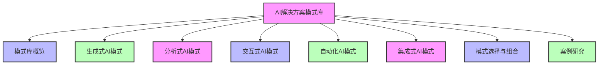

### 学习目标
1. 理解AI解决方案模式的概念和重要性
2. 掌握常见AI解决方案模式的分类和特点
3. 了解生成式AI、分析式AI、交互式AI、自动化AI和集成式AI模式
4. 学会根据业务需求选择合适的AI解决方案模式
5. 掌握AI解决方案模式的组合应用方法
6. 了解AI解决方案模式的最佳实践和案例
7. 能够将AI解决方案模式应用于实际业务场景

### 核心知识点
- AI解决方案模式的概念和重要性
- 生成式AI模式（内容生成、创意设计、代码生成等）
- 分析式AI模式（数据分析、预测分析、异常检测等）
- 交互式AI模式（聊天机器人、虚拟助手、语音交互等）
- 自动化AI模式（流程自动化、决策自动化、智能调度等）
- 集成式AI模式（AI+IoT、AI+RPA、AI+大数据等）
- AI解决方案模式的选择和组合方法
- AI解决方案模式的最佳实践和案例

### 重点难点
- 理解不同AI解决方案模式的适用场景
- 学会根据业务需求选择合适的AI解决方案模式
- 掌握AI解决方案模式的组合应用方法
- 将AI解决方案模式应用于实际业务场景

### 本章导读

AI解决方案模式是AI解决方案专家的工具箱，它包含了各种经过验证的、可复用的AI应用设计模板。这些模式可以帮助我们快速设计和部署AI解决方案，避免重复造轮子，提高解决方案的质量和可靠性。

想象一下，当你面对一个具体的业务问题时，比如需要自动化客户服务、生成营销内容、分析销售数据等，你不需要从零开始设计AI解决方案。相反，你可以从AI解决方案模式库中选择合适的模式，根据具体业务需求进行调整和定制，快速构建出高质量的AI解决方案。

本章将带你了解AI解决方案模式库的核心概念和常见模式，包括生成式AI模式、分析式AI模式、交互式AI模式、自动化AI模式和集成式AI模式。通过学习这些模式，你将能够根据业务需求选择合适的AI解决方案模式，并将它们应用于实际业务场景。

---

## 11.1 AI解决方案模式概览（建筑设计类比）

AI解决方案模式就像建筑设计中的设计模板，不同的模板适用于不同的建筑类型，如住宅、商业楼、医院等。同样，不同的AI解决方案模式适用于不同的业务场景。

### 11.1.1 什么是AI解决方案模式（建筑设计模板类比）

AI解决方案模式是指在特定业务场景下，经过验证的、可复用的AI应用设计模板，就像建筑设计中的标准化设计模板一样。它描述了AI技术如何与业务流程相结合，解决特定的业务问题，就像建筑设计模板描述了如何使用建筑材料和技术构建特定类型的建筑一样。

**AI解决方案模式的核心要素（建筑设计要素对应）**：
- **问题场景**：模式适用的业务问题和场景（相当于建筑设计模板适用的建筑类型和用途）
- **技术组件**：实现该模式所需的AI技术和工具（相当于建筑设计所需的建筑材料和技术）
- **架构设计**：AI系统的架构和组件关系（相当于建筑的结构设计和布局）
- **实现步骤**：构建该解决方案的步骤和流程（相当于建筑的施工步骤和流程）
- **最佳实践**：实施该模式的经验和建议（相当于建筑施工的最佳实践和安全规范）
- **成功指标**：衡量解决方案成功的指标（相当于建筑的质量标准和验收指标）

### 11.1.2 AI解决方案模式的重要性（建筑设计模板的重要性对应）

**1. 提高解决方案质量**：
- 经过验证的模式可以减少设计错误和风险（相当于使用经过验证的建筑设计模板可以减少建筑设计错误和安全风险）
- 基于最佳实践，提高解决方案的可靠性和性能（相当于按照建筑施工最佳实践可以提高建筑的质量和安全性）

**2. 加快解决方案交付速度**：
- 复用已有的设计模板，减少从零开始的设计时间（相当于使用现成的建筑设计模板可以减少建筑设计时间）
- 标准化的实现流程，提高开发效率（相当于按照标准化的施工流程可以提高建筑施工效率）

**3. 降低解决方案成本**：
- 减少重复开发和测试工作（相当于使用标准化设计模板可以减少重复的设计和审批工作）
- 降低维护和升级成本（相当于按照标准设计建造的建筑更容易维护和升级）

**4. 促进知识共享和积累**：
- 记录和分享成功的解决方案经验（相当于建筑设计模板可以记录和分享成功的建筑设计经验）
- 促进团队内部的知识共享和学习（相当于建筑设计模板可以促进建筑师之间的知识共享和学习）

**5. 便于沟通和协作**：
- 标准化的模式语言，便于团队成员之间的沟通（相当于使用标准化的建筑设计语言便于建筑师、工程师和施工人员之间的沟通）
- 便于与客户和合作伙伴交流解决方案设计（相当于使用建筑设计模板便于与客户和承包商交流建筑设计方案）

### 11.1.3 AI解决方案模式的分类

根据AI技术的应用方式和业务价值，AI解决方案模式可以分为以下几类：

| 模式类型 | 核心特点 | 典型应用场景 |
|----------|----------|--------------|
| 生成式AI模式 | 自动生成内容、创意或代码 | 内容创作、创意设计、代码生成等 |
| 分析式AI模式 | 分析数据、发现规律、预测趋势 | 数据分析、预测分析、异常检测等 |
| 交互式AI模式 | 与人类进行自然语言或语音交互 | 聊天机器人、虚拟助手、语音交互等 |
| 自动化AI模式 | 自动化业务流程和决策 | 流程自动化、决策自动化、智能调度等 |
| 集成式AI模式 | 与其他技术或系统集成 | AI+IoT、AI+RPA、AI+大数据等 |

---

## 11.2 生成式AI模式

生成式AI模式是指利用生成式AI技术（如大语言模型、图像生成模型等）自动生成内容、创意或代码的解决方案模式。

### 11.2.1 内容生成模式

**问题场景**：需要大量高质量的内容，如营销文案、产品描述、新闻报道等。

**技术组件**：
- 大语言模型（如GPT-4、Claude等）
- 内容管理系统
- 人工审核流程

**架构设计**：

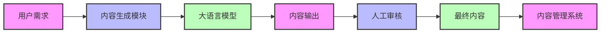

**实现步骤**：
1. 收集和分析用户的内容需求
2. 设计提示词（Prompt），指导大语言模型生成内容
3. 使用大语言模型生成初步内容
4. 人工审核和编辑生成的内容
5. 将最终内容存入内容管理系统

**最佳实践**：
- 设计清晰、具体的提示词，提高生成内容的质量
- 建立内容审核流程，确保内容的准确性和合规性
- 定期评估生成内容的质量，优化提示词和模型选择

**成功指标**：
- 内容生成速度（如每分钟生成的字数）
- 内容质量评分（如人工审核通过率）
- 内容的点击率和转化率

**案例示例**：
某电商平台使用大语言模型自动生成产品描述。通过设计特定的提示词，如"为一款智能手表生成吸引人的产品描述，突出其健康监测和续航能力"，模型可以生成高质量的产品描述。人工审核后，这些描述被发布到电商平台，显著提高了产品页面的转化率。

### 11.2.2 创意设计模式

**问题场景**：需要创意设计，如海报、Logo、产品设计等。

**技术组件**：
- 图像生成模型（如Midjourney、DALL-E等）
- 设计工具（如Photoshop、Figma等）
- 人工设计团队

**架构设计**：

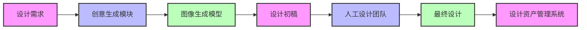

**实现步骤**：
1. 收集和分析设计需求
2. 设计提示词，指导图像生成模型生成创意
3. 使用图像生成模型生成设计初稿
4. 人工设计团队对初稿进行修改和优化
5. 将最终设计存入设计资产管理系统

**最佳实践**：
- 结合文本描述和参考图像，提高生成设计的准确性
- 建立设计风格指南，确保生成设计符合品牌形象
- 设计团队与AI协作，充分发挥各自优势

**成功指标**：
- 设计生成速度（如每天生成的设计稿数量）
- 设计质量评分（如客户满意度）
- 设计的转化率和点击率

**案例示例**：
某广告公司使用图像生成模型为客户生成海报设计。通过输入"为一款环保产品设计海报，使用绿色主题，突出自然元素"，模型可以生成多种创意海报设计。设计团队选择其中最符合客户需求的设计，进行进一步优化后提交给客户，显著提高了设计效率和客户满意度。

### 11.2.3 代码生成模式

**问题场景**：需要快速开发和维护软件代码，如API开发、前端界面开发等。

**技术组件**：
- 代码生成模型（如GitHub Copilot、CodeLlama等）
- 集成开发环境（IDE）
- 代码测试和部署工具

**架构设计**：

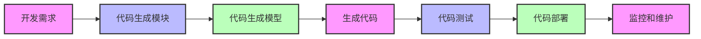

**实现步骤**：
1. 分析开发需求，确定代码功能和架构
2. 设计提示词，指导代码生成模型生成代码
3. 使用代码生成模型生成初步代码
4. 对生成的代码进行测试和调试
5. 部署代码到生产环境
6. 监控和维护运行中的代码

**最佳实践**：
- 设计清晰的代码需求，提高生成代码的准确性
- 建立代码审查流程，确保代码质量和安全性
- 结合自动化测试工具，提高代码测试效率

**成功指标**：
- 代码生成速度（如每天生成的代码行数）
- 代码质量评分（如测试通过率）
- 开发周期缩短比例

**案例示例**：
某软件公司使用代码生成模型辅助开发API接口。通过输入"生成一个用于用户认证的REST API，使用Python和Flask框架，包含登录、注册和令牌验证功能"，模型可以生成完整的API代码。开发人员对代码进行审查和测试后，部署到生产环境，显著缩短了开发周期。

---

## 11.3 分析式AI模式

分析式AI模式是指利用AI技术分析数据、发现规律、预测趋势的解决方案模式。

### 11.3.1 数据分析模式

**问题场景**：需要从大量数据中提取有价值的信息和洞察，如销售数据分析、客户行为分析等。

**技术组件**：
- 数据分析工具（如Tableau、Power BI等）
- 机器学习模型（如聚类、分类等）
- 数据仓库或数据湖

**架构设计**：

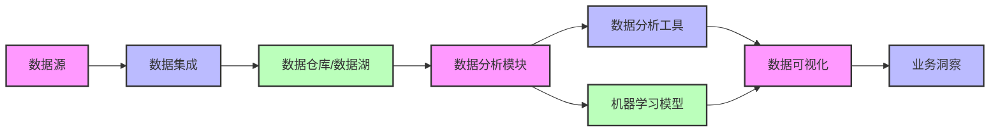

**实现步骤**：
1. 收集和整合来自不同来源的数据
2. 将数据存储到数据仓库或数据湖
3. 使用数据分析工具和机器学习模型分析数据
4. 生成数据可视化报告和业务洞察
5. 将业务洞察应用于业务决策

**最佳实践**：
- 确保数据的质量和完整性，避免垃圾进垃圾出
- 结合业务知识，解释数据分析结果
- 定期更新分析模型，适应数据变化

**成功指标**：
- 数据处理速度（如每天处理的数据量）
- 分析结果的准确性（如预测准确率）
- 业务洞察的价值（如带来的收入增长）

**案例示例**：
某零售企业使用数据分析模式分析销售数据。通过整合线上和线下销售数据，使用机器学习模型识别销售趋势和客户偏好，生成可视化报告。基于这些报告，企业调整了产品库存和营销策略，提高了销售额和客户满意度。

### 11.3.2 预测分析模式

**问题场景**：需要预测未来的趋势和结果，如销售预测、客户流失预测、设备故障预测等。

**技术组件**：
- 预测模型（如回归、时间序列分析等）
- 特征工程工具
- 预测可视化工具

**架构设计**：

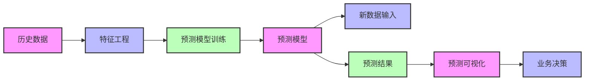

**实现步骤**：
1. 收集和整理历史数据
2. 进行特征工程，提取有用的特征
3. 训练预测模型
4. 使用训练好的模型对新数据进行预测
5. 可视化预测结果
6. 基于预测结果制定业务决策

**最佳实践**：
- 选择合适的预测模型，根据数据类型和问题特点
- 定期评估和更新预测模型，确保预测准确性
- 结合业务知识，解释预测结果的含义

**成功指标**：
- 预测准确率（如销售预测与实际销售的偏差）
- 预测结果的及时性（如提前预测的时间长度）
- 预测带来的业务价值（如库存成本降低）

**案例示例**：
某制造企业使用预测分析模式预测设备故障。通过收集设备的传感器数据，训练机器学习模型预测设备故障的可能性。当模型检测到设备可能出现故障时，企业会提前安排维护，避免了计划外停机，降低了维护成本和生产损失。

### 11.3.3 异常检测模式

**问题场景**：需要从数据中检测异常情况，如欺诈检测、网络安全威胁检测、生产质量异常检测等。

**技术组件**：
- 异常检测算法（如孤立森林、聚类等）
- 实时数据流处理工具（如Apache Kafka、Flink等）
- 告警系统

**架构设计**：

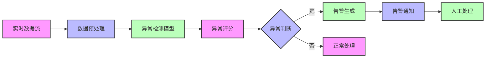

**实现步骤**：
1. 收集和预处理实时数据流
2. 使用异常检测模型对数据进行评分
3. 根据评分判断是否为异常情况
4. 对异常情况生成告警
5. 通知相关人员处理异常
6. 人工处理异常情况

**最佳实践**：
- 结合业务规则和机器学习模型，提高异常检测准确性
- 建立告警优先级机制，避免告警风暴
- 定期评估和调整异常检测阈值

**成功指标**：
- 异常检测准确率（如真阳性率、假阳性率）
- 异常检测的及时性（如从发生到检测到的时间）
- 异常处理的效率（如平均处理时间）

**案例示例**：
某银行使用异常检测模式检测信用卡欺诈交易。通过实时分析信用卡交易数据，使用机器学习模型检测异常交易模式，如不寻常的交易金额、交易地点或交易时间。当检测到异常交易时，系统会立即生成告警，银行工作人员会联系客户核实交易，防止欺诈损失。

---

## 11.4 交互式AI模式

交互式AI模式是指利用AI技术与人类进行自然语言或语音交互的解决方案模式。

### 11.4.1 聊天机器人模式

**问题场景**：需要自动化处理客户咨询和服务请求，如在线客服、技术支持等。

**技术组件**：
- 聊天机器人平台（如Dialogflow、Rasa等）
- 自然语言处理（NLP）模型
- 知识库或FAQ系统

**架构设计**：

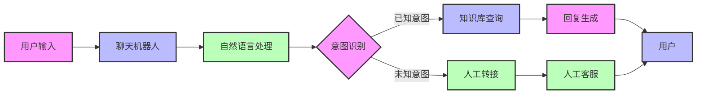

**实现步骤**：
1. 收集和整理常见问题和回答，构建知识库
2. 设计聊天机器人的对话流程和意图
3. 训练自然语言处理模型，识别用户意图
4. 部署聊天机器人到网站、APP或社交媒体平台
5. 监控聊天机器人的运行情况，定期优化

**最佳实践**：
- 设计清晰的对话流程，提高用户体验
- 确保聊天机器人能够正确识别用户意图
- 建立人工转接机制，处理复杂或未知问题

**成功指标**：
- 聊天机器人解决问题的比例（如自助服务率）
- 用户满意度评分（如CSAT）
- 平均响应时间

**案例示例**：
某电商平台使用聊天机器人处理客户咨询。客户可以通过网站或APP与聊天机器人交互，询问订单状态、产品信息、退换货政策等。聊天机器人能够快速回答常见问题，对于复杂问题则转接给人工客服。通过聊天机器人，平台显著提高了客户服务效率，降低了客服成本。

### 11.4.2 虚拟助手模式

**问题场景**：需要为用户提供个性化的助手服务，如日程管理、信息查询、任务提醒等。

**技术组件**：
- 虚拟助手平台（如Amazon Alexa、Google Assistant等）
- 语音识别和合成技术
- 第三方服务集成（如日历、邮件、天气等）

**架构设计**：

```mermaid
graph LR
    A[用户语音/文本] --> B[虚拟助手]
    B --> C[语音识别/自然语言处理]
    C --> D[意图识别]
    D --> E[任务执行]
    E --> F[第三方服务集成]
    F --> G[结果生成]
    G --> H[语音合成/文本输出]
    H --> I[用户]
    
    style A fill:#f9f,stroke:#333,stroke-width:2px
    style B fill:#bbf,stroke:#333,stroke-width:2px
    style C fill:#bfb,stroke:#333,stroke-width:2px
    style D fill:#f9f,stroke:#333,stroke-width:2px
    style E fill:#bbf,stroke:#333,stroke-width:2px
    style F fill:#bfb,stroke:#333,stroke-width:2px
    style G fill:#f9f,stroke:#333,stroke-width:2px
    style H fill:#bbf,stroke:#333,stroke-width:2px
    style I fill:#bfb,stroke:#333,stroke-width:2px
```

**实现步骤**：
1. 确定虚拟助手的核心功能和服务范围
2. 集成第三方服务，如日历、邮件、天气等
3. 训练语音识别和自然语言处理模型
4. 设计虚拟助手的对话风格和个性化设置
5. 部署虚拟助手到设备或平台
6. 收集用户反馈，定期优化功能和性能

**最佳实践**：
- 提供个性化的服务，根据用户习惯和偏好调整
- 确保虚拟助手的响应准确、及时
- 保护用户隐私，安全处理用户数据

**成功指标**：
- 虚拟助手的使用频率（如每日活跃用户数）
- 用户满意度评分
- 完成任务的成功率

**案例示例**：
某企业为员工提供了一款虚拟助手，用于管理工作日程、查询公司政策、预订会议室等。员工可以通过语音或文本与虚拟助手交互，例如说"帮我预订明天下午2点到3点的会议室"，虚拟助手会自动查询会议室可用性并完成预订。通过虚拟助手，企业提高了员工的工作效率，减少了行政事务的处理时间。

### 11.4.3 语音交互模式

**问题场景**：需要通过语音与设备或系统进行交互，如智能音箱、车载系统、智能家居设备等。

**技术组件**：
- 语音识别系统（如ASR）
- 语音合成系统（如TTS）
- 自然语言理解（NLU）系统

**架构设计**：

```mermaid
graph LR
    A[用户语音输入] --> B[语音识别ASR]
    B --> C[文本]
    C --> D[自然语言理解NLU]
    D --> E[意图和实体]
    E --> F[业务逻辑处理]
    F --> G[响应生成]
    G --> H[语音合成TTS]
    H --> I[语音输出]
    I --> J[用户]
    
    style A fill:#f9f,stroke:#333,stroke-width:2px
    style B fill:#bbf,stroke:#333,stroke-width:2px
    style C fill:#bfb,stroke:#333,stroke-width:2px
    style D fill:#f9f,stroke:#333,stroke-width:2px
    style E fill:#bbf,stroke:#333,stroke-width:2px
    style F fill:#bfb,stroke:#333,stroke-width:2px
    style G fill:#f9f,stroke:#333,stroke-width:2px
    style H fill:#bbf,stroke:#333,stroke-width:2px
    style I fill:#bfb,stroke:#333,stroke-width:2px
    style J fill:#f9f,stroke:#333,stroke-width:2px
```

**实现步骤**：
1. 确定语音交互的使用场景和功能
2. 选择合适的语音识别和合成技术
3. 设计语音交互的对话流程和意图
4. 训练自然语言理解模型
5. 部署语音交互系统到设备或平台
6. 测试和优化语音交互体验

**最佳实践**：
- 设计简洁、明确的语音指令，避免复杂的句式
- 提供清晰的语音反馈，让用户知道系统正在处理
- 支持多种语言和口音，提高系统的适应性

**成功指标**：
- 语音识别准确率
- 语音交互的成功率
- 用户满意度评分

**案例示例**：
某汽车制造商为其新款汽车配备了语音交互系统。驾驶员可以通过语音控制导航、音乐、空调等功能，例如说"导航到最近的加油站"或"将温度调高2度"。语音交互系统能够准确识别驾驶员的指令，并执行相应的操作，提高了驾驶安全性和便利性。

---

## 11.5 自动化AI模式

自动化AI模式是指利用AI技术自动化业务流程和决策的解决方案模式。

### 11.5.1 流程自动化模式

**问题场景**：需要自动化处理重复性、规则性的业务流程，如发票处理、订单处理、员工入职流程等。

**技术组件**：
- 机器人流程自动化（RPA）工具（如UiPath、Automation Anywhere等）
- 光学字符识别（OCR）技术
- 工作流管理系统

**架构设计**：

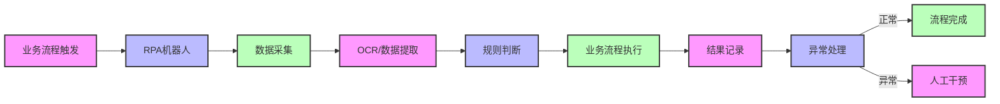

**实现步骤**：
1. 分析现有业务流程，识别可自动化的环节
2. 设计自动化流程，定义规则和逻辑
3. 开发和部署RPA机器人
4. 测试自动化流程的准确性和效率
5. 监控和优化自动化流程

**最佳实践**：
- 从简单、高价值的流程开始自动化，逐步扩展
- 建立流程监控和异常处理机制
- 定期评估自动化流程的效果，持续优化

**成功指标**：
- 流程处理时间缩短比例
- 流程处理成本降低比例
- 流程处理准确率

**案例示例**：
某财务部门使用RPA机器人自动化发票处理流程。RPA机器人从邮箱中获取发票，使用OCR技术提取发票信息，验证发票的准确性和合规性，然后将发票信息录入财务系统并安排付款。通过自动化发票处理流程，财务部门显著提高了处理效率，减少了人工错误。

### 11.5.2 决策自动化模式

**问题场景**：需要自动化做出业务决策，如信贷审批、保险理赔审核、广告投放优化等。

**技术组件**：
- 决策管理系统
- 机器学习模型（如分类、回归等）
- 规则引擎

**架构设计**：

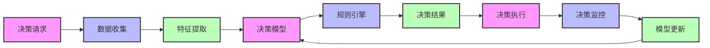

**实现步骤**：
1. 定义决策问题和目标
2. 收集和整理决策所需的数据
3. 训练决策模型，如机器学习模型或规则引擎
4. 部署决策模型到生产环境
5. 监控决策结果，评估决策质量
6. 定期更新和优化决策模型

**最佳实践**：
- 确保决策过程的透明度和可解释性
- 建立决策审计机制，记录决策过程和结果
- 结合人工审核，处理高风险决策

**成功指标**：
- 决策准确率
- 决策速度（如每秒处理的决策数量）
- 决策带来的业务价值（如风险降低、收入增加）

**案例示例**：
某银行使用决策自动化模式处理信贷审批。当客户申请贷款时，系统会自动收集客户的信用记录、收入情况、负债情况等数据，使用机器学习模型评估客户的信用风险，然后根据预设的规则自动做出贷款审批决策。对于高风险客户，系统会将申请转交给人工审核。通过决策自动化，银行显著提高了信贷审批效率，同时降低了信用风险。

### 11.5.3 智能调度模式

**问题场景**：需要优化资源调度和分配，如车辆调度、员工排班、生产调度等。

**技术组件**：
- 优化算法（如遗传算法、模拟退火等）
- 实时数据处理工具
- 可视化调度系统

**架构设计**：

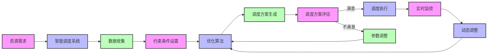

**实现步骤**：
1. 定义调度问题和目标，如最小化成本、最大化效率等
2. 收集和整理资源和需求数据
3. 设置调度约束条件，如资源可用性、时间限制等
4. 选择合适的优化算法，生成调度方案
5. 评估和调整调度方案
6. 执行调度方案，并实时监控和调整

**最佳实践**：
- 考虑多种约束条件，确保调度方案的可行性
- 建立实时监控机制，及时调整调度方案
- 结合历史数据和预测，优化长期调度策略

**成功指标**：
- 资源利用率（如车辆利用率、员工利用率）
- 调度成本降低比例
- 客户满意度（如准时交付率）

**案例示例**：
某物流企业使用智能调度模式优化车辆调度。系统会根据订单需求、车辆位置、路况等实时数据，使用优化算法生成最优的车辆调度方案，包括路线规划、车辆分配和时间安排。通过智能调度，企业提高了车辆利用率，降低了运输成本，同时提高了订单的准时交付率。

---

## 11.6 集成式AI模式

集成式AI模式是指将AI技术与其他技术或系统集成，形成更强大的解决方案模式。

### 11.6.1 AI+IoT模式

**问题场景**：需要将AI技术与物联网（IoT）设备集成，实现智能感知、分析和控制，如智能工厂、智能城市、智能家居等。

**技术组件**：
- IoT设备和传感器
- 边缘计算平台
- 云平台
- 机器学习模型

**架构设计**：

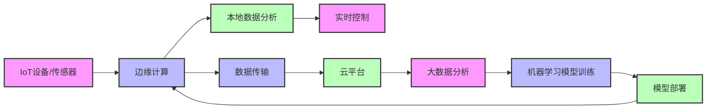

**实现步骤**：
1. 部署IoT设备和传感器，收集实时数据
2. 在边缘设备上进行本地数据分析和实时控制
3. 将数据传输到云平台，进行大数据分析
4. 训练机器学习模型，优化分析和控制算法
5. 将训练好的模型部署到边缘设备，实现智能控制
6. 持续监控和优化系统性能

**最佳实践**：
- 结合边缘计算和云计算，平衡实时性和扩展性
- 确保数据的安全性和隐私保护
- 设计模块化的架构，便于系统扩展和升级

**成功指标**：
- 设备连接成功率
- 数据传输延迟
- 系统的可靠性和可用性
- 智能控制带来的效益（如能耗降低、效率提高）

**案例示例**：
某智能工厂使用AI+IoT模式优化生产流程。工厂部署了大量IoT传感器，实时收集设备状态、生产数据、环境数据等。边缘计算设备对这些数据进行实时分析，检测设备故障和生产异常，然后自动调整生产参数或触发维护警报。同时，数据被传输到云平台，用于训练机器学习模型，预测设备故障和优化生产计划。通过AI+IoT集成，工厂提高了生产效率，降低了设备故障和维护成本。

### 11.6.2 AI+RPA模式

**问题场景**：需要将AI技术与机器人流程自动化（RPA）集成，实现更复杂的业务流程自动化，如智能文档处理、客户服务自动化等。

**技术组件**：
- RPA工具
- AI技术（如OCR、NLP、机器学习等）
- 业务系统集成

**架构设计**：

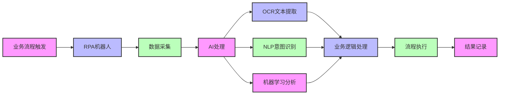

**实现步骤**：
1. 分析业务流程，识别需要AI和RPA结合的环节
2. 部署RPA机器人，自动化重复性流程
3. 集成AI技术，如OCR、NLP、机器学习等，处理非结构化数据和复杂决策
4. 设计AI和RPA的协作流程，确保无缝集成
5. 测试和优化集成系统
6. 监控系统运行情况，持续改进

**最佳实践**：
- 明确AI和RPA的分工，发挥各自优势
- 确保数据在AI和RPA系统之间的安全传输
- 建立统一的监控和管理平台，便于系统维护

**成功指标**：
- 流程自动化覆盖率
- 流程处理时间缩短比例
- 错误率降低比例
- 业务价值提升（如成本降低、效率提高）

**案例示例**：
某保险公司使用AI+RPA模式自动化理赔处理。当客户提交理赔申请时，RPA机器人会自动收集理赔文档，使用OCR技术提取文档信息，然后使用NLP技术理解理赔申请的内容。接下来，系统会使用机器学习模型评估理赔的真实性和赔付金额，最后由RPA机器人完成理赔流程的执行，如录入系统、发送通知等。通过AI+RPA集成，保险公司显著提高了理赔处理效率，同时降低了理赔欺诈的风险。

### 11.6.3 AI+大数据模式

**问题场景**：需要将AI技术与大数据技术集成，从海量数据中提取更深入的洞察和价值，如客户画像、市场预测、风险评估等。

**技术组件**：
- 大数据平台（如Hadoop、Spark等）
- 数据仓库或数据湖
- 机器学习和深度学习模型
- 数据可视化工具

**架构设计**：

```mermaid
graph LR
    A[数据源] --> B[数据集成]
    B --> C[大数据平台]
    C --> D[数据处理]
    D --> E[数据仓库/数据湖]
    E --> F[AI分析模块]
    F --> G[机器学习训练]
    G --> H[模型部署]
    H --> I[数据分析]
    I --> J[数据可视化]
    J --> K[业务洞察]
    
    style A fill:#f9f,stroke:#333,stroke-width:2px
    style B fill:#bbf,stroke:#333,stroke-width:2px
    style C fill:#bfb,stroke:#333,stroke-width:2px
    style D fill:#f9f,stroke:#333,stroke-width:2px
    style E fill:#bbf,stroke:#333,stroke-width:2px
    style F fill:#bfb,stroke:#333,stroke-width:2px
    style G fill:#f9f,stroke:#333,stroke-width:2px
    style H fill:#bbf,stroke:#333,stroke-width:2px
    style I fill:#bfb,stroke:#333,stroke-width:2px
    style J fill:#f9f,stroke:#333,stroke-width:2px
    style K fill:#bbf,stroke:#333,stroke-width:2px
```

**实现步骤**：
1. 收集和整合来自不同来源的大数据
2. 使用大数据平台处理和存储数据
3. 训练AI模型，如机器学习或深度学习模型
4. 部署AI模型到大数据平台
5. 使用AI模型分析大数据，提取业务洞察
6. 可视化分析结果，支持业务决策

**最佳实践**：
- 确保大数据的质量和完整性，为AI分析提供可靠基础
- 选择合适的AI模型，根据数据类型和分析目标
- 建立数据治理机制，确保数据的安全性和合规性

**成功指标**：
- 数据处理速度（如每秒处理的数据量）
- 分析结果的准确性和价值
- 业务洞察的应用效果（如收入增长、成本降低）

**案例示例**：
某电商平台使用AI+大数据模式分析客户行为。平台收集了大量客户的浏览记录、购买历史、搜索行为等数据，使用大数据平台存储和处理这些数据。然后，平台使用机器学习模型分析客户行为，生成客户画像，预测客户的购买意图，推荐个性化的产品。通过AI+大数据集成，平台提高了产品推荐的准确性，增加了销售额，同时提高了客户满意度。

---

## 11.7 AI解决方案模式的选择与组合

### 11.7.1 如何选择合适的AI解决方案模式

选择合适的AI解决方案模式需要考虑以下几个因素：

**1. 业务问题和目标**：
- 明确需要解决的业务问题和期望达到的目标
- 例如，是需要生成内容、分析数据、自动化流程还是优化决策

**2. 数据可用性和质量**：
- 评估是否有足够的数据支持AI解决方案
- 数据的质量和完整性如何
- 例如，分析式AI模式需要大量高质量的数据

**3. 技术成熟度和可行性**：
- 评估所选AI技术的成熟度和可行性
- 考虑企业的技术能力和资源
- 例如，生成式AI模式需要强大的计算资源和专业的AI团队

**4. 成本和收益分析**：
- 评估AI解决方案的成本，包括技术投资、人力成本、维护成本等
- 预测解决方案可能带来的收益，如成本降低、效率提高、收入增加等
- 确保投资回报率（ROI）符合企业的预期

**5. 风险和合规考虑**：
- 评估AI解决方案可能带来的风险，如数据隐私风险、算法偏见风险、业务中断风险等
- 确保解决方案符合相关法律法规和行业标准
- 例如，金融行业的AI解决方案需要符合严格的监管要求

### 11.7.2 AI解决方案模式的组合应用

在实际业务场景中，往往需要组合多种AI解决方案模式，才能解决复杂的业务问题。以下是一些常见的模式组合示例：

**1. 生成式AI + 交互式AI**：
- 例如，使用生成式AI生成个性化的营销内容，然后通过交互式AI（如聊天机器人）分发给客户
- 或者，使用交互式AI收集客户需求，然后使用生成式AI生成定制化的解决方案

**2. 分析式AI + 自动化AI**：
- 例如，使用分析式AI分析销售数据，发现销售趋势和客户偏好，然后使用自动化AI调整营销策略和库存管理
- 或者，使用分析式AI检测生产质量异常，然后使用自动化AI调整生产参数

**3. 集成式AI + 自动化AI**：
- 例如，使用AI+IoT模式收集设备数据，然后使用自动化AI进行设备维护和故障预测
- 或者，使用AI+大数据模式分析客户行为，然后使用自动化AI进行个性化推荐

**4. 多种模式的复杂组合**：
- 例如，在智能工厂中，可能需要组合AI+IoT、分析式AI、自动化AI等多种模式，实现从数据收集、分析到决策执行的全流程智能化

### 11.7.3 模式选择决策流程

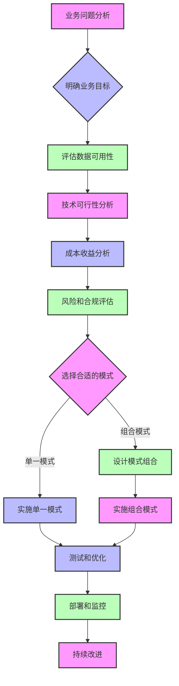

---

## 11.8 AI解决方案模式案例研究

### 11.8.1 案例1：电商平台的AI解决方案组合

**背景**：
某电商平台面临着激烈的市场竞争，需要提高客户满意度，增加销售额，降低运营成本。

**解决方案**：
该平台采用了多种AI解决方案模式的组合：

1. **生成式AI模式**：
   - 使用大语言模型自动生成产品描述和营销内容
   - 使用图像生成模型生成产品图片和广告创意

2. **分析式AI模式**：
   - 使用数据分析工具分析销售数据和客户行为
   - 使用预测模型预测销售趋势和客户需求
   - 使用异常检测模型检测欺诈交易

3. **交互式AI模式**：
   - 部署聊天机器人，自动化客户服务
   - 提供虚拟助手，帮助客户查找产品和下订单

4. **自动化AI模式**：
   - 使用RPA机器人自动化订单处理和物流管理
   - 使用智能调度系统优化仓库和配送

5. **集成式AI模式**：
   - 集成AI+大数据，生成客户画像和个性化推荐
   - 集成AI+IoT，优化供应链管理

**结果**：
- 客户满意度提高了20%
- 销售额增长了15%
- 运营成本降低了25%
- 欺诈交易减少了30%

### 11.8.2 案例2：制造企业的智能工厂解决方案

**背景**：
某制造企业面临着生产效率低下、设备故障频繁、质量不稳定等问题，需要转型升级为智能工厂。

**解决方案**：
该企业采用了AI+IoT和自动化AI的组合模式：

1. **AI+IoT模式**：
   - 部署了大量IoT传感器，实时收集设备状态、生产数据、环境数据等
   - 在边缘设备上进行本地数据分析，实时检测设备故障和生产异常
   - 将数据传输到云平台，用于训练机器学习模型

2. **自动化AI模式**：
   - 使用机器学习模型预测设备故障，实现 predictive maintenance
   - 使用智能调度系统优化生产计划和资源分配
   - 使用自动化控制系统调整生产参数，提高产品质量

**结果**：
- 设备故障停机时间减少了40%
- 生产效率提高了25%
- 产品合格率提高了15%
- 生产成本降低了20%

### 11.8.3 案例3：金融机构的智能风控解决方案

**背景**：
某金融机构面临着信用风险高、欺诈交易多、审批效率低等问题，需要加强风险管理。

**解决方案**：
该机构采用了分析式AI和决策自动化的组合模式：

1. **分析式AI模式**：
   - 使用机器学习模型分析客户的信用记录、交易数据、行为数据等
   - 使用异常检测模型检测欺诈交易和异常行为
   - 使用预测模型预测客户的违约风险

2. **决策自动化模式**：
   - 使用决策引擎自动化信贷审批和风险定价
   - 使用RPA机器人自动化风控流程的执行
   - 建立人工审核机制，处理高风险决策

**结果**：
- 信用风险降低了35%
- 欺诈损失减少了40%
- 信贷审批效率提高了60%
- 客户满意度提高了15%

---

## 本章总结

### 知识回顾

1. **AI解决方案模式概览**：
   - AI解决方案模式是经过验证的、可复用的AI应用设计模板
   - 模式的核心要素包括问题场景、技术组件、架构设计、实现步骤、最佳实践和成功指标
   - AI解决方案模式的重要性包括提高解决方案质量、加快交付速度、降低成本、促进知识共享等

2. **生成式AI模式**：
   - 内容生成模式：自动生成营销文案、产品描述等
   - 创意设计模式：生成海报、Logo、产品设计等
   - 代码生成模式：辅助开发API接口、前端界面等

3. **分析式AI模式**：
   - 数据分析模式：从大量数据中提取有价值的信息和洞察
   - 预测分析模式：预测未来的趋势和结果
   - 异常检测模式：从数据中检测异常情况

4. **交互式AI模式**：
   - 聊天机器人模式：自动化处理客户咨询和服务请求
   - 虚拟助手模式：为用户提供个性化的助手服务
   - 语音交互模式：通过语音与设备或系统进行交互

5. **自动化AI模式**：
   - 流程自动化模式：自动化处理重复性、规则性的业务流程
   - 决策自动化模式：自动化做出业务决策
   - 智能调度模式：优化资源调度和分配

6. **集成式AI模式**：
   - AI+IoT模式：将AI技术与物联网设备集成
   - AI+RPA模式：将AI技术与机器人流程自动化集成
   - AI+大数据模式：将AI技术与大数据技术集成

7. **AI解决方案模式的选择与组合**：
   - 选择合适的模式需要考虑业务问题、数据可用性、技术成熟度、成本收益、风险和合规等因素
   - 实际业务场景中往往需要组合多种模式
   - 建立模式选择的决策流程，确保选择合适的模式

8. **AI解决方案模式案例研究**：
   - 电商平台的AI解决方案组合：提高客户满意度，增加销售额，降低运营成本
   - 制造企业的智能工厂解决方案：提高生产效率，降低设备故障，提高产品质量
   - 金融机构的智能风控解决方案：降低信用风险，减少欺诈损失，提高审批效率

### 知识体系梳理

```mermaid
graph TD
    A[AI解决方案模式库] --> B[生成式AI模式]
    A --> C[分析式AI模式]
    A --> D[交互式AI模式]
    A --> E[自动化AI模式]
    A --> F[集成式AI模式]
    A --> G[模式选择与组合]
    
    B --> B1[内容生成]
    B --> B2[创意设计]
    B --> B3[代码生成]
    
    C --> C1[数据分析]
    C --> C2[预测分析]
    C --> C3[异常检测]
    
    D --> D1[聊天机器人]
    D --> D2[虚拟助手]
    D --> D3[语音交互]
    
    E --> E1[流程自动化]
    E --> E2[决策自动化]
    E --> E3[智能调度]
    
    F --> F1[AI+IoT]
    F --> F2[AI+RPA]
    F --> F3[AI+大数据]
    
    G --> G1[模式选择]
    G --> G2[模式组合]
    G --> G3[决策流程]
    
    style A fill:#f9f,stroke:#333,stroke-width:2px
    style B fill:#bbf,stroke:#333,stroke-width:2px
    style C fill:#bfb,stroke:#333,stroke-width:2px
    style D fill:#f9f,stroke:#333,stroke-width:2px
    style E fill:#bbf,stroke:#333,stroke-width:2px
    style F fill:#bfb,stroke:#333,stroke-width:2px
    style G fill:#f9f,stroke:#333,stroke-width:2px
```

### 实践应用场景

**场景1：企业AI解决方案设计**

假设你是一名AI解决方案专家，需要为一家零售企业设计AI解决方案。通过本章学习，你可以：

1. 分析企业的业务问题和目标，如提高销售额、降低成本、提高客户满意度等
2. 评估企业的数据可用性和技术能力
3. 从AI解决方案模式库中选择合适的模式，如生成式AI（内容生成）、分析式AI（数据分析、预测分析）、交互式AI（聊天机器人）、自动化AI（流程自动化）等
4. 设计模式的组合方案，确保各种模式无缝集成
5. 制定实施计划，包括技术选型、架构设计、实施步骤等
6. 建立成功指标，评估解决方案的效果

**场景2：AI解决方案实施管理**

假设你是一名项目经理，负责实施一个AI解决方案项目。通过本章学习，你可以：

1. 基于AI解决方案模式，制定详细的项目计划和时间表
2. 确定项目所需的技术组件和资源
3. 设计项目的测试和验证方案
4. 建立项目的监控和管理机制
5. 制定项目的风险应对策略
6. 确保项目按照最佳实践实施，交付高质量的解决方案

### 下一步学习建议

1. 深入学习需求分析与方案设计（第12章）
2. 了解竞争分析与厂商生态（第13章）
3. 学习演示技巧与客户沟通（第14章）
4. 关注AI解决方案模式的最新发展和趋势
5. 学习行业特定的AI解决方案模式，如金融、制造、医疗等
6. 参与AI解决方案设计和实施的实践项目
7. 加入AI解决方案专家社区，分享和学习经验

通过本章的学习，你已经了解了AI解决方案模式库的核心概念和常见模式。AI解决方案模式是AI解决方案专家的重要工具，它可以帮助你快速设计和部署高质量的AI解决方案。接下来，我们将学习需求分析与方案设计，了解如何将AI解决方案模式应用于实际业务场景，设计出符合客户需求的AI解决方案。

---