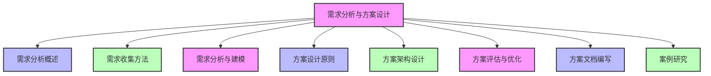
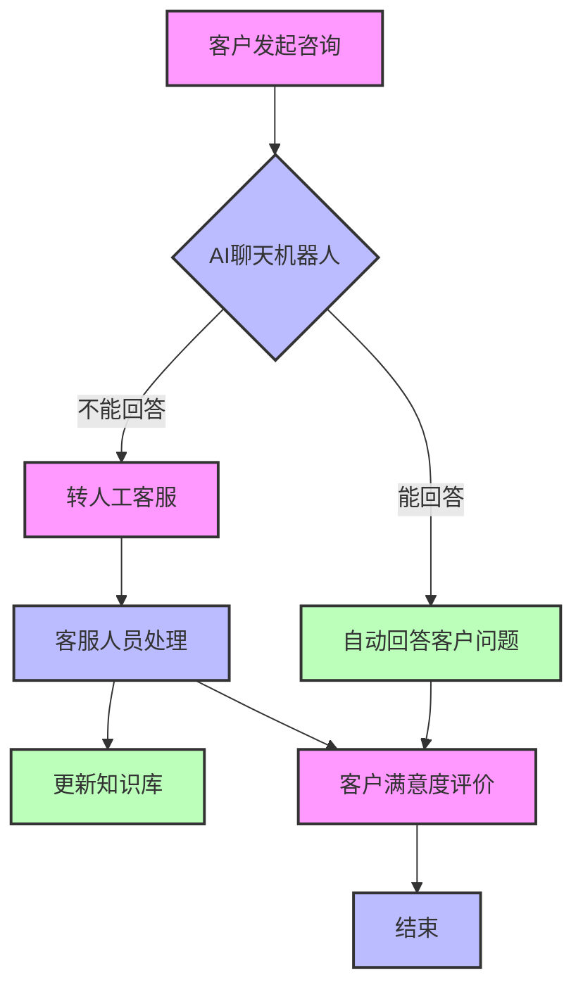
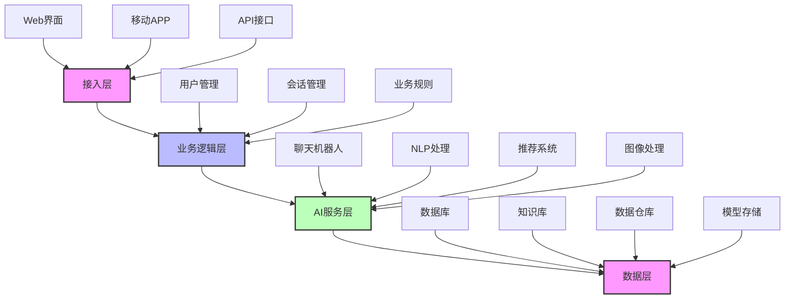
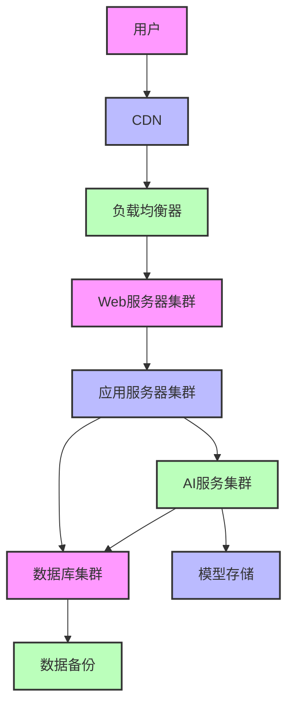
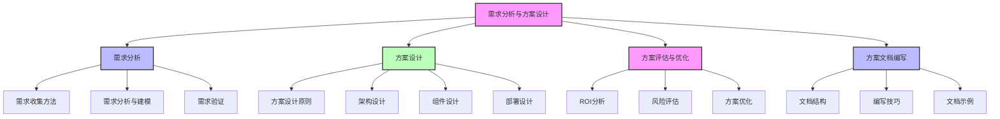

# 第三篇 AI解决方案实战

## 第12章 需求分析与方案设计

### 学习线路图


### 学习目标
1. 理解需求分析在AI解决方案设计中的重要性
2. 掌握需求收集的主要方法和技巧
3. 学会如何进行需求分析和建模
4. 理解AI解决方案设计的基本原则
5. 掌握AI方案架构设计的方法
6. 学会如何评估和优化AI解决方案
7. 掌握AI方案文档编写的要点
8. 了解需求分析与方案设计的实际案例

### 核心知识点
- 需求分析的概念和重要性
- 需求收集方法（访谈、调研、观察等）
- 需求分析与建模（用户故事、流程图、用例图等）
- AI解决方案设计原则（业务价值优先、技术可行性等）
- 方案架构设计（分层架构、组件设计等）
- 方案评估与优化（ROI分析、风险评估等）
- 方案文档编写（内容结构、编写技巧等）
- 需求分析与方案设计案例

### 重点难点
- 如何深入挖掘客户的潜在需求
- 如何平衡业务需求和技术可行性
- 如何将复杂的技术方案转化为业务价值
- 如何评估AI解决方案的ROI和风险
- 如何编写清晰、有效的方案文档

### 本章导读

想象一下，你是一名AI解决方案专家，接到了一个客户的需求："我们需要一个AI系统来提高客户服务质量"。这是一个非常模糊的需求，你需要做的第一件事就是深入了解客户的具体需求：他们的客户服务现状如何？存在哪些问题？他们期望通过AI系统解决什么具体问题？期望达到什么效果？预算是多少？时间要求是什么？

这个过程就是需求分析。需求分析是AI解决方案设计的第一步，也是最关键的一步。如果需求分析不到位，后面的方案设计和实施都会出现问题。

本章将带你了解需求分析与方案设计的核心概念和方法，包括需求收集、需求分析、方案设计、方案评估和方案文档编写等。通过学习这些内容，你将能够掌握AI解决方案专家的核心技能，从模糊的客户需求出发，设计出高质量的AI解决方案。

---

## 12.1 需求分析概述（装修设计类比）

需求分析就像装修房子前的需求调研，在开始装修前，你需要了解业主的需求、喜好、预算和时间要求，这样才能设计出符合业主期望的装修方案。同样，在设计AI解决方案前，你需要深入了解客户的需求，才能设计出高质量的AI解决方案。

### 12.1.1 什么是需求分析（装修需求调研类比）

需求分析是指通过各种方法和技术，收集、分析和整理客户的需求，明确AI解决方案需要解决的具体问题和实现的目标，就像装修前的需求调研，了解业主想要什么样的装修风格、功能布局、预算和时间要求一样。

**需求分析的核心目标（装修需求调研目标对应）**：
- 明确客户的业务问题和挑战（相当于了解业主对现有房子的不满和期望）
- 确定AI解决方案的功能和性能要求（相当于确定装修的具体功能和质量要求）
- 理解客户的期望和约束条件（相当于了解业主的装修预算和时间要求）
- 为方案设计提供依据（相当于为装修设计提供详细的需求文档）

### 12.1.2 需求分析的重要性（装修需求调研的重要性对应）

**1. 确保解决方案符合客户需求**：
- 避免开发出不符合客户期望的解决方案（相当于避免装修出不符合业主期望的房子）
- 提高客户满意度（相当于提高业主的装修满意度）

**2. 降低项目风险**：
- 提前发现和解决需求中的模糊性和矛盾（相当于提前解决业主需求中的矛盾，如想要豪华装修但预算有限）
- 减少后期变更和返工（相当于避免装修过程中的频繁变更，如更改装修风格或功能布局）
- 降低项目延期和超预算的风险（相当于避免装修延期和超预算）

**3. 提高解决方案质量**：
- 基于清晰的需求设计高质量的解决方案（相当于基于清晰的装修需求设计高质量的装修方案）
- 确保解决方案的功能完整性和一致性（相当于确保装修方案的功能完整性和风格一致性）

**4. 促进团队沟通和协作**：
- 建立统一的需求理解（相当于确保装修团队对业主需求有统一的理解）
- 促进技术团队和业务团队的沟通（相当于促进设计师、施工队和业主之间的沟通）

### 12.1.3 AI解决方案设计完整流程

在开始具体的需求分析之前，让我们先了解AI解决方案设计的完整流程，就像是"装修房子的完整步骤"：

```mermaid
graph TD
    subgraph 阶段1[需求探索与定义<br>相当于装修前的需求调研]
        A[1.1 需求收集<br>访谈/调研/观察] --> B[1.2 需求分析<br>问题定义/优先级排序]
        B --> C[1.3 需求确认<br>与客户达成共识]
    end
    
    subgraph 阶段2[方案设计与规划<br>相当于装修设计阶段]
        C --> D[2.1 方案架构设计<br>技术选型/架构图设计]
        D --> E[2.2 功能模块设计<br>核心功能/辅助功能]
        E --> F[2.3 数据规划<br>数据需求/数据流程]
        F --> G[2.4 实施计划<br>时间/资源/风险评估]
    end
    
    subgraph 阶段3[方案评估与优化<br>相当于装修方案评审]
        G --> H[3.1 技术可行性评估<br>技术风险/复杂度]
        H --> I[3.2 业务价值评估<br>ROI/成本效益分析]
        I --> J[3.3 方案优化<br>迭代改进/最佳实践]
    end
    
    subgraph 阶段4[方案交付与实施<br>相当于装修施工阶段]
        J --> K[4.1 方案文档编写<br>技术文档/演示文档]
        K --> L[4.2 方案演示与讲解<br>向客户展示方案]
        L --> M[4.3 方案实施<br>开发/部署/测试]
        M --> N[4.4 方案验收<br>客户确认/交付]
    end
    
    subgraph 阶段5[持续优化与迭代<br>相当于装修后的维护]
        N --> O[5.1 效果评估<br>性能监控/业务指标]
        O --> P[5.2 反馈收集<br>客户反馈/使用数据]
        P --> Q[5.3 方案迭代<br>功能升级/性能优化]
    end
    
    style 阶段1 fill:#E6F3FF,stroke:#333,stroke-width:2px
    style 阶段2 fill:#FFF3E0,stroke:#333,stroke-width:2px
    style 阶段3 fill:#F0FFF0,stroke:#333,stroke-width:2px
    style 阶段4 fill:#FFF0F5,stroke:#333,stroke-width:2px
    style 阶段5 fill:#F5F5F5,stroke:#333,stroke-width:2px
    style A fill:#E0F7FA,stroke:#333,stroke-width:1px
    style B fill:#E0F7FA,stroke:#333,stroke-width:1px
    style C fill:#E0F7FA,stroke:#333,stroke-width:1px
    style D fill:#FFECB3,stroke:#333,stroke-width:1px
    style E fill:#FFECB3,stroke:#333,stroke-width:1px
    style F fill:#FFECB3,stroke:#333,stroke-width:1px
    style G fill:#FFECB3,stroke:#333,stroke-width:1px
    style H fill:#C8E6C9,stroke:#333,stroke-width:1px
    style I fill:#C8E6C9,stroke:#333,stroke-width:1px
    style J fill:#C8E6C9,stroke:#333,stroke-width:1px
    style K fill:#F8BBD0,stroke:#333,stroke-width:1px
    style L fill:#F8BBD0,stroke:#333,stroke-width:1px
    style M fill:#F8BBD0,stroke:#333,stroke-width:1px
    style N fill:#F8BBD0,stroke:#333,stroke-width:1px
    style O fill:#E0E0E0,stroke:#333,stroke-width:1px
    style P fill:#E0E0E0,stroke:#333,stroke-width:1px
    style Q fill:#E0E0E0,stroke:#333,stroke-width:1px
```



**AI解决方案设计流程的核心原则**：
- **业务价值优先**：所有设计决策都要以实现业务价值为核心
- **迭代式设计**：从粗到细，逐步完善方案
- **技术与业务平衡**：在技术可行性和业务需求之间找到最佳平衡点
- **风险可控**：提前识别和评估风险，制定应对策略
- **可落地性**：确保方案具备实际可操作性

### 12.1.4 需求的分类（装修需求分类对应）

**1. 业务需求**：
- 客户的业务目标和期望（相当于业主的装修目标和期望，如"打造温馨舒适的家"、"提高房子的价值"）
- 如"提高客户满意度"、"降低运营成本"、"增加销售额"

**2. 功能需求**：
- AI系统需要具备的具体功能（相当于装修房子需要的具体功能，如"开放式厨房"、"智能家居系统"、"存储空间"）
- 如"自动回答客户问题"、"生成个性化推荐"、"检测异常交易"

**3. 非功能需求**：
- 系统的性能、可靠性、安全性等要求（相当于装修的质量、环保、安全等要求，如"使用环保材料"、"符合安全标准"、"使用寿命长"）
- 如"响应时间不超过1秒"、"系统可用性达到99.9%"、"符合GDPR要求"

**4. 约束条件**：
- 项目的限制条件（相当于装修的限制条件，如"预算30万元"、"装修时间2个月"、"不能改变房子的结构"）
- 如预算、时间、技术栈、现有系统集成要求等

---

## 12.2 需求收集方法

### 12.2.1 客户访谈

客户访谈是最常用的需求收集方法，通过与客户进行面对面或线上交流，了解他们的需求和期望。

**访谈准备**：
- 确定访谈目标和范围
- 制定访谈提纲
- 邀请相关 stakeholders 参与
- 准备录音或记录工具

**访谈技巧**：
- 从开放性问题开始，如"您能介绍一下贵公司的客户服务流程吗？"
- 逐步深入到具体问题，如"在客户服务过程中，您遇到的最大挑战是什么？"
- 倾听客户的需求，不要急于提出解决方案
- 询问"为什么"，挖掘需求背后的原因
- 确认理解，如"您的意思是希望AI系统能够自动处理80%的常见问题，对吗？"

**访谈示例**：
```
访谈者："您能介绍一下贵公司的客户服务现状吗？"
客户："我们目前有50名客服人员，每天处理大约2000个客户咨询。大部分咨询都是重复的问题，如订单查询、退换货政策等。客服人员每天忙于处理这些简单问题，没有时间处理复杂的客户问题。"
访谈者："您希望通过AI系统解决什么具体问题？"
客户："我们希望AI系统能够自动处理常见的客户问题，这样客服人员就可以专注于处理复杂问题，提高客户服务质量。"
访谈者："您期望AI系统达到什么效果？"
客户："我们希望AI系统能够处理至少60%的客户咨询，减少客服人员的工作量，同时提高客户满意度。"
访谈者："您有什么预算和时间要求吗？"
客户："我们的预算是50万元，希望在3个月内完成部署。"
```

### 12.2.2 问卷调查

问卷调查是一种快速收集大量客户需求的方法，适用于需要了解多个客户或用户的需求。

**问卷设计要点**：
- 明确问卷目标和范围
- 问题要清晰、简洁，避免歧义
- 采用多种问题类型，如选择题、填空题、 rating题等
- 从简单问题开始，逐步深入
- 包含开放性问题，收集客户的建议和想法

**问卷示例**：
```
1. 您对目前的客户服务质量满意吗？
   A. 非常满意 B. 满意 C. 一般 D. 不满意 E. 非常不满意

2. 您认为客户服务过程中最需要改进的地方是什么？（可多选）
   A. 响应速度 B. 解决问题的能力 C. 服务态度 D. 知识库的准确性 E. 其他

3. 您是否愿意使用AI聊天机器人来解决常见问题？
   A. 非常愿意 B. 愿意 C. 不确定 D. 不愿意 E. 非常不愿意

4. 您期望AI聊天机器人能够解决哪些类型的问题？（请列举）

5. 您对AI系统的预算预期是多少？
   A. 10万元以下 B. 10-30万元 C. 30-50万元 D. 50-100万元 E. 100万元以上
```

### 12.2.3 现场观察

现场观察是指亲自到客户的工作现场，观察业务流程和工作环境，了解实际存在的问题和需求。

**观察要点**：
- 观察业务流程的各个环节
- 注意工作人员的操作习惯和遇到的问题
- 观察工作环境和设备
- 记录关键数据和指标

**观察示例**：
在一家零售企业的客服中心观察后，你可能会发现：
- 客服人员每天花费大量时间查找订单信息
- 客户经常询问相同的产品信息和退换货政策
- 客服系统响应较慢，影响工作效率
- 客服人员缺乏统一的知识库支持

### 12.2.4 文档分析

文档分析是指通过分析客户现有的文档，如业务流程文档、系统文档、报告等，了解客户的业务和需求。

**分析的文档类型**：
- 业务流程文档
- 系统需求规格说明书
- 数据分析报告
- 客户反馈记录
- 竞争对手分析报告

**文档分析示例**：
通过分析客户的客服系统日志，你可能会发现：
- 80%的客户咨询都是关于订单状态和退换货政策
- 客服人员的平均响应时间是3分钟
- 客户满意度评分是3.5/5.0

### 12.2.5 头脑风暴

头脑风暴是一种创造性的需求收集方法，通过团队讨论，产生新的想法和需求。

**头脑风暴要点**：
- 确定讨论主题和目标
- 邀请不同背景的人员参与
- 鼓励自由发言，不批评他人的想法
- 记录所有想法
- 对想法进行分类和优先级排序

**头脑风暴示例**：
针对客户服务AI系统，头脑风暴可能产生以下想法：
- 自动回答常见问题
- 智能路由，将复杂问题转给合适的客服人员
- 实时提供客服人员知识库支持
- 分析客户情绪，及时干预不满意客户
- 生成客户服务报告和 insights

---

## 12.3 需求分析与建模

### 12.3.1 需求整理与分类

收集到需求后，需要对需求进行整理和分类，确保需求的清晰性和完整性。

**整理步骤**：
1. 合并重复的需求
2. 消除需求中的歧义
3. 分类需求（业务需求、功能需求、非功能需求、约束条件）
4. 确定需求的优先级

**需求优先级确定方法**：
- **MoSCoW方法**：Must have（必须有）、Should have（应该有）、Could have（可以有）、Won't have（不会有）
- **价值-复杂度矩阵**：根据需求的业务价值和实现复杂度，确定优先级

**需求优先级示例**：
| 需求 | 类型 | 优先级 | 理由 |
|------|------|--------|------|
| 自动回答常见问题 | 功能需求 | Must have | 解决客户的核心痛点，减少客服工作量 |
| 智能路由 | 功能需求 | Should have | 提高客服效率，改善客户体验 |
| 实时知识库支持 | 功能需求 | Should have | 帮助客服人员快速解决问题 |
| 客户情绪分析 | 功能需求 | Could have | 提升客户服务质量，但不是核心需求 |
| 生成客户服务报告 | 功能需求 | Could have | 提供数据分析支持，但不是紧急需求 |

### 12.3.2 用户故事

用户故事是一种描述需求的简单方法，通常采用"作为...，我想要...，以便..."的格式。

**用户故事示例**：
- 作为客户，我想要通过聊天机器人快速查询订单状态，以便了解我的订单何时送达。
- 作为客服人员，我想要AI系统实时提供客户的历史记录，以便更好地了解客户需求。
- 作为客服经理，我想要查看AI系统的使用报告，以便评估AI系统的效果。

### 12.3.3 流程图

流程图是一种可视化的需求建模方法，用于描述业务流程或系统流程。

**客户服务AI系统流程图示例**：



### 12.3.4 用例图

用例图是一种UML图，用于描述系统的功能和用户之间的交互。

**客户服务AI系统用例图示例**：

```mermaid
use case diagram
    actor 客户
    actor 客服人员
    actor 客服经理
    
    usecase "自动回答常见问题" as UC1
    usecase "转人工客服" as UC2
    usecase "实时知识库支持" as UC3
    usecase "客户情绪分析" as UC4
    usecase "生成服务报告" as UC5
    
    客户 --> UC1
    客户 --> UC2
    客服人员 --> UC2
    客服人员 --> UC3
    系统 --> UC4
    客服经理 --> UC5
    
    style UC1 fill:#f9f,stroke:#333,stroke-width:2px
    style UC2 fill:#bbf,stroke:#333,stroke-width:2px
    style UC3 fill:#bfb,stroke:#333,stroke-width:2px
    style UC4 fill:#f9f,stroke:#333,stroke-width:2px
    style UC5 fill:#bbf,stroke:#333,stroke-width:2px
```

### 12.3.5 需求验证

需求验证是指确保需求的正确性、完整性和一致性，避免需求错误导致的项目风险。

**验证方法**：
- **需求评审**：组织相关 stakeholders 评审需求文档
- **原型演示**：开发简单的原型，向客户演示系统功能
- **用户测试**：邀请用户测试系统，收集反馈

**需求评审示例**：
```
评审会议议程：
1. 需求文档介绍
2. 逐一评审需求，讨论需求的正确性和完整性
3. 解决需求中的冲突和歧义
4. 确定需求的最终版本
5. 签署需求确认文档
```

---

## 12.4 方案设计原则

### 12.4.1 业务价值优先

AI解决方案的设计应该以实现业务价值为核心，而不是追求技术的先进性。

**实践建议**：
- 明确AI解决方案要解决的具体业务问题
- 量化AI解决方案的预期效果
- 优先实现高业务价值的功能
- 定期评估AI解决方案的业务价值

### 12.4.2 技术可行性

方案设计必须考虑技术的可行性，确保解决方案能够在现有技术条件下实现。

**实践建议**：
- 评估现有技术栈和资源
- 选择成熟、稳定的技术
- 考虑技术的可扩展性和可维护性
- 进行技术原型验证

### 12.4.3 用户体验优先

AI解决方案的设计应该以用户为中心，提供良好的用户体验。

**实践建议**：
- 了解用户的需求和使用习惯
- 设计简洁、直观的界面
- 提供清晰的反馈和引导
- 考虑不同用户群体的需求

### 12.4.4 可扩展性和灵活性

AI解决方案应该具备良好的可扩展性和灵活性，能够适应业务的变化和增长。

**实践建议**：
- 采用模块化的架构设计
- 考虑未来功能扩展的需求
- 支持不同数据源和系统的集成
- 设计灵活的配置和参数

### 12.4.5 安全性和合规性

AI解决方案必须考虑安全性和合规性，保护用户数据和系统安全。

**实践建议**：
- 遵循数据保护法规，如GDPR、CCPA等
- 实施数据加密和访问控制
- 确保系统的安全性和可靠性
- 建立审计和监控机制

### 12.4.6 成本效益

AI解决方案的设计应该考虑成本效益，确保解决方案的投资回报率（ROI）。

**实践建议**：
- 评估解决方案的总成本（开发成本、部署成本、维护成本等）
- 量化解决方案的预期收益
- 优化解决方案的成本结构
- 考虑开源技术和云服务，降低成本

---

## 12.5 方案架构设计

### 12.5.1 架构设计概述

架构设计是指设计AI系统的整体结构和组件关系，确保系统的可用性、可扩展性和可维护性。

**架构设计的核心要素**：
- **分层架构**：将系统分为不同的层次，如接入层、业务逻辑层、数据层等
- **组件设计**：定义系统的主要组件和功能
- **数据流设计**：描述数据在系统中的流动过程
- **接口设计**：定义系统与外部系统的接口
- **部署架构**：描述系统的部署方式和环境

### 12.5.2 分层架构设计

分层架构是一种常见的系统架构设计方法，将系统分为不同的层次，每一层负责特定的功能。

**AI解决方案的典型分层架构**：



**各层功能说明**：
- **接入层**：负责用户接入，提供Web界面、移动APP、API接口等访问方式
- **业务逻辑层**：处理业务逻辑，如用户管理、会话管理、业务规则等
- **AI服务层**：提供AI功能，如聊天机器人、NLP处理、推荐系统、图像处理等
- **数据层**：存储和管理数据，如数据库、知识库、数据仓库、模型存储等

### 12.5.3 组件设计

组件设计是指将系统分解为多个独立的组件，每个组件负责特定的功能。

**AI客服系统组件设计示例**：

| 组件 | 功能 | 技术选型 |
|------|------|----------|
| 聊天界面 | 提供用户与AI系统的交互界面 | Web前端技术（React、Vue等） |
| 会话管理 | 管理用户会话和聊天记录 | 后端框架（Spring Boot、Node.js等） |
| NLP引擎 | 处理用户的自然语言输入 | 开源NLP框架（spaCy、NLTK等）或云服务（AWS Comprehend、Google NLP等） |
| 知识库 | 存储和管理常见问题和答案 | 数据库（MySQL、MongoDB等） |
| 意图识别 | 识别用户的意图 | 机器学习模型（如BERT、GPT等） |
| 实体识别 | 提取用户输入中的实体 | 机器学习模型或规则引擎 |
| 对话管理 | 管理对话流程 | 规则引擎或机器学习模型 |
| 答案生成 | 生成回答用户的内容 | 模板匹配或生成式AI模型 |
| 客服辅助 | 为客服人员提供实时支持 | 实时消息系统（WebSocket等） |
| 分析报告 | 生成系统使用报告和 insights | 数据分析工具（Tableau、Power BI等） |

### 12.5.4 数据流设计

数据流设计是指描述数据在系统中的流动过程，包括数据的输入、处理和输出。

**AI客服系统数据流示例**：

```mermaid
graph LR
    A[用户输入] --> B[聊天界面]
    B --> C[会话管理]
    C --> D[NLP引擎]
    D --> E[意图识别]
    E --> F[实体识别]
    F --> G[对话管理]
    G --> H{意图类型}
    H -->|常见问题| I[知识库查询]
    H -->|复杂问题| J[转人工客服]
    I --> K[答案生成]
    K --> L[聊天界面]
    L --> M[用户]
    J --> N[客服辅助]
    N --> L
    C --> O[聊天记录存储]
    O --> P[分析报告]
    
    style A fill:#f9f,stroke:#333,stroke-width:2px
    style B fill:#bbf,stroke:#333,stroke-width:2px
    style C fill:#bfb,stroke:#333,stroke-width:2px
    style D fill:#f9f,stroke:#333,stroke-width:2px
    style E fill:#bbf,stroke:#333,stroke-width:2px
    style F fill:#bfb,stroke:#333,stroke-width:2px
    style G fill:#f9f,stroke:#333,stroke-width:2px
    style H fill:#bbf,stroke:#333,stroke-width:2px
    style I fill:#bfb,stroke:#333,stroke-width:2px
    style J fill:#f9f,stroke:#333,stroke-width:2px
    style K fill:#bbf,stroke:#333,stroke-width:2px
    style L fill:#bfb,stroke:#333,stroke-width:2px
    style M fill:#f9f,stroke:#333,stroke-width:2px
    style N fill:#bbf,stroke:#333,stroke-width:2px
    style O fill:#bfb,stroke:#333,stroke-width:2px
    style P fill:#f9f,stroke:#333,stroke-width:2px
```



### 12.5.5 部署架构设计

部署架构设计是指描述系统的部署方式和环境，包括服务器、网络、存储等。

**AI解决方案的常见部署方式**：
- **云端部署**：将系统部署在云平台上，如AWS、Azure、阿里云等
- **本地部署**：将系统部署在客户的本地服务器上
- **混合部署**：将部分组件部署在云端，部分组件部署在本地

**云端部署架构示例**：



---

## 12.6 方案评估与优化

### 12.6.1 ROI分析

ROI（投资回报率）分析是评估AI解决方案价值的重要方法，通过比较解决方案的成本和收益，确定解决方案的可行性。

**ROI计算公式**：
```
ROI = (收益 - 成本) / 成本 × 100%
```

**成本构成**：
- 开发成本（人员成本、技术成本等）
- 部署成本（服务器、网络、软件等）
- 维护成本（人员成本、升级成本等）
- 运营成本（数据成本、计算资源成本等）

**收益构成**：
- 直接收益（如收入增加、成本降低等）
- 间接收益（如客户满意度提高、品牌价值提升等）

**ROI分析示例**：
```
假设某企业实施AI客服系统的成本和收益如下：

成本：
- 开发成本：20万元
- 部署成本：10万元
- 维护成本：5万元/年
- 运营成本：3万元/年

总投资（3年）：20 + 10 + (5+3)×3 = 54万元

收益：
- 客服人员成本降低：20万元/年（减少10名客服人员）
- 客户满意度提高，销售额增加：15万元/年
- 客服效率提高，处理更多客户：10万元/年

总收益（3年）：(20+15+10)×3 = 135万元

ROI = (135 - 54) / 54 × 100% = 150%
```

### 12.6.2 风险评估

风险评估是指识别和评估AI解决方案实施过程中可能遇到的风险，并制定相应的风险应对策略。

**常见风险类型**：
- **技术风险**：技术不成熟、系统性能不达标等
- **业务风险**：需求变更、业务流程不匹配等
- **数据风险**：数据质量差、数据安全问题等
- **项目管理风险**：延期、超预算、团队冲突等

**风险评估矩阵**：

| 风险 | 发生概率 | 影响程度 | 风险等级 | 应对策略 |
|------|----------|----------|----------|----------|
| 技术不成熟 | 中 | 高 | 高 | 进行技术原型验证，选择成熟技术 |
| 需求变更 | 高 | 中 | 高 | 建立需求变更管理流程，定期与客户沟通 |
| 数据质量差 | 中 | 高 | 高 | 进行数据清洗和质量评估，建立数据治理机制 |
| 项目延期 | 中 | 中 | 中 | 制定详细的项目计划，定期跟踪项目进度 |
| 超预算 | 中 | 中 | 中 | 建立预算监控机制，控制项目成本 |

### 12.6.3 方案优化

根据评估结果，对方案进行优化，提高方案的可行性和价值。

**优化方向**：
- 调整功能范围，优先实现高价值功能
- 优化技术选型，降低技术风险
- 调整成本结构，提高ROI
- 完善风险应对策略

**优化示例**：
如果AI客服系统的开发成本过高，可以考虑以下优化措施：
- 使用开源技术替代商业软件
- 采用云服务，降低硬件和维护成本
- 分阶段实施，先实现核心功能，后续逐步扩展
- 与AI服务提供商合作，减少自主开发工作量

---

## 12.7 方案文档编写

### 12.7.1 方案文档的重要性

方案文档是AI解决方案的重要交付物，用于：
- 向客户展示解决方案的设计和价值
- 指导开发团队实施解决方案
- 作为项目验收和维护的依据

### 12.7.2 方案文档的内容结构

**方案文档的典型内容结构**：
1. **文档概述**：文档的目的、范围、读者等
2. **业务需求分析**：客户的业务问题、需求和目标
3. **解决方案设计**：
   - 方案架构设计
   - 功能设计
   - 技术选型
   - 部署设计
4. **实施计划**：
   - 项目里程碑
   - 资源需求
   - 时间计划
5. **测试和验收计划**：
   - 测试策略和方法
   - 验收标准和流程
6. **风险评估和应对策略**：
   - 风险识别
   - 风险评估
   - 应对策略
7. **成本和收益分析**：
   - 成本估算
   - 收益预测
   - ROI分析
8. **维护和支持计划**：
   - 维护策略
   - 支持方式
   - 升级计划

### 12.7.3 方案文档编写技巧

**1. 清晰、简洁**：
- 使用简单明了的语言
- 避免技术术语过多，必要时提供术语解释
- 结构清晰，便于阅读和理解

**2. 图文并茂**：
- 使用图表、流程图、架构图等可视化元素
- 图片和图表要有说明文字
- 保持图表的一致性和专业性

**3. 突出重点**：
- 突出解决方案的核心价值
- 强调解决方案的优势和创新点
- 重点描述高风险和关键部分

**4. 量化指标**：
- 使用具体的数字和指标描述方案的效果
- 如"减少60%的客服工作量"、"提高20%的客户满意度"

**5. 客户视角**：
- 从客户的角度描述解决方案
- 强调解决方案如何解决客户的业务问题
- 避免过多关注技术细节

### 12.7.4 方案文档示例

**文档标题**：AI客服系统解决方案

**1. 文档概述**
- **目的**：本文档描述AI客服系统的解决方案设计，包括需求分析、架构设计、实施计划等
- **范围**：适用于企业客户服务部门的AI客服系统建设
- **读者**：企业决策者、IT部门、项目团队等

**2. 业务需求分析**
- **业务问题**：客服人员工作量大，客户等待时间长，满意度低
- **需求**：
  - 自动回答常见问题
  - 智能路由复杂问题
  - 提供客服人员知识库支持
  - 分析客户情绪
- **目标**：
  - 减少60%的客服工作量
  - 提高客户满意度到4.5/5.0
  - 降低客户等待时间到30秒以内

**3. 解决方案设计**
- **方案架构**：采用分层架构，包括接入层、业务逻辑层、AI服务层和数据层
- **功能设计**：
  - 聊天机器人：自动回答常见问题
  - 智能路由：将复杂问题转给合适的客服人员
  - 知识库管理：提供客服人员实时支持
  - 情绪分析：识别客户情绪，及时干预
- **技术选型**：
  - 前端：React
  - 后端：Spring Boot
  - NLP：阿里云智能对话平台
  - 数据库：MySQL
- **部署设计**：云端部署，使用阿里云服务器

**4. 实施计划**
- **项目里程碑**：
  - 需求确认：第1周
  - 系统设计：第2-3周
  - 开发实施：第4-8周
  - 测试验收：第9-10周
  - 上线运行：第11周
- **资源需求**：
  - 开发人员：5人
  - 测试人员：2人
  - 项目经理：1人
- **时间计划**：总工期11周

**5. 成本和收益分析**
- **成本估算**：50万元（开发成本20万，部署成本10万，维护成本20万/3年）
- **收益预测**：
  - 客服人员成本降低：20万元/年
  - 销售额增加：15万元/年
- **ROI**：150%（3年）

---

## 12.8 案例研究

### 12.8.1 案例1：电商平台AI客服系统

**背景**：
某电商平台拥有数百万用户，每天产生大量的客户咨询。平台现有的客服系统无法满足需求，客户等待时间长，满意度低。平台希望通过实施AI客服系统，提高客服效率和客户满意度。

**需求分析**：
1. **业务需求**：
   - 提高客服效率，减少客户等待时间
   - 提高客户满意度
   - 降低客服运营成本

2. **功能需求**：
   - 自动回答常见问题（如订单查询、退换货政策等）
   - 智能路由，将复杂问题转给合适的客服人员
   - 实时提供客服人员知识库支持
   - 分析客户情绪，及时干预不满意客户
   - 生成客服服务报告

3. **非功能需求**：
   - 响应时间不超过1秒
   - 系统可用性达到99.9%
   - 支持每天10万+次的咨询量

4. **约束条件**：
   - 预算：50万元
   - 时间：3个月内完成部署
   - 需与现有客服系统集成

**方案设计**：
1. **架构设计**：
   - 采用分层架构，包括接入层、业务逻辑层、AI服务层和数据层
   - 接入层：提供Web界面、移动APP和API接口
   - 业务逻辑层：处理会话管理、用户管理等
   - AI服务层：包括聊天机器人、NLP处理、情绪分析等
   - 数据层：存储用户数据、聊天记录、知识库等

2. **技术选型**：
   - 前端：React
   - 后端：Node.js
   - NLP：腾讯云智能对话平台
   - 数据库：MongoDB
   - 部署：腾讯云服务器

3. **实施计划**：
   - 需求确认和设计：1个月
   - 开发和测试：1.5个月
   - 部署和上线：0.5个月

**实施结果**：
- AI客服系统处理了70%的客户咨询
- 客户等待时间从原来的5分钟减少到30秒
- 客户满意度从3.5/5.0提高到4.5/5.0
- 客服运营成本降低了50%
- ROI达到200%（3年）

### 12.8.2 案例2：制造企业设备故障预测系统

**背景**：
某制造企业拥有大量生产设备，设备故障经常导致生产中断，造成巨大的经济损失。企业希望通过实施AI设备故障预测系统，提前预测设备故障，减少停机时间。

**需求分析**：
1. **业务需求**：
   - 减少设备故障停机时间
   - 降低设备维护成本
   - 提高生产效率

2. **功能需求**：
   - 实时监控设备状态
   - 预测设备故障风险
   - 生成维护建议
   - 可视化设备状态和预测结果

3. **非功能需求**：
   - 预测准确率达到90%以上
   - 实时监控延迟不超过5秒
   - 支持1000+设备的同时监控

4. **约束条件**：
   - 预算：80万元
   - 时间：4个月内完成部署
   - 需与现有设备监控系统集成

**方案设计**：
1. **架构设计**：
   - 采用AI+IoT架构，整合设备传感器数据和AI分析
   - 边缘计算：在设备端进行实时数据预处理
   - 云端：进行模型训练和故障预测
   - 可视化层：展示设备状态和预测结果

2. **技术选型**：
   - IoT平台：阿里云IoT
   - 边缘计算：EdgeX Foundry
   - 预测模型：TensorFlow
   - 可视化：Grafana
   - 部署：混合部署（边缘+云端）

3. **实施计划**：
   - 需求确认和设计：1.5个月
   - 开发和测试：2个月
   - 部署和上线：0.5个月

**实施结果**：
- 设备故障预测准确率达到92%
- 设备故障停机时间减少了60%
- 设备维护成本降低了40%
- 生产效率提高了25%
- ROI达到180%（3年）

---

## 本章总结

### 知识回顾

1. **需求分析概述**：
   - 需求分析是AI解决方案设计的第一步，核心目标是明确客户的业务问题和需求
   - 需求分为业务需求、功能需求、非功能需求和约束条件
   - 需求分析的重要性包括确保解决方案符合客户需求、降低项目风险、提高解决方案质量等

2. **需求收集方法**：
   - 客户访谈：通过与客户交流了解需求
   - 问卷调查：快速收集大量客户需求
   - 现场观察：观察客户的业务流程和工作环境
   - 文档分析：分析客户现有的文档
   - 头脑风暴：通过团队讨论产生新想法

3. **需求分析与建模**：
   - 需求整理与分类：合并重复需求，消除歧义，确定优先级
   - 用户故事：用简单的语言描述需求
   - 流程图和用例图：可视化描述业务流程和系统功能
   - 需求验证：确保需求的正确性和完整性

4. **方案设计原则**：
   - 业务价值优先：以实现业务价值为核心
   - 技术可行性：考虑技术的可行性和可扩展性
   - 用户体验优先：提供良好的用户体验
   - 可扩展性和灵活性：适应业务变化和增长
   - 安全性和合规性：保护用户数据和系统安全
   - 成本效益：确保解决方案的投资回报率

5. **方案架构设计**：
   - 分层架构：将系统分为接入层、业务逻辑层、AI服务层和数据层
   - 组件设计：将系统分解为多个独立的组件
   - 数据流设计：描述数据在系统中的流动过程
   - 部署架构设计：描述系统的部署方式和环境

6. **方案评估与优化**：
   - ROI分析：评估解决方案的投资回报率
   - 风险评估：识别和评估实施过程中的风险
   - 方案优化：调整方案，提高可行性和价值

7. **方案文档编写**：
   - 方案文档的重要性：向客户展示方案，指导开发团队，作为项目验收依据
   - 方案文档的内容结构：包括需求分析、方案设计、实施计划、成本收益分析等
   - 方案文档编写技巧：清晰简洁、图文并茂、突出重点、量化指标、客户视角

8. **案例研究**：
   - 电商平台AI客服系统：提高客服效率和客户满意度
   - 制造企业设备故障预测系统：减少设备故障停机时间，降低维护成本

### 知识体系梳理



### 实践应用场景

**场景1：为零售企业设计AI推荐系统**

假设你是一名AI解决方案专家，需要为一家零售企业设计AI推荐系统。通过本章学习，你可以：

1. **需求分析**：
   - 与客户进行访谈，了解他们的业务问题和需求
   - 收集客户的历史销售数据和客户行为数据
   - 分析客户的业务流程和现有系统

2. **需求建模**：
   - 整理和分类需求，确定优先级
   - 使用用户故事描述需求
   - 绘制推荐系统的流程图和用例图

3. **方案设计**：
   - 设计推荐系统的架构（分层架构、组件设计、数据流设计）
   - 选择合适的技术栈（推荐算法、数据库、部署方式）
   - 考虑系统的可扩展性和可维护性

4. **方案评估**：
   - 进行ROI分析，评估推荐系统的投资回报率
   - 识别和评估实施过程中的风险
   - 优化方案，提高可行性和价值

5. **方案文档编写**：
   - 编写详细的方案文档，包括需求分析、方案设计、实施计划、成本收益分析等
   - 使用清晰、简洁的语言，图文并茂
   - 突出推荐系统的业务价值

**场景2：为金融机构设计AI风控系统**

假设你是一名AI解决方案专家，需要为一家金融机构设计AI风控系统。通过本章学习，你可以：

1. **需求分析**：
   - 了解金融机构的风控流程和现有系统
   - 收集风控相关的数据和案例
   - 明确AI风控系统的具体需求和目标

2. **需求建模**：
   - 使用MoSCoW方法确定需求优先级
   - 绘制风控系统的流程图和用例图
   - 进行需求验证，确保需求的正确性和完整性

3. **方案设计**：
   - 设计AI风控系统的架构，包括数据层、AI服务层、业务逻辑层等
   - 选择合适的风控模型和算法
   - 考虑系统的安全性和合规性

4. **方案评估**：
   - 评估AI风控系统的预测准确率和效率
   - 进行成本收益分析，计算ROI
   - 制定风险应对策略

5. **方案文档编写**：
   - 编写详细的方案文档，包括需求分析、方案设计、实施计划、测试验收计划等
   - 突出AI风控系统的优势和创新点
   - 确保文档符合金融行业的规范和要求

### 下一步学习建议

1. 深入学习竞争分析与厂商生态（第13章）
2. 了解演示技巧与客户沟通（第14章）
3. 学习垂直行业深耕策略（第15章）
4. 实践需求分析与方案设计，参与实际项目
5. 学习项目管理知识，提高项目实施能力
6. 关注AI技术的最新发展，了解新的解决方案设计模式
7. 加入AI解决方案专家社区，分享和学习经验

通过本章的学习，你已经掌握了需求分析与方案设计的核心概念和方法。需求分析与方案设计是AI解决方案专家的核心技能，它决定了AI解决方案的成败。接下来，我们将学习竞争分析与厂商生态，了解如何分析竞争对手和选择合适的AI技术供应商，为AI解决方案的成功实施提供支持。

---