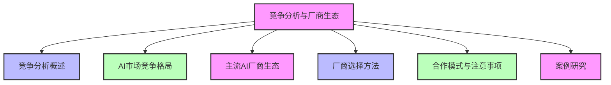
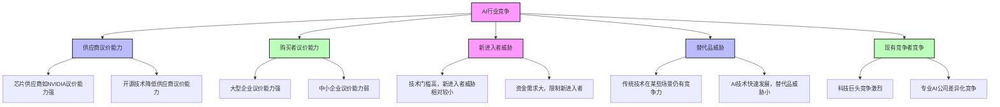
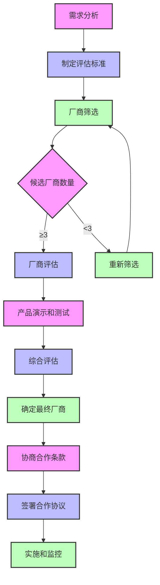
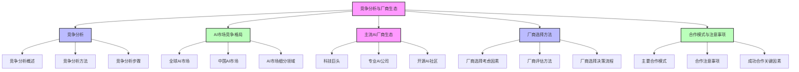

# 第三篇 AI解决方案实战

## 第13章 竞争分析与厂商生态

### 学习线路图

### 学习目标
1. 理解竞争分析在AI解决方案中的重要性
2. 掌握竞争分析的主要方法和工具
3. 了解全球AI市场的竞争格局
4. 熟悉主流AI厂商的生态系统
5. 学会如何选择合适的AI厂商和技术
6. 理解AI合作的主要模式和注意事项
7. 了解竞争分析与厂商选择的实际案例

### 核心知识点
- 竞争分析的概念和重要性
- 竞争分析方法（SWOT分析、五力模型等）
- AI市场竞争格局（全球和中国）
- 主流AI厂商生态（科技巨头、专业AI公司等）
- 厂商选择方法和评估标准
- 合作模式（技术授权、云服务、定制开发等）
- 合作注意事项（知识产权、数据安全等）
- 竞争分析与厂商选择案例

### 重点难点
- 如何进行有效的竞争分析
- 如何评估不同AI厂商的优势和劣势
- 如何选择最适合自身需求的AI厂商和技术
- 如何建立良好的AI合作关系
- 如何应对AI市场的快速变化

### 本章导读

想象一下，你是一家企业的AI负责人，需要选择合适的AI厂商合作，构建企业的AI解决方案。面对市场上众多的AI厂商，你该如何选择？是选择科技巨头如谷歌、微软、亚马逊，还是选择专业的AI公司如OpenAI、商汤科技、旷视科技？不同的厂商有不同的优势和劣势，适合不同的场景和需求。

同时，你还需要了解市场上的竞争情况，包括竞争对手的AI应用情况、市场趋势等，以便制定更有效的AI战略。

本章将带你了解竞争分析与厂商生态的核心概念和方法，包括竞争分析的方法、AI市场的竞争格局、主流AI厂商的生态系统、厂商选择方法、合作模式与注意事项等。通过学习这些内容，你将能够进行有效的竞争分析，选择合适的AI厂商合作，构建高质量的AI解决方案。

---

## 13.1 竞争分析概述（体育比赛类比）

竞争分析就像体育比赛前的对手分析，教练会研究对手的战术、球员特点和比赛风格，以便制定相应的比赛策略。同样，企业在进行AI解决方案建设前，也需要分析竞争对手的情况，了解市场竞争格局，制定有效的AI战略。

### 13.1.1 什么是竞争分析（体育比赛对手分析类比）

竞争分析是指通过各种方法和工具，收集、分析和评估竞争对手的信息，了解市场竞争格局，为企业制定战略和决策提供依据，就像教练收集对手的比赛录像、球员数据和战术分析，为球队制定比赛策略一样。

**竞争分析的核心目标（体育比赛目标对应）**：
- 了解竞争对手的优势和劣势（相当于了解对手的强弱点和战术特点）
- 识别市场机会和威胁（相当于识别比赛中的机会和潜在风险）
- 制定有效的竞争策略（相当于制定比赛战术和阵容）
- 优化产品和服务（相当于训练球队，提高球员技术和战术配合）
- 提高市场竞争力（相当于提高球队的比赛胜率）

### 13.1.2 竞争分析的重要性（体育比赛对手分析的重要性对应）

**1. 帮助企业制定战略**：
- 了解市场趋势和竞争对手的战略（相当于了解联赛趋势和对手的比赛策略）
- 制定符合市场需求的AI战略（相当于制定球队的赛季战略和目标）

**2. 优化产品和服务**：
- 了解竞争对手的产品和服务特点（相当于了解对手的球员特点和战术风格）
- 识别自身产品和服务的优势和劣势（相当于识别球队的强弱点）
- 优化AI解决方案，提高竞争力（相当于训练球队，提高比赛水平）

**3. 识别市场机会**：
- 发现市场空白和未满足的需求（相当于发现对手的防守漏洞和机会）
- 开发新的AI应用场景（相当于开发新的战术和打法）

**4. 降低风险**：
- 了解市场竞争的风险和挑战（相当于了解比赛中的风险和挑战）
- 制定风险应对策略（相当于制定应对对手战术的预案）

**5. 提高决策质量**：
- 基于客观的竞争分析数据，做出更明智的决策（相当于基于对手数据分析，做出更明智的战术决策）
- 避免盲目跟风和决策失误（相当于避免盲目模仿对手战术，导致比赛失败）

### 13.1.3 竞争分析的主要方法

#### 13.1.3.1 SWOT分析

SWOT分析是一种常用的竞争分析方法，用于评估企业的优势（Strengths）、劣势（Weaknesses）、机会（Opportunities）和威胁（Threats）。

**SWOT分析示例**：

| 维度 | 内容 |
|------|------|
| **优势（Strengths）** | - 拥有强大的研发团队 - 丰富的行业经验 - 良好的客户基础 - 成熟的技术平台 |
| **劣势（Weaknesses）** | - AI技术积累不足 - 数据资源有限 - 缺乏AI人才 - 品牌知名度不高 |
| **机会（Opportunities）** | - AI市场快速增长 - 政策支持AI发展 - 客户对AI需求增加 - 新技术不断涌现 |
| **威胁（Threats）** | - 竞争对手强大 - 技术更新换代快 - 数据安全和合规要求严格 - 市场竞争激烈 |

#### 13.1.3.2 五力模型

五力模型是由迈克尔·波特提出的一种竞争分析工具，用于分析行业的竞争强度和盈利能力。

**五力模型的五个要素**：
1. **供应商的议价能力**：AI技术供应商的议价能力
2. **购买者的议价能力**：客户的议价能力
3. **新进入者的威胁**：新的AI企业进入市场的威胁
4. **替代品的威胁**：替代AI技术或解决方案的威胁
5. **现有竞争者的竞争**：现有AI企业之间的竞争

**五力模型示例（AI行业）**：

#### 13.1.3.3 竞争对手分析矩阵

竞争对手分析矩阵是一种用于比较企业与竞争对手的工具，通常从多个维度进行比较，如产品、技术、市场、财务等。

**竞争对手分析矩阵示例**：

| 维度 | 自身企业 | 竞争对手A | 竞争对手B | 竞争对手C |
|------|----------|-----------|-----------|-----------|
| 技术实力 | ★★★☆☆ | ★★★★★ | ★★★★☆ | ★★★☆☆ |
| 产品质量 | ★★★★☆ | ★★★★☆ | ★★★★★ | ★★★☆☆ |
| 市场份额 | 15% | 30% | 25% | 20% |
| 客户满意度 | 4.2/5.0 | 4.5/5.0 | 4.6/5.0 | 4.0/5.0 |
| 价格竞争力 | ★★★★☆ | ★★★☆☆ | ★★★☆☆ | ★★★★★ |
| 创新能力 | ★★★☆☆ | ★★★★★ | ★★★★☆ | ★★★☆☆ |

### 13.1.4 竞争分析的步骤

**1. 确定分析目标**：
- 明确竞争分析的目的和范围
- 确定需要分析的竞争对手

**2. 收集信息**：
- 收集竞争对手的产品、技术、市场、财务等信息
- 收集市场趋势和行业数据
- 收集客户反馈和评价

**3. 分析信息**：
- 分析竞争对手的优势和劣势
- 分析市场机会和威胁
- 分析竞争格局和趋势

**4. 制定策略**：
- 基于分析结果，制定竞争策略
- 确定产品和服务的定位
- 制定市场推广策略

**5. 实施和监控**：
- 实施竞争策略
- 监控竞争对手的动态
- 定期更新竞争分析

---

## 13.2 AI市场竞争格局

### 13.2.1 全球AI市场竞争格局

**1. 市场规模和增长**：
- 根据IDC数据，2024年全球AI市场规模预计达到1500亿美元，年增长率超过30%
- 到2027年，全球AI市场规模预计将达到3000亿美元

**2. 主要竞争力量**：
- **科技巨头**：谷歌、微软、亚马逊、苹果、Meta等
- **专业AI公司**：OpenAI、Anthropic、Cohere等
- **硬件供应商**：NVIDIA、AMD、Intel等
- **行业解决方案提供商**：IBM、SAP、Oracle等

**3. 市场分布**：
- 北美：占全球AI市场的50%以上，是AI技术的发源地和主要市场
- 欧洲：注重AI的伦理和合规，市场增长迅速
- 亚太地区：中国、日本、韩国等国家AI市场增长迅速，尤其是中国，已成为全球第二大AI市场

### 13.2.2 中国AI市场竞争格局

**1. 市场规模和增长**：
- 根据中国信通院数据，2024年中国AI市场规模预计达到2000亿元人民币，年增长率超过40%
- 到2027年，中国AI市场规模预计将达到5000亿元人民币

**2. 主要竞争力量**：
- **科技巨头**：百度、阿里巴巴、腾讯、字节跳动等
- **专业AI公司**：商汤科技、旷视科技、依图科技、云从科技等
- **硬件供应商**：华为、寒武纪、地平线等
- **传统企业**：银行、电信、制造等行业的传统企业也在积极布局AI

**3. 市场特点**：
- 政府支持力度大，政策环境好
- 数据资源丰富，应用场景多样
- 人才储备不断增加
- 技术创新能力不断提升

### 13.2.3 AI市场的主要细分领域

**1. 基础层**：
- 芯片：GPU、CPU、TPU等AI芯片
- 算法框架：TensorFlow、PyTorch、飞桨等
- 算力基础设施：数据中心、云计算等

**2. 技术层**：
- 计算机视觉：图像识别、人脸识别、目标检测等
- 自然语言处理：机器翻译、文本生成、语音识别等
- 机器学习：监督学习、无监督学习、强化学习等
- 深度学习：神经网络、CNN、RNN、Transformer等

**3. 应用层**：
- 智能制造：预测性维护、质量检测、智能调度等
- 智慧金融：风控、客服、投资顾问等
- 智慧医疗：医学影像分析、辅助诊断、药物研发等
- 智慧城市：交通管理、安防监控、环境监测等
- 智慧零售：个性化推荐、库存管理、客户服务等

**AI市场细分领域占比示例**：

| 细分领域 | 占比 | 主要应用场景 |
|----------|------|--------------|
| 计算机视觉 | 30% | 安防、医疗、零售等 |
| 自然语言处理 | 25% | 客服、金融、教育等 |
| 机器学习平台 | 20% | 企业AI开发、数据科学等 |
| 自动驾驶 | 10% | 汽车、物流等 |
| 其他 | 15% | 机器人、物联网等 |

---

## 13.3 主流AI厂商生态

### 13.3.1 科技巨头

#### 13.3.1.1 微软

**核心优势**：
- 强大的云服务Azure，提供全面的AI服务
- 与OpenAI深度合作，拥有GPT系列模型的独家授权
- 丰富的企业级产品和服务，如Office 365、Dynamics 365等
- 强大的研发能力和人才储备

**AI生态系统**：
- **基础设施**：Azure云服务、Azure AI基础设施
- **AI模型**：GPT-4、Copilot、Azure OpenAI服务
- **开发工具**：Visual Studio、GitHub Copilot
- **应用场景**：企业办公、客户服务、销售和营销、软件开发等

**典型客户**：
- 企业客户：可口可乐、沃尔玛、摩根大通等
- 政府客户：美国国防部、英国政府等

#### 13.3.1.2 谷歌

**核心优势**：
- 强大的搜索引擎和数据资源
- 领先的AI研究实力，如DeepMind
- 开源的AI框架TensorFlow
- 全面的云服务Google Cloud

**AI生态系统**：
- **基础设施**：Google Cloud、TPU芯片
- **AI模型**：Gemini、PaLM 2、Bard
- **开发工具**：TensorFlow、Colab、Vertex AI
- **应用场景**：搜索、广告、地图、自动驾驶等

**典型客户**：
- 企业客户：Spotify、Snapchat、L'Oréal等
- 开发者社区：全球数百万开发者

#### 13.3.1.3 亚马逊

**核心优势**：
- 全球最大的电商平台，拥有丰富的用户数据
- 领先的云服务AWS，市场份额第一
- 强大的物流和供应链能力
- 丰富的AI应用场景

**AI生态系统**：
- **基础设施**：AWS云服务、AWS Inferentia芯片
- **AI模型**：Bedrock、Titan系列模型
- **开发工具**：SageMaker、Lex、Polly
- **应用场景**：电商推荐、物流优化、客户服务、智能家居等

**典型客户**：
- 企业客户：Netflix、Airbnb、NASA等
- 开发者社区：全球数百万开发者

#### 13.3.1.4 百度

**核心优势**：
- 中国最大的搜索引擎，拥有丰富的中文数据
- 领先的AI研究实力，如百度研究院
- 开源的AI框架飞桨（PaddlePaddle）
- 全面的AI产品和服务

**AI生态系统**：
- **基础设施**：百度智能云、昆仑芯片
- **AI模型**：文心一言、ERNIE系列模型
- **开发工具**：飞桨、EasyDL、BML
- **应用场景**：搜索、地图、自动驾驶、智能音箱等

**典型客户**：
- 企业客户：中国平安、中国移动、海尔等
- 政府客户：北京、上海、深圳等城市

#### 13.3.1.5 阿里巴巴

**核心优势**：
- 中国最大的电商平台，拥有丰富的电商数据
- 领先的云服务阿里云
- 强大的支付和金融服务
- 丰富的AI应用场景

**AI生态系统**：
- **基础设施**：阿里云、含光芯片
- **AI模型**：通义千问、达摩院大模型
- **开发工具**：PAI平台、AutoML
- **应用场景**：电商推荐、支付风控、物流优化、智能客服等

**典型客户**：
- 企业客户：饿了么、菜鸟网络、高德地图等
- 开发者社区：中国数百万开发者

### 13.3.2 专业AI公司

#### 13.3.2.1 OpenAI

**核心优势**：
- 领先的大语言模型技术，如GPT系列
- 强大的研发团队和资金支持
- 开放的API和生态系统
- 广泛的行业应用

**主要产品和服务**：
- GPT-4、GPT-3.5、GPT-2等大语言模型
- ChatGPT：聊天机器人
- DALL-E：图像生成模型
- Whisper：语音识别模型
- OpenAI API：提供AI模型的调用服务

**典型客户**：
- 科技公司：微软、Snapchat、Shopify等
- 企业客户：摩根士丹利、 Salesforce、Instacart等

#### 13.3.2.2 商汤科技

**核心优势**：
- 领先的计算机视觉技术
- 强大的研发能力和人才储备
- 丰富的行业应用经验
- 全面的AI解决方案

**主要产品和服务**：
- SenseCore：AI基础设施
- 计算机视觉算法和模型
- 行业解决方案：智慧城市、智慧商业、智慧生活、智能汽车等

**典型客户**：
- 政府客户：北京冬奥会、上海智慧城市等
- 企业客户：中国移动、中国联通、招商银行等

#### 13.3.2.3 旷视科技

**核心优势**：
- 领先的计算机视觉和人脸识别技术
- 强大的研发能力和人才储备
- 丰富的行业应用经验
- 全面的AI解决方案

**主要产品和服务**：
- 人脸识别系统
- 智能视频分析平台
- 行业解决方案：安防、零售、物流、金融等

**典型客户**：
- 政府客户：公安部、北京市公安局等
- 企业客户：阿里巴巴、蚂蚁集团、联想等

### 13.3.3 开源AI社区

**核心优势**：
- 开放的技术和资源
- 全球开发者的贡献和支持
- 快速的技术迭代和创新
- 较低的使用成本

**主要开源AI项目**：
- **算法框架**：TensorFlow、PyTorch、飞桨等
- **预训练模型**：BERT、GPT-2、LLaMA等
- **工具库**：Hugging Face Transformers、spaCy等

**开源AI社区的价值**：
- 降低AI技术的使用门槛
- 促进AI技术的普及和创新
- 提供丰富的技术资源和支持
- 培养AI人才和生态

---

## 13.4 厂商选择方法

### 13.4.1 厂商选择的考虑因素

**1. 技术实力**：
- AI技术的先进性和成熟度
- 研发能力和创新能力
- 技术团队的规模和质量

**2. 产品和服务**：
- 产品的功能和性能
- 服务的质量和响应速度
- 产品的可扩展性和灵活性

**3. 行业经验**：
- 相关行业的应用经验
- 成功案例和客户评价
- 对行业需求的理解

**4. 生态系统**：
- 产品和服务的完整性
- 与现有系统的兼容性
- 生态合作伙伴的数量和质量

**5. 成本和性价比**：
- 产品和服务的价格
- 总拥有成本（TCO）
- 投资回报率（ROI）

**6. 安全性和合规性**：
- 数据安全和隐私保护措施
- 符合相关法律法规和标准
- 安全认证和审计

**7. 支持和服务**：
- 技术支持的质量和响应速度
- 培训和文档资源
- 持续的产品更新和升级

### 13.4.2 厂商评估方法

#### 13.4.2.1 评分法

评分法是一种常用的厂商评估方法，通过对多个因素进行评分，综合评估厂商的实力。

**评分法示例**：

| 评估因素 | 权重 | 厂商A | 厂商B | 厂商C |
|----------|------|--------|--------|--------|
| 技术实力 | 20% | 90 | 85 | 80 |
| 产品和服务 | 20% | 85 | 90 | 85 |
| 行业经验 | 15% | 80 | 85 | 90 |
| 生态系统 | 15% | 90 | 85 | 80 |
| 成本和性价比 | 15% | 85 | 80 | 90 |
| 安全性和合规性 | 10% | 85 | 90 | 85 |
| 支持和服务 | 5% | 80 | 85 | 80 |
| **总分** | 100% | **86.5** | **85.5** | **84.5** |

#### 13.4.2.2 对比分析法

对比分析法是通过对比不同厂商的产品、服务、价格等，评估其优势和劣势。

**对比分析法示例**：

| 对比项 | 厂商A | 厂商B | 厂商C |
|--------|--------|--------|--------|
| 主要产品 | 大语言模型、聊天机器人 | 计算机视觉、人脸识别 | 机器学习平台、数据分析 |
| 技术优势 | 大语言模型技术领先 | 计算机视觉技术成熟 | 机器学习平台易用性高 |
| 典型客户 | 科技公司、金融机构 | 政府、安防、零售 | 制造业、电商 |
| 价格 | 较高 | 中等 | 较低 |
| 支持服务 | 7×24小时技术支持 | 5×8小时技术支持 | 在线文档和社区支持 |
| 优势 | 技术领先、生态完善 | 行业经验丰富、产品成熟 | 价格优势、易用性高 |
| 劣势 | 价格较高、定制化能力有限 | 产品功能相对单一 | 技术深度不足 |

#### 13.4.2.3 演示和测试

演示和测试是评估厂商产品和服务的有效方法，可以直观地了解产品的功能和性能。

**演示和测试的步骤**：
1. 确定演示和测试的目标和范围
2. 准备测试数据和场景
3. 邀请厂商进行产品演示
4. 进行产品测试，验证功能和性能
5. 收集和分析测试结果
6. 与厂商讨论测试中发现的问题

**演示和测试的重点**：
- 产品的功能是否满足需求
- 产品的性能是否达标
- 产品的易用性和用户体验
- 与现有系统的兼容性

### 13.4.3 厂商选择的决策流程

**1. 需求分析**：
- 明确AI解决方案的需求和目标
- 确定关键的评估标准

**2. 厂商筛选**：
- 收集潜在厂商的信息
- 根据初步条件筛选厂商
- 确定候选厂商名单

**3. 厂商评估**：
- 进行详细的厂商评估
- 采用评分法、对比分析法等方法
- 进行产品演示和测试

**4. 决策和选择**：
- 综合评估结果，确定最终的厂商
- 与厂商协商合作条款
- 签署合作协议

**5. 实施和监控**：
- 实施AI解决方案
- 监控厂商的服务质量
- 定期评估合作效果

**厂商选择决策流程示例**：

---

## 13.5 合作模式与注意事项

### 13.5.1 主要合作模式

**1. 技术授权**：
- 厂商授权企业使用其AI技术和模型
- 企业可以在自己的系统中部署和使用
- 适合对数据安全要求高、需要定制化的企业

**2. 云服务**：
- 厂商提供AI云服务，企业通过API调用
- 无需本地部署和维护
- 适合快速上线、预算有限的企业

**3. 定制开发**：
- 厂商根据企业的需求，定制开发AI解决方案
- 高度定制化，满足特定需求
- 适合需求复杂、特殊的企业

**4. 联合开发**：
- 企业和厂商联合开发AI解决方案
- 共享资源和风险
- 适合技术要求高、创新型的项目

**5. 投资和并购**：
- 企业投资或并购AI厂商
- 获取AI技术和人才
- 适合长期布局AI的企业

**合作模式比较示例**：

| 合作模式 | 优势 | 劣势 | 适合场景 |
|----------|------|------|----------|
| 技术授权 | 数据安全、定制化 | 成本高、维护复杂 | 金融、政府等对数据安全要求高的行业 |
| 云服务 | 快速上线、成本低 | 数据依赖云厂商、定制化有限 | 中小企业、快速验证项目 |
| 定制开发 | 高度定制化、满足特定需求 | 成本高、周期长 | 需求复杂、特殊的项目 |
| 联合开发 | 共享资源和风险、创新能力强 | 协调复杂、知识产权问题 | 技术要求高、创新型项目 |
| 投资和并购 | 长期布局、获取核心技术 | 风险高、整合难度大 | 大型企业、长期AI战略 |

### 13.5.2 合作注意事项

**1. 知识产权保护**：
- 明确AI模型、算法、代码等知识产权的归属
- 保护企业的核心数据和商业机密
- 签订保密协议和知识产权协议

**2. 数据安全和隐私**：
- 确保数据的安全性和隐私保护
- 符合相关数据保护法规，如GDPR、CCPA等
- 建立数据安全管理机制

**3. 服务水平协议（SLA）**：
- 明确服务的质量和响应时间
- 定义故障处理和恢复流程
- 设定服务赔偿条款

**4. 合同条款**：
- 明确合作范围和期限
- 定义产品和服务的规格和标准
- 设定付款方式和条件
- 规定违约责任和争议解决方式

**5. 长期合作关系**：
- 建立良好的沟通和协作机制
- 定期评估合作效果
- 共同规划未来的合作方向

**6. 风险防控**：
- 评估合作风险，制定风险应对策略
- 避免过度依赖单一厂商
- 建立备选方案和应急计划

### 13.5.3 成功合作的关键因素

**1. 明确的合作目标**：
- 明确合作的目的和期望
- 制定具体的合作计划和里程碑

**2. 良好的沟通和协作**：
- 建立有效的沟通渠道
- 定期举行会议，交流进展和问题
- 建立信任和互信的关系

**3. 资源的投入和支持**：
- 双方投入足够的资源和精力
- 提供必要的技术和人员支持

**4. 灵活的合作方式**：
- 根据项目进展和需求变化，调整合作方式
- 保持开放和灵活的态度

**5. 持续的评估和改进**：
- 定期评估合作效果
- 及时发现和解决问题
- 持续改进合作流程和方式

---

## 13.6 案例研究

### 13.6.1 案例1：某制造企业的AI厂商选择

**背景**：
某制造企业需要构建AI预测性维护系统，减少设备故障停机时间。企业面临多个AI厂商的选择，包括科技巨头、专业AI公司和开源社区。

**需求分析**：
- 功能需求：设备故障预测、维护计划优化、异常检测等
- 非功能需求：预测准确率≥90%、响应时间≤5秒、支持1000+设备监控
- 约束条件：预算100万元、6个月内完成部署、与现有设备监控系统集成

**竞争分析**：
- 竞争对手A：已实施AI预测性维护系统，设备故障停机时间减少了40%
- 竞争对手B：正在试点AI质量检测系统，产品合格率提高了15%
- 市场趋势：制造企业AI应用普及率不断提高，预测性维护是热点场景

**厂商评估**：
企业对3家候选厂商进行了评估：

| 评估因素 | 厂商A（科技巨头） | 厂商B（专业AI公司） | 厂商C（开源AI解决方案） |
|----------|------------------|--------------------|------------------------|
| 技术实力 | ★★★★★ | ★★★★☆ | ★★★☆☆ |
| 行业经验 | ★★★☆☆ | ★★★★★ | ★★★☆☆ |
| 产品功能 | ★★★★★ | ★★★★☆ | ★★★☆☆ |
| 成本 | ★★★☆☆ | ★★★★☆ | ★★★★★ |
| 实施周期 | ★★★★☆ | ★★★★★ | ★★★☆☆ |
| 与现有系统兼容性 | ★★★★☆ | ★★★★☆ | ★★★☆☆ |
| 总分 | 4.2 | 4.4 | 3.4 |

**厂商选择**：
企业最终选择了厂商B（专业AI公司），理由如下：
- 厂商B在制造业预测性维护领域有丰富的经验和成功案例
- 产品功能满足企业需求，实施周期短
- 成本合理，在企业预算范围内
- 与现有系统兼容性好

**实施结果**：
- 设备故障预测准确率达到92%
- 设备故障停机时间减少了50%
- 维护成本降低了35%
- 生产效率提高了20%

### 13.6.2 案例2：某金融机构的AI合作模式选择

**背景**：
某金融机构需要构建AI风控系统，提高风险管理能力。机构面临多种AI合作模式的选择，包括技术授权、云服务和定制开发。

**需求分析**：
- 功能需求：欺诈检测、信用评分、风险预警等
- 非功能需求：预测准确率≥95%、处理速度≥1000笔/秒、符合金融监管要求
- 约束条件：预算200万元、8个月内完成部署、数据安全级别高

**合作模式评估**：
机构对3种合作模式进行了评估：

| 评估因素 | 技术授权 | 云服务 | 定制开发 |
|----------|----------|--------|----------|
| 数据安全 | ★★★★★ | ★★★☆☆ | ★★★★★ |
| 功能定制化 | ★★★★☆ | ★★★☆☆ | ★★★★★ |
| 实施周期 | ★★★☆☆ | ★★★★★ | ★★★☆☆ |
| 成本 | ★★★☆☆ | ★★★★☆ | ★★★☆☆ |
| 维护难度 | ★★★★☆ | ★★★★★ | ★★★☆☆ |
| 总分 | 4.2 | 4.0 | 4.0 |

**合作模式选择**：
机构最终选择了技术授权模式，理由如下：
- 数据安全级别高，符合金融监管要求
- 功能定制化程度高，满足金融机构的特殊需求
- 长期来看，总拥有成本（TCO）较低
- 对核心技术有更多的控制权

**实施结果**：
- 欺诈检测准确率达到96%
- 信用评分准确性提高了15%
- 风险预警响应时间缩短了80%
- 合规性得到了监管机构的认可

---

## 本章总结

### 知识回顾

1. **竞争分析概述**：
   - 竞争分析是指收集、分析和评估竞争对手的信息，了解市场竞争格局
   - 竞争分析的重要性包括帮助企业制定战略、优化产品和服务、识别市场机会、降低风险等
   - 竞争分析的主要方法包括SWOT分析、五力模型、竞争对手分析矩阵等

2. **AI市场竞争格局**：
   - 全球AI市场规模快速增长，预计2027年达到3000亿美元
   - 主要竞争力量包括科技巨头、专业AI公司、硬件供应商等
   - AI市场分为基础层、技术层和应用层三个主要领域
   - 中国AI市场增长迅速，政府支持力度大，应用场景丰富

3. **主流AI厂商生态**：
   - 科技巨头（如微软、谷歌、亚马逊、百度、阿里巴巴）拥有强大的技术实力和生态系统
   - 专业AI公司（如OpenAI、商汤科技、旷视科技）在特定领域有优势
   - 开源AI社区（如TensorFlow、PyTorch）促进了AI技术的普及和创新

4. **厂商选择方法**：
   - 厂商选择的考虑因素包括技术实力、产品和服务、行业经验、生态系统、成本和性价比、安全性和合规性等
   - 厂商评估方法包括评分法、对比分析法、演示和测试等
   - 厂商选择的决策流程包括需求分析、厂商筛选、厂商评估、决策和选择、实施和监控等

5. **合作模式与注意事项**：
   - 主要合作模式包括技术授权、云服务、定制开发、联合开发、投资和并购等
   - 合作注意事项包括知识产权保护、数据安全和隐私、服务水平协议、合同条款、长期合作关系、风险防控等
   - 成功合作的关键因素包括明确的合作目标、良好的沟通和协作、资源的投入和支持、灵活的合作方式、持续的评估和改进等

6. **案例研究**：
   - 制造企业的AI厂商选择：通过评估技术实力、行业经验、产品功能、成本等因素，选择了专业AI公司，实现了设备故障预测准确率92%，设备故障停机时间减少50%
   - 金融机构的AI合作模式选择：基于数据安全、功能定制化、成本等因素，选择了技术授权模式，实现了欺诈检测准确率96%，信用评分准确性提高15%

### 知识体系梳理

### 实践应用场景

**场景1：为零售企业选择AI推荐系统厂商**

假设你是一家零售企业的AI负责人，需要选择合适的AI厂商合作，构建个性化推荐系统。通过本章学习，你可以：

1. **竞争分析**：
   - 分析零售行业的AI应用情况，了解竞争对手的推荐系统使用情况
   - 分析AI推荐系统市场的竞争格局，包括主要厂商和产品
   - 使用SWOT分析，评估企业自身的优势和劣势

2. **厂商评估**：
   - 确定厂商选择的考虑因素，如技术实力、产品功能、行业经验、成本等
   - 筛选候选厂商，包括科技巨头、专业AI公司等
   - 使用评分法和对比分析法，评估候选厂商
   - 邀请候选厂商进行产品演示和测试

3. **合作模式选择**：
   - 评估不同合作模式（技术授权、云服务、定制开发等）的优势和劣势
   - 根据企业需求和约束条件，选择合适的合作模式
   - 签订合作协议，明确知识产权、数据安全、服务水平等条款

4. **合作实施**：
   - 与厂商建立良好的沟通和协作机制
   - 监控合作进展，及时解决问题
   - 定期评估合作效果，持续改进

**场景2：为医疗企业制定AI竞争策略**

假设你是一家医疗企业的战略负责人，需要制定AI竞争策略。通过本章学习，你可以：

1. **竞争分析**：
   - 分析医疗行业的AI应用情况，包括竞争对手的AI应用情况
   - 分析AI医疗市场的竞争格局和趋势
   - 使用五力模型，分析医疗AI行业的竞争强度

2. **AI战略制定**：
   - 基于竞争分析结果，确定企业的AI战略定位
   - 选择合适的AI应用场景，如医学影像分析、辅助诊断等
   - 制定AI技术路线和发展规划

3. **厂商合作**：
   - 选择合适的AI厂商合作，构建医疗AI解决方案
   - 建立良好的合作关系，共同推动AI医疗应用
   - 考虑投资或并购AI初创公司，获取核心技术和人才

4. **生态建设**：
   - 构建医疗AI生态系统，包括医院、科研机构、AI厂商等
   - 促进AI医疗技术的普及和创新
   - 培养医疗AI人才和生态

### 下一步学习建议

1. 深入学习演示技巧与客户沟通（第14章）
2. 了解垂直行业深耕策略（第15章）
3. 学习知识体系维护与持续学习（第16章）
4. 实践竞争分析和厂商选择，参与实际项目
5. 关注AI市场的最新发展和趋势
6. 学习谈判和合同管理知识，提高合作能力
7. 加入AI行业协会和社区，拓展人脉和资源

通过本章的学习，你已经掌握了竞争分析与厂商生态的核心概念和方法。竞争分析和厂商选择是AI解决方案成功的重要因素，它决定了AI技术的应用效果和企业的竞争力。接下来，我们将学习演示技巧与客户沟通，了解如何向客户展示AI解决方案的价值，提高客户沟通的效果。

---