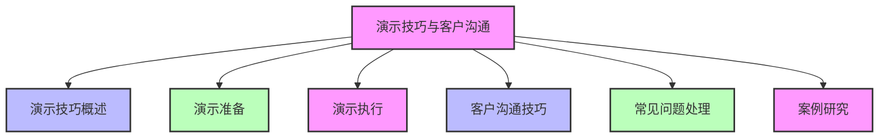
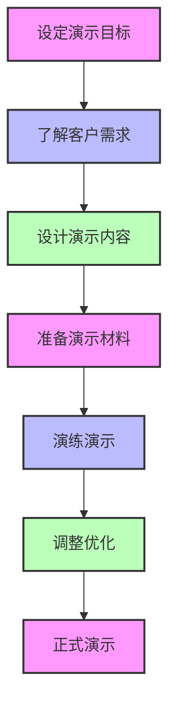
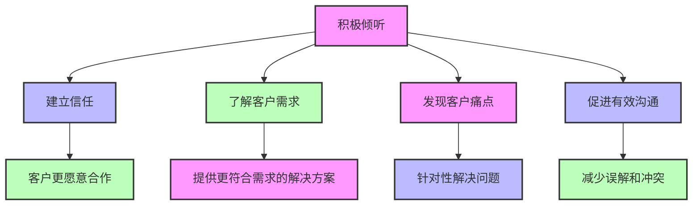

# 第三篇 AI解决方案实战

## 第14章 演示技巧与客户沟通

### 学习线路图


### 学习目标
1. 理解演示技巧在AI解决方案推广中的重要性
2. 掌握演示准备的主要步骤和方法
3. 学会如何有效执行AI解决方案演示
4. 掌握客户沟通的核心技巧
5. 学会如何处理客户的常见问题和异议
6. 了解演示技巧与客户沟通的实际案例

### 核心知识点
- 演示技巧的概念和重要性
- 演示准备（目标设定、内容设计、材料准备等）
- 演示执行（开场、主体、结尾、互动等）
- 客户沟通技巧（倾听、提问、反馈等）
- 常见问题处理（异议处理、技术问题解答等）
- 演示和沟通案例

### 重点难点
- 如何设计吸引人的演示内容
- 如何应对客户的异议和质疑
- 如何与不同类型的客户有效沟通
- 如何在演示中突出AI解决方案的价值
- 如何处理演示中的突发情况

### 本章导读

想象一下，你花费了数周时间设计了一个完美的AI解决方案，它可以帮助客户解决重要的业务问题，提高效率，降低成本。但是，当你向客户演示这个解决方案时，客户却没有表现出预期的兴趣，甚至中途离开了会议室。这可能是因为你的演示技巧不够吸引人，或者没有有效地与客户沟通解决方案的价值。

演示技巧和客户沟通是AI解决方案专家的核心技能之一。一个好的演示可以帮助客户理解AI解决方案的价值，建立信任，促进合作。而有效的沟通可以帮助你了解客户的需求，解决客户的疑虑，达成共识。

本章将带你了解演示技巧与客户沟通的核心概念和方法，包括演示准备、演示执行、客户沟通技巧、常见问题处理等。通过学习这些内容，你将能够设计吸引人的演示，与客户进行有效的沟通，成功推广AI解决方案。

---

## 14.1 演示技巧概述（演讲比赛类比）

### 14.1.1 什么是演示技巧

演示技巧就像参加演讲比赛时的各种表演技巧，包括内容设计、表达方式、互动技巧等。良好的演示技巧可以让你的AI解决方案演讲更加吸引人，让听众（客户）更容易理解和接受。

想象一下，你准备了一个关于AI客服系统的演示，就像准备一场重要的演讲比赛：
- 你需要设计引人入胜的内容，就像演讲比赛中的演讲稿
- 你需要使用生动的表达方式，就像演讲者的语气和肢体语言
- 你需要与听众互动，就像演讲比赛中的问答环节
- 你最终的目标是让听众认可你的观点，就像演讲比赛中获得高分

**演示的核心目标**：
- 展示AI解决方案的价值和优势（相当于演讲的核心观点）
- 建立与客户的信任和关系（相当于与听众建立连接）
- 解答客户的疑问和顾虑（相当于回应评委的提问）
- 促进客户做出决策（相当于获得评委的认可和高分）

**演示与演讲比赛的对比**：

| 演讲比赛 | AI解决方案演示 |
|----------|----------------|
| 演讲稿设计 | 演示内容设计 |
| 演讲技巧 | 演示技巧 |
| 评委 | 客户 |
| 获得高分 | 客户认可和合作 |
| 问答环节 | 客户答疑 |

### 14.1.2 演示技巧的重要性

**1. 吸引客户注意力**：
- 良好的演示可以吸引客户的注意力，让客户专注于解决方案
- 避免客户分心或中途离开

**2. 清晰传达价值**：
- 帮助客户理解AI解决方案的核心价值
- 突出解决方案如何解决客户的业务问题

**3. 建立信任关系**：
- 专业的演示可以建立客户对解决方案和演示者的信任
- 增强客户对解决方案的信心

**4. 促进决策**：
- 有效的演示可以帮助客户做出决策
- 缩短销售周期，提高成功率

**5. 差异化竞争**：
- 在竞争激烈的市场中，良好的演示可以差异化你的解决方案
- 脱颖而出，赢得客户

### 14.1.3 演示的主要类型

**1. 产品演示**：
- 展示AI解决方案的功能和性能
- 重点演示解决方案如何解决客户的业务问题

**2. 技术演示**：
- 展示AI解决方案的技术架构和实现原理
- 适合技术背景的客户

**3. 案例演示**：
- 展示AI解决方案在实际场景中的应用效果
- 用真实案例证明解决方案的价值

**4. 概念演示**：
- 展示AI解决方案的概念和理念
- 适合早期阶段的客户，帮助他们理解解决方案的价值

**5. 交互式演示**：
- 让客户参与演示过程
- 提高客户的兴趣和参与度

**演示类型选择示例**：

| 客户阶段 | 适合的演示类型 | 演示重点 |
|----------|----------------|----------|
| 初期接触 | 概念演示 | 解决方案的价值和理念 |
| 需求确认 | 产品演示 | 解决方案如何解决客户的业务问题 |
| 技术评估 | 技术演示 | 解决方案的技术架构和实现原理 |
| 决策阶段 | 案例演示 | 解决方案在实际场景中的应用效果 |
| 个性化需求 | 交互式演示 | 让客户参与演示，定制解决方案 |

---

## 14.2 演示准备

### 14.2.1 设定演示目标

**1. 明确演示目的**：
- 你希望通过演示达到什么目的？
- 是让客户了解解决方案，还是促进客户做出决策？

**2. 确定目标受众**：
- 演示的对象是谁？
- 他们的背景和需求是什么？
- 他们的关注点和痛点是什么？

**3. 制定预期结果**：
- 演示结束后，你希望客户有什么反应？
- 你希望客户采取什么行动？

**演示目标示例**：
- 让客户了解AI客服系统的核心功能和价值
- 解答客户关于数据安全和隐私的疑虑
- 促进客户签署合作意向书

### 14.2.2 了解客户需求

**1. 收集客户信息**：
- 客户的行业、规模、业务模式等
- 客户的痛点和需求
- 客户的决策流程和关键决策者

**2. 分析客户需求**：
- 客户的核心需求是什么？
- AI解决方案如何解决客户的需求？
- 客户可能的疑虑和反对意见是什么？

**3. 定制演示内容**：
- 根据客户的需求和痛点，定制演示内容
- 突出解决方案如何解决客户的特定问题

**客户需求分析示例**：
- 客户是一家零售企业，面临客户服务效率低、满意度低的问题
- 客户的核心需求是提高客服效率，降低成本，提高客户满意度
- AI客服系统可以自动回答常见问题，减少客服人员工作量，提高响应速度

### 14.2.3 设计演示内容

**1. 演示内容结构**：
- **开场**：吸引注意力，介绍自己和演示主题
- **主体**：展示解决方案的价值、功能、案例等
- **结尾**：总结要点，呼吁行动

**2. 内容设计原则**：
- **价值优先**：突出解决方案的价值，而不是技术细节
- **简洁明了**：避免过多的文字和复杂的图表
- **生动形象**：使用案例、故事、可视化等方式
- **客户导向**：关注客户的需求和痛点

**3. 演示内容示例**：
```
演示内容结构：
1. 开场（5分钟）：
   - 自我介绍和公司介绍
   - 演示目标和议程
   - 一个引人入胜的故事或数据

2. 主体（20分钟）：
   - 客户痛点分析：展示零售企业客服面临的挑战
   - 解决方案价值：AI客服系统如何解决这些挑战
   - 核心功能演示：自动回答、智能路由、情绪分析等
   - 成功案例：其他零售企业的应用效果
   - 技术架构简介：简洁的架构图，避免技术细节
   - 实施计划和成本：清晰的时间线和投资回报分析

3. 结尾（5分钟）：
   - 总结要点
   - 解答客户疑问
   - 呼吁行动：签署合作意向书
```

### 14.2.4 准备演示材料

**1. 演示文稿（PPT）**：
- 简洁明了，每页面不超过5-7行文字
- 使用高质量的图片、图表和动画
- 突出关键信息，使用大字体和对比色

**2. 演示环境**：
- 确保演示设备正常工作（电脑、投影仪、麦克风等）
- 测试网络连接和软件功能
- 准备备用方案，如离线演示

**3. 辅助材料**：
- 解决方案手册
- 成功案例集
- 技术白皮书
- 报价单

**4. 互动准备**：
- 准备互动问题，促进客户参与
- 设计演示中的互动环节，如现场演示、问答游戏等

**演示材料准备检查清单**：
| 材料类型 | 检查项目 | 状态 |
|----------|----------|------|
| 演示文稿 | 内容完整、简洁明了 | □ 已完成 □ 待完成 |
| 演示设备 | 电脑、投影仪、麦克风正常工作 | □ 已测试 □ 待测试 |
| 软件功能 | AI解决方案演示功能正常 | □ 已测试 □ 待测试 |
| 网络连接 | 稳定可靠 | □ 已测试 □ 待测试 |
| 辅助材料 | 解决方案手册、案例集等准备齐全 | □ 已准备 □ 待准备 |
| 互动准备 | 互动问题和环节设计完成 | □ 已完成 □ 待完成 |

### 14.2.5 演练演示

**1. 个人演练**：
- 多次演练演示内容，熟悉流程和时间
- 练习语速和语调，确保清晰流畅
- 准备应对可能的问题

**2. 团队演练**：
- 与团队成员一起演练，获取反馈
- 模拟客户的提问和反对意见
- 优化演示内容和方式

**3. 调整和优化**：
- 根据演练反馈，调整演示内容和结构
- 优化演示的时间分配
- 改进表达方式和互动技巧

**演示演练要点**：
- 记录演练时间，确保不超时
- 注意肢体语言和眼神交流
- 练习如何处理突发情况
- 准备备用方案

---

## 14.3 演示执行

### 14.3.1 开场技巧

**1. 吸引注意力**：
- 使用引人入胜的故事或案例
- 展示令人震惊的数据或事实
- 提出一个发人深省的问题

**开场示例**：
"各位领导，下午好！今天我想先给大家分享一个真实的故事。上个月，我们的一个零售客户告诉我，他们的客服人员每天要处理2000多个客户咨询，其中80%是重复的问题，比如订单查询、退换货政策等。客服人员每天忙于处理这些简单问题，没有时间处理复杂的客户问题，导致客户满意度只有3.5/5.0。这也是很多零售企业面临的共同挑战。今天，我将向大家展示如何使用AI客服系统解决这个问题。"

**2. 介绍自己和主题**：
- 简洁明了地介绍自己和公司
- 说明演示的主题和目的
- 展示演示的议程

**3. 建立信任**：
- 提及公司的经验和成功案例
- 展示与客户的共同点
- 表达对客户的理解和关注

### 14.3.2 主体演示技巧

**1. 突出价值**：
- 始终围绕客户的痛点和需求
- 展示AI解决方案如何解决客户的问题
- 使用具体的数据和案例证明价值

**价值突出示例**：
"我们的AI客服系统可以自动回答80%的常见问题，减少客服人员的工作量。根据我们的客户案例，实施AI客服系统后，客服人员的工作量减少了60%，客户等待时间从原来的5分钟缩短到30秒，客户满意度提高到4.5/5.0。"

**2. 演示功能**：
- 选择核心功能进行演示，避免演示所有功能
- 演示功能如何解决客户的具体问题
- 保持演示简洁流畅，避免技术细节

**功能演示示例**：
"现在我将演示AI客服系统的自动回答功能。假设客户询问：'我的订单什么时候能送达？'。系统会自动识别客户的意图，查询订单系统，然后生成回答：'您好，您的订单预计明天下午3点前送达，快递单号为123456789。'整个过程不到1秒，不需要人工干预。"

**3. 使用可视化**：
- 使用图表、图片、视频等可视化元素
- 避免过多的文字和复杂的技术架构图
- 使用对比图表，展示解决方案的效果

**可视化示例**：
```mermaid
bar chart
    title AI客服系统效果对比
    x-axis [客服工作量, 客户等待时间, 客户满意度]
    y-axis 变化百分比
    bar [60%减少, 90%减少, 29%提高]
```

**演示准备流程**：


**4. 讲述故事和案例**：
- 使用真实的案例和故事，增强说服力
- 案例要与客户的行业和需求相关
- 突出案例的具体效果和价值

**案例演示示例**：
"我们的一个零售客户，实施AI客服系统后，客服人员从50人减少到20人，每年节省人力成本120万元。同时，客户满意度从3.5/5.0提高到4.5/5.0，销售额增长了15%。这个案例充分证明了AI客服系统的价值。"

### 14.3.3 互动技巧

**1. 提问互动**：
- 提出开放式问题，鼓励客户参与
- 针对客户的痛点和需求提问
- 认真倾听客户的回答，给予反馈

**提问示例**：
"请问贵公司目前客服人员的工作量如何？每天处理多少个客户咨询？"

**2. 演示互动**：
- 邀请客户参与演示，如输入问题，查看系统的回答
- 让客户体验AI解决方案的功能
- 观察客户的反应，调整演示内容

**演示互动示例**：
"现在，我想邀请一位同事来体验一下AI客服系统。您可以输入一个客户常问的问题，比如'如何退换货？'，看看系统会如何回答。"

**3. 反馈互动**：
- 询问客户的意见和反馈
- 针对客户的反馈，调整演示内容
- 解答客户的疑问和顾虑

**反馈互动示例**：
"请问您对AI客服系统的自动回答功能有什么疑问或想法？"

### 14.3.4 结尾技巧

**1. 总结要点**：
- 简洁明了地总结演示的核心内容
- 突出AI解决方案的价值和优势
- 回顾客户的痛点和解决方案的对应关系

**总结示例**：
"今天，我向大家展示了AI客服系统如何解决零售企业客服效率低、满意度低的问题。系统可以自动回答80%的常见问题，减少客服工作量60%，缩短客户等待时间90%，提高客户满意度29%。我们的解决方案已经在多家零售企业成功实施，取得了显著的效果。"

**2. 呼吁行动**：
- 明确告诉客户你希望他们采取什么行动
- 提出具体的下一步建议
- 设定明确的时间框架

**呼吁行动示例**：
"基于今天的演示，我建议我们下一步进行深入的需求调研，制定详细的解决方案，并在下周提交正式的合作方案。请问您对这个安排有什么意见？"

**3. 感谢和问答**：
- 感谢客户的时间和关注
- 邀请客户提问，解答疑问
- 留下联系方式，方便后续沟通

**感谢和问答示例**：
"感谢大家的耐心聆听！现在，我很乐意回答大家的任何问题。如果您有任何疑问或需要进一步的信息，请随时与我联系，我的联系方式是138xxxx8888，邮箱是xxx@xxx.com。"

### 14.3.5 处理突发情况

**1. 设备故障**：
- 保持冷静，不要慌乱
- 启动备用方案，如离线演示文稿
- 调整演示方式，增加互动和讨论

**2. 客户质疑**：
- 认真倾听客户的质疑
- 不要与客户争论，保持友好
- 用事实和案例回应质疑

**3. 时间不足**：
- 优先展示核心内容和价值
- 调整演示的节奏，加快进度
- 省略非核心的内容

**4. 偏离主题**：
- 礼貌地将话题拉回到演示主题
- 记录客户的问题，演示后再详细解答
- 保持演示的焦点

---

## 14.4 客户沟通技巧（日常聊天类比）

### 14.4.1 倾听技巧

想象一下，你和朋友聊天时，朋友正在向你抱怨工作压力大。如果你打断他，或者心不在焉，他会觉得你不重视他。同样，在与客户沟通时，倾听是建立信任的第一步。

**1. 积极倾听**：
- 专注于客户的发言，不要打断（就像你不会打断朋友的抱怨）
- 保持眼神交流，显示你在认真倾听（就像你会看着朋友的眼睛）
- 使用肢体语言，如点头、微笑等（就像你会点头表示理解）

**2. 理解客户**：
- 尝试理解客户的观点和需求（就像你会尝试理解朋友的感受）
- 不要急于给出解决方案，先理解问题（就像你会先听朋友说完，再给出建议）
- 用自己的话复述客户的问题，确认理解（就像你会说："我理解你的意思是...，对吗？"）

**3. 记录要点**：
- 记录客户的需求、痛点和疑问（就像你会记住朋友的重要事情）
- 记录客户的反馈和建议（就像你会记住朋友的建议）
- 后续跟进客户的问题（就像你会后来问朋友："上次你说的问题解决了吗？"）

**倾听技巧示例**：
"您刚才提到，贵公司的客服人员每天要处理大量重复的问题，导致工作量大，压力大。我理解这是一个很大的挑战。您希望AI客服系统能够自动处理这些重复问题，减轻客服人员的工作量，对吗？"

**倾听技巧的重要性**：


### 14.4.2 提问技巧

**1. 开放式问题**：
- 鼓励客户详细回答，获取更多信息
- 用于了解客户的需求和痛点
- 示例："您认为贵公司在客户服务方面面临的最大挑战是什么？"

**2. 封闭式问题**：
- 用于确认信息或获取明确的回答
- 示例："您希望AI客服系统能够处理哪些类型的客户咨询？"

**3. 引导式问题**：
- 引导客户思考，同意你的观点
- 示例："如果AI客服系统能够减少60%的客服工作量，您认为这会对贵公司的运营成本产生什么影响？"

**提问技巧应用示例**：
- 首先使用开放式问题，了解客户的需求和痛点
- 然后使用封闭式问题，确认具体的需求
- 最后使用引导式问题，引导客户认可解决方案的价值

### 14.4.3 表达技巧

**1. 简洁明了**：
- 使用简单的语言，避免技术术语
- 表达清晰，逻辑严谨
- 重点突出，避免冗长

**2. 生动形象**：
- 使用比喻、类比等方式，解释复杂概念
- 使用案例和故事，增强说服力
- 使用数据和事实，支持你的观点

**3. 积极正面**：
- 使用积极的语言，避免消极词汇
- 强调解决方案的优势和价值
- 表达对合作的信心和期待

**表达技巧示例**：
- 避免说："AI客服系统不会出错"，而是说："AI客服系统的准确率达到95%以上，比人工客服更稳定可靠"
- 避免说："我们的系统很复杂"，而是说："我们的系统采用模块化设计，易于集成和使用"

### 14.4.4 不同类型客户的沟通策略

**1. 技术型客户**：
- 提供详细的技术信息和架构图
- 解答技术细节和实现原理
- 讨论技术的先进性和创新性

**2. 业务型客户**：
- 重点讨论解决方案的业务价值
- 展示具体的效果和ROI
- 讨论如何解决业务问题

**3. 决策型客户**：
- 简洁明了地展示解决方案的价值
- 提供清晰的投资回报分析
- 讨论长期战略和竞争优势

**4. 怀疑型客户**：
- 提供大量的案例和证据
- 解答客户的疑问和顾虑
- 提供试用或POC机会

**客户类型沟通策略示例**：
- 对技术型客户："我们的AI客服系统采用了最新的Transformer架构，支持多轮对话，准确率达到95%以上"
- 对业务型客户："实施AI客服系统后，贵公司每年可以节省人力成本100万元，提高客户满意度20%"
- 对决策型客户："AI客服系统可以帮助贵公司建立竞争优势，提高客户忠诚度，增加市场份额"
- 对怀疑型客户："我们的AI客服系统已经在100多家企业成功实施，客户满意度达到4.5/5.0，您可以联系我们的客户进行验证"

---

## 14.5 常见问题处理

### 14.5.1 技术类问题

**1. 数据安全和隐私问题**：
- 客户可能担心数据泄露、隐私保护等问题
- 解答要点：
  - 系统采用的数据加密和访问控制措施
  - 符合的数据保护法规，如GDPR、CCPA等
  - 数据存储和处理的安全机制

**解答示例**：
"关于数据安全和隐私问题，我们的AI客服系统采用了银行级的数据加密技术，所有数据传输和存储都进行加密。同时，我们严格遵守GDPR、CCPA等数据保护法规，客户数据只用于提供服务，不会泄露给第三方。我们还提供本地部署选项，数据存储在客户自己的服务器上，进一步保障数据安全。"

**2. 系统性能和可靠性问题**：
- 客户可能担心系统的响应速度、可用性等问题
- 解答要点：
  - 系统的性能指标，如响应时间、并发处理能力等
  - 系统的可靠性和可用性保障措施
  - 系统的监控和故障处理机制

**解答示例**：
"我们的AI客服系统响应时间不到1秒，支持每秒1000+的并发请求。系统采用云原生架构，可用性达到99.9%。同时，我们建立了完善的监控和故障处理机制，24小时监控系统运行状态，出现故障10分钟内响应，30分钟内解决。"

**3. 与现有系统集成问题**：
- 客户可能担心AI系统与现有系统的集成难度
- 解答要点：
  - 系统的集成能力和接口
  - 集成的复杂度和时间
  - 成功的集成案例

**解答示例**：
"我们的AI客服系统提供丰富的API接口，可以与贵公司现有的客服系统、订单系统、CRM系统等无缝集成。集成过程通常需要2-4周时间，我们会提供专业的技术支持团队，确保集成顺利完成。我们已经成功与100多家企业的现有系统集成，具有丰富的经验。"

### 14.5.2 业务类问题

**1. 投资回报率（ROI）问题**：
- 客户可能担心AI解决方案的投资回报率
- 解答要点：
  - 具体的成本和收益分析
  - 投资回报周期
  - 成功案例的ROI数据

**解答示例**：
"关于投资回报率，根据我们的客户案例，AI客服系统的投资回报周期通常为6-12个月。以贵公司为例，假设客服人员成本为6万元/人/年，50名客服人员每年成本为300万元。实施AI客服系统后，客服人员可以减少到20人，每年节省成本180万元。而AI客服系统的投资约为100万元，投资回报周期约为6个月。"

**2. 实施周期和复杂度问题**：
- 客户可能担心AI解决方案的实施周期和复杂度
- 解答要点：
  - 实施的阶段和时间安排
  - 实施的复杂度和资源需求
  - 实施的成功案例

**解答示例**：
"AI客服系统的实施通常分为需求确认、系统设计、开发部署、测试验收四个阶段，总周期约为2-3个月。实施过程中，我们会提供专业的项目团队，负责系统的设计、开发、部署和培训。我们的实施成功率达到95%以上，大部分客户都能按时完成实施。"

**3. 效果和风险问题**：
- 客户可能担心AI解决方案的实际效果和风险
- 解答要点：
  - 具体的效果指标和承诺
  - 风险评估和应对措施
  - 试用或POC机会

**解答示例**：
"关于效果和风险，我们承诺AI客服系统的自动回答准确率达到90%以上，客户满意度提高15%以上。如果达不到这些指标，我们会免费优化系统，直到达到承诺的效果。同时，我们提供3个月的试用期，让您在实际环境中测试系统的效果，降低投资风险。"

### 14.5.3 异议处理技巧

**1. 倾听和理解**：
- 认真倾听客户的异议
- 理解客户的顾虑和担忧
- 不要急于反驳，先认同客户的观点

**2. 回应和解释**：
- 使用事实和数据回应异议
- 提供具体的案例和证据
- 解释解决方案如何解决客户的顾虑

**3. 确认和达成共识**：
- 确认客户是否理解和接受你的解释
- 尝试达成共识，推进合作
- 如果无法达成共识，记录下来，后续跟进

**异议处理示例**：
- 客户异议："AI客服系统的成本太高了"
- 倾听理解："我理解您的顾虑，成本确实是一个重要的考虑因素"
- 回应解释："虽然AI客服系统的初期投资较高，但从长期来看，它可以帮助贵公司节省大量的人力成本。以贵公司为例，每年可以节省180万元的人力成本，投资回报周期仅为6个月。同时，我们提供灵活的付款方式，如分期付款，减轻贵公司的资金压力"
- 确认共识："您觉得这个方案怎么样？是否可以考虑？"

---

## 14.6 案例研究

### 14.6.1 案例1：某金融机构的AI客服系统演示

**背景**：
某金融机构需要构建AI客服系统，提高客服效率，降低成本。AI解决方案专家需要向该机构的高管团队演示AI客服系统的价值和功能。

**演示准备**：
1. **目标设定**：让高管团队了解AI客服系统的价值，解答疑虑，促进合作
2. **客户需求分析**：金融机构客服人员工作量大，成本高，客户等待时间长，满意度低
3. **演示内容设计**：
   - 开场：使用金融行业客服的痛点数据，吸引注意力
   - 主体：展示AI客服系统的价值、功能、案例等
   - 结尾：总结要点，提出下一步建议
4. **演示材料准备**：演示文稿、成功案例、技术架构图等
5. **演练**：与团队进行多次演练，优化演示内容和方式

**演示执行**：
1. **开场**：
   "各位领导，上午好！今天我想先给大家看一组数据：根据我们的调研，金融行业客服人员的平均成本为8万元/人/年，客户等待时间平均为4分钟，客户满意度仅为3.8/5.0。这也是贵公司面临的挑战。今天，我将向大家展示如何使用AI客服系统解决这些问题。"

2. **主体演示**：
   - 展示AI客服系统的自动回答功能，演示如何处理客户的常见问题
   - 使用对比图表，展示AI客服系统的效果：客服工作量减少60%，客户等待时间缩短90%，客户满意度提高25%
   - 讲述其他金融机构的成功案例：某银行实施AI客服系统后，客服人员从100人减少到40人，每年节省成本480万元
   - 解答数据安全和隐私问题：系统采用银行级加密技术，符合金融监管要求

3. **互动环节**：
   - 邀请一位高管参与演示，输入问题，查看系统的回答
   - 提问："请问贵公司目前客服人员的成本是多少？每天处理多少个客户咨询？"
   - 解答高管关于实施周期和复杂度的疑问

4. **结尾**：
   "总结一下，AI客服系统可以帮助贵公司减少60%的客服工作量，缩短90%的客户等待时间，提高25%的客户满意度，每年节省数百万的人力成本。我们建议下一步进行深入的需求调研，制定详细的解决方案，并在下周提交正式的合作方案。请问各位领导对这个安排有什么意见？"

**演示结果**：
- 高管团队对演示内容表示满意，认可AI客服系统的价值
- 解答了高管关于数据安全、实施周期、成本等疑虑
- 客户同意进行深入的需求调研，推进合作

### 14.6.2 案例2：某制造企业的AI预测性维护系统沟通

**背景**：
某制造企业需要构建AI预测性维护系统，减少设备故障停机时间。AI解决方案专家需要与该企业的技术团队和业务团队进行沟通，了解需求，解答疑虑。

**沟通准备**：
1. **收集客户信息**：企业是一家汽车零部件制造商，拥有500+生产设备，设备故障停机时间每年达到1000小时，损失超过500万元
2. **分析客户需求**：核心需求是减少设备故障停机时间，降低维护成本，提高生产效率
3. **准备沟通材料**：AI预测性维护系统的介绍、成功案例、技术架构等
4. **制定沟通策略**：对技术团队重点讨论技术细节和实现原理，对业务团队重点讨论业务价值和ROI

**沟通执行**：
1. **与技术团队沟通**：
   - 讨论设备数据的采集和预处理方法
   - 解释预测模型的算法和原理
   - 解答与现有设备监控系统的集成问题
   - 讨论系统的性能和可靠性

2. **与业务团队沟通**：
   - 展示AI预测性维护系统的价值：减少设备故障停机时间，降低维护成本
   - 提供具体的ROI分析：实施后，设备故障停机时间预计减少60%，每年节省损失300万元
   - 讲述其他制造企业的成功案例：某机械制造企业实施后，设备故障停机时间减少55%，维护成本降低40%
   - 解答实施周期和成本的疑问

3. **处理异议**：
   - 客户异议："我们的设备种类繁多，AI系统能适应吗？"
   - 回应："我们的AI预测性维护系统采用了迁移学习技术，可以快速适应不同类型的设备。我们已经成功应用于100+种不同类型的设备，准确率达到92%以上"
   - 客户异议："实施周期太长，会影响生产"
   - 回应："我们采用了模块化设计和快速部署方法，实施周期仅为3-4个月。同时，我们会在不影响生产的情况下进行系统部署和测试"

**沟通结果**：
- 技术团队认可AI预测性维护系统的技术方案
- 业务团队认可系统的业务价值和ROI
- 客户同意进行POC测试，验证系统的效果
- 建立了良好的沟通和合作关系

---

## 本章总结

### 知识回顾

1. **演示技巧概述**：
   - 演示技巧是指在向客户展示AI解决方案时使用的各种方法和策略
   - 演示的核心目标包括展示价值、建立信任、促进合作等
   - 演示类型包括产品演示、技术演示、案例演示、概念演示、交互式演示等

2. **演示准备**：
   - 设定演示目标，明确演示目的、目标受众和预期结果
   - 了解客户需求，收集客户信息，分析客户痛点和需求
   - 设计演示内容，包括开场、主体、结尾，突出价值，简洁明了
   - 准备演示材料，包括演示文稿、演示环境、辅助材料等
   - 演练演示，个人演练和团队演练，调整和优化

3. **演示执行**：
   - 开场技巧：吸引注意力，介绍自己和主题，建立信任
   - 主体演示技巧：突出价值，演示功能，使用可视化，讲述故事和案例
   - 互动技巧：提问互动，演示互动，反馈互动
   - 结尾技巧：总结要点，呼吁行动，感谢和问答
   - 处理突发情况：设备故障，客户质疑，时间不足，偏离主题

4. **客户沟通技巧**：
   - 倾听技巧：积极倾听，理解客户，记录要点
   - 提问技巧：开放式问题，封闭式问题，引导式问题
   - 表达技巧：简洁明了，生动形象，积极正面
   - 不同类型客户的沟通策略：技术型、业务型、决策型、怀疑型

5. **常见问题处理**：
   - 技术类问题：数据安全和隐私，系统性能和可靠性，与现有系统集成
   - 业务类问题：投资回报率，实施周期和复杂度，效果和风险
   - 异议处理技巧：倾听和理解，回应和解释，确认和达成共识

6. **案例研究**：
   - 金融机构的AI客服系统演示：通过吸引注意力的开场、突出价值的主体演示、有效的互动和清晰的结尾，获得了客户的认可
   - 制造企业的AI预测性维护系统沟通：与技术团队和业务团队进行针对性沟通，解答疑虑，促进合作

### 知识体系梳理

```mermaid
graph TD
    A[演示技巧与客户沟通] --> B[演示技巧概述]
    A --> C[演示准备]
    A --> D[演示执行]
    A --> E[客户沟通技巧]
    A --> F[常见问题处理]
    
    B --> B1[演示的定义和目标]
    B --> B2[演示的重要性]
    B --> B3[演示的主要类型]
    
    C --> C1[设定演示目标]
    C --> C2[了解客户需求]
    C --> C3[设计演示内容]
    C --> C4[准备演示材料]
    C --> C5[演练演示]
    
    D --> D1[开场技巧]
    D --> D2[主体演示技巧]
    D --> D3[互动技巧]
    D --> D4[结尾技巧]
    D --> D5[处理突发情况]
    
    E --> E1[倾听技巧]
    E --> E2[提问技巧]
    E --> E3[表达技巧]
    E --> E4[不同类型客户的沟通策略]
    
    F --> F1[技术类问题]
    F --> F2[业务类问题]
    F --> F3[异议处理技巧]
    
    style A fill:#f9f,stroke:#333,stroke-width:2px
    style B fill:#bbf,stroke:#333,stroke-width:2px
    style C fill:#bfb,stroke:#333,stroke-width:2px
    style D fill:#f9f,stroke:#333,stroke-width:2px
    style E fill:#bbf,stroke:#333,stroke-width:2px
    style F fill:#bfb,stroke:#333,stroke-width:2px
```



### 实践应用场景

**场景1：为零售企业演示AI推荐系统**

假设你是一名AI解决方案专家，需要为一家零售企业演示AI推荐系统。通过本章学习，你可以：

1. **演示准备**：
   - 设定演示目标：展示AI推荐系统的价值，解答客户疑虑，促进合作
   - 了解客户需求：零售企业面临客户转化率低、客单价低的问题
   - 设计演示内容：开场使用零售行业的痛点数据，主体展示AI推荐系统的功能和效果，结尾提出合作建议
   - 准备演示材料：演示文稿、成功案例、技术架构图等

2. **演示执行**：
   - 开场：使用引人入胜的数据，吸引客户注意力
   - 主体：展示AI推荐系统如何提高客户转化率和客单价，使用对比图表和案例
   - 互动：邀请客户参与演示，提问了解客户的具体需求
   - 结尾：总结要点，提出下一步合作建议

3. **沟通技巧应用**：
   - 倾听客户的需求和疑虑
   - 使用简洁明了的语言，避免技术术语
   - 针对零售企业的业务特点，突出AI推荐系统的价值
   - 解答客户关于数据安全、实施周期、成本等疑虑

**场景2：与医疗企业沟通AI医学影像分析系统**

假设你是一名AI解决方案专家，需要与一家医疗企业沟通AI医学影像分析系统。通过本章学习，你可以：

1. **沟通准备**：
   - 收集客户信息：医疗企业是一家医院，拥有大量的医学影像数据，放射科医生工作量大，诊断压力大
   - 分析客户需求：核心需求是提高医学影像诊断的效率和准确性，减轻医生的工作量
   - 准备沟通材料：AI医学影像分析系统的介绍、成功案例、技术架构等

2. **沟通执行**：
   - 与技术团队沟通：讨论医学影像数据的处理方法，解释AI模型的算法和原理，解答与现有PACS系统的集成问题
   - 与业务团队沟通：展示AI医学影像分析系统的价值，提高诊断效率30%，提高诊断准确性15%，讲述其他医院的成功案例
   - 解答客户关于数据安全、合规性、实施周期等疑虑

3. **常见问题处理**：
   - 处理客户关于AI诊断准确性的疑虑，提供具体的准确率数据和案例
   - 处理客户关于数据隐私的疑虑，解释符合的医疗数据保护法规
   - 处理客户关于实施复杂度的疑虑，提供详细的实施计划和支持

### 下一步学习建议

1. 深入学习垂直行业深耕策略（第15章）
2. 了解知识体系维护与持续学习（第16章）
3. 学习专业认证与职业发展（第17章）
4. 实践演示和沟通技巧，参与实际项目
5. 学习演讲和 presentation 技巧，提高演示能力
6. 学习心理学和沟通学知识，提高沟通效果
7. 观看优秀的演示视频，学习他人的经验

通过本章的学习，你已经掌握了演示技巧与客户沟通的核心概念和方法。演示技巧和客户沟通是AI解决方案专家的重要技能，它可以帮助你成功推广AI解决方案，建立信任，促进合作。接下来，我们将学习垂直行业深耕策略，了解如何在特定行业中深入应用AI技术，提供专业的解决方案。

---