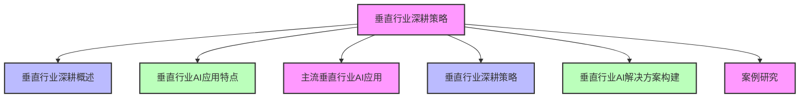
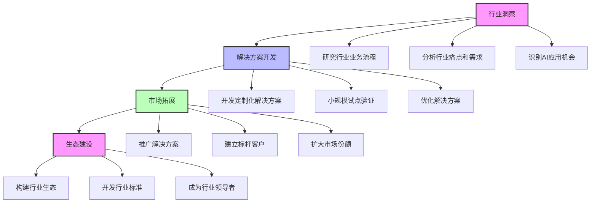
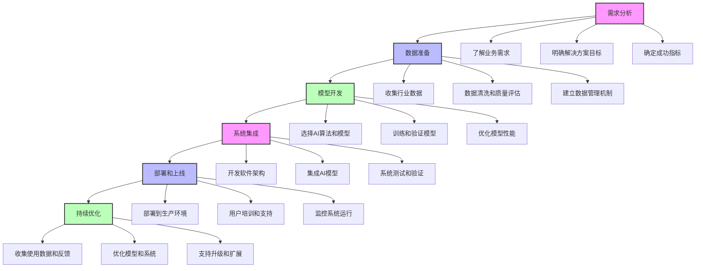

# 第三篇 AI解决方案实战

## 第15章 垂直行业深耕策略

### 学习线路图


### 学习目标
1. 理解垂直行业深耕的概念和重要性
2. 掌握垂直行业AI应用的特点和挑战
3. 了解主流垂直行业的AI应用场景和案例
4. 掌握垂直行业深耕的策略和方法
5. 学会如何构建垂直行业的AI解决方案
6. 了解垂直行业深耕的实际案例

### 核心知识点
- 垂直行业深耕的概念和重要性
- 垂直行业AI应用的特点和挑战
- 主流垂直行业AI应用（制造、金融、医疗、零售等）
- 垂直行业深耕策略（行业洞察、解决方案定制、生态建设等）
- 垂直行业AI解决方案构建方法
- 垂直行业深耕案例

### 重点难点
- 如何深入理解垂直行业的业务流程和痛点
- 如何定制化开发垂直行业的AI解决方案
- 如何构建垂直行业的AI生态系统
- 如何应对垂直行业的监管和合规要求
- 如何在垂直行业中建立竞争优势

### 本章导读

想象一下，你是一名AI解决方案专家，面临两个选择：一个是为多个行业提供通用的AI解决方案，另一个是专注于某个特定行业，如制造、金融或医疗，提供深度定制的AI解决方案。你会选择哪一个？

在AI发展的早期阶段，许多企业倾向于提供通用的AI解决方案，希望覆盖多个行业。然而，随着AI技术的普及和竞争的加剧，越来越多的企业开始意识到，垂直行业深耕是建立竞争优势的关键。通过深入理解某个特定行业的业务流程、痛点和需求，提供深度定制的AI解决方案，可以更好地满足客户需求，建立长期合作关系。

本章将带你了解垂直行业深耕的核心概念和策略，包括垂直行业AI应用的特点和挑战、主流垂直行业的AI应用场景、垂直行业深耕策略、垂直行业AI解决方案构建方法等。通过学习这些内容，你将能够制定有效的垂直行业深耕策略，构建高质量的垂直行业AI解决方案。

---

## 15.1 垂直行业深耕概述（种树类比）

### 15.1.1 什么是垂直行业深耕

想象一下，你有一块土地，你可以选择种植多种不同的作物，每种作物只种植一小块；或者你可以选择只种植一种作物，深耕细作，把它种好。垂直行业深耕就像后者，专注于某个特定行业，深入理解该行业的业务流程、痛点和需求，提供深度定制的AI解决方案，建立长期合作关系，成为该行业的AI解决方案专家。

**垂直行业深耕与种树的类比**：

| 种树 | 垂直行业深耕 |
|------|--------------|
| 选择适合的土壤（行业） | 选择适合的垂直行业 |
| 深耕土壤，了解土壤特性 | 深入理解行业的业务流程、痛点和需求 |
| 选择适合的树种（解决方案） | 选择适合行业的AI技术和解决方案 |
| 长期培育，定期浇水施肥 | 与客户建立长期合作关系，持续优化解决方案 |
| 修剪枝叶，防治病虫害 | 根据行业变化，调整解决方案 |
| 收获果实（收益） | 获得行业认可和商业成功 |

**垂直行业深耕的核心要素**：
- **行业聚焦**：专注于一个或少数几个相关行业（就像只种植一种作物）
- **深度理解**：深入了解行业的业务流程、痛点和需求（就像深入了解土壤特性）
- **定制化解决方案**：根据行业特点，定制开发AI解决方案（就像选择适合土壤的树种）
- **长期合作**：与客户建立长期的合作关系（就像长期培育树木）
- **生态建设**：构建行业生态系统，整合资源和合作伙伴（就像建立植物共生系统）

### 15.1.2 垂直行业深耕的重要性

**1. 建立竞争优势**：
- 深入的行业理解和定制化解决方案，形成差异化竞争优势
- 难以被竞争对手复制，建立行业壁垒

**2. 提高客户满意度**：
- 深度定制的解决方案，更好地满足客户需求
- 长期合作关系，提高客户粘性和忠诚度

**3. 增加收入和利润**：
- 定制化解决方案，通常具有更高的附加值和利润空间
- 长期合作，带来稳定的收入流

**4. 促进创新**：
- 深入的行业理解，促进AI技术与行业需求的深度融合
- 推动行业的数字化转型和创新

**5. 降低风险**：
- 专注于少数行业，更好地管理风险
- 深入的行业知识，减少项目失败的风险

### 15.1.3 垂直行业深耕的阶段

**1. 行业洞察阶段**：
- 研究行业的业务流程、痛点和需求
- 分析行业的市场规模和增长趋势
- 识别行业的AI应用机会

**2. 解决方案开发阶段**：
- 基于行业洞察，开发定制化的AI解决方案
- 进行小规模试点和验证
- 优化解决方案，提高效果和性能

**3. 市场拓展阶段**：
- 向行业内的其他客户推广解决方案
- 建立行业标杆客户
- 扩大市场份额

**4. 生态建设阶段**：
- 构建行业生态系统，整合资源和合作伙伴
- 开发行业标准和最佳实践
- 成为行业的AI解决方案领导者

**垂直行业深耕阶段示例**：



---

## 15.2 垂直行业AI应用特点

### 15.2.1 行业差异性

不同行业具有不同的业务流程、痛点和需求，AI应用的特点也各不相同。

**行业差异示例**：
- **制造业**：关注生产效率、质量控制、设备维护等
- **金融行业**：关注风险控制、客户服务、投资决策等
- **医疗行业**：关注诊断准确性、治疗效果、患者体验等
- **零售行业**：关注客户体验、销售增长、库存管理等

### 15.2.2 业务流程复杂性

垂直行业的业务流程通常比较复杂，AI解决方案需要深入理解和融入这些流程。

**业务流程复杂性示例**：
- 制造业的生产流程涉及多个环节，如原材料采购、生产计划、质量检测、物流配送等
- 金融行业的信贷审批流程涉及多个部门和环节，如客户申请、信用评估、风险审批等

### 15.2.3 数据特点

不同行业的数据特点也各不相同，如数据类型、数据量、数据质量等。

**数据特点示例**：
- **制造业**：数据类型多样，包括传感器数据、图像数据、结构化数据等，数据量大，实时性要求高
- **医疗行业**：数据类型包括医学影像、电子病历、基因数据等，数据隐私要求高，数据质量参差不齐
- **金融行业**：数据类型以结构化数据为主，数据量巨大，实时性和准确性要求高

### 15.2.4 监管和合规要求

不同行业有不同的监管和合规要求，AI解决方案需要符合这些要求。

**监管和合规要求示例**：
- **金融行业**：需要符合巴塞尔协议、反洗钱（AML）、了解你的客户（KYC）等监管要求
- **医疗行业**：需要符合HIPAA（美国）、GDPR（欧盟）等数据保护法规
- **制造业**：需要符合ISO 9001等质量标准

### 15.2.5 投资回报周期

不同行业的AI投资回报周期也各不相同。

**投资回报周期示例**：
- **零售行业**：AI推荐系统的投资回报周期通常为6-12个月
- **制造业**：AI预测性维护系统的投资回报周期通常为12-24个月
- **医疗行业**：AI医学影像分析系统的投资回报周期通常为24-36个月

---

## 15.3 主流垂直行业AI应用

### 15.3.1 制造业

**1. 行业痛点**：
- 生产效率低，成本高
- 设备故障频繁，停机时间长
- 产品质量不稳定
- 供应链管理复杂

**2. AI应用场景**：
- **预测性维护**：通过分析设备传感器数据，预测设备故障，提前安排维护
- **质量控制**：使用计算机视觉技术，自动检测产品缺陷
- **生产调度优化**：使用AI算法优化生产计划和调度
- **供应链优化**：使用AI算法优化供应链管理，降低库存成本
- **智能机器人**：使用AI驱动的机器人，自动化生产流程

**3. 成功案例**：
- 某汽车制造商使用AI预测性维护系统，设备故障停机时间减少了50%，维护成本降低了40%
- 某电子制造商使用AI质量检测系统，产品缺陷率降低了30%，检测效率提高了50%

**制造业AI应用占比示例**：

| 应用场景 | 占比 | 主要价值 |
|----------|------|----------|
| 预测性维护 | 30% | 减少设备故障，降低维护成本 |
| 质量控制 | 25% | 提高产品质量，降低缺陷率 |
| 生产调度优化 | 20% | 提高生产效率，降低成本 |
| 供应链优化 | 15% | 优化库存，降低供应链成本 |
| 智能机器人 | 10% | 自动化生产，提高效率 |

### 15.3.2 金融行业

**1. 行业痛点**：
- 风险控制难度大
- 客户服务成本高，效率低
- 投资决策难度大
- 合规成本高

**2. AI应用场景**：
- **智能风控**：使用AI算法评估信用风险、欺诈风险等
- **智能客服**：使用聊天机器人自动化客户服务
- **智能投顾**：使用AI算法提供投资建议
- **合规自动化**：使用AI技术自动化合规检查和报告生成
- **个性化推荐**：使用AI算法推荐金融产品和服务

**3. 成功案例**：
- 某银行使用AI智能风控系统，欺诈检测准确率提高了30%，信用评分准确性提高了15%
- 某保险公司使用AI智能客服系统，客服人员工作量减少了60%，客户满意度提高了20%

**金融行业AI应用占比示例**：

| 应用场景 | 占比 | 主要价值 |
|----------|------|----------|
| 智能风控 | 35% | 降低风险，减少损失 |
| 智能客服 | 25% | 提高客服效率，降低成本 |
| 智能投顾 | 20% | 提高投资收益，降低风险 |
| 合规自动化 | 10% | 降低合规成本，提高效率 |
| 个性化推荐 | 10% | 提高产品销量，增加收入 |

### 15.3.3 医疗行业

**1. 行业痛点**：
- 医疗资源分配不均
- 诊断效率低，准确性有待提高
- 患者体验差
- 药物研发周期长，成本高

**2. AI应用场景**：
- **医学影像分析**：使用AI技术自动分析医学影像，辅助医生诊断
- **辅助诊断**：使用AI算法辅助医生进行疾病诊断
- **药物研发**：使用AI技术加速药物研发过程
- **患者管理**：使用AI技术优化患者管理，提高患者体验
- **远程医疗**：使用AI技术支持远程医疗服务

**3. 成功案例**：
- 某医院使用AI医学影像分析系统，肺癌诊断准确率提高了15%，诊断时间缩短了80%
- 某制药公司使用AI药物研发系统，新药研发周期缩短了30%，成本降低了25%

**医疗行业AI应用占比示例**：

| 应用场景 | 占比 | 主要价值 |
|----------|------|----------|
| 医学影像分析 | 35% | 提高诊断准确性，减少漏诊 |
| 辅助诊断 | 25% | 提高诊断效率，减轻医生负担 |
| 药物研发 | 20% | 加速药物研发，降低成本 |
| 患者管理 | 10% | 提高患者体验，改善治疗效果 |
| 远程医疗 | 10% | 扩大医疗服务覆盖范围 |

### 15.3.4 零售行业

**1. 行业痛点**：
- 客户转化率低，客单价低
- 库存管理困难，缺货和积压并存
- 客户体验差
- 营销效果不佳

**2. AI应用场景**：
- **个性化推荐**：使用AI算法推荐产品，提高客户转化率和客单价
- **智能库存管理**：使用AI算法优化库存，降低库存成本
- **智能定价**：使用AI算法动态调整价格，提高销售额和利润
- **智能客服**：使用聊天机器人自动化客户服务
- **客户行为分析**：使用AI技术分析客户行为，优化营销策略

**3. 成功案例**：
- 某电商平台使用AI个性化推荐系统，客户转化率提高了20%，客单价提高了15%
- 某零售企业使用AI智能库存管理系统，库存成本降低了30%，缺货率降低了40%

**零售行业AI应用占比示例**：

| 应用场景 | 占比 | 主要价值 |
|----------|------|----------|
| 个性化推荐 | 35% | 提高转化率，增加销售额 |
| 智能库存管理 | 25% | 降低库存成本，减少缺货 |
| 智能定价 | 20% | 优化价格，提高利润 |
| 智能客服 | 10% | 提高客服效率，降低成本 |
| 客户行为分析 | 10% | 优化营销，提高效果 |

### 15.3.5 智慧城市

**1. 行业痛点**：
- 交通拥堵严重
- 公共安全压力大
- 环境问题突出
- 资源管理效率低

**2. AI应用场景**：
- **智能交通**：使用AI技术优化交通信号灯控制，减少交通拥堵
- **智能安防**：使用AI技术监控公共区域，提高公共安全
- **智能环境监测**：使用AI技术监测环境质量，预测污染情况
- **智能能源管理**：使用AI技术优化能源使用，降低能耗
- **智能政务**：使用AI技术优化政务服务，提高效率

**3. 成功案例**：
- 某城市使用AI智能交通系统，交通拥堵时间减少了30%，交通事故率降低了20%
- 某城市使用AI智能安防系统，犯罪率降低了25%，破案率提高了40%

**智慧城市AI应用占比示例**：

| 应用场景 | 占比 | 主要价值 |
|----------|------|----------|
| 智能交通 | 30% | 减少拥堵，提高交通效率 |
| 智能安防 | 25% | 提高公共安全，降低犯罪率 |
| 智能环境监测 | 20% | 改善环境质量，预测污染 |
| 智能能源管理 | 15% | 降低能耗，节约资源 |
| 智能政务 | 10% | 提高政务效率，改善服务 |

**主流垂直行业AI应用对比**：

```mermaid
bar chart
title 不同行业AI应用成熟度对比
x-axis [制造业, 金融行业, 医疗行业, 零售行业, 智慧城市]
y-axis 成熟度评分 (1-10)
bar [8, 9, 7, 8, 7]
```

**各行业AI应用核心价值对比**：

| 行业 | 核心价值 | AI应用重点 |
|------|----------|------------|
| 制造业 | 提高生产效率，降低成本 | 预测性维护、质量控制 |
| 金融行业 | 降低风险，提高客户体验 | 智能风控、智能客服 |
| 医疗行业 | 提高诊断准确性，改善患者体验 | 医学影像分析、辅助诊断 |
| 零售行业 | 提高销售额，优化库存 | 个性化推荐、智能库存管理 |
| 智慧城市 | 提高城市管理效率，改善民生 | 智能交通、智能安防 |

---

## 15.4 垂直行业深耕策略

### 15.4.1 行业洞察策略

**1. 深入了解行业**：
- 研究行业的业务流程、价值链和关键成功因素
- 了解行业的痛点和需求
- 分析行业的发展趋势和未来方向

**2. 建立行业专家团队**：
- 招聘具有行业经验的专家
- 对团队进行行业知识培训
- 与行业协会和研究机构合作

**3. 与客户深度合作**：
- 与客户建立长期合作关系
- 参与客户的业务流程优化和数字化转型
- 共同探索AI应用机会

**行业洞察方法示例**：
- 参加行业会议和展览，了解行业动态
- 阅读行业报告和研究论文
- 与行业专家和客户进行深度访谈
- 进行行业案例研究和分析

### 15.4.2 解决方案定制策略

**1. 基于行业需求定制**：
- 根据行业的具体需求，定制开发AI解决方案
- 解决行业的核心痛点
- 提供端到端的解决方案

**2. 模块化设计**：
- 采用模块化的解决方案设计，便于定制和扩展
- 提供标准化的核心模块，结合行业特定的定制模块
- 支持灵活的配置和调整

**3. 持续优化和迭代**：
- 基于客户反馈和实际使用情况，持续优化解决方案
- 定期更新AI模型和算法
- 支持快速迭代和部署

**解决方案定制示例**：
- 针对制造业，定制开发预测性维护解决方案，结合制造业的设备特点和维护流程
- 针对金融行业，定制开发智能风控解决方案，结合金融行业的风险特点和监管要求

### 15.4.3 市场拓展策略

**1. 建立标杆客户**：
- 选择行业内的领先企业作为标杆客户
- 与标杆客户深度合作，共同开发和验证解决方案
- 利用标杆客户的影响力，向其他客户推广解决方案

**2. 行业细分市场聚焦**：
- 聚焦于行业内的特定细分市场，如制造业中的汽车制造或电子制造
- 深入了解细分市场的需求和特点
- 开发针对性的解决方案

**3. 合作伙伴生态**：
- 与行业内的系统集成商、设备供应商等建立合作伙伴关系
- 共同推广和交付解决方案
- 共享市场资源和客户渠道

**市场拓展示例**：
- 某AI解决方案提供商选择一家大型汽车制造商作为标杆客户，共同开发AI预测性维护系统。成功实施后，利用该标杆客户的案例，向其他汽车制造商推广解决方案

### 15.4.4 生态建设策略

**1. 构建行业生态系统**：
- 整合行业内的各种资源和合作伙伴
- 建立行业联盟和生态平台
- 促进资源共享和协作

**2. 开发行业标准和最佳实践**：
- 参与制定行业AI应用的标准和规范
- 开发行业最佳实践和参考架构
- 推动行业的标准化和规范化发展

**3. 培养行业人才**：
- 与高校和培训机构合作，培养行业所需的AI人才
- 提供行业AI培训和认证
- 建立行业人才库

**4. 行业知识共享**：
- 举办行业会议和研讨会，分享AI应用经验和案例
- 发布行业AI应用报告和白皮书
- 建立行业知识库和社区

**生态建设示例**：
- 某AI解决方案提供商联合行业内的设备制造商、系统集成商和研究机构，建立了制造业AI生态联盟，共同推动制造业的AI应用发展

### 15.4.5 技术与业务融合策略

**1. 技术驱动与业务驱动结合**：
- 以业务需求为导向，结合AI技术的优势
- 避免技术为中心，忽视业务需求
- 确保AI解决方案能够解决实际业务问题

**2. 与现有系统集成**：
- 确保AI解决方案能够与客户现有的IT系统和业务流程无缝集成
- 降低客户的实施成本和风险
- 提高解决方案的易用性和接受度

**3. 注重用户体验**：
- 设计用户友好的AI解决方案界面
- 提供清晰的AI决策解释
- 确保解决方案易于使用和维护

**技术与业务融合示例**：
- 某AI解决方案提供商在开发制造业AI解决方案时，深入了解制造业的生产流程，确保解决方案能够与现有的ERP系统、MES系统无缝集成，提高生产效率

---

## 15.5 垂直行业AI解决方案构建

### 15.5.1 解决方案构建流程

**1. 需求分析**：
- 深入了解客户的业务需求和痛点
- 明确解决方案的目标和范围
- 确定关键成功指标

**2. 数据准备**：
- 收集和整理行业相关数据
- 进行数据清洗和质量评估
- 建立数据管理和治理机制

**3. 模型开发**：
- 选择合适的AI算法和模型
- 训练和验证AI模型
- 优化模型性能

**4. 系统集成**：
- 开发解决方案的软件架构
- 集成AI模型和其他系统组件
- 进行系统测试和验证

**5. 部署和上线**：
- 部署解决方案到生产环境
- 进行用户培训和支持
- 监控系统运行情况

**6. 持续优化**：
- 收集系统使用数据和用户反馈
- 持续优化AI模型和系统性能
- 支持系统的升级和扩展

**垂直行业AI解决方案构建流程示例**：



### 15.5.2 数据策略

**1. 数据收集**：
- 明确需要收集的数据类型和来源
- 建立数据收集机制和流程
- 确保数据的合法性和合规性

**2. 数据质量**：
- 建立数据质量评估和监控机制
- 进行数据清洗和预处理
- 确保数据的准确性、完整性和一致性

**3. 数据安全和隐私**：
- 实施数据加密和访问控制措施
- 符合行业数据保护法规
- 建立数据安全管理机制

**4. 数据治理**：
- 建立数据治理框架和流程
- 明确数据的所有权和责任
- 确保数据的可追溯性和审计性

**数据策略示例**：
- 针对医疗行业，建立严格的数据隐私保护机制，符合HIPAA等法规要求
- 针对金融行业，建立完善的数据治理框架，确保数据的准确性和合规性

### 15.5.3 技术选型策略

**1. 技术栈选择**：
- 根据行业特点和需求，选择合适的技术栈
- 考虑技术的成熟度、性能、可扩展性等因素
- 优先选择行业内广泛采用的技术

**2. 云服务与本地部署**：
- 根据行业的安全和合规要求，选择云服务或本地部署
- 考虑混合部署模式，结合云服务和本地部署的优势
- 确保部署方式符合行业的监管要求

**3. 开源与商业技术**：
- 根据行业需求和预算，选择开源或商业技术
- 考虑技术的支持和服务质量
- 确保技术的可持续性和可维护性

**技术选型示例**：
- 针对金融行业，选择安全可靠的商业AI平台，确保符合监管要求
- 针对制造业，选择支持边缘计算的技术栈，满足实时性要求

### 15.5.4 组织和人才策略

**1. 跨职能团队**：
- 建立跨职能的解决方案团队，包括AI技术专家、行业专家、项目经理等
- 确保团队具备全面的能力
- 促进团队内部的沟通和协作

**2. 行业知识培训**：
- 对AI技术团队进行行业知识培训
- 提高团队对行业业务流程和需求的理解
- 培养既懂AI技术又懂行业业务的复合型人才

**3. 外部专家资源**：
- 利用外部行业专家和顾问的资源
- 与高校和研究机构合作
- 建立专家咨询网络

**组织和人才示例**：
- 某AI解决方案提供商建立了跨职能的制造业解决方案团队，包括AI技术专家、制造业专家、项目经理和数据科学家，共同开发制造业AI解决方案

---

## 15.6 案例研究

### 15.6.1 案例1：某AI公司的制造业深耕策略

**背景**：
某AI公司成立初期，提供通用的AI解决方案，但市场竞争激烈，难以建立竞争优势。公司决定聚焦于制造业，实施垂直行业深耕策略。

**行业洞察**：
- 制造业面临生产效率低、设备故障频繁、产品质量不稳定等痛点
- AI技术在制造业有巨大的应用潜力，尤其是预测性维护、质量控制等领域
- 制造业客户对AI解决方案的需求强烈，但缺乏合适的解决方案

**解决方案开发**：
1. 与一家大型汽车制造商合作，共同开发AI预测性维护解决方案
2. 基于汽车制造行业的设备特点和维护流程，定制开发解决方案
3. 进行小规模试点，验证解决方案的效果
4. 优化解决方案，提高预测准确率和系统性能

**市场拓展**：
1. 以汽车制造商为标杆客户，向其他汽车制造商推广解决方案
2. 扩展到电子制造、机械制造等其他制造细分行业
3. 与制造业系统集成商建立合作伙伴关系，共同推广解决方案

**生态建设**：
1. 与制造业设备供应商合作，整合设备数据和AI解决方案
2. 举办制造业AI应用研讨会，分享成功案例和经验
3. 发布制造业AI应用报告，建立行业影响力

**实施结果**：
- 成为制造业AI解决方案的领先提供商，市场份额达到20%
- 服务了100+制造企业，包括多家世界500强企业
- 制造业AI解决方案收入占公司总收入的80%
- 建立了完善的制造业AI生态系统，包括设备供应商、系统集成商、研究机构等

### 15.6.2 案例2：某银行的金融AI深耕策略

**背景**：
某银行面临风险控制难度大、客户服务成本高、营销效果不佳等问题，决定实施AI深耕策略，提高竞争力。

**行业洞察**：
- 金融行业对AI技术的需求强烈，尤其是在风控、客服、营销等领域
- 金融行业监管严格，对AI解决方案的安全性和合规性要求高
- 客户对个性化金融服务的需求不断增加

**解决方案开发**：
1. 建立金融AI实验室，专注于金融AI技术的研发
2. 开发智能风控、智能客服、智能营销等AI解决方案
3. 与监管机构合作，确保解决方案符合监管要求
4. 进行内部试点，验证解决方案的效果

**内部部署和推广**：
1. 在银行内部全面部署AI解决方案
2. 培训员工使用AI工具，提高工作效率
3. 建立AI应用的评估和优化机制
4. 扩展AI解决方案的应用范围

**外部合作**：
1. 与金融科技公司合作，共同开发创新的金融AI解决方案
2. 向其他金融机构输出AI解决方案和技术
3. 参与制定金融AI应用的行业标准

**实施结果**：
- 智能风控系统使欺诈损失减少了30%，信用风险降低了20%
- 智能客服系统使客服人员工作量减少了50%，客户满意度提高了25%
- 智能营销系统使客户转化率提高了15%，营销成本降低了20%
- 成为金融AI领域的领先银行，获得了良好的市场声誉

---

## 本章总结

### 知识回顾

1. **垂直行业深耕概述**：
   - 垂直行业深耕是指AI解决方案提供商专注于某个特定行业，深入理解该行业的业务流程、痛点和需求，提供深度定制的AI解决方案
   - 垂直行业深耕的核心要素包括行业聚焦、深度理解、定制化解决方案、长期合作和生态建设
   - 垂直行业深耕的重要性包括建立竞争优势、提高客户满意度、增加收入和利润、促进创新、降低风险等

2. **垂直行业AI应用特点**：
   - 不同行业具有不同的业务流程、痛点和需求，AI应用的特点也各不相同
   - 垂直行业AI应用的特点包括行业差异性、业务流程复杂性、数据特点、监管和合规要求、投资回报周期等

3. **主流垂直行业AI应用**：
   - **制造业**：AI应用场景包括预测性维护、质量控制、生产调度优化、供应链优化、智能机器人等
   - **金融行业**：AI应用场景包括智能风控、智能客服、智能投顾、合规自动化、个性化推荐等
   - **医疗行业**：AI应用场景包括医学影像分析、辅助诊断、药物研发、患者管理、远程医疗等
   - **零售行业**：AI应用场景包括个性化推荐、智能库存管理、智能定价、智能客服、客户行为分析等
   - **智慧城市**：AI应用场景包括智能交通、智能安防、智能环境监测、智能能源管理、智能政务等

4. **垂直行业深耕策略**：
   - **行业洞察策略**：深入了解行业，建立行业专家团队，与客户深度合作
   - **解决方案定制策略**：基于行业需求定制，模块化设计，持续优化和迭代
   - **市场拓展策略**：建立标杆客户，行业细分市场聚焦，合作伙伴生态
   - **生态建设策略**：构建行业生态系统，开发行业标准和最佳实践，培养行业人才，行业知识共享
   - **技术与业务融合策略**：技术驱动与业务驱动结合，与现有系统集成，注重用户体验

5. **垂直行业AI解决方案构建**：
   - 解决方案构建流程包括需求分析、数据准备、模型开发、系统集成、部署和上线、持续优化
   - 数据策略包括数据收集、数据质量、数据安全和隐私、数据治理
   - 技术选型策略包括技术栈选择、云服务与本地部署、开源与商业技术
   - 组织和人才策略包括跨职能团队、行业知识培训、外部专家资源

6. **案例研究**：
   - 某AI公司的制造业深耕策略：通过行业洞察、解决方案开发、市场拓展和生态建设，成为制造业AI解决方案的领先提供商
   - 某银行的金融AI深耕策略：通过内部解决方案开发、部署和推广，提高了风控效果、客服效率和营销效果，成为金融AI领域的领先银行

### 知识体系梳理

```mermaid
graph TD
    A[垂直行业深耕策略] --> B[垂直行业深耕概述]
    A --> C[垂直行业AI应用特点]
    A --> D[主流垂直行业AI应用]
    A --> E[垂直行业深耕策略]
    A --> F[垂直行业AI解决方案构建]
    
    B --> B1[定义和核心要素]
    B --> B2[重要性]
    B --> B3[阶段]
    
    C --> C1[行业差异性]
    C --> C2[业务流程复杂性]
    C --> C3[数据特点]
    C --> C4[监管和合规要求]
    C --> C5[投资回报周期]
    
    D --> D1[制造业]
    D --> D2[金融行业]
    D --> D3[医疗行业]
    D --> D4[零售行业]
    D --> D5[智慧城市]
    
    E --> E1[行业洞察策略]
    E --> E2[解决方案定制策略]
    E --> E3[市场拓展策略]
    E --> E4[生态建设策略]
    E --> E5[技术与业务融合策略]
    
    F --> F1[构建流程]
    F --> F2[数据策略]
    F --> F3[技术选型策略]
    F --> F4[组织和人才策略]
    
    style A fill:#f9f,stroke:#333,stroke-width:2px
    style B fill:#bbf,stroke:#333,stroke-width:2px
    style C fill:#bfb,stroke:#333,stroke-width:2px
    style D fill:#f9f,stroke:#333,stroke-width:2px
    style E fill:#bbf,stroke:#333,stroke-width:2px
    style F fill:#bfb,stroke:#333,stroke-width:2px
```



### 实践应用场景

**场景1：为制造业企业设计AI解决方案**

假设你是一名AI解决方案专家，需要为一家制造企业设计AI解决方案。通过本章学习，你可以：

1. **行业洞察**：
   - 研究制造企业的业务流程、痛点和需求
   - 分析制造业AI应用的机会和趋势
   - 确定AI解决方案的核心场景

2. **解决方案设计**：
   - 基于制造业的特点，设计定制化的AI解决方案
   - 选择合适的AI算法和技术栈
   - 考虑与现有系统的集成

3. **实施策略**：
   - 制定分阶段的实施计划
   - 选择合适的试点场景
   - 建立跨职能的实施团队

4. **生态建设**：
   - 与制造业设备供应商、系统集成商建立合作关系
   - 参与制造业AI生态建设
   - 分享制造业AI应用经验

**场景2：为金融机构制定AI策略**

假设你是一名金融机构的AI负责人，需要制定金融AI策略。通过本章学习，你可以：

1. **行业洞察**：
   - 分析金融行业的痛点和需求
   - 研究金融AI应用的趋势和机会
   - 了解竞争对手的AI策略

2. **AI策略制定**：
   - 确定金融AI的核心应用场景，如智能风控、智能客服、智能营销等
   - 制定AI技术路线和发展规划
   - 考虑监管和合规要求

3. **解决方案实施**：
   - 选择合适的AI解决方案提供商
   - 制定内部实施计划
   - 建立AI应用的评估和优化机制

4. **人才培养**：
   - 培养既懂金融又懂AI的复合型人才
   - 与高校和培训机构合作，建立金融AI人才培养体系
   - 建立AI专家团队

### 下一步学习建议

1. 深入学习知识体系维护与持续学习（第16章）
2. 了解专业认证与职业发展（第17章）
3. 实践垂直行业深耕策略，参与实际项目
4. 关注垂直行业AI应用的最新发展和趋势
5. 学习行业特定的知识和业务流程
6. 加入垂直行业AI专家社区，分享和学习经验
7. 研究行业AI应用的成功案例和最佳实践

通过本章的学习，你已经掌握了垂直行业深耕的核心概念和策略。垂直行业深耕是AI解决方案专家的重要发展方向，它可以帮助你建立竞争优势，提高客户满意度，增加收入和利润。接下来，我们将学习知识体系维护与持续学习，了解如何保持和更新AI解决方案专家的知识体系，适应快速变化的AI技术和市场环境。

---