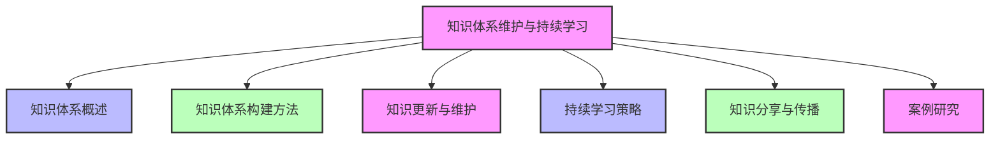
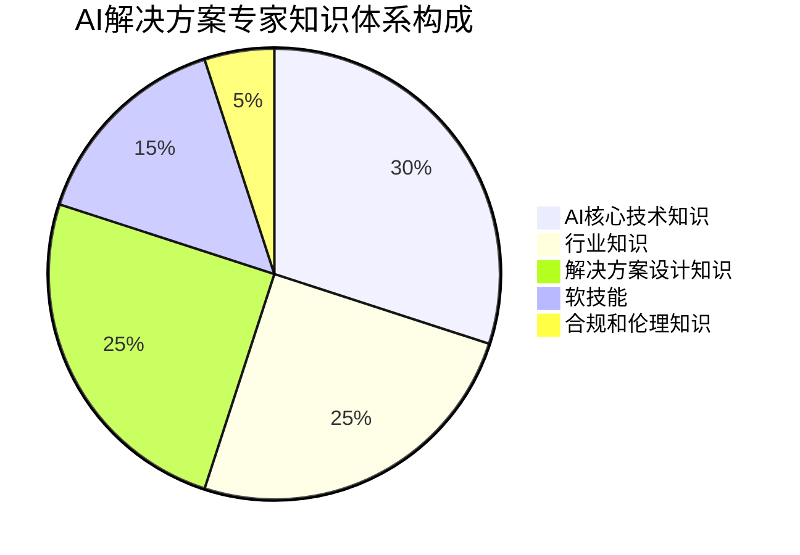
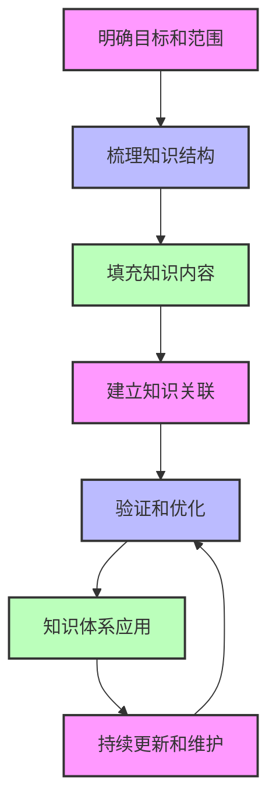

# 第四篇 AI解决方案专家职业发展

## 第16章 知识体系维护与持续学习

### 学习线路图

### 学习目标
1. 理解知识体系维护与持续学习的重要性
2. 掌握AI解决方案专家知识体系的构建方法
3. 学会如何进行知识更新与维护
4. 掌握持续学习的策略和方法
5. 了解知识分享与传播的方式和价值
6. 学习知识体系维护与持续学习的实际案例

### 核心知识点
- 知识体系的概念和重要性
- AI解决方案专家知识体系的构成
- 知识体系构建方法
- 知识更新与维护策略
- 持续学习的方法和工具
- 知识分享与传播的方式
- 知识管理工具和平台

### 重点难点
- 如何构建完整的AI解决方案专家知识体系
- 如何持续更新和维护知识体系
- 如何选择适合自己的学习方法和资源
- 如何平衡工作和学习的关系
- 如何有效分享和传播知识

### 本章导读

想象一下，你是一名AI解决方案专家，掌握了丰富的AI知识和技能，成功实施了多个AI项目。但随着AI技术的快速发展，新的模型、算法、工具不断涌现，你的知识开始过时，你发现自己越来越难以跟上行业的发展趋势。这时候，你该怎么办？

在AI领域，知识更新的速度非常快，每天都有新的研究成果、技术突破和应用案例出现。作为一名AI解决方案专家，你需要不断学习和更新知识，维护和完善自己的知识体系，才能保持竞争力，为客户提供最新、最优质的解决方案。

本章将带你了解知识体系维护与持续学习的核心概念和方法，包括知识体系的构建、更新与维护、持续学习策略、知识分享与传播等。通过学习这些内容，你将能够建立完整的知识体系，制定有效的持续学习计划，保持知识的更新和竞争力。

---

## 16.1 知识体系概述（图书馆类比）

### 16.1.1 什么是知识体系

知识体系就像一个图书馆，里面收藏了各种书籍、资料和信息，按照一定的分类和结构组织起来，方便读者查找和使用。同样，AI解决方案专家的知识体系是指将AI相关的知识和技能按照一定的分类和结构组织起来，形成一个完整、系统的知识框架。

**知识体系与图书馆的类比**：

| 图书馆 | AI解决方案专家知识体系 |
|--------|------------------------|
| 图书分类（文学、历史、科学等） | 知识分类（AI技术、行业知识、解决方案设计等） |
| 书架和索引系统 | 知识结构和组织方式 |
| 图书收藏和更新 | 知识的获取和更新 |
| 读者借阅和使用 | 知识的应用和实践 |
| 图书馆管理员 | 知识体系的维护者 |

### 16.1.2 AI解决方案专家知识体系的构成

**AI解决方案专家的知识体系主要包括以下几个方面**：

1. **AI核心技术知识**：
   - AI基础概念和原理
   - 机器学习和深度学习算法
   - 大语言模型和Transformer架构
   - AI开发工具和平台
   - AI模型训练和部署

2. **行业知识**：
   - 垂直行业的业务流程和痛点
   - 行业发展趋势和政策
   - 行业解决方案和案例
   - 行业标准和规范

3. **解决方案设计知识**：
   - 需求分析和业务建模
   - 解决方案架构设计
   - 技术选型和风险评估
   - 项目管理和实施
   - 效果评估和优化

4. **软技能**：
   - 沟通和演示技巧
   - 团队协作和管理
   - 问题解决和创新能力
   - 商业思维和战略规划
   - 客户关系管理

5. **合规和伦理知识**：
   - AI安全和隐私保护
   - 数据保护法规（GDPR、CCPA等）
   - AI伦理和社会责任
   - 行业合规要求

**AI解决方案专家知识体系构成示例**：

### 16.1.3 知识体系的重要性

**1. 提高学习效率**：
- 有了完整的知识体系，学习新的知识时可以更快地找到其在体系中的位置
- 更容易理解知识之间的关联和逻辑关系
- 避免零散学习，提高学习的系统性和效率

**2. 提高解决问题的能力**：
- 完整的知识体系可以帮助你从多个角度分析问题
- 更容易找到解决问题的方法和思路
- 提高问题解决的效率和质量

**3. 保持竞争力**：
- 快速变化的AI领域，只有不断更新知识体系，才能保持竞争力
- 完整的知识体系可以帮助你更好地适应行业的变化
- 提高你的专业水平和市场价值

**4. 促进职业发展**：
- 完整的知识体系是职业发展的基础
- 更容易获得晋升和职业机会
- 提高你的专业影响力和声誉

---

## 16.2 知识体系构建方法

### 16.2.1 知识体系构建原则

**1. 系统性原则**：
- 知识体系应该是系统的、完整的，涵盖AI解决方案专家所需的各个方面
- 知识之间应该有清晰的逻辑关系和层次结构

**2. 实用性原则**：
- 知识体系应该以实用为导向，重点关注解决实际问题所需的知识和技能
- 避免过于理论化，注重实践应用

**3. 动态性原则**：
- 知识体系应该是动态的、不断更新的
- 随着AI技术和行业的发展，及时调整和完善知识体系

**4. 个性化原则**：
- 知识体系应该根据个人的兴趣、专长和职业目标进行定制
- 不同的AI解决方案专家可以有不同的知识体系侧重点

### 16.2.2 知识体系构建步骤

**1. 明确目标和范围**：
- 确定知识体系的目标和范围，根据职业目标和需求确定需要涵盖的知识领域
- 例如，如果你专注于金融行业的AI解决方案，那么你的知识体系应该重点涵盖金融行业知识

**2. 梳理知识结构**：
- 将知识领域分解为更小的知识模块，建立层次结构
- 例如，AI核心技术知识可以分解为AI基础概念、机器学习算法、深度学习算法、大语言模型等模块

**3. 填充知识内容**：
- 为每个知识模块填充具体的知识内容
- 可以通过学习、实践、阅读等方式获取知识
- 注重知识的质量和实用性

**4. 建立知识关联**：
- 建立不同知识模块之间的关联和逻辑关系
- 例如，AI技术知识与行业知识之间的关联，解决方案设计知识与软技能之间的关联

**5. 验证和优化**：
- 通过实践应用验证知识体系的有效性
- 根据实践反馈和行业变化，不断优化和完善知识体系

**知识体系构建流程**：

### 16.2.3 知识体系构建工具

**1. 思维导图工具**：
- 使用思维导图工具（如MindManager、XMind、Notion等）构建知识体系的层次结构
- 思维导图可以直观地展示知识之间的关联和逻辑关系
- 方便修改和更新知识体系

**2. 知识管理平台**：
- 使用知识管理平台（如Confluence、Notion、Obsidian等）存储和管理知识
- 支持文档、笔记、链接等多种形式的知识存储
- 提供搜索、分类、标签等功能，方便知识的查找和使用

**3. 学习管理系统**：
- 使用学习管理系统（如Coursera、Udemy、edX等）获取和管理学习资源
- 跟踪学习进度，管理学习计划
- 提供证书和学习记录，方便职业发展

**4. 项目管理工具**：
- 使用项目管理工具（如Trello、Asana、Jira等）管理学习任务和项目
- 制定学习计划，跟踪学习进度
- 提高学习的组织性和效率

---

## 16.3 知识更新与维护

### 16.3.1 知识更新的重要性

AI技术的发展非常快，新的模型、算法、工具不断涌现，行业应用场景也在不断扩展。如果不及时更新知识，你的知识体系就会过时，无法适应行业的发展需求。

**知识更新的重要性**：
- 保持知识的时效性和实用性
- 适应AI技术和行业的快速变化
- 提高解决问题的能力和竞争力
- 促进创新和持续改进

### 16.3.2 知识更新的方法

**1. 定期学习和阅读**：
- 定期阅读AI相关的书籍、论文、博客和新闻
- 关注行业动态和趋势
- 参加在线课程和培训

**2. 实践和项目经验**：
- 参与AI项目和实践，积累实际经验
- 尝试使用新的AI工具和技术
- 总结项目经验和教训

**3. 参加行业活动和社区**：
- 参加AI行业会议、研讨会和讲座
- 加入AI社区和论坛，与同行交流和分享
- 关注行业专家和意见领袖

**4. 知识分享和传播**：
- 分享自己的知识和经验，如撰写博客、发表文章、进行演讲等
- 在分享的过程中，加深对知识的理解和掌握
- 获取他人的反馈和建议，完善自己的知识体系

**知识更新频率建议**：

| 知识类型 | 更新频率 | 主要方式 |
|----------|----------|----------|
| AI核心技术 | 每周 | 阅读技术博客、论文，尝试新工具 |
| 行业知识 | 每月 | 阅读行业报告，参加行业会议 |
| 解决方案设计 | 每季度 | 总结项目经验，学习最佳实践 |
| 软技能 | 每半年 | 参加培训，实践应用 |
| 合规和伦理 | 每年 | 学习新的法规和标准 |

### 16.3.3 知识维护的策略

**1. 定期梳理和整理**：
- 定期梳理和整理自己的知识体系
- 检查知识的时效性和准确性
- 删除过时的知识，添加新的知识

**2. 建立知识更新机制**：
- 制定知识更新计划和时间表
- 建立知识更新的提醒和跟踪机制
- 确保知识更新的持续性和规律性

**3. 知识分类和标签**：
- 对知识进行分类和标签，方便查找和管理
- 使用统一的分类标准和标签体系
- 定期更新分类和标签

**4. 知识备份和安全**：
- 定期备份知识和学习资料
- 确保知识的安全性和隐私保护
- 选择可靠的知识管理平台和工具

---

## 16.4 持续学习策略

### 16.4.1 持续学习的原则

**1. 目标导向**：
- 明确学习目标和方向，避免盲目学习
- 根据职业目标和需求确定学习内容
- 设定具体、可衡量的学习目标

**2. 主动学习**：
- 主动寻找学习机会和资源
- 积极参与学习活动和社区
- 主动实践和应用所学知识

**3. 多元化学习**：
- 采用多种学习方式，如阅读、听课、实践、交流等
- 结合理论学习和实践应用
- 学习不同领域的知识，拓宽视野

**4. 终身学习**：
- 持续学习是一个终身的过程，不是一次性的
- 保持学习的习惯和热情
- 不断更新和完善自己的知识体系

### 16.4.2 持续学习的方法

**1. 深度学习和广泛学习结合**：
- **深度学习**：深入学习某个领域的知识，成为该领域的专家
- **广泛学习**：学习多个领域的知识，拓宽知识面和视野
- 平衡深度学习和广泛学习，根据职业目标和需求进行调整

**2. 结构化学习和碎片化学习结合**：
- **结构化学习**：系统学习某个领域的知识，如参加在线课程、阅读书籍等
- **碎片化学习**：利用零散时间学习，如阅读博客、听 podcast、刷短视频等
- 结合结构化学习和碎片化学习，提高学习效率

**3. 自主学习和合作学习结合**：
- **自主学习**：根据自己的需求和节奏学习
- **合作学习**：与他人合作学习，如参加学习小组、研讨会等
- 结合自主学习和合作学习，提高学习效果和动力

**4. 理论学习和实践应用结合**：
- **理论学习**：学习AI的基础概念和原理
- **实践应用**：将所学知识应用到实际项目中
- 结合理论学习和实践应用，加深对知识的理解和掌握

### 16.4.3 持续学习的资源

**1. 在线课程和培训**：
- Coursera、Udemy、edX等在线学习平台
- 提供各种AI相关的课程和培训
- 包括基础课程、高级课程和职业证书

**2. 书籍和论文**：
- AI领域的经典书籍和最新著作
- 学术论文和研究报告
- 行业白皮书和案例研究

**3. 博客和网站**：
- AI技术博客和网站，如Medium、Towards Data Science、AI Weekly等
- 行业新闻和趋势网站，如TechCrunch、WIRED、MIT Technology Review等
- 开源社区和代码库，如GitHub、Stack Overflow等

**4. 行业会议和研讨会**：
- AI行业会议，如NeurIPS、ICML、CVPR等
- 行业研讨会和讲座
- 在线会议和网络研讨会

**5. 社区和论坛**：
- AI社区和论坛，如Reddit的r/MachineLearning、AI Stack Exchange等
- 专业社交网络，如LinkedIn、Twitter等
- 国内AI社区，如知乎、CSDN、掘金等

### 16.4.4 平衡工作和学习

作为一名AI解决方案专家，你可能需要同时处理工作和学习，如何平衡工作和学习的关系是一个重要的挑战。

**平衡工作和学习的方法**：
1. **制定合理的学习计划**：根据工作和生活的安排，制定合理的学习计划
2. **利用零散时间学习**：利用通勤、午休、晚上等零散时间学习
3. **将学习融入工作**：在工作中学习和实践新的知识和技能
4. **设定优先级**：根据职业目标和需求，设定学习的优先级
5. **保持良好的生活习惯**：保持充足的睡眠、健康的饮食和适当的运动，提高学习效率

---

## 16.5 知识分享与传播

### 16.5.1 知识分享的价值

**1. 加深对知识的理解和掌握**：
- 在分享知识的过程中，需要整理和组织知识，加深对知识的理解和掌握
- 解释和回答问题的过程，有助于发现知识的盲点和不足

**2. 建立专业影响力**：
- 分享知识和经验，建立自己的专业影响力和声誉
- 提高在行业内的知名度和认可度

**3. 促进交流和合作**：
- 分享知识和经验，促进与同行的交流和合作
- 建立人脉关系，拓展职业机会

**4. 推动行业发展**：
- 分享知识和经验，推动AI技术和行业的发展
- 促进知识的传播和创新

### 16.5.2 知识分享的方式

**1. 撰写和发表内容**：
- 撰写博客、文章、白皮书和案例研究
- 发表在行业网站、博客平台和专业期刊上
- 出版书籍和电子书

**2. 演讲和培训**：
- 在行业会议、研讨会和讲座上进行演讲
- 提供培训和辅导，分享知识和经验
- 录制视频教程和在线课程

**3. 参与社区和论坛**：
- 在AI社区和论坛上回答问题，分享经验
- 参与讨论和交流，提供建议和见解
- 组织和主持社区活动

**4. 开源贡献**：
- 参与开源项目，贡献代码和文档
- 分享自己的AI模型、工具和资源
- 建立和维护开源项目

### 16.5.3 知识传播的策略

**1. 选择合适的平台和渠道**：
- 根据目标受众和内容类型，选择合适的平台和渠道
- 例如，技术内容适合发表在GitHub、Medium等平台，行业内容适合发表在LinkedIn、行业网站等平台

**2. 优化内容质量和形式**：
- 确保内容的质量和准确性
- 使用简洁明了的语言，避免过于技术化
- 结合图表、图片、视频等可视化元素，提高内容的吸引力

**3. 建立个人品牌**：
- 建立自己的个人品牌和专业形象
- 保持内容的一致性和专业性
- 定期更新内容，保持活跃度

**4. 互动和反馈**：
- 与读者和听众互动，回复评论和问题
- 收集反馈和建议，不断改进内容和分享方式
- 建立忠实的读者和粉丝群体

---

## 16.6 案例研究

### 16.6.1 案例1：某AI解决方案专家的知识体系构建

**背景**：
某AI解决方案专家刚进入AI行业，需要构建自己的知识体系，提高专业能力，为客户提供高质量的AI解决方案。

**知识体系构建过程**：
1. **明确目标和范围**：
   - 职业目标：成为金融行业AI解决方案专家
   - 知识范围：AI核心技术、金融行业知识、解决方案设计、软技能等

2. **梳理知识结构**：
   - 将知识领域分解为更小的模块，如AI基础概念、机器学习算法、深度学习算法、大语言模型、金融行业知识、解决方案设计等
   - 建立层次结构，明确知识之间的关联和逻辑关系

3. **填充知识内容**：
   - 通过在线课程、书籍、论文等方式获取知识
   - 参与AI项目和实践，积累实际经验
   - 参加行业会议和社区，与同行交流和分享

4. **建立知识关联**：
   - 建立不同知识模块之间的关联，如AI技术与金融行业应用的关联
   - 构建完整的知识网络

5. **持续更新和维护**：
   - 制定知识更新计划，每周阅读技术博客和论文
   - 每月参加行业会议和讲座
   - 每季度总结项目经验，更新知识体系

**实施结果**：
- 建立了完整的金融行业AI解决方案专家知识体系
- 提高了学习效率和专业能力
- 成功实施了多个金融行业AI项目
- 建立了专业影响力和声誉

### 16.6.2 案例2：某企业的AI团队持续学习机制

**背景**：
某企业的AI团队面临AI技术快速发展的挑战，需要建立持续学习机制，提高团队的专业能力和竞争力。

**持续学习机制建立过程**：
1. **制定学习计划**：
   - 为团队成员制定个性化的学习计划
   - 设定具体的学习目标和时间框架
   - 结合工作需求和职业发展目标

2. **提供学习资源**：
   - 订阅AI相关的在线课程和培训平台
   - 购买AI书籍和论文数据库
   - 提供参加行业会议和研讨会的机会

3. **建立学习文化**：
   - 每周组织团队学习分享会，分享学习心得和经验
   - 鼓励团队成员撰写博客和发表文章
   - 建立学习奖励机制，激励团队成员学习

4. **实践和项目结合**：
   - 在项目中应用新的AI技术和工具
   - 组织内部hackathon和技术创新活动
   - 鼓励团队成员参与开源项目和社区

5. **评估和优化**：
   - 定期评估学习效果和团队能力提升情况
   - 根据评估结果，调整学习计划和资源
   - 持续优化持续学习机制

**实施结果**：
- 团队成员的专业能力和竞争力得到了显著提升
- 成功应用了多个新的AI技术和工具
- 提高了项目的质量和效率
- 建立了良好的学习文化和团队氛围

---

## 本章总结

### 知识回顾

1. **知识体系概述**：
   - 知识体系就像一个图书馆，将AI相关的知识和技能按照一定的分类和结构组织起来
   - AI解决方案专家的知识体系包括AI核心技术知识、行业知识、解决方案设计知识、软技能、合规和伦理知识
   - 知识体系的重要性包括提高学习效率、提高解决问题的能力、保持竞争力、促进职业发展

2. **知识体系构建方法**：
   - 知识体系构建原则：系统性、实用性、动态性、个性化
   - 知识体系构建步骤：明确目标和范围、梳理知识结构、填充知识内容、建立知识关联、验证和优化
   - 知识体系构建工具：思维导图工具、知识管理平台、学习管理系统、项目管理工具

3. **知识更新与维护**：
   - 知识更新的重要性：保持知识的时效性和实用性，适应AI技术和行业的快速变化
   - 知识更新的方法：定期学习和阅读、实践和项目经验、参加行业活动和社区、知识分享和传播
   - 知识维护的策略：定期梳理和整理、建立知识更新机制、知识分类和标签、知识备份和安全

4. **持续学习策略**：
   - 持续学习的原则：目标导向、主动学习、多元化学习、终身学习
   - 持续学习的方法：深度学习和广泛学习结合、结构化学习和碎片化学习结合、自主学习和合作学习结合、理论学习和实践应用结合
   - 持续学习的资源：在线课程和培训、书籍和论文、博客和网站、行业会议和研讨会、社区和论坛
   - 平衡工作和学习：制定合理的学习计划、利用零散时间学习、将学习融入工作、设定优先级

5. **知识分享与传播**：
   - 知识分享的价值：加深对知识的理解和掌握、建立专业影响力、促进交流和合作、推动行业发展
   - 知识分享的方式：撰写和发表内容、演讲和培训、参与社区和论坛、开源贡献
   - 知识传播的策略：选择合适的平台和渠道、优化内容质量和形式、建立个人品牌、互动和反馈

6. **案例研究**：
   - 某AI解决方案专家的知识体系构建：通过明确目标、梳理知识结构、填充知识内容、建立知识关联、持续更新和维护，建立了完整的金融行业AI解决方案专家知识体系
   - 某企业的AI团队持续学习机制：通过制定学习计划、提供学习资源、建立学习文化、实践和项目结合、评估和优化，建立了有效的持续学习机制，提高了团队的专业能力和竞争力

### 知识体系梳理

```mermaid
graph TD
    A[知识体系维护与持续学习] --> B[知识体系概述]
    A --> C[知识体系构建方法]
    A --> D[知识更新与维护]
    A --> E[持续学习策略]
    A --> F[知识分享与传播]
    
    B --> B1[知识体系的定义]
    B --> B2[AI解决方案专家知识体系构成]
    B --> B3[知识体系的重要性]
    
    C --> C1[知识体系构建原则]
    C --> C2[知识体系构建步骤]
    C --> C3[知识体系构建工具]
    
    D --> D1[知识更新的重要性]
    D --> D2[知识更新的方法]
    D --> D3[知识维护的策略]
    
    E --> E1[持续学习的原则]
    E --> E2[持续学习的方法]
    E --> E3[持续学习的资源]
    E --> E4[平衡工作和学习]
    
    F --> F1[知识分享的价值]
    F --> F2[知识分享的方式]
    F --> F3[知识传播的策略]
    
    style A fill:#f9f,stroke:#333,stroke-width:2px
    style B fill:#bbf,stroke:#333,stroke-width:2px
    style C fill:#bfb,stroke:#333,stroke-width:2px
    style D fill:#f9f,stroke:#333,stroke-width:2px
    style E fill:#bbf,stroke:#333,stroke-width:2px
    style F fill:#bfb,stroke:#333,stroke-width:2px
```

### 实践应用场景

**场景1：构建个人AI解决方案专家知识体系**

假设你是一名AI解决方案专家，需要构建自己的知识体系。通过本章学习，你可以：

1. **明确目标和范围**：
   - 根据自己的职业目标和兴趣，确定知识体系的目标和范围
   - 例如，如果你想成为医疗行业AI解决方案专家，那么你的知识体系应该重点涵盖医疗行业知识

2. **梳理知识结构**：
   - 将知识领域分解为更小的模块，如AI核心技术、医疗行业知识、解决方案设计等
   - 建立层次结构，明确知识之间的关联

3. **填充知识内容**：
   - 通过在线课程、书籍、论文等方式获取知识
   - 参与医疗行业AI项目，积累实际经验
   - 参加医疗行业会议和社区

4. **持续更新和维护**：
   - 制定知识更新计划，每周阅读技术博客和论文
   - 每月参加行业会议和讲座
   - 每季度总结项目经验，更新知识体系

**场景2：建立团队持续学习机制**

假设你是一名AI团队负责人，需要建立团队持续学习机制。通过本章学习，你可以：

1. **制定学习计划**：
   - 为团队成员制定个性化的学习计划
   - 结合工作需求和职业发展目标
   - 设定具体的学习目标和时间框架

2. **提供学习资源**：
   - 订阅AI相关的在线课程和培训平台
   - 购买AI书籍和论文数据库
   - 提供参加行业会议和研讨会的机会

3. **建立学习文化**：
   - 每周组织团队学习分享会
   - 鼓励团队成员撰写博客和发表文章
   - 建立学习奖励机制

4. **实践和项目结合**：
   - 在项目中应用新的AI技术和工具
   - 组织内部hackathon和技术创新活动
   - 鼓励团队成员参与开源项目和社区

### 下一步学习建议

1. 深入学习专业认证与职业发展（第17章）
2. 参考附录A：核心资源汇总表，获取学习资源
3. 探索附录B：常用工具与平台，选择适合自己的知识管理工具
4. 查阅附录C：术语表，巩固AI相关术语
5. 制定个人知识体系构建和持续学习计划
6. 加入AI社区和论坛，参与知识分享和交流
7. 实践知识分享，撰写博客或发表文章

通过本章的学习，你已经掌握了知识体系维护与持续学习的核心概念和方法。在AI技术快速发展的今天，持续学习和知识更新是AI解决方案专家保持竞争力的关键。建立完整的知识体系，制定有效的持续学习计划，不断更新和维护知识，分享和传播知识，将帮助你在AI解决方案专家的职业道路上不断成长和发展。

---