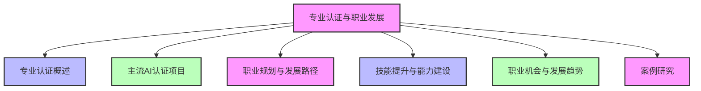
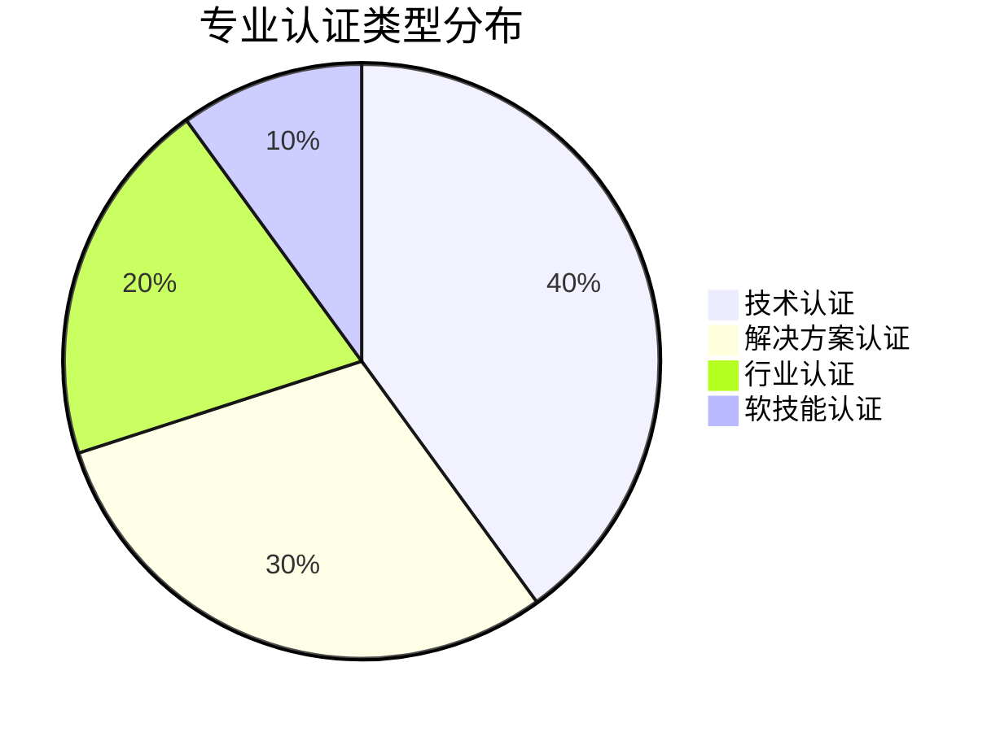
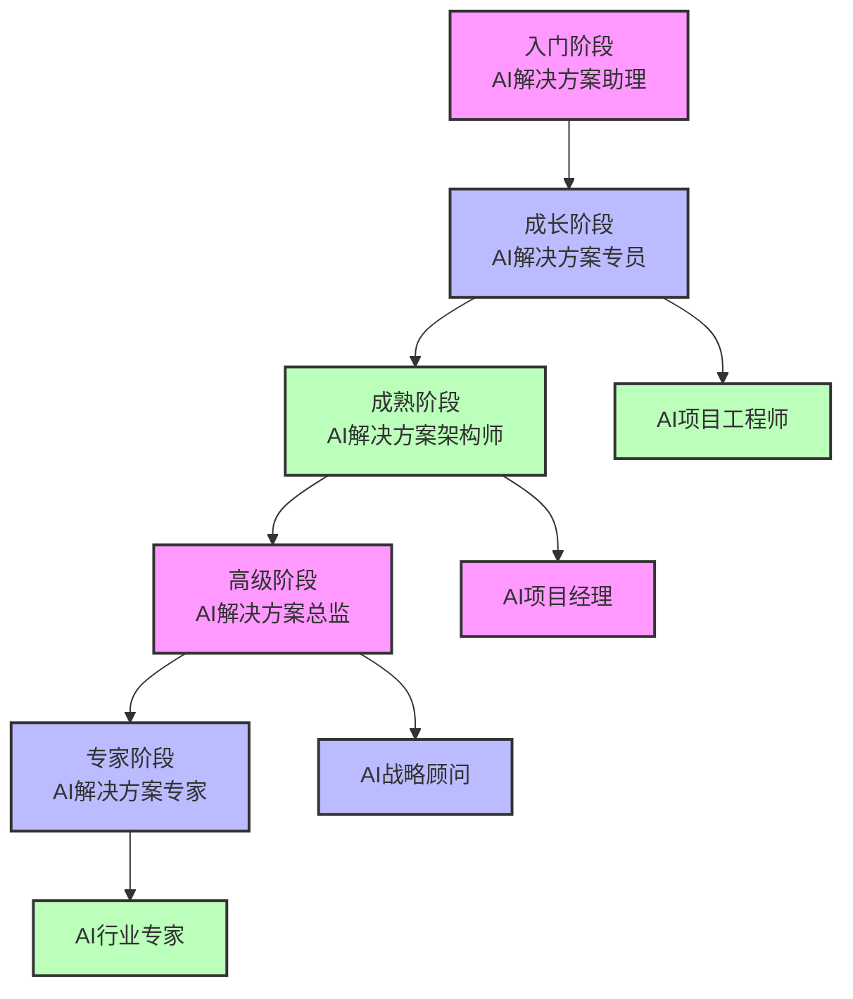
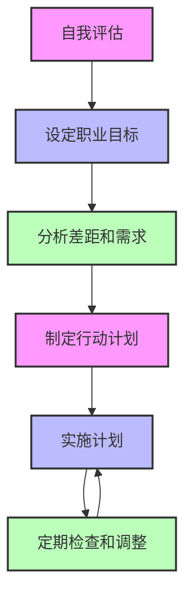
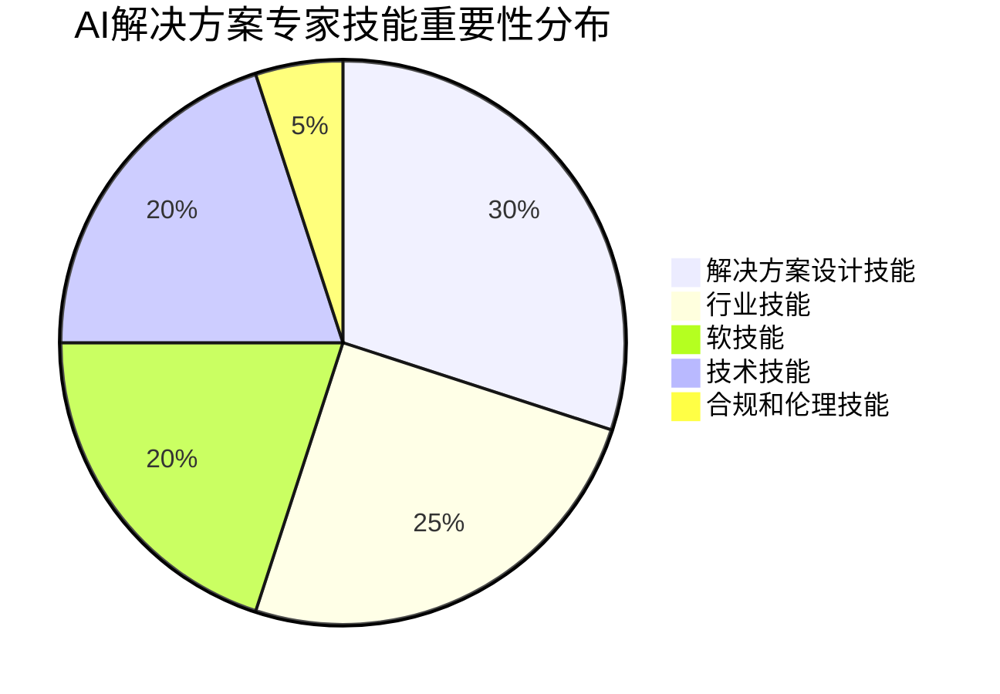
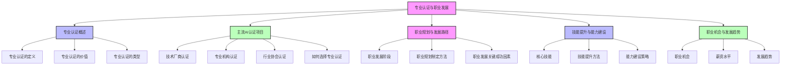

# 第四篇 AI解决方案专家职业发展

## 第17章 专业认证与职业发展

### 学习线路图

### 学习目标
1. 理解专业认证在AI解决方案专家职业发展中的重要性
2. 了解主流AI认证项目的特点和要求
3. 掌握职业规划和发展路径的制定方法
4. 学会如何提升AI解决方案专家所需的技能和能力
5. 了解AI解决方案专家的职业机会和发展趋势
6. 学习职业发展的实际案例和经验

### 核心知识点
- 专业认证的概念和价值
- 主流AI认证项目（技术认证、行业认证、解决方案认证）
- AI解决方案专家的职业规划和发展路径
- 技能提升和能力建设的方法
- AI解决方案专家的职业机会和市场需求
- 行业发展趋势和未来展望

### 重点难点
- 如何选择适合自己的专业认证
- 如何制定有效的职业规划和发展路径
- 如何提升AI解决方案专家所需的软技能和硬技能
- 如何应对AI行业的快速变化和挑战
- 如何在职业发展中保持竞争力

### 本章导读

想象一下，你已经掌握了AI解决方案专家所需的知识和技能，构建了完整的知识体系，制定了持续学习计划。现在，你想进一步提升自己的专业水平，获得更多的职业机会，实现职业发展的突破。这时候，你该怎么办？

专业认证和职业发展规划是AI解决方案专家职业道路上的重要里程碑。专业认证可以证明你的专业能力和知识水平，提高你的市场竞争力和职业价值。职业规划可以帮助你明确职业目标和发展路径，制定有效的提升计划，实现职业发展的突破。

本章将带你了解专业认证与职业发展的核心概念和方法，包括专业认证的价值、主流AI认证项目、职业规划和发展路径、技能提升和能力建设、职业机会和发展趋势等。通过学习这些内容，你将能够制定有效的职业规划，选择适合自己的专业认证，提升自己的技能和能力，实现AI解决方案专家的职业发展目标。

---

## 17.1 专业认证概述（学历与资格证书类比）

### 17.1.1 什么是专业认证

专业认证就像学历和资格证书一样，是对个人专业知识和技能的一种认可和证明。它由权威的机构或组织颁发，证明持证人具备特定领域的专业知识和技能，符合行业标准和要求。

**专业认证与学历的类比**：

| 学历 | 专业认证 |
|------|----------|
| 证明你的教育背景和基础知识 | 证明你的专业技能和实践能力 |
| 由学校颁发 | 由专业机构或厂商颁发 |
| 学习周期长，注重理论知识 | 学习周期短，注重实践技能 |
| 通用性强，适用于多个行业 | 针对性强，适用于特定领域或技术 |
| 终身有效（一般情况下） | 有有效期，需要定期更新 |

### 17.1.2 专业认证的价值

**1. 证明专业能力**：
- 专业认证是对个人专业知识和技能的权威认可
- 证明持证人具备特定领域的专业能力，符合行业标准
- 提高个人的专业可信度和声誉

**2. 提高竞争力**：
- 在求职和晋升中，专业认证可以增加竞争力
- 区分自己与其他候选人，脱颖而出
- 提高薪资水平和职业机会

**3. 促进职业发展**：
- 专业认证可以帮助你获得更多的职业机会和晋升机会
- 拓宽职业发展路径，进入更高层次的职位
- 提高职业满意度和成就感

**4. 持续学习和知识更新**：
- 准备专业认证的过程可以促进持续学习和知识更新
- 保持对行业最新技术和趋势的了解
- 提高解决问题的能力和创新能力

**5. 建立专业网络**：
- 参加专业认证的学习和考试，可以建立专业网络
- 与同行交流和分享经验，拓展人脉关系
- 获得行业认可和尊重

### 17.1.3 专业认证的类型

**1. 技术认证**：
- 由技术厂商或专业机构颁发，专注于特定技术或工具
- 例如，AWS Certified Machine Learning、Google Professional Machine Learning Engineer等

**2. 行业认证**：
- 由行业协会或组织颁发，专注于特定行业的AI应用
- 例如，金融行业AI解决方案认证、医疗行业AI解决方案认证等

**3. 解决方案认证**：
- 专注于AI解决方案的设计、实施和管理
- 例如，AI解决方案架构师认证、AI项目管理认证等

**4. 软技能认证**：
- 专注于AI解决方案专家所需的软技能，如沟通、项目管理、领导力等
- 例如，PMP（项目管理专业人士）认证、Scrum Master认证等

**专业认证类型分布**：

---

## 17.2 主流AI认证项目

### 17.2.1 技术厂商认证

**1. AWS AI/ML认证**：
- **AWS Certified Machine Learning - Specialty**：
  - 专注于AWS平台上的机器学习解决方案设计、开发和部署
  - 要求掌握机器学习算法、数据处理、模型训练和部署等知识
  - 适合希望在AWS平台上从事AI/ML工作的专业人士

- **AWS Certified Data Scientist - Specialty**：
  - 专注于数据科学和机器学习，包括数据处理、分析、模型开发等
  - 要求掌握统计学、机器学习、数据可视化等知识
  - 适合数据科学家和AI研究人员

**2. Google Cloud AI认证**：
- **Google Professional Machine Learning Engineer**：
  - 专注于Google Cloud平台上的机器学习解决方案设计、开发和部署
  - 要求掌握机器学习架构、数据处理、模型训练和部署等知识
  - 适合在Google Cloud平台上从事AI/ML工作的专业人士

- **Google Professional Data Engineer**：
  - 专注于数据工程和机器学习管道的设计和实现
  - 要求掌握数据处理、存储、分析和机器学习等知识
  - 适合数据工程师和AI解决方案架构师

**3. Microsoft Azure AI认证**：
- **Microsoft Certified: Azure AI Engineer Associate**：
  - 专注于Azure平台上的AI解决方案设计、开发和部署
  - 要求掌握Azure AI服务、机器学习、计算机视觉、自然语言处理等知识
  - 适合在Azure平台上从事AI工作的专业人士

- **Microsoft Certified: Data Scientist Associate**：
  - 专注于数据科学和机器学习，包括数据处理、模型开发、评估和部署等
  - 要求掌握统计学、机器学习、Python等知识
  - 适合数据科学家和AI研究人员

### 17.2.2 专业机构认证

**1. IBM AI认证**：
- **IBM Certified AI Engineer**：
  - 专注于IBM Watson平台上的AI解决方案设计、开发和部署
  - 要求掌握机器学习、自然语言处理、计算机视觉等知识
  - 适合在IBM Watson平台上从事AI工作的专业人士

- **IBM Certified Data Scientist**：
  - 专注于数据科学和机器学习，包括数据处理、模型开发、评估和部署等
  - 要求掌握统计学、机器学习、Python等知识
  - 适合数据科学家和AI研究人员

**2. Hugging Face认证**：
- **Hugging Face Certified NLP Engineer**：
  - 专注于自然语言处理（NLP）和Transformer模型
  - 要求掌握Hugging Face Transformers库、NLP模型开发和部署等知识
  - 适合从事NLP和大语言模型工作的专业人士

**3. DeepLearning.AI认证**：
- **DeepLearning.AI TensorFlow Developer Professional Certificate**：
  - 专注于TensorFlow框架的深度学习模型开发和部署
  - 要求掌握TensorFlow、深度学习、计算机视觉、NLP等知识
  - 适合从事深度学习和AI开发工作的专业人士

- **DeepLearning.AI Machine Learning Engineer Professional Certificate**：
  - 专注于机器学习工程，包括模型开发、部署、监控和管理等
  - 要求掌握机器学习、Python、MLOps等知识
  - 适合机器学习工程师和AI解决方案架构师

### 17.2.3 行业协会认证

**1. IEEE AI认证**：
- **IEEE Certified AI Professional (CAIP)**：
  - 由IEEE计算机协会颁发，专注于AI领域的专业知识和技能
  - 要求掌握AI基础、机器学习、深度学习、计算机视觉、NLP等知识
  - 适合AI领域的专业人士和工程师

**2. ACM AI认证**：
- **ACM Certified AI Professional**：
  - 由ACM（美国计算机协会）颁发，专注于AI领域的专业知识和技能
  - 要求掌握AI基础、机器学习、深度学习、伦理和社会影响等知识
  - 适合AI领域的专业人士和研究人员

**3. 国内AI认证**：
- **中国人工智能学会（CAAI）认证**：
  - 包括AI工程师、AI高级工程师、AI研究员等认证
  - 要求掌握AI基础、机器学习、深度学习、行业应用等知识
  - 适合国内AI领域的专业人士

- **工业和信息化部（MIIT）AI认证**：
  - 包括AI应用师、AI开发师、AI架构师等认证
  - 要求掌握AI基础、技术应用、解决方案设计等知识
  - 适合国内AI领域的专业人士和从业人员

### 17.2.4 如何选择专业认证

**1. 根据职业目标选择**：
- 明确自己的职业目标和发展方向
- 选择与职业目标相关的认证
- 例如，如果想成为AI解决方案架构师，可以选择解决方案认证；如果想成为AI开发工程师，可以选择技术认证

**2. 根据技术栈选择**：
- 考虑自己使用的技术栈和平台
- 选择与技术栈相关的认证
- 例如，如果主要使用AWS平台，可以选择AWS AI/ML认证；如果主要使用TensorFlow，可以选择DeepLearning.AI TensorFlow认证

**3. 根据行业需求选择**：
- 考虑目标行业的需求和趋势
- 选择行业认可的认证
- 例如，如果想在金融行业从事AI工作，可以选择金融行业相关的AI认证

**4. 根据认证价值和成本选择**：
- 考虑认证的市场价值和认可度
- 评估认证的成本和回报
- 选择性价比高的认证

**5. 根据个人兴趣和能力选择**：
- 考虑自己的兴趣和能力
- 选择自己感兴趣且有能力通过的认证
- 提高学习的动力和效果

---

## 17.3 职业规划与发展路径

### 17.3.1 AI解决方案专家的职业发展阶段

**AI解决方案专家的职业发展通常分为以下几个阶段**：

1. **入门阶段**：
   - 角色：AI解决方案助理、AI技术支持
   - 主要职责：协助制定AI解决方案，提供技术支持，参与项目实施
   - 所需技能：基础AI知识，行业基础知识，沟通能力

2. **成长阶段**：
   - 角色：AI解决方案专员、AI项目工程师
   - 主要职责：独立制定AI解决方案，参与项目管理，与客户沟通
   - 所需技能：扎实的AI知识，行业知识，解决方案设计能力，项目管理能力

3. **成熟阶段**：
   - 角色：AI解决方案架构师、AI项目经理
   - 主要职责：主导AI解决方案设计，管理AI项目，与客户高层沟通
   - 所需技能：深入的AI知识，丰富的行业经验，解决方案架构设计能力，团队管理能力

4. **高级阶段**：
   - 角色：AI解决方案总监、AI战略顾问
   - 主要职责：制定AI战略，管理多个AI项目，提供战略咨询
   - 所需技能：全面的AI知识，深厚的行业经验，战略规划能力，领导力

5. **专家阶段**：
   - 角色：AI解决方案专家、AI行业专家
   - 主要职责：推动AI行业发展，提供高端咨询，培养人才
   - 所需技能：顶尖的AI知识，丰富的行业经验，影响力和领导力

**AI解决方案专家职业发展路径**：

### 17.3.2 制定职业规划的方法

**1. 自我评估**：
- 评估自己的兴趣、技能、优势和劣势
- 明确自己的职业价值观和目标
- 了解自己的职业现状和期望

**2. 设定职业目标**：
- 设定短期、中期和长期职业目标
- 目标要具体、可衡量、可实现、相关、有时限（SMART原则）
- 例如，短期目标：3个月内通过AWS Certified Machine Learning认证；中期目标：2年内成为AI解决方案架构师；长期目标：5年内成为AI解决方案总监

**3. 分析差距和需求**：
- 分析当前技能和能力与职业目标的差距
- 确定需要提升的知识和技能
- 制定提升计划和时间表

**4. 制定行动计划**：
- 根据差距分析，制定具体的行动计划
- 包括学习计划、认证计划、项目经验积累计划等
- 设定里程碑和检查点，跟踪进度

**5. 实施和调整**：
- 按照行动计划实施，定期检查进度
- 根据实际情况调整计划和目标
- 保持灵活性和适应性

**职业规划制定流程**：

### 17.3.3 职业发展的关键成功因素

**1. 持续学习和技能提升**：
- AI技术发展迅速，需要不断学习和更新知识
- 参加培训、课程、认证等，提升技能和能力
- 保持对行业趋势和新技术的关注

**2. 实践经验积累**：
- 参与更多的AI项目，积累实践经验
- 尝试不同类型的项目和行业，拓宽经验范围
- 总结项目经验和教训，不断改进

**3. 建立专业网络**：
- 加入AI社区和行业组织，与同行交流和分享
- 参加行业会议和活动，建立人脉关系
- 寻找导师和榜样，学习他们的经验和知识

**4. 培养软技能**：
- 沟通能力：与客户和团队成员有效沟通
- 团队合作：与不同背景的人合作
- 领导力：带领团队完成项目
- 问题解决：解决复杂的业务和技术问题

**5. 保持适应性和灵活性**：
- AI行业变化迅速，需要保持适应性和灵活性
- 愿意尝试新的技术和方法
- 接受挑战和变化

---

## 17.4 技能提升与能力建设

### 17.4.1 AI解决方案专家所需的核心技能

**AI解决方案专家需要具备以下核心技能**：

**1. 技术技能**：
- AI基础概念和原理
- 机器学习和深度学习算法
- 大语言模型和Transformer架构
- AI开发工具和平台
- AI模型训练和部署
- MLOps和AI系统管理

**2. 行业技能**：
- 行业业务流程和痛点
- 行业发展趋势和政策
- 行业解决方案和案例
- 行业标准和规范

**3. 解决方案设计技能**：
- 需求分析和业务建模
- 解决方案架构设计
- 技术选型和风险评估
- 项目管理和实施
- 效果评估和优化

**4. 软技能**：
- 沟通和演示技巧
- 团队协作和管理
- 问题解决和创新能力
- 商业思维和战略规划
- 客户关系管理

**5. 合规和伦理技能**：
- AI安全和隐私保护
- 数据保护法规（GDPR、CCPA等）
- AI伦理和社会责任
- 行业合规要求

**AI解决方案专家技能重要性分布**：

### 17.4.2 技能提升的方法

**1. 学习和培训**：
- 参加在线课程和培训，如Coursera、Udemy、edX等
- 阅读AI相关的书籍、论文和博客
- 参加行业会议和研讨会

**2. 实践和项目经验**：
- 参与AI项目和实践，积累实际经验
- 尝试使用新的AI工具和技术
- 参与开源项目，贡献代码和文档

**3. 认证和考试**：
- 参加专业认证考试，如AWS AI/ML认证、Google Professional Machine Learning Engineer认证等
- 获得认证，证明自己的专业能力

**4. 导师和指导**：
- 寻找导师和指导者，学习他们的经验和知识
- 加入导师计划，获得专业指导

**5. 社区和交流**：
- 加入AI社区和论坛，与同行交流和分享
- 参加社区活动和讨论，提高自己的影响力

### 17.4.3 能力建设的策略

**1. 构建完整的知识体系**：
- 建立完整的AI解决方案专家知识体系
- 涵盖技术知识、行业知识、解决方案设计知识、软技能等
- 定期更新和完善知识体系

**2. 专注于核心技能**：
- 识别自己的核心技能和优势
- 专注于提升核心技能，成为领域专家
- 同时发展辅助技能，提高综合能力

**3. 跨领域学习**：
- 学习不同领域的知识，拓宽视野和思路
- 结合不同领域的知识，创新解决方案
- 提高解决复杂问题的能力

**4. 培养创新能力**：
- 鼓励自己提出新的想法和解决方案
- 尝试不同的方法和技术
- 从失败中学习，不断改进

**5. 建立个人品牌**：
- 分享自己的知识和经验，如撰写博客、发表文章、进行演讲等
- 建立个人品牌和专业形象
- 提高自己的专业影响力和声誉

---

## 17.5 职业机会与发展趋势

### 17.5.1 AI解决方案专家的职业机会

AI解决方案专家在各个行业都有广阔的职业机会，包括：

**1. 科技行业**：
- 担任AI解决方案架构师、AI项目经理等角色
- 为企业客户提供AI解决方案
- 参与AI产品和服务的设计和开发

**2. 金融行业**：
- 担任金融AI解决方案专家、智能风控专家等角色
- 设计和实施金融AI解决方案，如智能风控、智能客服、智能投顾等
- 推动金融行业的数字化转型

**3. 医疗行业**：
- 担任医疗AI解决方案专家、医学影像分析专家等角色
- 设计和实施医疗AI解决方案，如医学影像分析、辅助诊断、药物研发等
- 提高医疗服务的效率和质量

**4. 制造行业**：
- 担任制造AI解决方案专家、工业AI顾问等角色
- 设计和实施制造AI解决方案，如预测性维护、质量控制、生产调度优化等
- 推动制造业的智能化转型

**5. 零售行业**：
- 担任零售AI解决方案专家、智能零售顾问等角色
- 设计和实施零售AI解决方案，如个性化推荐、智能库存管理、智能定价等
- 提高零售企业的销售和运营效率

**6. 政府和公共服务**：
- 担任政府AI解决方案专家、智慧城市顾问等角色
- 设计和实施政府AI解决方案，如智能交通、智能安防、智能政务等
- 提高政府服务的效率和质量

### 17.5.2 AI解决方案专家的薪资水平

AI解决方案专家的薪资水平因地区、行业、经验和技能而异。一般来说，AI解决方案专家的薪资水平较高，高于普通IT专业人士。

**全球AI解决方案专家薪资水平示例**：

| 地区 | 初级（0-2年） | 中级（2-5年） | 高级（5-10年） | 专家级（10年以上） |
|------|--------------|--------------|--------------|------------------|
| 美国 | $80,000-$120,000 | $120,000-$180,000 | $180,000-$250,000 | $250,000+ |
| 欧洲 | €60,000-€90,000 | €90,000-€130,000 | €130,000-€180,000 | €180,000+ |
| 中国 | ¥200,000-¥400,000 | ¥400,000-¥800,000 | ¥800,000-¥1,500,000 | ¥1,500,000+ |
| 印度 | ₹600,000-₹1,200,000 | ₹1,200,000-₹2,000,000 | ₹2,000,000-₹3,500,000 | ₹3,500,000+ |

**行业AI解决方案专家薪资水平示例**（中国）：

| 行业 | 平均年薪（人民币） |
|------|------------------|
| 金融行业 | ¥800,000-¥1,500,000 |
| 科技行业 | ¥600,000-¥1,200,000 |
| 医疗行业 | ¥500,000-¥1,000,000 |
| 制造行业 | ¥400,000-¥900,000 |
| 零售行业 | ¥350,000-¥800,000 |

### 17.5.3 AI行业的发展趋势

**AI行业的发展趋势将对AI解决方案专家的职业发展产生重要影响**：

**1. 大语言模型和生成式AI的普及**：
- 大语言模型和生成式AI的应用将越来越广泛
- AI解决方案专家需要掌握大语言模型和生成式AI的知识和技能
- 设计和实施基于大语言模型和生成式AI的解决方案

**2. 多模态AI的发展**：
- 多模态AI（结合文本、图像、音频、视频等）将成为主流
- AI解决方案专家需要掌握多模态AI的知识和技能
- 设计和实施多模态AI解决方案

**3. AI产业化和规模化应用**：
- AI将从实验室走向产业化和规模化应用
- AI解决方案专家需要具备规模化AI解决方案设计和实施的能力
- 推动AI在各个行业的落地和应用

**4. AI伦理和合规要求的提高**：
- AI伦理和合规将受到越来越多的关注和重视
- AI解决方案专家需要掌握AI伦理和合规的知识和要求
- 设计和实施符合伦理和合规要求的AI解决方案

**5. 边缘AI和联邦学习的兴起**：
- 边缘AI和联邦学习将在隐私保护和实时性要求高的场景中得到广泛应用
- AI解决方案专家需要掌握边缘AI和联邦学习的知识和技能
- 设计和实施边缘AI和联邦学习解决方案

**6. AI与其他技术的融合**：
- AI将与云计算、大数据、物联网、区块链等技术深度融合
- AI解决方案专家需要掌握这些技术的知识和技能
- 设计和实施融合多种技术的解决方案

---

## 17.6 案例研究

### 17.6.1 案例1：从AI开发工程师到AI解决方案总监

**背景**：
张三是一名AI开发工程师，拥有扎实的AI技术知识和开发经验。但他发现，单纯的技术开发工作无法充分发挥他的潜力，他希望能够参与更全面的AI项目，与客户直接沟通，影响项目的整体方向。于是，他决定转型为AI解决方案专家，并制定了详细的职业规划。

**职业规划和实施**：
1. **自我评估**：
   - 优势：扎实的AI技术知识，开发经验丰富
   - 劣势：缺乏解决方案设计经验，行业知识不足，沟通能力有待提高
   - 职业目标：成为AI解决方案总监

2. **制定提升计划**：
   - 学习行业知识：选择金融行业作为目标行业，学习金融业务流程和痛点
   - 提升解决方案设计能力：参加解决方案设计培训，学习需求分析、架构设计等知识
   - 提高沟通能力：参加沟通和演示技巧培训，实践演讲和沟通
   - 获取专业认证：通过AWS Certified Machine Learning认证和金融AI解决方案认证
   - 积累项目经验：参与金融AI项目，从开发角色逐渐转向解决方案设计角色

3. **实施和调整**：
   - 按照计划实施，定期检查进度
   - 调整学习计划和目标，根据实际情况优化
   - 保持持续学习和实践

**实施结果**：
- 3年内，张三从AI开发工程师转型为AI解决方案架构师
- 5年内，张三成为AI解决方案总监，负责管理多个金融AI项目
- 他的薪资水平提高了3倍，职业影响力和声誉显著提升
- 他成功推动了多个金融机构的AI转型，获得了客户的高度认可

### 17.6.2 案例2：非技术背景转型为AI解决方案专家

**背景**：
李四是一名金融行业的业务分析师，拥有丰富的金融行业经验，但缺乏AI技术知识。随着AI技术在金融行业的普及，他意识到AI解决方案专家是一个有前景的职业方向。于是，他决定转型为金融AI解决方案专家。

**职业规划和实施**：
1. **自我评估**：
   - 优势：丰富的金融行业经验，深入了解金融业务流程和痛点
   - 劣势：缺乏AI技术知识，解决方案设计经验不足
   - 职业目标：成为金融AI解决方案专家

2. **制定提升计划**：
   - 学习AI基础理论：参加AI基础课程，学习机器学习、深度学习等知识
   - 掌握AI工具和平台：学习使用主流AI工具和平台，如Python、TensorFlow、AWS等
   - 提升解决方案设计能力：参加解决方案设计培训，学习需求分析、架构设计等知识
   - 获取专业认证：通过金融AI解决方案认证和AWS Certified Machine Learning认证
   - 积累实践经验：参与金融AI项目，从业务顾问角色逐渐转向解决方案专家角色

3. **实施和调整**：
   - 按照计划实施，定期检查进度
   - 利用周末和晚上的时间学习AI技术知识
   - 结合金融行业经验，将AI技术与金融业务需求相结合

**实施结果**：
- 2年内，李四从金融业务分析师转型为金融AI解决方案专家
- 他成功设计和实施了多个金融AI解决方案，如智能风控、智能客服、智能投顾等
- 他的薪资水平提高了2倍，职业发展前景广阔
- 他成为金融行业AI应用的专家，受到行业的认可和尊重

---

## 本章总结

### 知识回顾

1. **专业认证概述**：
   - 专业认证是对个人专业知识和技能的认可和证明，类似于学历和资格证书
   - 专业认证的价值包括证明专业能力、提高竞争力、促进职业发展、持续学习和知识更新、建立专业网络
   - 专业认证的类型包括技术认证、行业认证、解决方案认证、软技能认证

2. **主流AI认证项目**：
   - 技术厂商认证：AWS AI/ML认证、Google Cloud AI认证、Microsoft Azure AI认证等
   - 专业机构认证：IBM AI认证、Hugging Face认证、DeepLearning.AI认证等
   - 行业协会认证：IEEE AI认证、ACM AI认证、国内AI认证等
   - 选择专业认证的方法包括根据职业目标、技术栈、行业需求、认证价值和成本、个人兴趣和能力选择

3. **职业规划与发展路径**：
   - AI解决方案专家的职业发展阶段包括入门阶段、成长阶段、成熟阶段、高级阶段
   - 职业规划的制定方法包括自我评估、设定职业目标、分析差距和需求、制定行动计划、实施和调整
   - 职业发展的关键成功因素包括持续学习和技能提升、实践经验积累、建立专业网络、培养软技能、保持适应性和灵活性

4. **技能提升与能力建设**：
   - AI解决方案专家所需的核心技能包括技术技能、行业技能、解决方案设计技能、软技能、合规和伦理技能
   - 技能提升的方法包括学习和培训、实践和项目经验、认证和考试、导师和指导、社区和交流
   - 能力建设的策略包括构建完整的知识体系、专注于核心技能、跨领域学习、培养创新能力、建立个人品牌

5. **职业机会与发展趋势**：
   - AI解决方案专家在各个行业都有广阔的职业机会，包括科技行业、金融行业、医疗行业、制造行业、零售行业、政府和公共服务
   - AI解决方案专家的薪资水平较高，因地区、行业、经验和技能而异
   - AI行业的发展趋势包括大语言模型和生成式AI的普及、多模态AI的发展、AI产业化和规模化应用、AI伦理和合规要求的提高、边缘AI和联邦学习的兴起、AI与其他技术的融合

6. **案例研究**：
   - 从AI开发工程师到AI解决方案总监：通过自我评估、制定提升计划、实施和调整，成功转型并实现职业发展目标
   - 非技术背景转型为AI解决方案专家：利用现有行业经验，学习AI技术知识，成功转型为金融AI解决方案专家

### 知识体系梳理

### 实践应用场景

**场景1：制定个人职业规划**

假设你是一名AI开发工程师，希望转型为AI解决方案专家。通过本章学习，你可以：

1. **自我评估**：
   - 评估自己的优势、劣势、兴趣和职业目标
   - 明确职业发展方向和目标

2. **制定提升计划**：
   - 分析当前技能和能力与职业目标的差距
   - 确定需要提升的知识和技能，如解决方案设计能力、行业知识、沟通能力等
   - 制定具体的提升计划，包括学习计划、认证计划、项目经验积累计划等

3. **实施和调整**：
   - 按照计划实施，定期检查进度
   - 根据实际情况调整计划和目标
   - 保持持续学习和实践

**场景2：选择适合自己的专业认证**

假设你是一名金融行业的业务分析师，希望转型为金融AI解决方案专家。通过本章学习，你可以：

1. **明确职业目标**：
   - 确定职业发展方向：金融AI解决方案专家
   - 了解金融行业对AI解决方案专家的需求和要求

2. **分析技术栈和行业需求**：
   - 考虑金融行业常用的AI技术栈和平台
   - 了解金融行业认可的专业认证

3. **评估认证价值和成本**：
   - 研究不同认证的市场价值和认可度
   - 评估认证的成本（时间和金钱）和回报

4. **选择合适的认证**：
   - 根据职业目标、技术栈、行业需求、认证价值和成本，选择适合自己的认证
   - 制定认证准备计划，包括学习材料、培训课程、考试时间等

### 下一步学习建议

1. 参考附录A：核心资源汇总表，获取学习资源和认证信息
2. 探索附录B：常用工具与平台，选择适合自己的AI工具和平台
3. 查阅附录C：术语表，巩固AI相关术语
4. 制定个人职业规划和提升计划
5. 选择适合自己的专业认证，开始准备
6. 加入AI社区和行业组织，建立专业网络
7. 参与AI项目和实践，积累经验

通过本章的学习，你已经掌握了专业认证与职业发展的核心概念和方法。专业认证和职业规划是AI解决方案专家职业道路上的重要里程碑，它们可以帮助你证明专业能力，提高竞争力，实现职业发展的突破。在AI技术快速发展的今天，制定有效的职业规划，选择适合自己的专业认证，持续提升自己的技能和能力，将帮助你在AI解决方案专家的职业道路上不断成长和发展，实现自己的职业目标。

---

# 附录

- [附录A：核心资源汇总表](附录A：核心资源汇总表.md)
- [附录B：常用工具与平台](附录B：常用工具与平台.md)
- [附录C：术语表](附录C：术语表.md)

# 参考文献

1. 人工智能导论（第三版），作者：Nilsson，出版社：机械工业出版社
2. 深度学习，作者：Ian Goodfellow等，出版社：人民邮电出版社
3. 机器学习，作者：周志华，出版社：清华大学出版社
4. 人工智能：一种现代的方法（第四版），作者：Stuart Russell等，出版社：清华大学出版社
5. 大语言模型原理与应用，作者：李航等，出版社：电子工业出版社
6. AI解决方案设计实战，作者：王飞跃等，出版社：机械工业出版社
7. 职业发展规划与管理，作者：程社明，出版社：企业管理出版社
8. AWS Certified Machine Learning Study Guide，作者：Sriram Rajendran，出版社：Wiley
9. Google Professional Machine Learning Engineer Guide，作者：Lakshmanan Meiyappan，出版社：Packt Publishing
10. Microsoft Azure AI Engineer Associate Study Guide，作者：Brett Hargreaves，出版社：Wiley